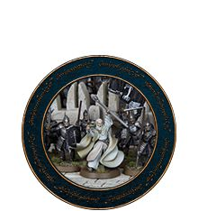
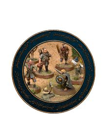
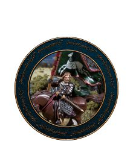
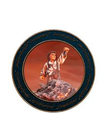
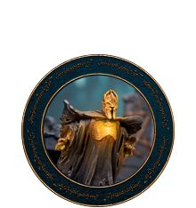
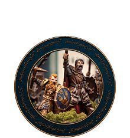

There is a campaign system that links each Scenario together, forming a flowing campaign where the result of each battle will have an impact on one, or more, future games in the campaign. 

The result of the campaign will, of course, have a huge impact on the fate of Middle-earth!

  

  
