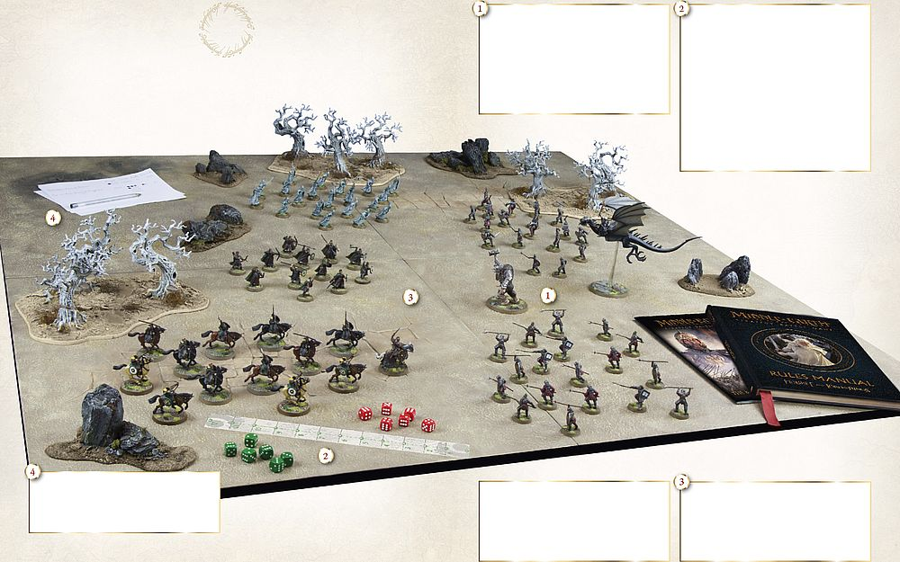

# WHAT YOU NEED TO PLAY

Playing battles with the Middle-earth Strategy Battle Game is a rather simple thing to do. However, there are a few things that you will want to organise before you settle down to play (a willing opponent, of course, is vital). Over the next couple of pages, we will take a look at the things you will need, explain some of the more unusual items and help you work out how to get started.

## 1. CITADEL OR FORGE WORLD MODELS

This may seem obvious, but you will need some Citadel or Forge World models in order to play. Whether this is a specific collection to faithfully recreate a scene from the films, or just a selection of your favourite models arranged into an army of your own making, the choice is up to you. As you play your first few games, you'll probably find yourself using unpainted models, but as almost every hobbyist will agree, playing a game with fully painted armies both looks and feels better!

## 2. DICE AND TAPE MEASURES

We use tape measures or measuring sticks to see how far our models can move across the battlefield each turn, whether they are in bow range and for many other distance-related reasons. To this end, it is important to have a measuring device on hand that measures in inches. *The Battle of Pelennor Fields* boxed game contains a handy ruler, or you can pick up a tape measure from any Games Workshop store.

Dice are required to see if our models are successful in their in-game endeavours, to see whether an arrow hits its target, who wins in a fight and all manner of other things. As such, you will need a selection of six-sided dice at your disposal (between eight and twelve, preferably in a few different colours, is about right).

**REFRESHMENTS**

In the finest tradition of *Hobbits* everywhere, it's often a good idea to have a selection of sensible snacks, such as biscuits and seed cakes, available for you and your opponent, as well as having something nice to drink (Jay will rarely go through a whole game without a nice hot mug of tea in his hand!).

## 3. PLAYING AREA

You can play a game almost anywhere, from your kitchen table with some makeshift scenery to provide some cover from arrow-fire, to custom-made gaming tables designed to resemble one of the famous scenes from Middle-earth. The more attention you put into your gaming area, the more evocative your games will be.

## 4. PENS AND PAPER
It is often useful to have some paper and a pen close by to record vital information during your games, such as how many Might, Will or Fate points each Hero has spent, or the number of Wounds they have taken.