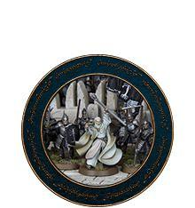
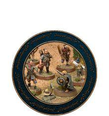
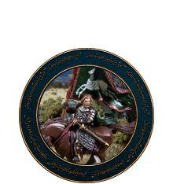
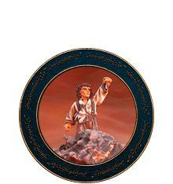
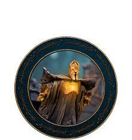
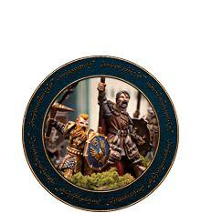

There is a campaign system that links each Scenario together, forming a flowing campaign where the result of each battle will have an impact on one, or more, future games in the campaign.

The result of the campaign will, of course, have a huge impact on the fate of Middle-earth!

[{ width=220 height=234 }](gondor_at_war.md) [{ width=220 height=234 }](scouring_of_the_shire.md) [{ width=220 height=234 }](war_in_rohan.md)

[{ width=220 height=234 }](quest_of_the_ringbearer.md) [{ width=220 height=234 }](fall_of_the_necromancer.md) [{ width=220 height=234 }](defence_of_the_north.md)
