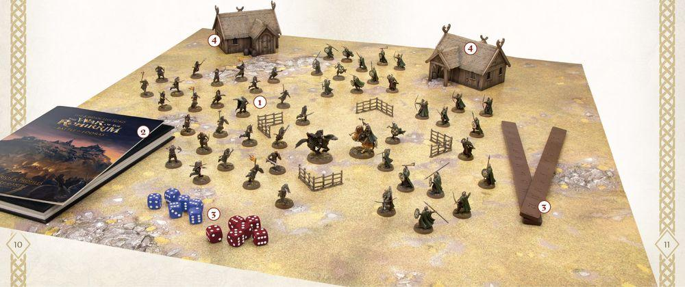

# WHAT YOU NEED TO PLAY

Playing battles of the Middle-earth Strategy Battle Game is a rather simple thing to do. However, there are a few things you will want to organise before you settle down to play your game - a willing opponent, of course, is the first vital thing! Here we will go through all you will need to play a game, explain some of them in a bit more detail, and help you understand what you need to get started in your first games in Middle-earth.

## 1. Citadel or Forge World Miniatures

This may seem obvious, but you will need a selection of Citadel or Forge World miniatures in order to play. Whether this is a specific collection designed to faithfully recreate a scene from the films, or just a selection of your favourite models arranged into an army of your own making - the choice is up to you. As you play your first few games, you'll probably find yourself using unpainted miniatures but, as almost every hobbyist will agree, playing a game with fully painted miniatures looks and feels better!

## 2. Rules Manual and Supplements

Whenever you are playing a game, you will want to make sure that you have any relevant rules references close at hand in case you are not sure how a rule works, or if you and your opponent disagree on a particular rule. It is always important to have this Rules Manual handy, and both players are responsible for providing the supplements that contain the profiles for any miniatures they are using in the game.

## 3. Dice, Tape Measure and Tokens

We use tape measures or measuring sticks to see how far our models can move across the battlefield each turn, whether they are in range with their Missile Weapons to Shoot an enemy, and for many other distance-related reasons. It is necessary to have a measuring device that measures in inches for this game.

Dice are an integral part of the Middle-earth Strategy Battle Game as we use them to determine the outcome of how our miniatures act. From whether a model can hit an enemy when Shooting, to how effective they are in a duel, and also if they can successfully slay an opposing model in Combat. As such, you'll need a selection of six-sided dice at your disposal; between eight and twelve in a few different colours is ideal.

Tokens are often used to denote in-game effects that are affecting our models. Whether a model has been knocked Prone, is under the effects of a Magical Power, or even has a beneficial rule temporarily in play, using tokens is a great way to keep track of such situations so that they are all clear.

## 4. Playing Area and Terrain

You can play a game almost anywhere, from your kitchen table with some makeshift scenery to provide cover from arrow fire, to custom-made gaming tables designed to represent one of the varied battlefields or locations in Middle-earth. It is important to always have some form of terrain in your games, as the more varied and interesting your playing area is, the more evocative your games will be.

## 5. Pens and Paper

It is often useful to have a pen and paper close at hand to record any important information about the game. This is great for keeping track of how many Might, Will and Fate Points each Hero has spent, how many models from each side have been slain (which is important for your Break Point), and for keeping track of any other special rules that require some form of note taking.

## 6. Refreshments

In the finest tradition of Hobbits everywhere, it's often a good idea to have a selection of sensible snacks, such as biscuits or seed cakes, available for you and your opponent - you don't want to be making tricky tactical decisions on an empty stomach - as well as something nice to drink to keep you refreshed (you can't go far wrong with a nice, hot cup of tea!).
