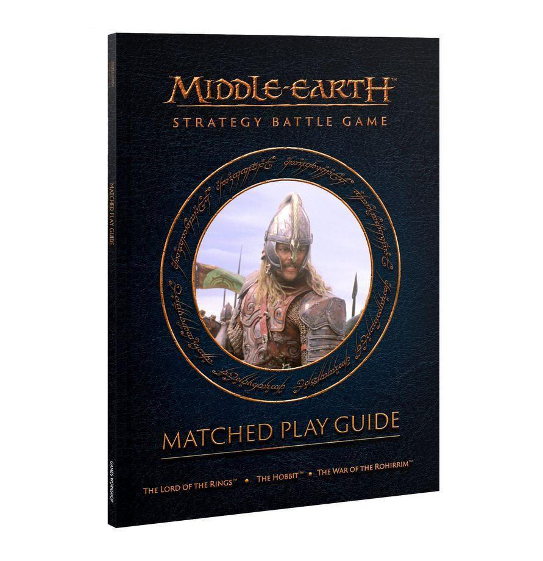

Welcome to the Middle-earth Strategy Battle Game: Matched Play Guide; your way to get the very best from your Matched Play experiences, be they high-stakes tournaments or casual games at your local gaming club.

The Middle-earth Strategy Battle Game has always lent itself well to a Matched Play environment, and players have been organising their own tournaments and gaming events around the globe for many years. This supplement is designed to help players run their own Matched Play events by providing them with a system to organise their tournaments with, balanced Scenarios and ways to choose them, and a selection of alternative special rules that Event Organisers can use in order to add that extra bit of flair to their events, should they wish.

Within this Matched Play Guide you will find the following:

### CODE OF CONDUCT

Tournaments and gaming weekends should be, first and foremost, fun. The Code of Conduct presented in this guide is something we expect all players to follow at all times to ensure that they and their opponents always have the best time possible.

### RECOMMENDED TOURNAMENT STYLE

Here we present our recommended way for running tournaments, including how players score Tournament Points, Tiebreakers, pairing opponents, and more.

### SCENARIO POOL SYSTEM

An easy system for selecting which Scenario to play in each round of your event. This groups the Matched Play Scenarios into six pools, each with four similar Scenarios in it, allowing for a random mix of any of the Scenarios but ensuring that the spread of Scenarios that you play does not favour one style of Army unfairly based on a random dice roll.

### MATCHED PLAY SCENARIOS

A total of 24 Matched Play Scenarios, each formulated to be balanced for tournament style play. The six Scenarios from the Middle-earth Strategy Battle Game Rules Manual return along with 18 other Scenarios for your Matched Play events.

### DOUBLES EVENTS

Rules for how to run an event for the ever-popular Doubles format, along with six Scenarios written specifically for Doubles games, and additional rules for how Doubles events work, including how to format your Army for use in Doubles games.

### CAMPAIGN EVENTS

A selection of rules for running Map-based Campaign events where teams of players battle for control of Regions of Middle-earth, each with their own special rules and campaign benefits.

### TEAM EVENTS

Full rules for running Team events where players band together to take on opposing teams, including how to put a team together, how to formulate your Army Lists, and how to pair players in one team against those in another.

### ADDITIONAL RULES

A selection of optional rules that Tournament Organisers can use to add that extra bit of flavour to their events; from secret missions, to points escalation, and more.

### THE MOST IMPORTANT RULE

The Middle-earth Strategy Battle Game is designed to be exactly that; a game. One played between players who seek to have a good time rolling dice, moving miniatures, and recreating the epic tales of The Lord of the Rings™ and The Hobbit™. As such, players are expected to show good sportsmanship and fair play at all times; we are all here to enjoy ourselves after all!

In a game filled with so many unique and exciting characters, there may be situations which arise during your games that may not seem to be fully covered by the rules presented in the Middle-earth Strategy Battle Game Rules Manual. For example, you may not be able to find the exact place where a rule is to work out your situation, or there is a disagreement between the players on the interpretation of the rules.

Because wasting time arguing is not fun for either player (and more importantly is eating into the time that you could be using to have an awesome game instead), often it is good practice to interpret the rule in a way that suits both players equally at that point in time. This game is designed to be played in a generous spirit, in a manner befitting the gentlest and noblest of Hobbits, and you'll find that if you keep that spirit of kindness and fair play in mind, you can resolve almost every instance of disagreement.

If you find that you and your opponent still cannot agree upon the application of the rules, or another situation, simply roll a dice to see whose interpretation you will use for the rest of the game - on a 1-3, the Evil player gets to decide, on a 4-6, the Good player gets to decide. Then you can put the disagreement behind you and return to the much more important matter of the battle at hand. Once the game is over, you can continue the discussion (preferably over a mug of tea and a seed cake) and arrive at a consensus for future games.

### CODE OF CONDUCT

The Middle-earth Strategy Battle Game is designed to be played in a manner that old Mr. Bilbo would be proud of; one where fair play, good humour and showing respect for one another are paramount. As such, we have provided a series of important principles that we expect all players of the Strategy Battle Game to uphold at all times. After all, the most important thing is that everyone involved has a thoroughly enjoyable time during the course of the game!

### CARDINAL RULES

- Always be polite and respectful to your opponent at all times.
- Always tell the truth and never cheat.

### IMPORTANT PRINCIPLES

- Make a respectful gesture to your opponent before the game begins, such as wishing them good luck, offering a handshake, etc.
- Avoid using language that your opponent or those around you may find offensive.
- Arrive on time for your game with all of the things you need to play.
- Ask your opponent's permission if you wish to use any unpainted or substitute models during your game. In Matched Play games, players must have all of their models fully painted and use the correct miniatures and base sizes.
- Offer your opponent the chance to examine your Army List before the game begins. If your opponent has any questions or queries about your Army List, you should answer them truthfully and ensure your opponent understands the answer.
- Discuss the terrain before the game begins to ensure each player has all the information regarding the terrain before starting.
- Measure moves and distances carefully and accurately. You should also allow your opponent the opportunity to check any distances before you move any models if they wish.
- When rolling dice, make sure they are clearly visible to all players and allow your opponent to examine the rolls before picking up the dice.
- Always ask your opponent's permission before touching their models.
- Remind your opponent about any rules they may have forgotten to use or they have used incorrectly, especially when doing so is to your opponent's benefit rather than your own.
- Never deliberately manipulate the amount of time a game takes in order to gain an advantage, either by playing overly quickly or by wasting time.
- Try not to distract an opponent when they are trying to concentrate, and always ensure you respect their personal space.
- Never complain about your own bad luck or your opponent's good luck.
- Always be humble in victory and graceful in defeat.
- Never fix the outcome of a game for any reason.
