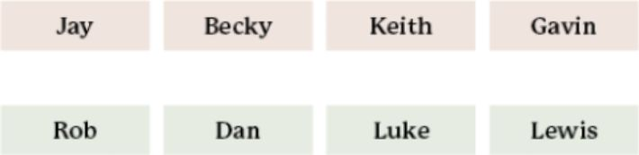
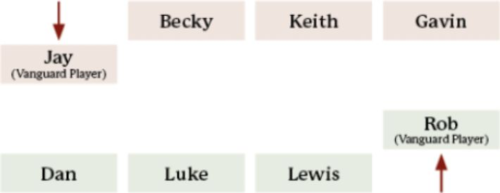
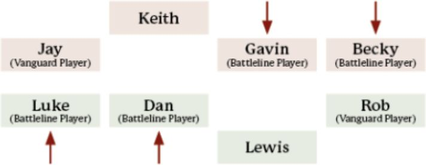
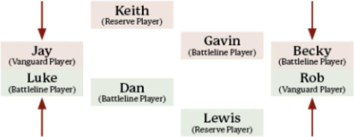
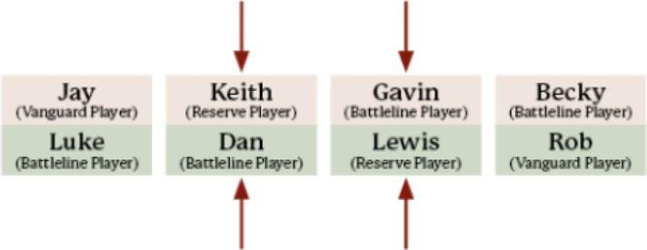

Team events are another exciting type of event that allows you to assemble your very own fellowship of friends and gaming partners. Instead of taking on the challenge of a tournament alone, you and your friends can stand together as a team, taking on all comers to prove that you are the mightiest heroes, or villains, in all of Middle-earth - much like the valiant friends in the Fellowship, the plucky Dwarves of Thorin's Company or the terrifying Nazgûl! Being able to enjoy the experience of an event together is one of the best aspects of a Team event, and often why Team events are remembered so fondly by those who attended them.

Over the next few pages, we will present some additional rules for how Tournament Organisers can go about running their own Team events, including any differences from the Recommended Tournament Style provided earlier in this guide. There are also all of the rules that players will need to put their team together, as well as how to build their Army Lists for the event, and how such events are scored.

A Team event will use the same 24 Matched Play Scenarios found in this guide, and will determine them in the same way as a standard event using the Scenario Pool System. All members of a team will play the same Scenario in each round.

### ASSEMBLING A TEAM

#### TEAM SIZE

When playing a Team event, the Tournament Organiser will need to make it clear how many players each team will require. Teams can be whatever size the Tournament Organiser wishes; some Team events may require teams as small as three players, whilst a much larger one may require as many as eight or nine! Whilst Tournament Organisers are free to decide what size of team is best for their event, we find that teams of four work best. As a result, the format presented in this guide will assume that teams consist of four players each. If you wish to run an event with more or less than four players in each team, you will need to adapt the pairings system found later in the guide slightly to accommodate for the change in the number of players.

#### NOMINATING A TEAM CAPTAIN

Much like how Gandalf guided both the Fellowship and Thorin's Company on their quests, a Team Captain helps to make sure the team has all the information they need before and during the event. The Team Captain will be responsible for things like organising list submission, collecting and handing in results at the end of each round and passing on any information from the Tournament Organiser to the rest of their team. It's usually best for the most organised or experienced person to take on this responsibility, as it will often ensure that things run nice and smoothly!

### BUILDING THE ARMIES

Each player will need an Army to play with for the duration of the event; rules for building an Army can be found on page 154 of the *Middle-earth Strategy Battle Game Rules Manual*. However, as players are competing as part of a team, there are a few things they will need to take into account when building their Armies.

#### RULE OF ONE

As players are working together as a team, it makes sense that they wouldn't be able to use the same named characters or Unique pieces of wargear - as much as they might like to! Thorin, Elrond and Aragorn may be amongst the mightiest heroes in Middle-earth, but not even they can be in two places at once!

As a result, the Unique keyword, described on page 65 of the *Middle-earth Strategy Battle Game Rules Manual*, applies across the entire team, rather than to each Army. This means that teams cannot take the same named character twice across their Army, even if a character has multiple different profiles, such as Thorin Oakenshield, or even has different alignments, such as Saruman who can be taken as either a Good or Evil model.

*For example: Keith wants to use Aragorn (Strider) in his Army but Becky, who is on the same team as Keith, wants to use Aragorn, King Elessar in her force. Only one of them will be able to use Aragorn, because Aragorn has the Unique keyword, so the pair will have to come to an amicable agreement as to who gets to take the stoic ranger in their force.*

*Likewise, Jay wants to take Saruman the White in his Good Army but Gavin, who is on the same team, wants to use Saruman in his Evil Army. As there is only one Saruman in Middle-earth, only one of them will be able to take the powerful Istari - either Good or Evil.*

Following the same principle, the same Unique piece of wargear cannot be taken twice across your team, even if it's being wielded by different models.

*For example: Luke is intending to take the mighty Thorin Oakenshield wielding Orcrist in his force; however, Lewis is on the same team as Luke and wishes to arm his Legolas Greenleaf, Prince of Mirkwood, with the deadly blade. As they cannot both take Orcrist in their Army, the two will have to come to a decision about who gets to arm their Hero with the Elven weapon.*

A team may include multiple models who can carry The One Ring, but as The One Ring is one of a kind (the clue is in the name!), follow the hierarchy table on page 111 of the *Middle-earth Strategy Battle Game Rules Manual* to determine who carries it.

*For example: Rob has chosen to take Sauron in his Army for the event and Dan, who is on the same team as Rob, wants to take Bilbo Baggins, Master Burglar, in his Army. As Sauron is higher on The One Ring hierarchy table than Bilbo, it is the Dark Lord who will wield the power of the Ring for the event, not the plucky Hobbit - though Dan is still more than welcome to take Bilbo; he just won't have the Ring as part of his wargear.*

Additionally, each Army List may only be included once across the entire team.

#### GOOD AND EVIL

As the fight for Middle-earth is between the forces of light and darkness, each team must have the same number of Good and Evil armies. If there are an odd number of players on the team, then make sure there are an even number of players on the team using Good and Evil, with the remaining player able to choose between the two.

*For example: Jay, Dan, Keith, Becky and Lewis are attending a Team event with five players on each team. Dan and Lewis both decide to play an Evil Army, whereas Jay and Becky are keen to use a Good Army. Now that there is an even split of Good and Evil Armies in the team, Keith can choose whether he wants to play a Good or Evil Army!*

### SCORING & TIEBREAKERS

Scoring in a Team event is very similar to a regular Matched Play event, with a few small differences. Major and Minor Victories, as described on page 58, will always be in use at Team events, but the amount of points awarded for each result is slightly different. A team's TPs are still used to determine a team's ranking.

**Major Win** - 4 Tournament Points

**Minor Win** - 3 Tournament Points

**Draw** - 2 Tournament Points

**Minor Loss** - 1 Tournament Point

**Major Loss** - 0 Tournament Points

Teams will score Tournament Points for each game their team plays every round, with a maximum of 16 Tournament Points available per round at events with 4 players per team.

*For example: Jay, Keith, Becky and Gavin have joined forces for a Team event. During round 1, Jay, Keith and Becky all dominated in their games and achieved Major Victories, whilst Gavin earned a hard fought Draw. As a team they will score 14 Tournament Points: 4 points for each Major Victory and 2 for the Draw - an excellent start to the event!*

At the end of each game, players will need to record the result and provide this information to their Team Captain, who will then hand in all of their team's results at once to the Scorekeeper when all of their team's games have been completed.

#### RANKING

As players are working as teams to achieve victory, the ranking system works a little differently to a regular Matched Play event. Instead of players being ranked on their individual performances they are instead ranked as a team. Teams are ranked using Tournament Points just like a normal event. This means that each team will get matched up against another team, rather than against individual opponents.

Where teams are tied on the number of Tournament Points, there are a number of Tiebreakers to be used to determine who is higher placed, which are very similar to the standard ones, just cumulative.

The first Tiebreaker is a team's Victory Point Difference, which is equal to the number of Victory Points scored by all players across all of their games, minus the number of Victory Points conceded by each team member across all their games.

*For example: At the end of round 1, Rob's team will have played four games and had the following results; 3-0, 7-4, 12-0 and 3-8, making their Victory Point Difference +13.*

If teams are still tied, the second Tiebreaker is the team's total number of Victory Points scored by each player across all of a team's games.

*For example: At the end of round 2, Jay has scored a total of 20 Victory Points, Becky has scored a total of 18, Keith has scored 16 and Gavin has scored 8 - giving the team a total of 62 Victory Points scored.*

If teams are still tied, the next Tiebreaker is the number of enemy General models killed by each player on the team across all of their games.

Further Tiebreakers are then used at the Tournament Organiser's discretion.

#### ROUND 1

For the first round, teams will be randomly paired against each other to determine the match-ups, as this is the best way to ensure an unbiased draw.

#### SUBSEQUENT ROUNDS

After the first round, teams will be paired based on their ranking in the event, using the same method as previously described on page 7.

### TEAM PAIRING SYSTEM

Once the teams have been matched up, it's time to decide who plays who from each team - this is done using the Team Pairing System. Each team will have fifteen minutes for this to take place. Teams will review the Army Lists from the other team, and be told clearly which player is using which Army List. Then, follow this step-by-step guide to determine which players will face off:

*For example: Team 1 is composed of Keith, Jay, Gavin and Becky. Team 2 is composed of Dan, Rob, Luke and Lewis.*

**Step 1.** Both teams secretly nominate one player on their team to put forward - this person will be the Vanguard Player. Once both teams are happy with their Vanguard Player selection, they reveal their choice simultaneously.

*Both secretly nominate their Vanguard Player, revealing their choice simultaneously. Team 1 puts forward Jay and Team 2 puts forward Rob.*

**Step 2.** Each team then secretly nominates two of their players to put forward against the opposing team's Vanguard Player - these are the team's Battleline Players. The remaining person on the team becomes the Reserve Player. Once both teams are happy with their chosen Battleline Players, they reveal their choices simultaneously.

*Both teams then secretly nominate their two Battleline Players to put forward against the Vanguard Players. Team 1 puts Becky and Gavin forward, and Team 2 puts Dan and Luke forward.*

**Step 3.** The Vanguard Player from each team will then choose which of the two opposing Battleline Players they wish to play against. This will establish the first two match-ups.

*The Vanguard Players now get to choose which of the opposing two Battleline Players they wish to play against, revealing their choices simultaneously. Jay decides that he wants to play against Luke, and Rob chooses to play against Becky.*

**Step 4.** Finally, the Reserve player will match-up against the Battleline Player on the opposing team who was not chosen by the team's Vanguard Player.

*The Reserve Players then match-up against the opposing Battleline Player who does not yet have an opponent. This means that Gavin would match up against Lewis, and Dan would play against Keith, meaning all eight players are now matched up.*

