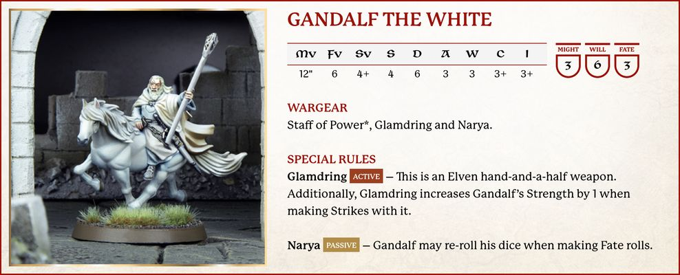
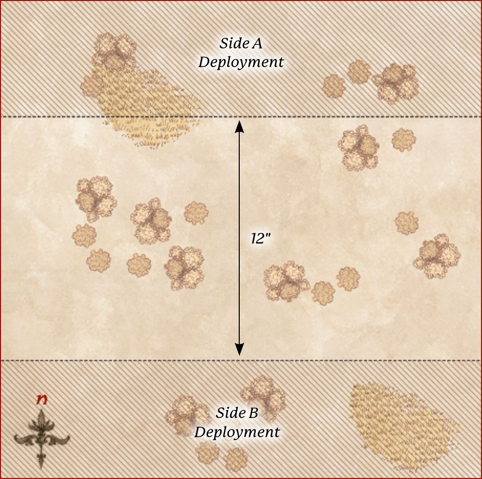

## INTRODUCTION

### PROFILES

{ width=988 height=400 }

At first glance, a profile looks to be an abstract series of letters and numbers, but it is actually a simple way to represent a model's abilities and statistics in the game:

**Mv (Move)** - This characteristic tells you how far in inches (") a model may Move in each of its Move Phases.

**FV (Fight Vaue)** - This characteristic denotes a model's skill at fighting in hand-to-hand combat; the higher the number, the better it is at fighting.

**SV (Shoot Vaue)** - Similar to Fight Value, this characteristic tells you how proficient a model is with a ranged weapon, providing you with a target number to hit when the model makes a Shooting Attack; the lower the number, the easier it is for them to find their mark.

**S (Strength)** - This characteristic shows how strong the model is. The higher a model's Strength, the more easily it will injure an opponent.

**D (Defence)** - Defence represents how hard it is to hurt a model. The higher it is, the harder the model is to wound in battle.

**A (Attacks)** - The Attacks characteristic represents how many blows a model can land upon an enemy during a duel. It literally translates to the number of dice that a model will roll during the Fight Phase, both for making the initial Duel Roll, and for making Strikes against an enemy.

**W (Wounds)** - This denotes how many injuries a model can sustain before it will succumb to its wounds and be slain. If at any point during the game a model's Wounds are reduced to 0, it is immediately removed from the board as a casualty.

**C (Courage)** - The bravery and determination of a model is measured by its Courage characteristic. The lower this value, the braver the model is.

**I (Intelligence)** - This characteristic reflects a model's intellect; the lower the characteristic, the more intelligent the model is.

**M, W, F (Might, Will, Fate)** - Hero models possess an additional three characteristics: Might, Will and Fate. Unlike the other characteristics, these are represented by a store of points that can be spent during the game to perform heroic deeds, fortify their spirit and cheat death.

## BASIC PRINCIPLES

### LINE OF SIGHT

At many points during a game, we will need to work out if a model is able to see a target. The best way to do this is to get down to the 'model's eye view' and see if you can see the target. This is the model's Line of Sight.

### MEASURING

Throughout the game, you will need to measure distances across the battlefield. To measure between models, always measure between the closest two parts of the base. A model is always considered to be in range of itself. As you play, you may measure any distance at any time as often as you wish.

### NATURAL ROLLS

Some special rules will state that they require a roll of a 'natural X', where X is the number on a D6. What this means is that the score on the dice must be equal to the value of X without being modified in any way (such as having Might used to increase it). Re-rolls are not considered to be a modifier as they don't modify the score on the actual dice.

### KEY WORDS

Every model has a number of keywords in its profile. These are broken into three sections: Race, Faction and Unit Type.

Race keywords denote the race of the model, such as Man, Elf or Orc.

Faction keywords inform the faction or allegiance of the model, such as Gondor, Rohan or Mordor. Sometimes models may have multiple Faction keywords.

Unit Type keywords show what kind of unit the model is, such as Infantry, Cavalry or Monster, as well as Warrior or Hero. Models will almost always have multiple Unit Type keywords.

Some rules will contain words or phrases in bold; these will show which models are affected by the rule in question.

*For example, a model may have a special rule that affects 'all **Rohan** models', in which case the special rule will apply to all models with the **Rohan** keyword. Some rules may list more than one keyword in them. When this is the case, a model must have all of the keywords listed in order to be affected. For example, if a special rule affects 'all **Rohan Cavalry** models', then a model must have both the **Rohan** keyword and the **Cavalry** keyword in order to be affected.*

## TURNS

The game is broken down into turns, which are further divided into phases. In each phase, the player with Priority will act first. Once they have completed everything they need to within a phase, the other player will then get the chance to do the same before both players progress to the next phase.

### TURN SEQUENCE

**Priority Phase** - In the Priority Phase, players roll off to see which player has Priority.

**Move Phase** - Both players Activate and Move their models. First, the player with Priority Moves any of their models that they wish. When they are finished, the other player Moves their models.

**Shoot Phase** - Players make Shooting Attacks with any of their models that are equipped with Missile Weapons, starting with the player with Priority. Once they have finished with all of their models, the other player makes Shooting Attacks with their models.

**Fight Phase** - In the Fight Phase, all models from both sides that are engaged in hand-to-hand combat will fight. The player with Priority chooses the order in which Combats are resolved.

**End Phase** - In this phase, resolve any effects that remain until the End Phase, and then clear any stray tokens and dice before starting the next turn.

## PRIORITY PHASE

At the start of each turn, both players will roll a D6 in the Priority Phase to see which player has Priority that turn. The player who rolls highest may choose which player has Priority. In the event of a tie on the first turn, then the players re-roll until one player wins the roll-off. If the result is a tie in subsequent turns, then the choice of which player has Priority will go to the player who did not choose who had Priority in the previous turn. For this reason (and indeed, for reminding yourself who has Priority throughout the turn), it is a good idea to have a suitable counter or token so that it is easy for both players to see who currently has Priority, and to pass it between players as and when Priority changes during the course of the game.

## MOVE PHASE

### ACTIVATING A MODEL

In the Move Phase, the player with Priority Moves first. They Activate the models under their control one at a time until all, some, or even none, of their models have Activated. Once the player with Priority is completely finished, the opposing player then gets to do likewise.

### ACTIVATING MODELS

You can Activate each of your models in the Move Phase in any order that you choose, as long as you complete a model's Activation before starting another one. When a model Activates, it may Move a number of inches up to its Move allowance (MV). Models are not required to Move only in straight lines and may Move in any direction, as long as they do not exceed their Move allowance.

Models may not Move 'through' other models. For a model to Move past or between other models, there must be enough space for its base to be able to pass through without disrupting another model's base. If there is not enough room to pass through, then the model will have to go around or wait.

Sometimes, a model will be rendered unable to move for one reason or another, such as Magical Powers or special rules. When this is the case, it will be made clear in the rules.

Once a model has completed its Move, its Activation ends.

### CONTROL ZONES

Although all of the models are immobile, we imagine that they are, in fact, quite dynamic, ready to fight in the swirling maelstrom of battle. To represent this, every model has a Control Zone - a 1" imaginary ring that extends out from the edge of the model's base. No model may enter the Control Zone of an enemy unless it is Charging the model in question.

There may be occasions when a model is forced into an enemy model's Control Zone due to some other rule, such as being forced to Back Away after losing a Combat. Note that a model cannot choose to enter an enemy's Control Zone without Charging - it can only happen when another rule forces it to.

It is possible for a model to start its Activation already within an enemy model's Control Zone. In these circumstances, your model has three choices:

- Remain where it is and forgo its Movement.
- Charge one of the enemy models whose Control Zone it is in.
- Move Away. In this third instance, a model may Move within the Control Zone of an enemy, provided that it doesn't get any closer to the enemy whose Control Zone it started in.

### CHARGING ENEMIES

Making a Charge is simple - measure the distance as you would for making any other Move and, if you have enough Movement to reach your target, Move your model into base contact with the target.

Once a model has Charged into an enemy and is in base contact with it, they are both Engaged in Combat and cannot Move any further in the Move Phase, unless they subsequently become unengaged and have not yet Moved that turn.

Control Zones play an important part in Charging. If a model enters an enemy model's Control Zone, then it must Charge that model; though it may continue Moving within that model's Control Zone in order to Charge a different part of the model's base if it so wishes and has Movement remaining.

Additionally, models do not have a Control Zone whilst Engaged in Combat.

Once a Charging model enters a Control Zone, it may ignore the Control Zones of other models in order to continue Charging its original target. This means that a model is always able to Charge the first enemy model whose Control Zone it Moves into.

### CHARGING MULTIPLE ENEMIES

Charging multiple enemies is very straightforward. As long as your model has a high enough Move characteristic to reach all of its intended targets, and its base is large enough to end its Move in base contact with those targets, it may Charge two or more opponents.

### PAIRING OFF COMBATS

At the end of the Move Phase, it is important to work out which models are Engaged in Combat with one another, for the sake of clarity. Any models that are Engaged in Combat with an enemy need to be paired off into Combats, which are more fully detailed in the Fight Phase section.

At the end of the Move Phase, opponents are always paired off into one-on-one Combats where possible. You may have situations where two, or maybe more, enemies face a single model. This is called a Multiple Combat.

First, all models in base contact with an enemy must fight, so make sure none of the models Engaged in Combat are left out once you are done!

Second, if a model could be involved in more than one Combat, the player with Priority may choose which of the possible Combats it is assigned to.

### PRONE MODELS

During battles in Middle-earth, there are times when a model will find itself lying on the ground, such as being bowled over as a result of being Charged by a Cavalry model. A model that is Knocked to the Ground is said to be Prone and should have a Prone marker placed next to it to show that the model is on the floor. Prone models do not have a Control Zone and do not block Line of Sight.

#### CRAWLING

A model that is Prone may crawl 1" in the Move Phase, regardless of its maximum Move allowance. If a model crawls, the only other Movement it may make that turn is to stand up if it has sufficient Move allowance remaining. Prone models may not Charge - they must stand up first.

#### STANDING UP

A Prone model may stand up at the cost of half of its maximum Move allowance, and may still Charge if it does so. Models that stand up will still count as having Moved. A Prone model may still stand up whilst within an enemy model's Control Zone without Charging it, so long as it does not Move closer to that model.

#### CHARGING PRONE MODELS

Prone models may be Charged as normal. As they have no Control Zone, an enemy model can Move within 1" of them unimpeded, provided it doesn't come into base contact.

## SHOOT PHASE

### PRIORITY

The player with Priority shoots first. They select one of their models and resolve its Shooting Attack. Once they are finished, they select another of their models and resolve its Shooting Attack - repeating this process until they have made all of the Shooting Attacks that they wish to. Once the player with Priority has resolved all of their Shooting Attacks, the other player may then do likewise.

### WHO CAN SHOOT?

If a model has a Missile Weapon, has a target to shoot at, hasn't Moved too far in the preceding Move Phase and is not Engaged in Combat, it may make a Shooting Attack. A model may only make a single Shooting Attack each turn, unless otherwise stated.

### HOW TO SHOOT

Making a Shooting Attack is simple. First, select the model that is going to shoot; then, choose who it is going to shoot at. The shooting model must have Line of Sight to the target model, and the target model must be in range - the range of each Missile Weapon can be found on the Missile Weapon Chart. Sometimes, when you are taking shots with your models, you will find that other models partially obscure your potential target. When this is the case, the model may not make the shot and may choose a new target if able.

To shoot, roll a D6 and compare it to the shooting model's Shoot Value. If the score is equal to or higher than the target number, then you have hit and will need to make a To Wound Roll.

When making a To Wound Roll, compare the Strength of the Missile Weapon (found on the Missile Weapon Chart) to the Defence of the target using the To Wound Chart below. This will give a target number needed to cause a Wound. Roll a D6, and if the score is equal to or greater than the target number, the model has been wounded. When the chart shows 6/4, 6/5 or 6/6, this means you must roll a single dice and score a 6, followed by a further dice which must score 4 or higher, 5 or higher, or 6 respectively. A '-' means that an attack with that Strength cannot wound the target.

### MOVING AND SHOOTING

A model that wishes to shoot in the same turn that it has Moved suffers a penalty to its Shoot Value. This is represented by making the Shoot Value of a model that has Moved one point worse for the rest of the turn. A model with a Shoot Value of 4+ that has Moved will instead require a 5+ to hit its target that turn. A roll of a 6 always hits.

### MISSILE WEAPON CHART

| Name | Range | Strength |
|:--|:--:|:--:|
| Bow | 24" | 2 |
| Orc bow | 18" | 2 |
| Elf bow | 24" | 3 |
| Throwing spear | 8" | 3 |
| Uruk-hai bow | 18" | 3 |

### TO WOUND CHART

| Strength / Defence | 1 | 2 | 3 | 4 | 5 | 6 | 7 | 8 | 9 | 10 |
|:--:|:--:|:--:|:--:|:--:|:--:|:--:|:--:|:--:|:--:|:--:|
| 1 | 4 | 5 | 5 | 6 | 6 | 6/4 | 6/5 | 6/6 | -/- | -/- |
| 2 | 4 | 4 | 5 | 5 | 6 | 6 | 6/4 | 6/5 | 6/6 | -/- |
| 3 | 3 | 4 | 4 | 5 | 5 | 6 | 6 | 6/4 | 6/5 | 6/6 |
| 4 | 3 | 3 | 4 | 4 | 5 | 5 | 6 | 6 | 6/4 | 6/5 |
| 5 | 3 | 3 | 3 | 4 | 4 | 5 | 5 | 6 | 6 | 6/4 |
| 6 | 3 | 3 | 3 | 3 | 4 | 4 | 5 | 5 | 6 | 6 |
| 7 | 3 | 3 | 3 | 3 | 3 | 4 | 4 | 5 | 5 | 6 |
| 8 | 3 | 3 | 3 | 3 | 3 | 3 | 4 | 4 | 5 | 5 |
| 9 | 3 | 3 | 3 | 3 | 3 | 3 | 3 | 4 | 4 | 5 |
| 10 | 3 | 3 | 3 | 3 | 3 | 3 | 3 | 3 | 4 | 4 |

## FIGHT PHASE

### WHEN TO FIGHT

Combats are resolved one at a time. The player with Priority picks a Combat that is yet to be resolved, and the players use dice to determine who wins the duel and whether any casualties are caused. Once the Combat is completely resolved, the player with Priority chooses another to resolve, repeating the process and continuing until all the Combats have been dealt with.

### RESOLVING A COMBAT

#### DUEL ROLL

To see who wins a Combat, you must make a Duel Roll. To make a Duel Roll, each player rolls a number of D6s equal to the number of Attacks their models in the Combat have, and the player with the highest single result wins.

When resolving a Combat, follow the steps below in order:

- Gather the number of dice you need for the Duel Roll; use a different coloured dice for each model with modifiers to the Duel Roll or Might Points available.
- Declare any two-handed attacks and ensure these attacks are marked with a different coloured dice.
- Roll all of your dice.
- Apply any modifiers to the dice rolls.
- Use any re-rolls.
- Use Might.
- Winner makes Strikes.

### DRAWN COMBATS

If the highest score that both players get in the Duel Roll is tied, compare the Fight Value of the models - the model with the highest Fight Value wins.

If the Fight Values of the models are also drawn, then the player with Priority rolls a D6 to see who wins. On a 1-3, the Evil side wins the Combat, whilst on a 4-6, the Good side is victorious.

### LOSER BACKS AWAY

The loser of a Combat must Back Away 1" in a straight line away from the winner in a direction chosen by their controlling player. This may allow a model to Move into an enemy model's Control Zone, but not into base contact.

### TRAPPED

If a model cannot Back Away a full 1" when it loses a Combat, it is Trapped. If the losing model is unable to Back Away, then it does not Move and the models are left in base contact until after the winners have made their Strikes, after which they should be separated by just enough to no longer be in base contact.

Sometimes, a defeated model will find itself Trapped because a friendly model is blocking its retreat. In these situations, it is possible for the friendly model to make a special Make Way Move of up to 1" to clear a path for their ally to Back Away, so long as they themselves are not Engaged in Combat. Simply Move the ally the shortest distance possible to enable its comrade to escape being Trapped. Making Way is entirely optional, though not doing so will likely result in a friendly model being Trapped.

Making way for a friend may take a model into an enemy's Control Zone, but not into base contact with an enemy model.

Finally, only one model may Make Way for a defeated friend - if one model making way is not enough to prevent a model from being Trapped, then no Make Way Move is made and the model is still Trapped.

### PRONE MODELS

If a Prone model is Charged, it fights as normal - with one exception. If the Prone model wins the Combat, it will make no Strikes, but may immediately stand up instead if it wishes. When resolving Strikes against a Prone model, it is always considered to be Trapped.

### WINNER MAKES STRIKES

Once the loser has backed away, the winner of the Duel Roll must Strike against their opponent. To make a Strike, roll To Wound, comparing the Strength of the winner against the loser's Defence to find the target number in the same way as making a To Wound Roll when shooting. If the target is wounded, reduce its remaining Wounds by 1 - if this reduces the model's Wounds total to 0, remove it as a casualty.

### MULTIPLE ATTACKS

If a model with multiple Attacks wins a Combat, it makes one Strike for each Attack on its profile when striking its victim. You may choose to fully resolve these Strikes one at a time or all together if you wish, so long as both players understand exactly what is happening.

### STRIKING A TRAPPED MODEL

Each Attack that is directed against a Trapped model becomes a set of two Strikes rather than one. Thus, a model with one Attack would deal a set of two Strikes against its Trapped victim, a model with two Attacks would deal two sets of two Strikes, and so on.

Note that you cannot split these sets of Strikes - you get a set of two Strikes for each Attack you direct against a Trapped model, but both Strikes must be directed against the same target.

### MULTIPLE COMBATS

In Combats where two or more models are fighting against one model, things work in exactly the same way as a one-on-one Combat. When comparing the dice rolls in a Duel Roll to see which side has won, only consider the highest-scoring dice and the highest Fight Value on each side. If the lone model wins the Duel Roll, all of the enemy models in the Combat must Back Away. If the more numerous foes are victorious, the loser must Back Away.

If the lone model wins the Duel Roll, it can make Strikes against any of the models that it is fighting.

If the lone model loses the Duel Roll, the winners each make their Strikes against the loser in an order chosen by the winners' controlling player.

If a lone model is the winner of a Multiple Combat and has more than one Attack, it may choose to resolve Strikes against one target or against different models. You are allowed to see the result of one Strike before rolling for the next. Regardless of how a model directs its Attacks, you must resolve all of a model's Strikes before rolling for the next model.

## COURAGE & INTELLIGENCE

### TAKING COURAGE AND INTELLIGENCE TESTS

When a model is called upon to take a Courage Test or Intelligence Test, roll 2D6 and compare the result to the model's Courage or Intelligence characteristic respectively. If the score of the 2D6 is equal to or greater than the target number listed under the relevant characteristic, the test has been passed. If the score is less than the target number, the test has been failed and the model will suffer the consequences outlined in the rule that called for the test to be taken.

## CAVALRY

A Cavalry model consists of a rider and its mount. In the case of a Cavalry model, as the rider is directing their mount, Line of Sight is always taken from the perspective of the rider and is never blocked by the mount. A Cavalry model Moves in the same way as an Infantry model.

### CAVALRY AND COMBATS

Cavalry models fight in the same way as an Infantry model; however, to represent the force of a cavalry Charge, Cavalry models gain two bonus rules when they Charge: Extra Attack and Knock to the Ground. They will only get these bonuses if they have Charged exclusively Infantry models, and have not been subsequently Charged by an enemy Cavalry model.

### EXTRA ATTACK

A Cavalry model with this bonus gains one additional Attack when making Duel Rolls and when making Strikes. So, a model with 1 Attack will roll two dice when making a Duel Roll, a model with 2 Attacks will roll three dice, and so on.

### KNOCK TO THE GROUND

If a Cavalry model with this bonus wins a Combat, all of its opponents are Knocked to the Ground. A model that is Knocked to the Ground becomes Prone after Backing Away. This means that it will also be Trapped, as described in the rules for Prone models.

## HEROES

Models that are also heroes will have the Hero keyword in their profile.

### MIGHT, WILL AND FATE

Unlike other characteristics, Might, Will and Fate Points are expended when they are used - so players need to mark them off as they are used up. When a Hero model runs out of Might, Will or Fate Points they may spend no more during that game, unless they are somehow able to regain these points during its course.

All Hero models have an extra section in their characteristics profile, which shows how much Might, Will and Fate they have at their disposal.

#### MIGHT

Might Points can be used to modify a Hero model's dice rolls.

A Hero model is able to spend a point of Might to adjust a dice roll made on their behalf (not an ally), after the roll has been made, and after any re-rolls or modifiers have been applied. For each point of Might that is expended, alter the dice score by 1. This can only be used to increase a dice roll in order to succeed in a particular situation.

If two opposing Hero models are fighting, both may use Might in order to win the Combat. The player whose Hero is currently losing has the first opportunity to use Might. Should they choose to use Might to win the Combat, then their opponent may elect to use Might as well in order to win. The opportunity then keeps switching between players until both players have used all of the Might Points they would like to, or no more can be used.

#### WILL

Hero models may expend Will Points in three situations:

- **Cast a Magical Power:** To cast a Magical Power, a Hero expends one or more Will Points - this is the number of dice the controlling player rolls in their casting attempt. Note that the player must choose how many Will Points they will expend before they roll any dice.
- **Resist a Magical Power:** A Hero who is the victim of a Magical Power cast by an enemy model may attempt to Resist it by expending Will Points.
- **Pass a Courage Test:** A Hero who has failed a Courage Test may spend Will Points to adjust the score of their test. For each Will Point they expend, improve the result of the 2D6 roll by 1. A Hero may spend a mixture of Will Points and Might Points to modify their score in this manner if they wish to.

#### FATE

Whenever a model with Fate Points is wounded, the controlling player may choose to expend a Fate Point to attempt to prevent a Wound. Roll a D6 and, on a 4+, the Wound has no effect; do not reduce the Hero model's remaining Wounds.

If the Fate Roll is unsuccessful, and the Hero has more Fate Points remaining, another Fate Roll can be attempted if you wish - expend the next Fate Point and roll again. Might can be used to alter the results of a Fate Roll, but because Fate Rolls are taken one at a time, you must decide whether to adjust your Fate Roll before using another Fate Point.

## WEAPONS & WARGEAR

### SINGLE-HANDED WEAPONS

Wherever a weapon is listed without it being defined as either a hand-and-a-half or two-handed weapon, the weapon in question will be a single-handed weapon. There are no additional rules for a single-handed weapon.

### HAND-AND-A-HALF WEAPONS

Whenever a model armed with a hand-and-a-half weapon is involved in a Combat, the controlling player must decide at the start of the Combat whether it will be using its weapon as a single-handed weapon or a two-handed weapon.

### TWO-HANDED WEAPONS

A model using a two-handed weapon whilst Engaged in Combat suffers a -1 penalty to Duel Rolls. When a model makes Strikes with a two-handed weapon, add 1 to its To Wound Roll.

### SPEARS

An Infantry model that is armed with a spear may assist a friendly model, with the same base size or smaller, in a Combat in a special way. If an unengaged model armed with a spear is in base contact with a friendly Infantry model, then it may contribute a single Attack to the Combat using its own Fight Value and Strength.

Models that are assisting another model in this way are not considered to be part of the Combat and so cannot be targeted by Strikes, benefit from a Heroic Combat, or be knocked Prone by a Charging Cavalry model.

A model can only gain Support from one spear-armed model at a time, and a spear-armed model may only ever Support a single model during each turn, even if it is subsequently Moved into base contact with another friendly model after Supporting a Combat that turn. A spear-armed model can even Support a friendly model that is Prone or armed with a two-handed weapon. A model that is Prone cannot Support under any circumstances.

A spear-armed model may Make Way for its ally if it loses a Combat. This counts as the one model who is allowed to Make Way for a friend.

### PIKES

The rules for pikes are the same as those for spears with the following exceptions. A pike-armed model can Support a friend Engaged in Combat by being in base contact with another pike-armed model that is already doing so (note that they must both be pikes; neither can be a spear), so two pike-armed models can Support one ally.

### ELVEN WEAPONS

Models using an Elven-made weapon are more likely to win the dice roll to see who wins a Drawn Combat. A Good model using an Elven weapon will win the roll-off on a 3-6 instead of a 4-6. Should an Evil model be using an Elven weapon (an odd situation, granted!), it will win the roll on a 1-4. If both sides are using Elven weapons, neither receives an advantage.

### LANCES

A Cavalry model using a lance receives a bonus of +1 To Wound when making Strikes in a turn that it has Charged. A Cavalry model using a lance even gets this bonus against other Cavalry models, as long as it has Charged.

### STAFF OF POWER

A Staff of Power is a hand-and-a-half weapon. In addition, the bearer can expend 1 point of Will each turn without reducing their own Will store.

### BOWS

A model can shoot a bow (of any type) in the Shoot Phase provided it has not Moved more than half of its maximum allowance in the preceding Move Phase.

### THROWING SPEARS

A model with a throwing spear can shoot with it in the Shoot Phase, even if it has Moved more than half of its maximum Move distance, so long as it didn't throw it in the preceding Move Phase.

Once per turn, during the Move Phase, a throwing spear can be used as its bearer Charges into Combat. The player Moves the model as if it were going to Charge the enemy, but instead of Moving into base contact, it stops 1" away. It then throws the spear at the enemy it is about to Charge. This Shooting Attack is resolved using the rules for Shooting, even though it takes place in the Move Phase. Throwing spears thrown as a model Charges into Combat do not suffer the -1 penalty for Moving and Shooting.

If the target is not slain, the Charger then Moves into base contact with the same enemy model. If the original target is slain, the Charger may complete their Move in any way the controlling player wishes - stopping straight away, Charging another target or anything in between.

### ARMOUR

A model upgraded to wear armour adds 1 to its Defence characteristic.

### HEAVY ARMOUR

A model upgraded to wear heavy armour adds 2 to its Defence characteristic.

### SHIELDS

A shield increases the Defence characteristic of its bearer by 1. A model with a shield may elect to be Shielding during a Combat it is involved in; this must be declared before any dice are rolled. When a model is Shielding, it will double its Attacks characteristic for the Duel Roll. However, if a model who is Shielding wins a Combat, it may not make any Strikes. Cavalry models cannot elect to be Shielding.

## MAGICAL POWERS

### USING MAGICAL POWERS

A Hero with Magical Powers (and Will Points available) can attempt to cast one (and only one) during each Move Phase. They can use the power before they Move, during their Move or at the end of it. A Hero can even use a Magical Power in the same turn that they Charge, or if they don't Move at all. Each Magical Power will state who can be targeted by it. Models need Line of Sight to the target of their Magical Power, but may still target a model that is obscured by other models. The range of each model's Magical Powers is listed in their profile. A model that is already Engaged in Combat or is Prone cannot use a Magical Power.

### MAKING A CASTING ROLL

To successfully Cast a Magical Power, the Hero must take a Casting Test. Every Magical Power has a Casting Value (given as a target number), listed in the entry of the model casting it.

The controlling player states which Magical Power the Hero is attempting to cast and expends one or more Will Points. For each Will Point the Hero expends, they roll a D6. All the dice are rolled together and if the score on any of the dice equals or exceeds the Magical Power's Casting Value, the spell is successfully cast - resolve its effects as detailed in the Magical Power's entry. If a model wishes to increase the Casting roll using Might, it must do so before the Resist Test (if any).

### RESISTING A MAGICAL POWER

If a model is targeted by a Magical Power, there is a chance it can Resist its effects. Before resolving the effects of the power, the player controlling the target must decide whether to spend Will Points to Resist the Magical Power (assuming the model has any). This is called a Resist Test.

For each Will Point spent, the defending player rolls a D6 in their Resist Test. If any of the dice equal or beat the Casting Roll, the model has resisted the power and there is no effect. Note, the player must choose how many Will Points to expend before rolling any dice. If, when making a Resist Test, any of the dice rolled from spending Will Points rolls a natural 6, the Hero immediately regains that point of Will. Note that rolling a natural 6 with 'free' points of Will (such as those from Resistant to Magic) does not confer this effect.

### MAGICAL POWER DURATIONS

`INSTANT`

Magical Powers with this duration take effect straight away. After they are resolved, they end. These Magical Powers tend to be those that cause damage.

`TEMPORARY`

Magical Powers with this duration remain in play until the End Phase of the turn in which they are cast.

`EXHAUSTION`

Magical Powers with this duration remain in play until the caster reaches 0 Will Points.

## MAGICAL POWERS LIST

### BLACK DART

`DURATION: INSTANT`

This power targets one enemy model within range. The target immediately suffers one Strength 6 hit. This power can still be used on a target that is Engaged in Combat.

### COMPEL

`DURATION: TEMPORARY`

This power targets one enemy model within range. The caster may Move the target model up to half of its Move allowance. They can do this even if the model has already Moved this turn, though they cannot Move a model out of Combat. The Move can even make it Charge an enemy model. No Courage Test is required to Charge Terror-causing foes. Once the target has finished the Move, it may Move no further that turn for any reason.

Finally, the target suffers the effect of the Transfix magical power (see below).

### SORCEROUS BLAST

`DURATION: INSTANT`

This power targets one enemy model within range. The target immediately suffers one Strength 5 hit. If it survives, the target is immediately knocked Prone. If the target was Engaged in Combat, then any other model (friend or foe) that is also Engaged in the same Combat will also be knocked Prone - make sure to pair off Combats (see page 4) before working out which models are knocked Prone in this manner.

### TERRIFYING AURA

`DURATION: EXHAUSTION`

This power targets the caster themselves. Whilst this power is in effect, the caster causes Terror.

### TRANSFIX

`DURATION: TEMPORARY`

This power targets one enemy model within range. Whilst this power is in effect, the target model may not Move (except to Back Away should it lose a Combat), shoot, cast Magical Powers, or use Active abilities, and may not make Strikes if it wins a Duel.

## SPECIAL RULES

### ACTIVE AND PASSIVE SPECIAL RULES

All special rules can be classed as either *`PASSIVE`* or *`ACTIVE`*.

A Passive special rule is one that takes effect regardless of other factors, as they require no particular thought or effort to enact. Passive special rules still take effect even if the model is under the influence of another ability that would render it unable to Activate, such as the Transfix Magical Power.

An Active special rule is one that requires the user to physically act, think or move. These special rules are not usable if the model in question is under the effect of another ability that renders it unable to Activate, such as the Transfix Magical Power.

#### Burly

`PASSIVE`

A model with this special rule does not suffer the -1 penalty to the Duel Roll for using a two-handed weapon.

#### Harbinger of Evil

`PASSIVE`

Any enemy model within 12" of this model suffers a -1 penalty to its Courage.

#### Resistant to Magic

`PASSIVE`

If this model is targeted by a Magical Power, it may use an additional 'free' dice when it makes a Resist Test, even if it has no Will remaining or decides not to use any Will Points from its store.

#### Shieldwall

`ACTIVE`

If this model is armed with a shield, whilst in base contact with two or more non-Prone models with this special rule that are armed with a shield, this model gains a bonus of +1 to its Defence. Only Infantry models may benefit from this special rule.

#### Terror

`PASSIVE`

Should a model wish to Charge this model, it must first take a Courage Test at the start of its Activation before doing anything else. If the test is passed, the model may Charge as normal, though is not obliged to. If the test is failed, the model does not Charge and may not Move at all this turn.

#### Will of Evil

`PASSIVE`

This model must give up 1 point of Will at the end of the Fight Phase if it has been involved in one or more Combats that turn. Note that if a model is in base contact with an enemy model then it must fight. Once the model is reduced to 0 Will Points, it is banished and therefore removed as a casualty. A model with this special rule may not use its last point of Will to cast a Magical Power and cause itself to be removed as a casualty.

## SCENARIO

### THE FORCES CLASH

**SCENARIO OUTLINE**

Two enemy forces have come across each other as they march to war, thrusting them both into an impromptu battle.

**THE ARMIES**

Players use the forces provided in one of the Middle-earth Strategy Battle Game Battlehosts.

**LAYOUT**

The battlefield is sparse and ready for conflict. There is no terrain used in this game.

**STARTING POSITIONS**

The exact size of the playing area isn't particularly important, but it should be large enough to allow players to deploy their forces at least 12" apart from each other. Both players roll a D6. The player who scored the highest chooses one half of the board and deploys their models within their chosen half, with all their Warrior models deploying within 6" of a friendly Hero model. The other player then deploys their models in their half of the board, but not within 12" of any opposing model, with all their Warrior models deploying within 6" of a friendly Hero model.

**INITIAL PRIORITY**

Both players roll a D6. The player with the highest score has Priority in the first turn.

**OBJECTIVES**

This is a battle to the death; the first side to wipe out all their opponent's models is the winner!

{ width=957 height=950 }
