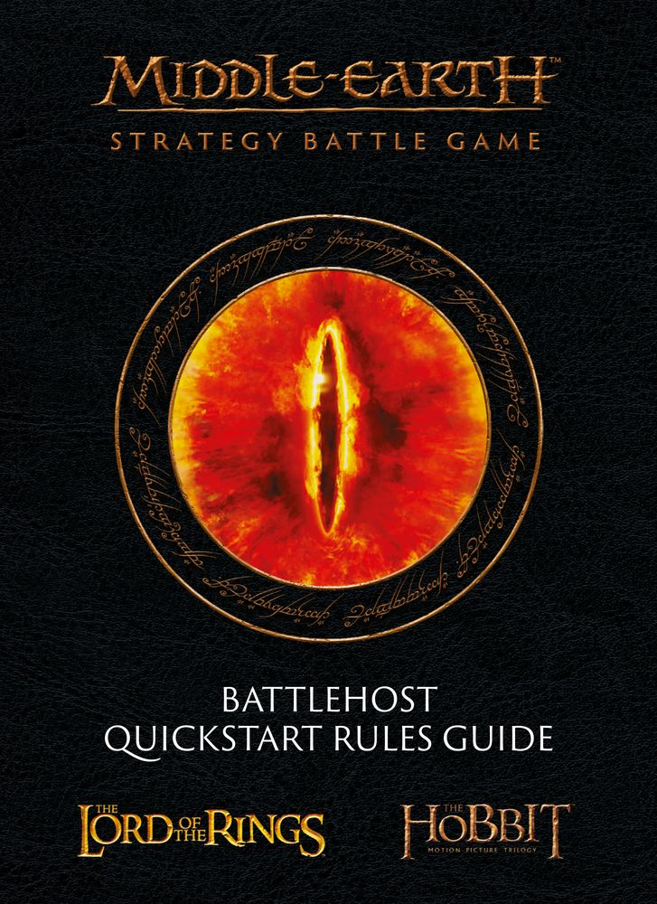

{ width=727 height=1000 }

The rules found on these pages are a simplified, stripped-down version of those found in the Middle-earth Strategy Battle Game Rules Manual, designed to teach you the fundamental rules as you make your first forays into Middle-earth. As a result, there are some small differences between the rules found here and those in the Rules Manual, and some that are omitted entirely. This is to ensure that you can get to grips with the most important aspects of the game, without having to worry about being bogged down by too much new information at one time - hopefully making for an easy and enjoyable learning experience as you command the forces of Good or Evil!
