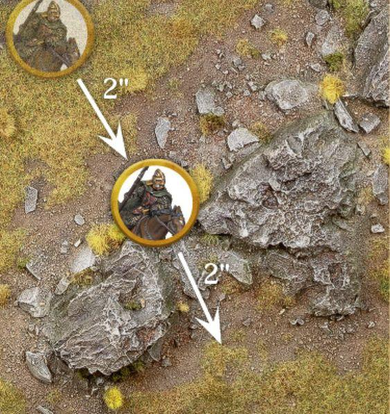
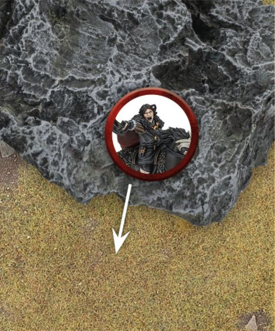
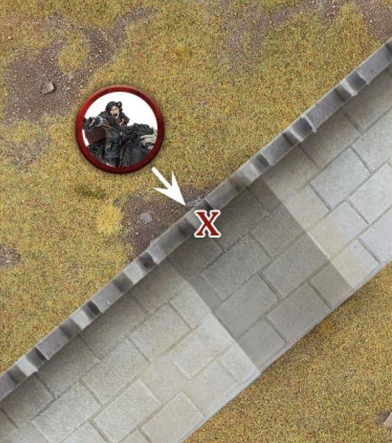
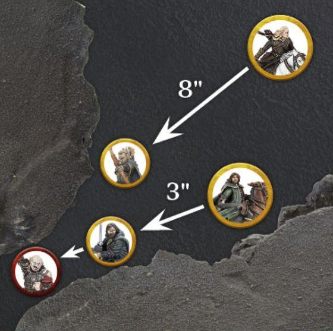
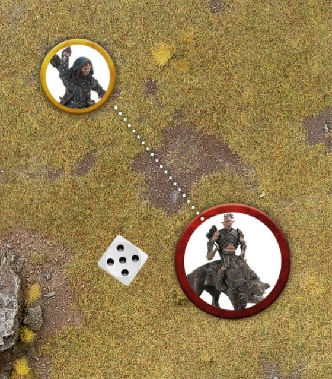
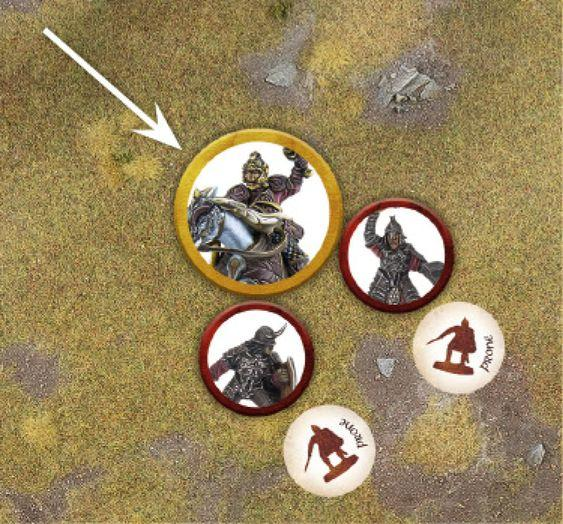
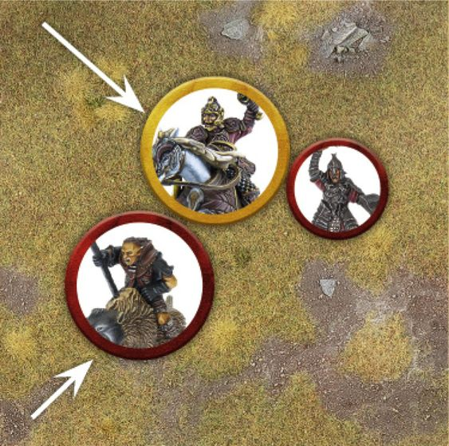
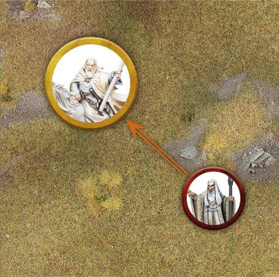

Many of the most feared and formidable armies in the history of Middle-earth have utilised cavalry to devastating effect. Whether from the back of a horse, Warg or some other mount, an impactful cavalry charge is enough to scatter even the most steadfast battleline; and those that try to stand against such a charge often find themselves trampled into the ground. There are a number of different cavalry options available to the armies of Middle- earth, each of which are capable of unleashing untold devastation upon the ranks of their enemies.

## WHAT IS A CAVALRY MODEL?

A Cavalry model consists of two parts: the rider on top, and the Mount being ridden. Riders that are separated from their Mount will immediately replace their Cavalry keyword with the Infantry keyword. Additionally, an Infantry model that purchases a Mount will replace their Infantry keyword with the Cavalry keyword. A model may only ever purchase a single Mount.

### WHICH MODELS CAN RIDE?

The only models that can ride a Mount are those who either start with the Cavalry keyword in their profile, or have purchased a Mount from their wargear options. Models that do not fit these criteria cannot be Cavalry models.

### CAVALRY LINE OF SIGHT

To determine whether or not a Cavalry model has Line of Sight to another model, always check Line of Sight from the rider and not the Mount.

## CHARACTERISTICS FOR CAVALRY MODELS

A Cavalry model has two sets of characteristics: one for the rider and one for the Mount.

### MORDOR WARG RIDER

## CAVALRY AND MOVEMENT

A Cavalry model moves in the same way as an Infantry model, with the exception that it cannot take a Climb Test, Lie Down, Crawl or use the likes of ladders, ropes or similar. Cavalry models must also use the Move Value of the Mount when they Move. When comparing the height of the Cavalry model to an Obstacle or gap, use the height of the full model from the top of the rider's head to the feet of the Mount. If the Cavalry model is in an unusual pose - such as rearing up or hunched down low - remember to use the model's true height.

### MODELS THAT MUST CHARGE

Some Cavalry models may have, or be affected by, a special rule that means they must Charge when they are Activated. When this is the case, if the only way for the model to Charge is for them to dismount, then they do not have to Charge as part of the special rule - they may Move as normal.

### MV

6"

### WARG

10"

### FV

3

3

### SV

5+

6+

### S

3

4

### D

4

4

### A

1

### 1A

### W

1

### 1W

### C

8+

8+

### I

8+

### I8+

What is a Cavalry Model? Characteristics For Cavalry Models Cavalry and Movement One of the benefits of riding a Mount is that the rider uses some of the Mount model's characteristics. Cavalry models must use the Move Value of the Mount. Additionally, during a Combat, the rider must use the Fight Value, Strength and Attacks characteristics of their Mount if they are higher than their own. In the example above, the Mordor Orc must use the Warg's Strength of 4 as it is higher than their own.

***Example 50:** Éowyn is riding towards Pelennor Fields, however she needs to pass through a rocky outcrop on her way. A horse can move 10" in total: Éowyn spends 2" of her Move Value moving up to the Difficult Terrain, leaving her with 8" remaining. This is enough to allow Éowyn to Move 2" through the rocky outcrop this turn.*

***Example 51:** Wulf is on his horse and wishes to Descend from atop this large boulder. Because the drop is taller than the model, there is a chance that it will be injured. The horse suffers one Strength 3 hit. If it survives, it may continue to Move as normal.*

### CAVALRY AND DIFFICULT TERRAIN (50)

A Cavalry model that Moves whilst within Difficult Terrain counts the distance Moved as four times what it would normally be, rather than just two times as it would be for Infantry. So, a Cavalry model that Moves 1" within Difficult Terrain will count the distance Moved as 4". This penalty is applied the entire time a Cavalry model's base is within Difficult Terrain. Additionally, whilst within Difficult Terrain, Cavalry models never get any of their usual combat bonuses for Charging, including the use of a lance if they carry one.

### JUMPING AND LEAPING

Cavalry models must take Jump and Leap Tests in the same way as other models. Jumping and Leaping from the back of a mount is not without risk, however. If a 1 is rolled for either a Jump or Leap Test for a Cavalry model, then in addition to applying the result rolled on the relevant chart, the model has also been Knocked Flying exactly as if they had rolled a 1 on the Thrown Rider Chart (see page 70).

### DESCENDING (51)

A Cavalry model may Descend a distance equal to the height of the model without penalty. However, if a Cavalry model Descends a distance greater than this, then the Mount will suffer one Strength 3 hit, plus an additional Strength 3 hit for each additional 1" it Descends greater than the height of the model.

### STAIRS, DOORWAYS AND WATER FEATURES

There are a number of interactions with terrain features that can give pause for thought when using a Cavalry model. We will cover those here.

### STAIRS

Cavalry models can climb stairs, provided they are not too steep. Steps that are broad and shallow can be Moved over as normal, however, steps that are too steep cannot be Moved over by Cavalry models. If you are unsure whether or not a Cavalry model can climb a set of stairs, make sure you discuss this with your opponent before the game starts and decide whether or not those stairs are traversable by Cavalry models.

### DOORWAYS

Cavalry models cannot pass through Doorways or ceilings that are too low. See if the model will fit through the Doorway - of course, be reasonable here; as long as the Mount fits through, it's safe to assume the rider is ducking down low in the saddle. As long as both players agree, the Cavalry model can Move through the Doorway.

### WATER FEATURES

Cavalry models can Swim, in fact they gain some bonuses when Moving through water features as explained on page 133.

### CAVALRY AND COURAGE TESTS

When you are required to take a Courage Test for a Cavalry model, only the rider needs to test. Cavalry models cannot use the Courage value of their Mount.

### SEPARATED MOUNTS

During a battle, there are situations where the rider of a Cavalry model will become separated from their Mount. Whenever a Mount loses its rider, whether this is because they have been slain, knocked from their steed, or dismounted for some other reason, the Mount must immediately take a Courage Test using its own Courage value. If the test is passed, the Mount will stay and fight and the Cavalry model is replaced with a suitable unridden Mount model (if you have no such model available, remove the model as if the Mount had failed the test). If the test is failed, the Mount flees and is removed from the board. A Mount that has an Attacks characteristic of 0 (such as a horse) will automatically fail this Courage Test (even if a rule would say they automatically pass), and will flee as soon as it has no rider. If, at any point, a Cavalry model is knocked Prone for any reason, the rider will automatically suffer the effects of Knocked Flying as per the Thrown Rider Chart. If a Cavalry model is knocked Prone whilst it is surrounded in a Combat, and the Mount does not flee meaning there is no space to place the dismounted rider, simply treat both the rider and Mount as occupying the same space for the duration of the Combat. All enemy models may make Strikes against either the rider or the Mount should they win the Duel Roll. If, after the Combat has been resolved, both rider and Mount are still alive, simply move models the minimum distance so that both can be placed as close as possible to where the original model was. Once a rider has become separated from their Mount, they cannot remount again during the game.

### DISMOUNTING (52, 53)

The rider of a Cavalry model may Dismount from their steed at any point during their Move. Dismounting is automatic, and there is no roll required. Place the newly dismounted Infantry model in base contact with the Cavalry model, and then the Mount becomes a Separated Mount. The Infantry model cannot be placed in base contact with an enemy model in this manner. Once placed, the Infantry model can continue their Move as normal, including Charging if they wish, subtracting the amount the Cavalry model Moved prior to them Dismounting from their Move Value. If a rider Dismounts and their Mount stays, the Mount cannot Move any further that turn. Sometimes, when a model Dismounts there will not be an official model that can accurately depict the wargear that the rider was carrying - such as a Rider of Rohan carrying both a shield and a bow (and possibly also throwing spears). If this is the case, then when the model Dismounts they must discard pieces of wargear so that they can be accurately represented as a model. So, in the example of a Rider of Rohan, they would have to discard either their bow or their shield. If the Rider of Rohan also had throwing spears, then they would have to discard either their bow, their bow and throwing spears, or their shield and throwing spears in order to represent a legal dismounted model - in this case a Warrior of Rohan. The choice of which wargear is discarded is always down to the model's controlling player.

***Example 52:** Wulf wishes to Move under a low arch whilst mounted. However, the arch is too low for Wulf and his horse together, and so he must Dismount and continue on foot, or find an alternative route.*

***Example 53:** Aragorn and Legolas are chasing down Gothmog, who has moved through a gap too small for a Cavalry model to fit through. As he is further away, Legolas has to Move 8" to get close to Gothmog and Dismount; though as he has now Moved over the 6" he can Move on foot, Legolas cannot Move any further. Aragorn Moves 3" before Dismounting, which then gives him 3" of his Move Value remaining - enough to Charge Gothmog.*

***Example 54:** Kíli is Shooting at the Hunter Orc on Fell Warg, targeting the rider. After successfully rolling To Hit, Kíli must now take a special In The Way Test to see whether he hits the Mount (on a 1-3) or the rider (on a 4+). Rolling a 5, Kíli's shot hits the rider and he must now roll To Wound.*

## CAVALRY AND SHOOTING

Cavalry models Shoot in the same way as other models, measuring Line of Sight from the point of view of the rider.

### SHOOTING AT CAVALRY (54)

When a model targets a Cavalry model with a Shooting Attack, they must always target the rider (unless they have a special rule that says otherwise). However, if a Shooting Attack hits a Cavalry model, it may hit either the rider or the Mount. To determine which part is hit, the player making the Shooting Attack makes a special In The Way Test and rolls a D6. On a 1-3, the shot will hit the part of the Cavalry model that was not the target. On a 4+, the shot will hit the part of the Cavalry model that was the target.

### SLAIN RIDERS AND MOUNTS

If the rider is slain, then the Mount becomes a Separated Mount as described on page 69. If it stays on the battlefield, replace the Cavalry model with a suitable unridden Mount model - it will then lose the Mount keyword. Should the Mount be slain, then the rider must immediately take a Thrown Rider Test by rolling a D6 and consulting the Thrown Rider Table. If the rider survives, replace the Cavalry model with a dismounted Infantry version of that model. The Infantry model must be placed wholly within the footprint of where the Cavalry model was, as close to the centre as possible. If the model was Engaged in Combat when it was dismounted, it will still count as being Engaged in Combat with all enemy models it was in base contact with, even though it will no longer be in base contact with those models.

### THROWN RIDER TABLE

D6 Result 1 2-5 6 Knocked Flying: The rider hits the dirt and immediately suffers one Strength 3 hit and, if they survive, are placed Prone. A model that was Knocked Flying cannot Activate, Move, Shoot, make Strikes or Cast Magical Powers for the remainder of the turn. If the Mount survived, place the rider in base contact with the Mount instead of in the centre of where its base was; if there is not enough room, separate the models the minimum distance to make it so. If the rider is Engaged in Combat, they fight as a Prone model. Rises From the Dust: The rider disentangles themselves from their Mount and gets to their feet. A model that Rises From the Dust cannot Activate, Move, Shoot, make Strikes or Cast Magical Powers for the remainder of the turn. Leaps into Action: The rider bounds from the saddle and is ready for action. A model that Leaps into Action stays on its feet and can act as normal for the remainder of the turn. Cavalry and Shooting

### LIST OF MOUNTS

There are various steeds that can be ridden by Cavalry models. The most unusual ones can be found in the profile of the Cavalry model in question, but the more common ones can be found here. Mount models have their own list of keywords; for their Faction keyword, a Mount will take on the same Faction keyword as their rider, even if the rider is slain. Some will have their own special rules as well, which are described on page 122.

### HORSE - 40MM

## CAVALRY AND COMBAT

Cavalry models fight as one during a Combat, and must always use the highest Fight Value, Attacks and Strength available between the rider and Mount - even if that means using some from one and some from the other. Whilst when a Cavalry model fights it may combine the characteristics of both rider and Mount, it is always the rider that is considered to be fighting, and so will use any special rules or abilities, or apply any modifiers (such as fighting with a two-handed weapon) associated with the rider fighting in Combat. To illustrate the point, let's compare the characteristics of a Rider of Rohan with those of a Warg Rider: Race

### HORSE

Faction SEE RIDER Unit Type MOUNT

### MV FV SV S D A W C I

10" 2 6+ 3 4 0 1 7+ 7+

### ARMOURED HORSE - 40MM

### RIDER OF ROHAN MV FV SV S D A W C I

6" 3 4+ 3 5 1 1 7+ 7+

Race HORSE Faction SEE RIDER Unit Type MOUNT

10" 2 6+ 3 4 0 1 7+ 7+

10" 2 6+ 3 5 0 1 7+ 7+

### PONY - 40MM

### MORDOR WARG RIDER MV FV SV S D A W C I

6" 3 5+ 3 4 1 1 8+ 8+ Race

Faction SEE RIDER Unit Type MOUNT

### WARG MV FV

### IC

8" 1 6+ 3 3 0 1 8+ 7+

### SPECIAL RULES:

Timid

### WARG - 40MM

10" 3 6+ 4 4 1 1 8+ 8+ The Rider of Rohan uses their own characteristics during a Combat as they are better than (or at least the same as) those of their horse. On the other hand, the Mordor Orc uses the Warg's Strength of 4 when rolling To Wound - a considerable advantage. Race

Faction SEE RIDER Unit Type MOUNT

10" 3 6+ 4 4 1 1 8+ 8+

### FELL WARG - 40MM

Race WARG Faction SEE RIDER Unit Type MOUNT Cavalry and Combat

### 10" 3 6+ 4 4 1 1 8+ 7+ SPECIAL RULES:

Fell Sight

***Example 55:** Théoden Charges a pair of Morannon Orcs. As they are both Infantry, Théoden will get the Extra Attack and Knock to the Ground bonuses. Théoden rolls three dice for his Duel Roll (2 for his Attacks +1 for Extra Attack) and wins the roll, knocking both Morannon Orcs Prone. Théoden then gets to make three Strikes, and may choose how to assign them. As his Strikes are being made against Prone enemies, Théoden will roll two dice rather than one and apply both results. He assigns the first Strike to the first Orc, rolls two dice, and then checks the results before deciding which Orc to assign the next Strike to.*

***Example 56:** Théoden has Charged another Morannon Orc. However, this time a Warg Rider has subsequently Charged Théoden as well. Since Théoden is no longer fighting solely against Infantry models, he no longer gains the Extra Attack and Knock to the Ground bonuses he would normally get. This means that Théoden will only roll two dice (the number of Attacks on his profile) when making his Duel Roll.*

### CAVALRY CHARGE (55, 56)

The main advantage of Cavalry models is the devastating charge they can unleash, using great momentum to bowl their opponents over to the ground. When a Cavalry model Charges, it gets two additional bonuses in the ensuing Fight Phase: Extra Attack and Knock to the Ground. To gain these bonuses, all of the following must be true: The Cavalry model has Charged only Infantry models and, when the Combat is resolved, they are fighting exclusively against Infantry models. The Cavalry model is not Engaged in Combat with another Cavalry model, a Chariot or a War Beast when the Combat is resolved. The Cavalry model is not in any kind of Difficult Terrain. The Cavalry model has not been Transfixed. These bonuses will still apply even if the Cavalry model is subsequently Charged by other enemy models, so long as all the above statements remain true.

### EXTRA ATTACK

A Cavalry model benefitting from this bonus increases their Attacks characteristic by 1 for the duration of the Combat. So, a Cavalry model with 1 Attack would have 2 Attacks with this bonus, rolling two dice for the Duel Roll and making two Strikes. This bonus still applies if the rider is using the Attacks characteristic of their Mount.

### KNOCK TO THE GROUND (55)

If a Cavalry model benefitting from this bonus wins the Duel Roll, then all Infantry models they are Engaged in Combat with will be knocked Prone after Backing Away - with the exception of Monster models or models with a Strength of 6 or above.

### MAKING STRIKES AGAINST CAVALRY MODELS

If a model wins a Duel Roll against a Cavalry model, then it may choose to make its Strikes against either the rider or the Mount. This choice is down to the player making the Strikes, and they can distribute them however they choose, and may even resolve them one at a time in the usual fashion, and even alternate between rider and Mount if they wish. No In The Way Tests are required to Strike either the rider or Mount. If the rider is slain, then the Mount becomes a Separated Mount. If the Mount is slain, then the rider will need to take a Thrown Rider Test; however, this is only taken and the effects applied after all other Strikes have been resolved.

### FIGHTING ACROSS BARRIERS

Cavalry models can defend Barriers in the same way as Infantry models. If a Cavalry model Charges a model that is defending a Barrier, then they do not get either the Extra Attack or Knock to the Ground bonuses. Remember though, that the Barrier must be at least half as tall as the attacker (in this case the Cavalry model) in order for it to count as a Barrier that can be defended.

## CAVALRY AND SPECIAL RULES

If a special rule states it affects a model, or all models within a certain range or specification, then both the rider and the Mount of a Cavalry model will be affected unless otherwise stated.

## CAVALRY AND MAGIC (57)

If a model uses a Magical Power that targets a Cavalry model, then the whole model (both rider and Mount) is considered to be the target of the Magical Power, and both will feel the effects. Some Magical Powers may state that if it targets a Cavalry model then they must choose whether the rider or Mount is affected, in which case only the chosen part of the Cavalry model will be affected if the Magical Power succeeds (see page 112).

## CAVALRY AND BREAK POINTS

As a Cavalry model contains two parts - the rider and the Mount - it can be confusing trying to understand if and when slain Cavalry models count as a casualty in regards to working out if an Army has been Broken. A Cavalry model will count as a casualty in regards to working out whether an Army is Broken (or reduced to 25%) as soon as the rider is slain, regardless as to whether the Mount stays or flees. If the Mount is slain, either before the rider or after the rider has been slain themselves, then this will not count as a casualty towards an Army's Break Point. Cavalry and Special Rules Cavalry and Magic Cavalry and Break Points

***Example 57:** Gandalf is mounted upon Shadowfax and is the target of Saruman's Flameburst Magical Power. As this is a Cavalry model, both Gandalf and his Mount, Shadowfax, will feel the effects.*

