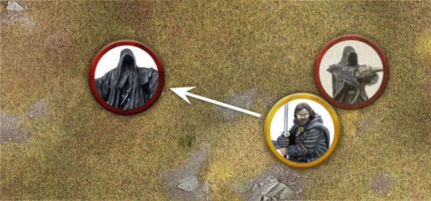
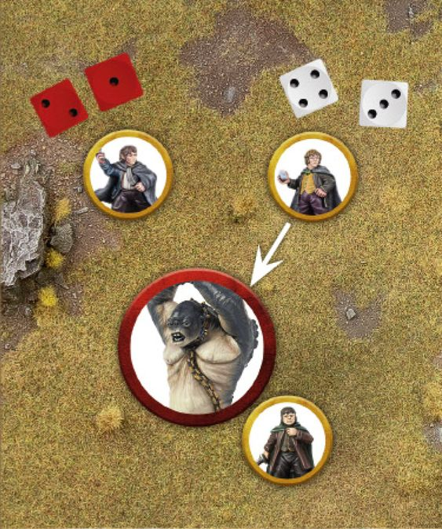
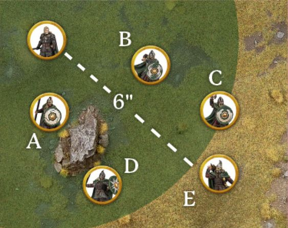
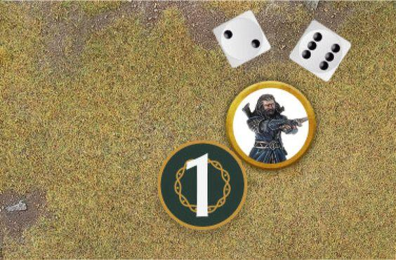
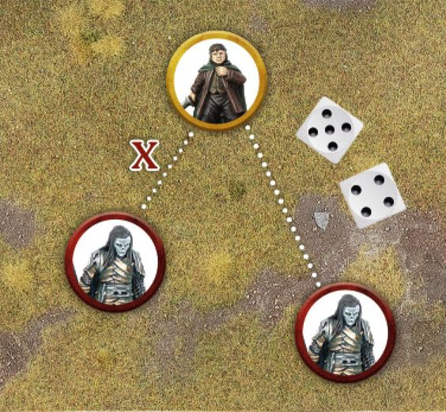

As a battle rages on, those fighting will become surrounded by death, destruction and the horrors of war. They will also be faced with all manner of dire situations which require a swift decision to be made in the heat of battle. With peril around every corner and mere seconds to make important choices, warriors will need to muster every ounce of bravery and intellect if they are to hold fast and make it through to the end of the battle.

Every profile in the Middle-earth Strategy Battle Game has two characteristics that represent the model's inherent bravery and how smart they are when faced with choices on the battlefield: Courage and Intelligence. Some models may be both equally courageous and intelligent, whilst others may excel at (or simply not be very good at) one or the other. Courage and Intelligence function in much the same way, and we will cover them both in this section.

## COURAGE (44)

There will be many situations that arise in a game when a model will need to take a Courage Test - the most common of which have been listed below. To take a Courage Test, roll 2D6 and compare the result to the model's Courage characteristic. If the score of the 2D6 is equal to or greater than the model's Courage, the Courage Test has been passed. If the score is less than the model's Courage, the test has been failed and the model will suffer the consequences as stated in the rule causing the Courage Test to be taken.

### WHEN TO TEST

The most common occurrences that cause a Courage Test to be taken are: Broken Army: When an Army is reduced to less than 50% of its starting numbers it will become Broken, and models may start fleeing the battlefield. Separated Mounts: If the rider and Mount of a Cavalry model become separated, the Mount must immediately take a Courage Test. Terror: If a model wishes to Charge an enemy model which has the Terror special rule. There will be other situations that also require a model to take a Courage Test. When these occur, it will be clearly stated in the relevant rules.

### TAKING MULTIPLE COURAGE TESTS (45)

If a model passes a Courage Test caused by a special rule or ability, it will automatically pass any other Courage Tests it is required to make for the same special rule or ability for the remainder of the turn, unless otherwise stated.

***Example 45:** Aragorn has Charged a Ringwraith after passing his Courage Test due to the Ringwraith's Terror special rule. Aragorn declares a Heroic Combat (see page 81) and successfully slays the Nazgûl. Aragorn does not need to take a second Courage Test to Charge the second Ringwraith as he has already passed one Courage Test for the Terror special rule this turn.*

***Example 44:** A lumbering Cave Troll has Charged Frodo. Wishing to save their friend from this terrifying beast, Merry and Pippin both attempt to Charge the Troll. As the Cave Troll has the Terror special rule, both Merry and Pippin must take a Courage Test. Merry goes first and rolls a 3 and a 4 for a total of 7. As his Courage is 6+, Merry passes the Courage Test and may Charge. Next, Pippin takes his Courage Test and rolls a 1 and a 2 for a total of 3. As his Courage is also 6+, Pippin fails and so cannot Charge the Troll - or Move at all this Move Phase.*

### COURAGE

***Example 46:** The army of Minas Tirith have been frantically fending off the Mordor Orcs, killing as many as possible. At the start of the game there were 30 Orcs, but at the start of the tenth turn, 16 have been slain. As the Orcs had a Break Point of 15, they are now a Broken Army - they must now start taking Courage Tests at the start of each of their Activations.*

***Example 47:** Haleth's Army has been Broken. At the start of his next Activation, Haleth takes his Courage Test and passes it. At the end of Haleth's Activation he calls Stand Fast, which has a range of 6". Warriors of Rohan A, B and C are all within range of Haleth's Stand Fast and can draw Line of Sight to him. Warrior of Rohan D is within range of Haleth's Stand Fast, but cannot draw Line of Sight to him - they must take their own Courage Test. Warrior of Rohan E is not within range of Haleth's Stand Fast, and so must also take a Courage Test.*

### BROKEN ARMY (46)

When you write an Army List for Matched Play, you will also need to calculate your Army's Break Point. This is always equal to half the number of models in your starting Army, even if the number of models in your Army would increase during the game. So, an Army of 50 models would have a Break Point of 25, whilst an Army of 13 models would have a Break Point of 6.5. During the game, you should keep track of how many casualties your Army has suffered. If, at the start of any turn, the number of casualties your Army has suffered is greater than its Break Point, then your Army is considered to be Broken from that point onwards. Once your Army is Broken, every time a model from your Army Activates it must take a Courage Test before doing anything else. As models that are Engaged in Combat, or are under the effects of a special rule or Magical Power that renders them unable to Activate, cannot Activate they do not have to take this Courage Test. If the Courage Test is passed, the model will stay and fight. If this Courage Test is failed then the model flees and is removed from the board as a casualty.

### STAND FAST (47)

Stand Fast is a rule that only applies to Courage Tests taken by Hero models as part of the rules for a Broken Army. When a Hero model takes a Courage Test for being part of a Broken Army and passes, then at the end of their Activation they must call Stand Fast. Any friendly Warrior model that Activates within 6" of a Hero who has called Stand Fast, and who can draw Line of Sight to the Hero, will automatically pass their Courage Test for being part of a Broken Army. Other Hero models are not affected by this rule and make their own Courage Test as normal. Remember that Hero models that are Engaged in Combat or affected by a special rule or Magical Power that renders them unable to Activate, cannot Activate and do not take this Courage Test, and therefore cannot provide a Stand Fast.

## INTELLIGENCE (48)

There will be many situations that arise in a game when a model will need to take an Intelligence Test. To take an Intelligence Test, roll 2D6 and compare the result to the model's Intelligence characteristic. If the score of the 2D6 is equal to or greater than the model's Intelligence, the Intelligence Test has been passed. If the score is less than the model's Intelligence, the test has been failed and the model will suffer the consequences as stated in the rule causing the Intelligence Test to be taken.

### TAKING MULTIPLE INTELLIGENCE TESTS (49)

If a model passes an Intelligence Test caused by a special rule or ability, it will automatically pass any other Intelligence Tests it is required to make for the same special rule or ability for the remainder of the turn, unless otherwise stated.

### INTELLIGENCE

***Example 48:** Thorin is trying to free a relic from the ground and requires an Intelligence Test to do so. Thorin rolls a 1 and a 3 for his Intelligence Test, for a total of 4. As his Intelligence is 5+, Thorin fails to retrieve the relic which stays in the ground. The next turn, Thorin tries again. This time he rolls a 2 and a 6 for a total of 8 - a pass. Thorin retrieves the relic.*

***Example 49:** Frodo has been targeted by a Spectre's A Fell Light is in Them special rule, and must now take an Intelligence Test. Frodo has an Intelligence of 5+ and rolls a 4 and a 5 for his Intelligence Test for a total of 9 - a clear pass. A second Spectre then also targets Frodo with the A Fell Light is in Them special rule. However, as Frodo has already passed one Intelligence Test this turn due to this special rule, he will automatically pass the second test.*

