Battles are won and lost in the chaos of hand-to-hand combat, where warriors meet each other face-to-face in an epic clash of steel. Skill with a blade, a stout heart and no small amount of luck are required to achieve victory when the fighting gets up close and personal. In order to emerge victorious, a general will need to amass their forces and use them to great effect on the battlefield, crushing their foes in combat.

During the Fight Phase, models will battle for their lives in a series of Combats. A Combat is essentially a duel between two or more enemy models that are Engaged in Combat with each other. Remember, enemy models can only be placed in base contact with each other if one of the models has Charged the other, and all enemy models in base contact (and therefore Engaged in Combat) must fight - there is no standing idly by! Every Combat must be resolved during the Fight Phase; you cannot choose not to resolve some of them.

The Fight Phase can be broken down into a number of steps as shown below:

1. **Start of Fight Phase** - Any special rules that come into play at the start of the Fight Phase are resolved here.

2. **Combats are Paired Off** - The Player with Priority will Pair Off those models that are Engaged in Combat into individual Combats where possible.

3. **Declare Heroic Actions** - Any Heroic Actions that can be declared in the Fight Phase are declared here.

4. **Combats are Resolved** - The various Combats are resolved one at a time in an order chosen by the player with Priority.

5. **End of Fight Phase** - Any special rules that come into play at the end of the Fight Phase are resolved here.

## PAIRING OFF COMBATS (29)

At the start of the Fight Phase, the very first thing that needs to be done is to work out which models are Engaged in Combat with one another. Any models that are Engaged in Combat with an enemy model will need Pairing Off into Combats. By the end of the Pairing Off Combats step, you will need to reach a situation where all models that were Engaged in Combat are assigned to a Combat, and that no Combat has multiple models from both sides involved in the Combat - i.e., you cannot have a Combat with two (or more) models from each side.

When it comes to Pairing Off Combats, there are a few rules that govern how it works.

The first is that all models Engaged in Combat with an enemy model must be Paired Off into a Combat - they cannot be Paired Off in a way that would stop them being Engaged in Combat. Models can only be Paired Off into a Combat with a model they are in base contact with.

Secondly, if a model could be Paired Off into multiple different Combats, then the player with Priority may decide which Combat the model is Paired Off into. These do not need to be done equally, so long as every model that was Engaged in Combat has been Paired Off into a Combat.

In practice, it is often a good idea for players to look over the Combats at the start of the Fight Phase and split them, with the player with Priority deciding on any where there are multiple options. It can be a good idea whilst you are learning to separate the Combats slightly so that there is a small gap between them. However, this should only be done for clarity and not to gain an advantage in-game by moving a model into or out of range of an ability. If models are moved in this way for the sake of clarity, they will still count as being in base contact with what they were with beforehand.

Sometimes there may be a situation where a rule will target or affect a model in a Combat which could cause multiple other models to be affected as well - such as a Shooting Attack, Magical Power or an ability that could Move a model out of Combat before the Fight Phase. When this would be the case, the game should be temporarily paused and the player with Priority should decide how the affected Combats should be Paired Off for the purpose of the rule or ability in question. Once this has been done, the rule is resolved as normal and play continues. When it gets to the Fight Phase, the player with Priority will then Pair Off the Combats again as normal.

***Example 29:** Frodo is in base contact with Moria Goblin A. As it's clear who Frodo is fighting, and there are no other models in the Combat, no Pairing Off is required.*

*Sam is in base contact with Moria Goblins B and C. Merry is also in base contact with Moria Goblin C, and so Merry is Paired Off against Moria Goblin C, leaving Sam to be Paired Off against Moria Goblin B. Finally, and most complex of all, Pippin is in base contact with Moria Goblins D, E and F,whilst Aragorn is in base contact with Moria Goblins F and G. It is clear that Pippin is fighting Moria Goblins D and E, and that Aragorn is fighting Moria Goblin G.*

*However, as Moria Goblin F could be fighting either Pippin or Aragorn, and both are already in a Combat it is up to the player with Priority to decide which Combat it will be Paired Off into. As the Evil player has Priority, they choose to Pair Off Moria Goblin F into Pippin's Combat - bad news for the Hobbit!*

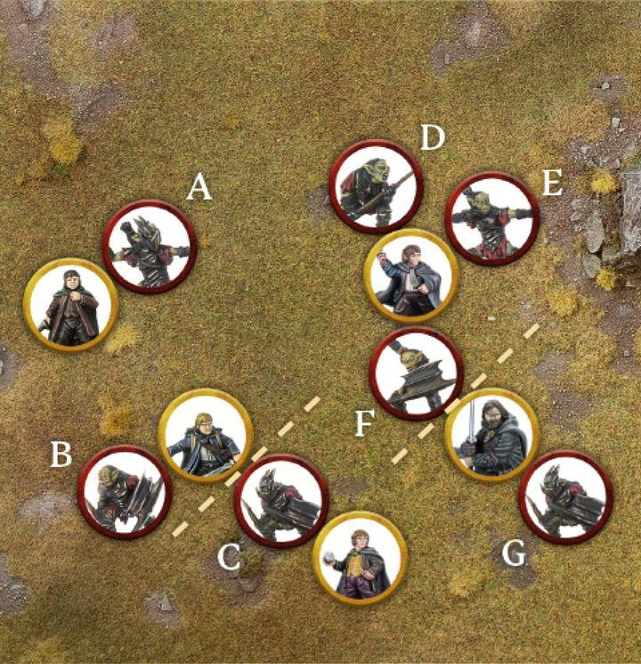{ width=720 height=745 }

## WHEN TO FIGHT

Combats are resolved one at a time in an order chosen by the player with Priority. Players use dice to determine the outcome of a Combat and whether any casualties are caused. Once a Combat has been resolved, the player with Priority chooses another Combat to resolve, and so on until all Combats have been resolved.

The order that Combats are resolved in is often of little consequence, and so it is usually best to work them out in an arbitrary manner such as left to right or saving the most interesting ones until last. However, sometimes the order in which you resolve Combats can make a big difference - models might be Trapped, banners may be in jeopardy, and so on. Because of this it is always worth the player with Priority taking a look at how best they can pick the order of Combats to work in their favour.*

## RESOLVING A COMBAT

Resolving a Combat is simple, especially once you have done it a few times. A Combat is broken down into four steps as shown below:

1. **Duel Roll** - Players roll a number of dice equal to the number of Attacks their models have in that Combat to see who wins.

2. **Loser Backs Away** - The losing model, or models, must Back Away 1".

3. **Winner Makes Strikes** - The winning model, or models, now roll To Wound to try to cause any Wounds.

4. **Remove Casualties** - Any models slain are removed from play as casualties.

### DUEL ROLL (30, 31)

To see who wins a Combat, players must make a Duel Roll. When making a Duel Roll, each player rolls a D6 and the player with the highest roll wins the Combat.

If a model in a Combat has multiple Attacks, they will roll a number of D6 equal to their Attacks characteristic rather than just one, and then use the highest individual result.

Many things can affect a Duel Roll, so when making a Duel Roll follow these steps in order:
- Gather the number of dice you need for the Duel Roll; use a different colour of dice for each model with modifiers or Might Points available.
- Declare any models that wish to use any weapon abilities that would affect the Duel Roll, such as using a two-handed weapon.
- Roll all of your dice.
- Apply any modifiers to the dice rolls.
- Use any re-rolls, banners, special rules, etc. Remember to apply any modifiers to these re-rolls as well.
- Use Might Points.
- Determine the winner.

***Example 30:** Frodo is fighting for his life against this Moria Goblin. They need to make a Duel Roll, and both roll a dice to see who wins. Frodo rolls a 5, whilst the Moria Goblin rolls a 2. With the highest result, Frodo wins the Duel Roll and the Moria Goblin must Back Away.*

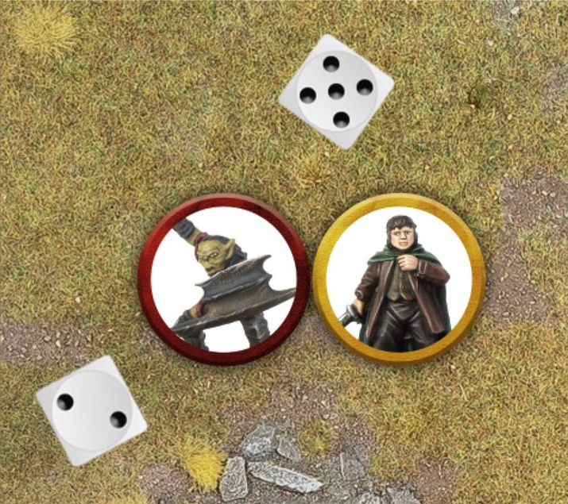{ width=715 height=635 }

***Example 31:** Here, Aragorn is fighting an Uruk-hai. As a skilled combatant, Aragorn has 3 Attacks on his profile. This allows him to roll three dice for his Duel Roll, compared to the Uruk-hai's 1, and pick the highest result.*

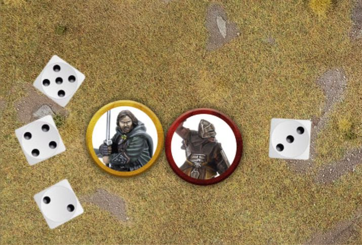{ width=715 height=485 }

#### WHO RE-ROLLS FIRST?

There may be instances where models on both sides have the chance to use a re-roll, such as during a Combat if models from both sides are in range of a banner or have a special rule that allows them to. In these instances, the player who is currently losing the Duel Roll decides whether or not to re-roll first. After they have re-rolled, the player who is then losing chooses whether or not to use any of their re-rolls (if they have any remaining). This continues until either no more re-rolls can be used, or neither player wishes to use their re-rolls.

#### DRAWN COMBAT (32)

Quite often, the highest result that both players get in a Duel Roll will be the same, and is therefore tied. When this is the case, compare the Fight Values of the models in the Combat - the model with the highest Fight Value wins the Combat.

If this is still a tie, then the player with Priority will need to roll a D6 to see who wins. On a 1-3 the Evil side wins, whilst on a 4-6 the Good side wins.

***Example 32:** Frodo is fighting yet another Moria Goblin. Making a Duel Roll, both Frodo and the Moria Goblin roll a 3 - a tie. Comparing their Fight Values, we see that Frodo has a Fight Value of 3, whilst the Moria Goblin has a Fight Value of 2, meaning that Frodo wins the Duel Roll and the Moria Goblin must Back Away. Frodo will then have the opportunity to make a Strike.*

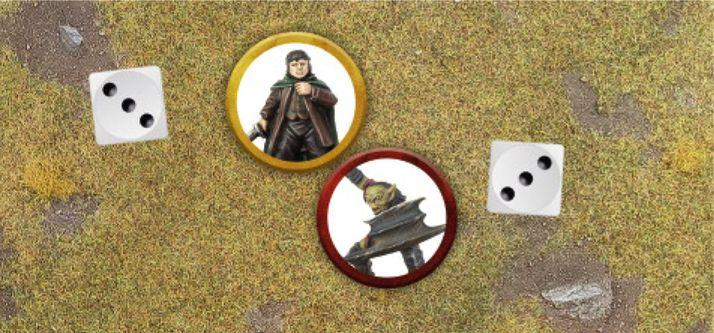{ width=714 height=333 }

### LOSER BACKS AWAY (33, 34)

Once the winner of the Duel Roll has been determined, the loser must Back Away in a direction chosen by their controlling player. To Back Away, the losing model must Move 1" in a straight line (though this does not have to be directly away).

When a model must Back Away it may Move through the Control Zones of enemy models, but cannot Move into base contact with them. When a model must Back Away this will not count as a normal Move, and so can still be done if a model used their full Move Value during their Activation or has been affected by a special rule or Magical Power that would normally prevent them from Moving. This also means that Backing Away is not slowed by Difficult Terrain. Backing Away cannot be used to cross Obstacles or take a Jump, Climb or Leap Test. However, if the loser is at the edge of a vertical drop, with nowhere else to Back Away to, then they must Back Away over the edge and will fall as described on page 35. Make any Strikes against the model being pushed over the edge first and then resolve any Falling Damage if the model survives.

***Example 33:** Haleth has beaten Wulf in a Duel Roll, and so Wulf must now Back Away 1". The direction in which Wulf Backs Away is up to his controlling player, as long as he Moves the full 1" away from Haleth. As Wulf retreats backwards, Haleth readies his weapon to make Strikes.*

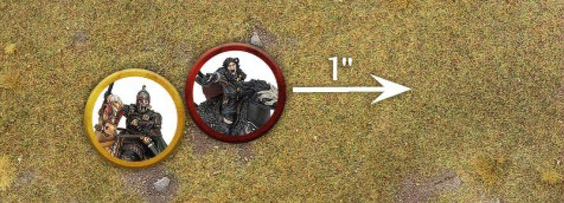{ width=714 height=258 }

***Example 34:** Bombur has lost a Duel Roll and finds himself pinned in place by two Goblins with his back to a sheer drop. As he must Back Away, Bombur is forced over the edge! First the Goblins resolve their Strikes as normal and then, assuming Bombur survives, he will fall and suffer Falling Damage.*

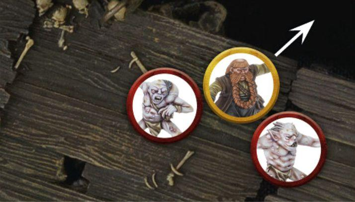{ width=714 height=407 }

#### TRAPPED

If a model cannot Back Away when they lose a Duel Roll then they are Trapped. Usually this happens when a model is backed against terrain or surrounded by other models.

If a model is Trapped then it does not Back Away at all; instead it will remain in place whilst the enemy models make their Strikes. Once these have been resolved, if the Trapped model has not been slain, slightly separate the enemy models from the Trapped model so they are no longer in base contact.

Some rules may ask you to check to see if a model would be considered to be Trapped in order to apply an effect. When this is the case, these rules should be applied at the time the special rule in question comes into effect. For example, some may say 'at the start of the Fight Phase', in which case you would check to see if the model is Trapped at the start of the Fight Phase. Others might say 'during a Combat' or similar, in which case you would check at the start of that Combat before any dice are rolled. In all instances of this type of rule, a model would be considered Trapped if, should they lose the ensuing Duel Roll, they would be unable to Back Away as normal. If the model would be able to Back Away as a result of a friendly model deciding to Make Way, then they would not be considered Trapped for the purpose of the special rule.

#### MAKE WAY (35)

Sometimes a model may find themselves Trapped because a friendly model is blocking their retreat. In these situations it is possible for a friendly model to make a special Make Way Move of up to 1" to clear a path for their ally to Back Away into. This can still be done even if the model Backing Away could Back Away without needing an ally to Make Way - in fact, this can be a good way of trying to keep models in formation.

To Make Way, simply Move the friendly model as described above in order to allow their ally to Back Away the full 1". A Make Way Move is not slowed by Difficult Terrain and can still be made if the model is Prone.

A model cannot Make Way if they are Engaged in Combat, have been rendered unable to Move by a special rule or Magical Power, or if doing so would require them to Move over an Obstacle. A model cannot take a Jump, Climb or Leap Test as part of a Make Way Move, and cannot use a Make Way Move if doing so would force them over the edge of a cliff (or similar) which would require them to take Falling Damage.

Only a single friendly model can Make Way for an ally; if one model using a Make Way is not enough to prevent a model from being Trapped, then no Make Way Move is made and the model is Trapped.

A Make Way Move is entirely optional, though not doing so will likely result in an ally being Trapped.

***Example 35:** Théoden has lost a Duel Roll against the Witch-king, and finds himself Trapped by Éowyn and Merry. Not wanting Théoden to take double Strikes from the Lord of the Nazgûl, the Good player has Merry Make Way to allow Théoden the space he needs to Back Away.*

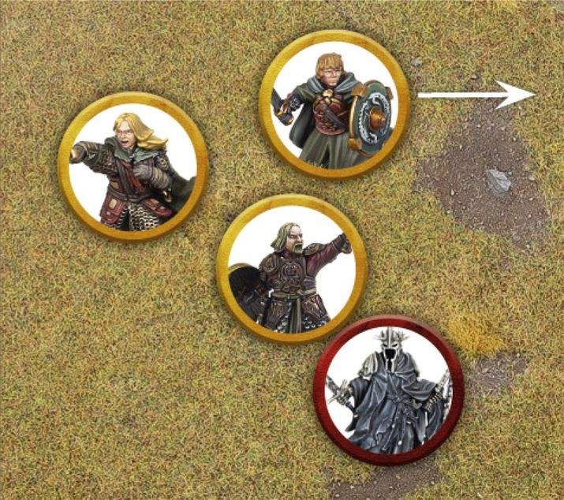{ width=715 height=634 }

#### PRONE MODELS

Whilst a Prone model cannot Charge an enemy, they can still be Charged as normal. A Prone model will still participate in a Duel Roll as normal, with one exception. If a Prone model wins a Duel Roll, they do not get to make Strikes against enemy models and instead may immediately Stand Up.

A Prone model must still Back Away as normal, however, if a Prone model loses the Duel Roll they will always be considered to be Trapped.

If both models in a Combat happen to be Prone, the Duel Roll will still be made; however, the winner will simply get to Stand Up and the loser will Back Away as normal.

### WINNER MAKES STRIKES

Once the Duel Roll has been resolved and the loser has Backed Away, the winner gets the chance to make Strikes against their enemy. To make a Strike, roll To Wound by comparing the model's Strength against the target's Defence on the To Wound Chart in the same manner as Shooting (see page 44). If the To Wound Roll is successful, the target suffers a Wound; reduce their remaining Wounds by 1. If this reduces a model's Wounds characteristic to 0, they are slain and removed as a casualty. If the To Wound Roll fails, nothing happens.

#### MULTIPLE ATTACKS

If a model with multiple Attacks wins a Duel Roll, they may make a number of Strikes equal to their Attacks characteristic. Make a To Wound Roll for each.

#### STRIKING A TRAPPED MODEL (36)

Whenever a model resolves a Strike against a Trapped model, they make two To Wound Rolls simultaneously and apply both of the results. This means that a model making two Strikes against a Trapped model will make four To Wound Rolls in total; a model making three Strikes would make six To Wound Rolls, and so on.

***Example 36:** Gandalf has forced this Moria Goblin against a rocky wall, trapping it. The Wizard wins the Duel Roll, causing the Moria Goblin to be Trapped. Gandalf makes a Strike against the Moria Goblin and rolls two To Wound Rolls against his Trapped foe, applying both results.*

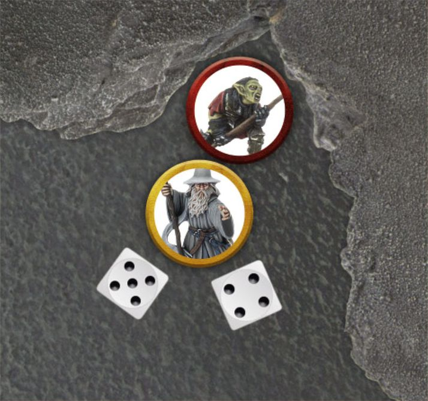{ width=714 height=670 }

### REMOVE CASUALTIES

Any model that is reduced to 0 Wounds is immediately slain and removed as a casualty.

### MULTIPLE COMBATS

In a Combat where there is more than one model on one (or, in very rare instances, both sides), things work the same as in a one-on-one fight. Though there are still some things to mention for clarity.

#### DUEL ROLL

Both players make a Duel Roll to see who wins the Combat. A player with multiple models in the Combat rolls a number of D6 equal to the combined Attacks characteristics of all of their models involved in that Combat.

When comparing the results on the dice to work out which side has won the Duel Roll, only count the highest individual dice result and the highest Fight Value from each side.

#### LOSER BACKS AWAY

If there are multiple models on the losing side, they must all Back Away as normal, in an order chosen by their controlling player. If a model is Backing Away from multiple models, they must choose one of them to Back Away the full 1" from.

#### WINNER MAKES STRIKES (37)

A model that wins a Duel Roll against multiple models may make Strikes against any model they were fighting against. If multiple models win a Duel Roll, they can resolve their Strikes in any order as chosen by their controlling player - however, you must fully resolve all of one model's Strikes before moving on to the next one.

***Example 37:** Aragorn is fighting two Uruk-hai: one Trapped against a rocky wall, and another that has Charged in against him. Aragorn wins the Duel Roll and now gets to resolve his Strikes. He chooses to use his first Strike against the Trapped Uruk-hai and makes two To Wound Rolls simultaneously as it is Trapped. If the Uruk-hai survives, Aragorn can direct another Strike at it (for a further two To Wound Rolls) or he can choose to use his Strikes against the other Uruk-hai, which will only make a single To Wound Roll each as the other Uruk-hai is not Trapped.*

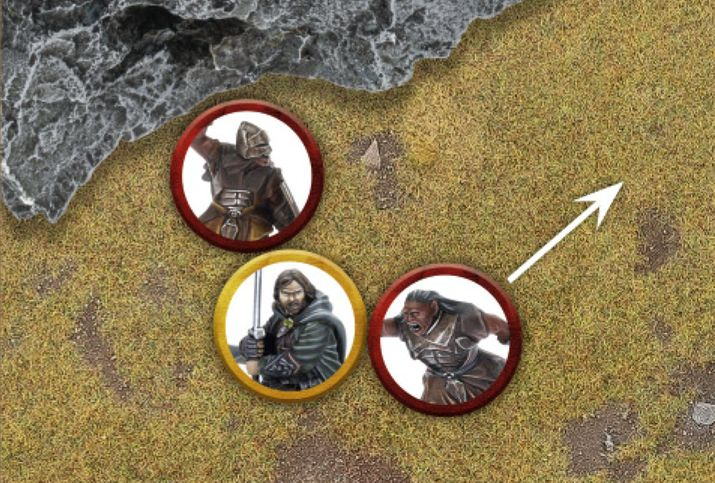{ width=715 height=483 }

#### MULTIPLE ATTACKS (37)

If a model with multiple Attacks wins a Duel Roll against multiple enemy models, they may choose to resolve these either one at a time or all together, whichever suits you. However, there are some things to bear in mind if you do this.

If a model resolves their Strikes one at a time, they must fully resolve the result of that Strike - including choosing whether or not to spend Might, use any relevant special rules and so forth - before moving onto the next one. Once they move on to the next Strike, they cannot go back. However, the benefit of a model deciding to resolve their Strikes one at a time, is that they can wait to see the result of that Strike before deciding where to use their next Strike (if they have any remaining).

If a model resolves all their Strikes simultaneously, they must declare where each Strike will go before making any To Wound Rolls. They will then make all their To Wound Rolls at the same time and can use any Might Points or relevant special rules as they see fit.

Often, if a model with multiple Attacks is making Strikes they will do so in the most beneficial manner to them. It is important to make sure your opponent is aware of what is happening, and that you are clear about your intentions when making Strikes. It is also important to ask your opponent how they are using their Strikes if you are unsure.

#### OUTNUMBERED IN A COMBAT

Some special rules will come into effect when a certain model is outnumbered in a Combat, i.e., if the model is on its own and fighting multiple opponents - such as if it is two-on-one. It is important to note that Supporting models (see page 104) never count towards working out if a model is outnumbered in a Combat.

## DEFENDED POSITIONS

Certain areas of the battlefield are ideally suited as defensive positions, giving fighters a chance to use their surroundings to their advantage. From walls and hedges to the likes of Doorways and Elevated Positions, these defensible positions can see a warrior hold out far longer than they normally could.

### BARRIERS (38)

Barriers encompass the likes of walls, hedges, barricades and other such terrain. Essentially, to count as defendable, a Barrier needs to be at least half the height of the attacker and the defender needs to be able to see over the Barrier.

For a model to defend a Barrier they must be in base contact with it. When this is the case, the defending model's Control Zone will extend over the Barrier rather than stopping at it, as shown in example 38. As with any other Control Zone, an enemy model cannot enter the defending model's Control Zone without Charging them. To Charge a defending model, place the attacking model in base contact with the Barrier as close to the defender as possible.

Additionally, so long as a defending model has a Control Zone, enemy models cannot attempt to cross the Barrier within that Control Zone - they must Charge and fight them.

If the attacker is more than twice the size of the Barrier, then it will offer no protection for the defender and they may still ignore it as they Move.

Prone models may never defend a Barrier.

***Example 38:** Haleth is in base contact with a low wall and is therefore defending it, with his Control Zone extending over it. No enemy model may cross the wall within Haleth's Control Zone unless they first Charge and slay him. The Hill Tribesman must decide whether to cross the wall further away from Haleth, or whether to risk taking on a skilled fighter behind the barricade.*

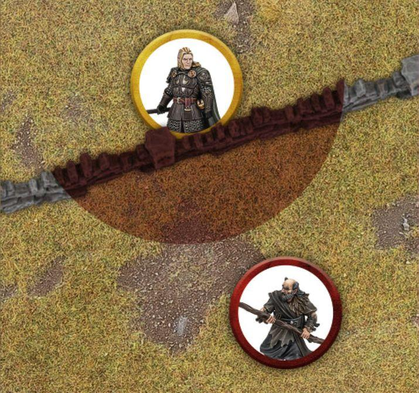{ width=715 height=671 }

#### CHARGING A MODEL BEHIND A BARRIER

To Charge a model that is defending a Barrier, simply Move the Charging model into base contact with the Barrier as close to the defending model as possible on the opposite side of the Barrier. Even though they are not in base contact, these models will still count as being Engaged in Combat and in base contact for all other purposes. The defending model's Control Zone is then cancelled out.

Only a single model may Charge a model over a Barrier. However, models on the same side of the Barrier as the defender may still Charge them as normal.

#### DUELLING OVER BARRIERS (39)

The rules for making a Duel Roll over a Barrier are exactly the same as those for a normal Duel Roll.

***Example 39:** Here, Haleth and General Targg are fighting over a Barrier with Haleth as the defender. Haleth wins the Duel Roll and makes his Strikes against General Targg without needing to make an In The Way Test for each Strike. If General Targg had won, he would have needed to take an In The Way Test for each of his Strikes.*

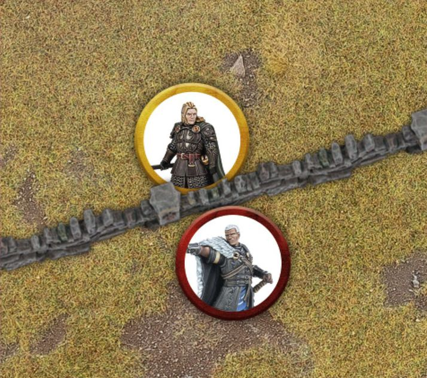{ width=714 height=633 }

#### MAKING STRIKES OVER BARRIERS

Unlike in other Combats, when models fight over a Barrier then Strikes are made before models Back Away. If the defender wins, then they may make Strikes as normal. However, if the attacker wins, then they must make an In The Way Test for each of their Strikes before rolling To Wound. For each Strike that fails its In The Way Test, nothing happens. For each Strike that passes its In The Way Test, a To Wound Roll is made.

As Backing Away happens after Strikes are made, models fighting over a Barrier will never count as Trapped if they couldn't Back Away - unless the Combat has attackers on both sides (see below).

#### BACKING AWAY FROM BARRIERS

If the defender wins the Duel Roll and the attacker survives, the attacker Backs Away as normal.

If the defender loses but survives, then they do not Back Away; the attacker must Back Away instead.

If the defender is slain, then the attacker may immediately cross the Barrier and be placed where the defender was on the other side of the Barrier.

#### ATTACKED FROM BOTH SIDES (40)

Should a model defending a Barrier also be Charged by an enemy model on the same side of the Barrier as themselves, then they will lose all protection that Barrier would offer. As a result, the Combat is treated the same as any other Combat and all models will ignore the Barrier when making Strikes. If the defending model is slain, the attacking model may cross the Barrier as described above.

In an alternative situation, if the attacking model is Charged by another model on the defender's side on the same side of the Barrier as the attacker, then this will also be treated as a normal Combat as described above - with the exception that even if the attacker slays the defender they may not cross the Barrier.

***Example 40:** Haleth is still defending the low wall against General Targg but now a Hill Tribesman has arrived. Because the Hill Tribesman is on the same side of the Barrier as him, Haleth will receive no protection from the Barrier. Should Haleth lose the Duel Roll, General Targg and his ally will be able to make Strikes against Haleth without needing to take an In The Way Test for each Strike.*

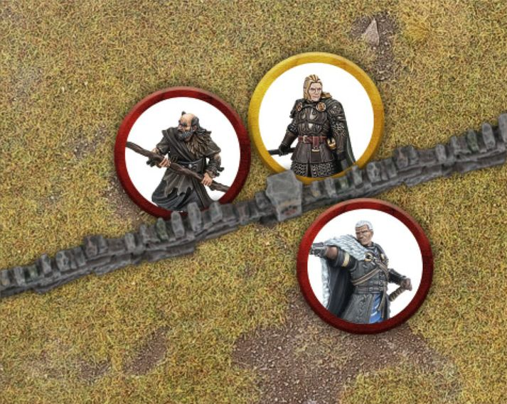{ width=713 height=569 }

### DOORWAYS (41)

A model in a Doorway counts as defending a Barrier if they are Charged by an enemy model, so long as the enemy model cannot Move through the Doorway without Moving into base contact with the defender. If the enemy model could Move through the Doorway without Moving into base contact with the defender (even though they must still Charge the defender), then the model in the Doorway will not count as defending a Barrier.

Only a single model can defend a Doorway at a time. If two models could stand in the Doorway at the same time, then it is too big of a Doorway to be defended.

***Example 41:** Here, Gothmog is blocking a Doorway he is standing in. Because Aragorn cannot Move through the Doorway without Moving into base contact with Gothmog, the sneaky Orc gets the advantage of defending the Doorway.*

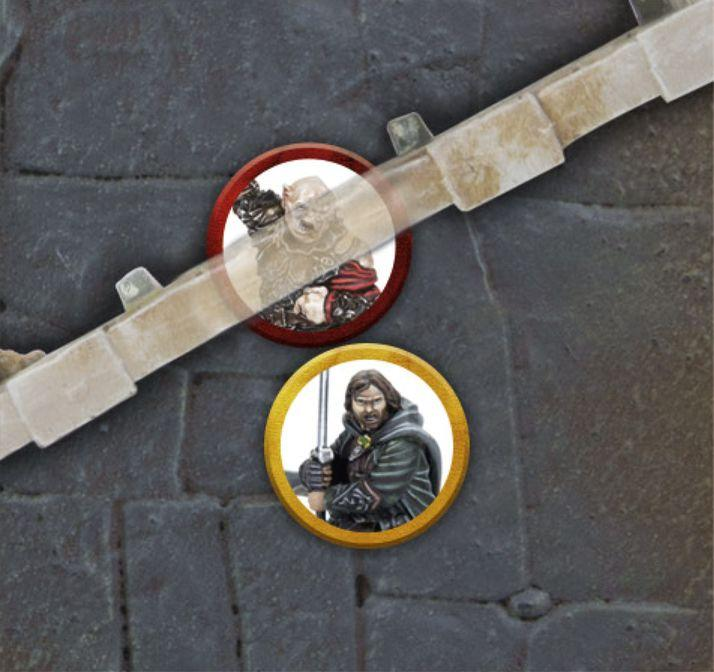{ width=714 height=672 }

### ELEVATED POSITIONS (42, 43)

Models positioned on higher ground can also defend it in the same manner as a Barrier, so long as the higher ground is at least half the height of, and no taller than, the attacking model. Such positions may include a model standing on a raised platform, at the top of a steep cliff, or at the top of a ladder.

Defending an Elevated Position works in the same way as defending a Barrier, and so all the rules associated with it are the same here. This means only one model can Charge and attack a model defending a position at once (unless they are attacked from both sides of course), the defender will not Back Away if they lose the Duel Roll, the attacker must take an In The Way Test for any Strikes they are resolving, and if the attacker kills the defender they may take their place at the top of the Elevated Position.

Models may not Charge a model defending an Elevated Position that is greater than the height of the model wishing to Charge - it is simply too tall for them to viably attack.

***Example 42:** Kíli and Fíli are atop a ledge, facing a tide of Goblins. Because their Elevated Position is higher than half the height of the Goblins, both brothers will receive the bonuses for defending a Barrier.*

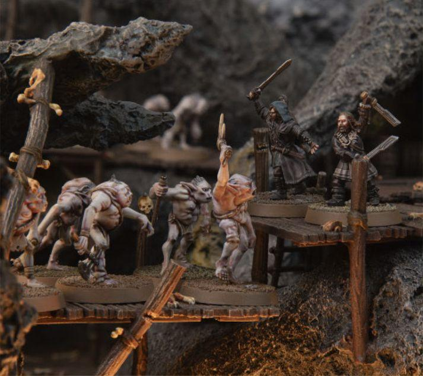{ width=713 height=633 }

***Example 43:** The Mordor Troll has Charged the Warrior of Minas Tirith which is atop this ruin. As the ruin is taller than half the height of the Troll, but not taller than it, the Warrior of Minas Tirith will count as defending a Barrier. If the ruin had been less than half the height of the Troll, then it would have provided no benefit to the Warrior of Minas Tirith and the Combat would have been resolved as normal.*

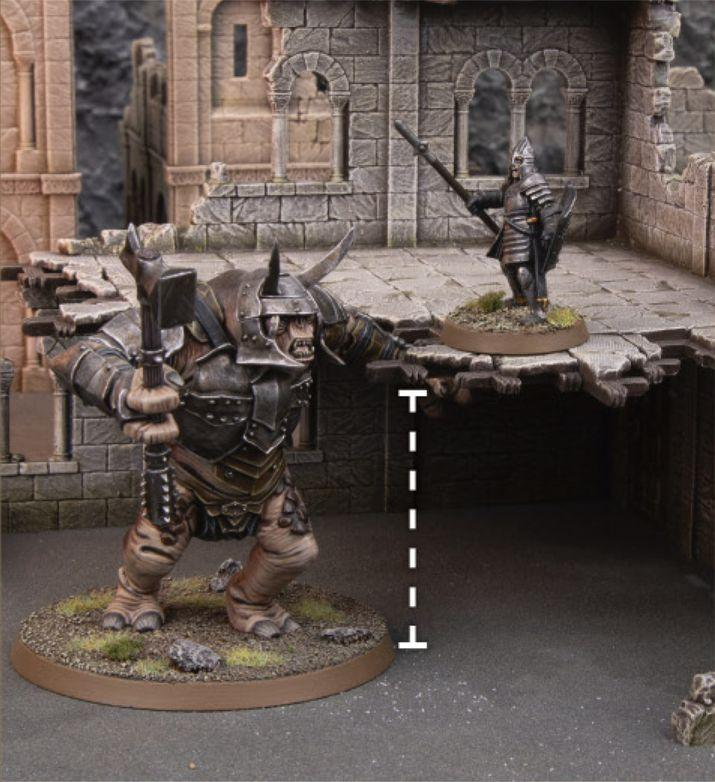{ width=715 height=782 }
