Throughout its extensive history, Middle-earth has had numerous exceptional individuals that have left their mark on the world and changed the course of history, either for good or for ill. Such entities can loosely be referred to as heroes - although villains is perhaps a more suitable term for the followers of the Dark Lord. Regardless, these are the famous characters that make up the forefront of the greatest stories in Middle-earth, and who are sung about in legend or spoken of in hushed tones across the lands. From noble kings such as Aragorn, mighty warriors such as Boromir, fearsome servants of Sauron such as Azog, or even the humble Hobbits of the Shire who gave their all to see to the destruction of the One Ring, Heroes come in all shapes and sizes. Models that are heroes will have the Hero keyword, and have an important role to play in any battle. Hero models have a number of special abilities that distinguish them from the rank and file Warrior models that make up the bulk of any Army. These are covered in this section and, as you will soon realise, make Hero models an absolutely crucial part of any game you play.

## MIGHT, WILL AND FATE

The most obvious difference between a Hero and a Warrior is that a Hero will have three additional characteristics: Might, Will and Fate. These characteristics do a great deal to separate a Hero from ordinary folk, and allow them to pull off extraordinary feats of heroism on the battlefield. Unlike other characteristics, Might, Will and Fate act as a finite resource, and once you spend these points your store of them is reduced - so use them wisely! Players will need to look for the most opportune moments to use their Might, Will and Fate Points during the course of a game, and will need to carefully keep track of how many each of their Hero models has spent so they know exactly how many more they have remaining. Once a Hero has spent all of their Might, Will or Fate Points they can spend no more, unless they are able to regain them in some way during the battle. If a special rule allows a Hero to regain a Might, Will or Fate Point, this may not take that Hero above their starting number, unless specifically stated otherwise. If a special rule allows for a Hero to do something that would usually cost a Might, Will or Fate Point without spending that Might, Will or Fate Point, then the Hero can still do this even if they have no Might, Will or Fate remaining - it is free. All Hero models have an extra section to their characteristics that looks like this, which shows how many Might, Will and Fate Points they have at their disposal. 3 2 1 Haleth has 3 Might Points, 2 Will Points and 1 Fate Point.

### HERO MOUNTS

In rare situations, a Mount may also have the Hero keyword and have its own store of Might, Will and Fate. When this is the case, both the rider and the Mount can use each other's Might, Will and Fate interchangeably whilst the rider remains mounted. The only exception to this is that a rider cannot use the Will Points of their Mount to Cast a Magical Power. So, a rider could use their Might Points to improve a Resist Test made using Will Points from their Mount, a rider or Mount could use their Fate Points to prevent Wounds caused upon the other, and if targeted by a Magical Power the controlling player could choose to use a mixture of Will Points from both the Mount and the rider, though they should roll different coloured dice for each. When doing this, you should still mark down which of the two has actually spent the Might, Will or Fate Point. A Hero Mount with an Attacks characteristic of 0 will still automatically fail its Courage Test if it becomes a Separated Mount. Might, Will and Fate

***Example 58:** Háma takes a shot at a Hill Tribesman and scores a hit. There is a wall In The Way, however, so Háma must pass an In The Way Test in order to hit the Hill Tribesman. Háma rolls a D6 and scores a 3, which will mean the arrow hits the wall. If Háma wants to hit the Hill Tribesman, he will need to spend 1 Might Point to make the In The Way Test successful.*

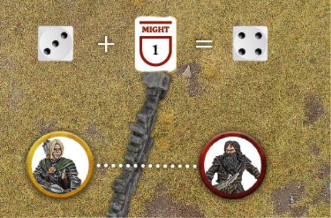

***Example 59:** Jay and Rob are both using Hero models in a Combat. Rob is using Gothmog (Fight Value 5 and 3 Might) and Jay is using Éomer (Fight Value 6 and 3 Might). Rob rolls his dice for the Duel Roll and scores a 1 and a 3, whilst Jay scores a 2, 3 and a 4. As Rob is currently losing, he has the first opportunity to spend Might. Rob chooses to spend Might, though as Gothmog has a lower Fight Value than Éomer, Rob must spend 2 Might Points to improve his 3 to a 5 in order to be winning the Combat. As Rob is now winning, Jay can now spend Might and chooses to spend 1 Might Point to improve his 4 to a 5, meaning that Éomer is now winning thanks to his higher Fight Value. Rob then chooses to spend his last Might Point to improve his 5 to a 6 and be winning once more, and so then Jay chooses to do the same and wins the Combat. As both players are now at a 6, no more Might can be used and Éomer wins the Combat. Might*

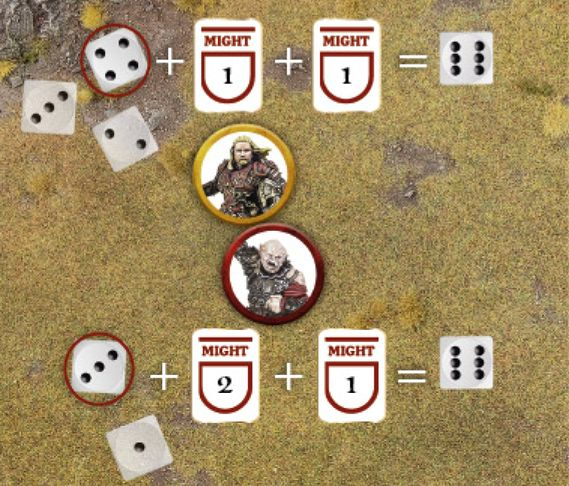

## MIGHT

Arguably the single most valuable characteristic available to a Hero, Might Points represent the ability of a Hero to seize the initiative, act faster than their foes, fight off seemingly impossible odds, and summon strength they may not even know they possessed in order to win the day. Might Points are a reserve of resolve and heroism, and spending a Might Point is often a sign that something truly heroic is afoot. Might Points can be spent in one of two ways: to modify dice rolls or to declare Heroic Actions.

### MODIFY DICE ROLLS (58, 59, 60)

A Hero model is able to spend a Might Point to adjust the score on a dice roll made on their behalf. For each Might Point spent in this manner, they may increase the result on one dice by 1. Might Points can only ever be spent to improve a dice roll, and cannot be used to reduce the score on the dice. It is also important to note that Might Points can never be used to increase the score on a dice above 6 - no matter how many Might Points the Hero has! A player does not need to decide to use any Might Points until all the dice have been rolled, any re-rolls have been used, and all other modifiers have been applied. Essentially, Might Points are always the last thing that can affect a dice roll. This is also true in the case of the likes of a Duel Roll where players are rolling against each other; Might Points are always the last thing to be used. This often means that a player can ensure the result they want if they have enough Might Points at their disposal. If two opposing Hero models are fighting, both may use Might Points in order to try to win the Duel Roll. This is done as a bidding system, where the player whose Hero is currently losing the Duel Roll has the first opportunity to use Might. Should they choose to use Might to win, then their opponent then gets the opportunity to use Might as well. This goes back and forth until both players have used all the Might Points they wish to, or no more can be used. Hero models can only ever use Might Points to alter their own dice rolls, and never to affect the rolls of their allies or enemies. This means in situations such as a Multiple Combat, it is important to roll the dice associated with a Hero separately or in a different colour so that all players know which dice can be modified by Might. A good system would be to have a different colour dice for each Hero in a Combat, and then another for Warrior models (as they don't have Might to use). If you don't have enough coloured dice to do this, then simply roll each Hero model's dice separately and keep them apart from the others.

### CAN I USE MIGHT?

Might can only be used in certain situations, and only to alter certain dice rolls. Here we have provided a list of what dice rolls Might Points can be used to alter, and some notes on how they take effect. It's worth remembering that Might can only be used to alter the Hero model's own rolls, and not those of allies or enemies. It also cannot be used to alter rolls made indirectly for the Hero, such as randomly determining an effect that impacts them, or during a roll-off to see which side wins a Duel Roll in the case of a tie. Unless explicitly stated otherwise, Might Points cannot be used to alter any dice rolls other than the ones presented here. Where this is the case, it will be stated in the relevant special rule. Taking Tests: Might can be used to improve the result of Jump, Climb, Leap, Swim, Thrown Rider and In The Way Tests. Duel Rolls: Might can be used to improve a Hero model's score during a Duel Roll. When used in this way, Might will be used after any modifiers and re-rolls have been applied. Shooting: Might can be used to improve a To Hit Roll. Wounding: Might can be used to improve a To Wound Roll caused directly by the Hero, such as with a Shooting Attack, a hit from a Magical Power, or when making Strikes. If a To Wound Roll requires two values, such as a 6+/4+, then any Might Points used on the first roll will also carry over to improve the second roll. Might cannot be used to improve a To Wound Roll caused indirectly by the Hero, such as an enemy model failing a Thrown Rider Test and suffering a hit, an enemy model hit by a model flung back by the Hero model's special rules (such as a Brutal Power Attack or Magical Power), or an enemy model that was forced over the edge of a drop due to the Hero and suffering Falling Damage. Courage: Might can be used to improve the result of a Courage Test. Intelligence: Might can be used to improve the result of an Intelligence Test. Using Will: Might can be used to improve the result of a Casting or Resist Test when using Will Points. Using Fate: Might can be used to improve the result of a Fate Roll. Some Hero models will have special rules that will allow them to use Might Points to alter the dice roll associated to that special rule. Where this is the case it will state 'Might can be used to alter this roll'.

***Example 60:** Beorn is in a Combat against Bolg. Looking at their Duel Roll, Beorn has scored a 1, 3 and 4, whilst Bolg has rolled a 2, 5 and 6. Beorn must now decide whether he loses the Combat, or whether he spends 2 Might Points in order to boost his 4 to a 6 - and with the higher Fight Value, that may well be a very sensible thing to do!*

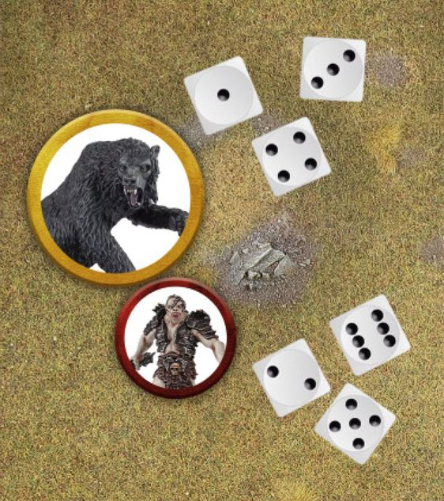

***Example 61:** During the Move Phase, it is Jay's Priority and so Rob has the first opportunity to declare a Heroic Action and chooses to declare a Heroic Move. Jay then also declares a Heroic Move in response. Rob decides to pass, and Jay then does the same. As both players have passed in succession, the sequence ends and the Heroic Moves are resolved.*

***Example 62:** During the Fight Phase of the same turn, Rob has the first opportunity and declares a Heroic Combat. Jay elects to pass, and then Rob declares a Heroic Strike with a different Hero. Jay now decides to declare a Heroic Strike of his own, and Rob decides to pass as he has no more Hero models that can declare a Heroic Action. Jay then declares a Heroic Defence, Rob passes and then Jay also passes. The sequence then ends.*

## HEROIC ACTIONS (61, 62)

The other way that Hero models can spend Might Points is through the use of Heroic Actions. These are spectacular deeds that have the potential to alter the course of a battle and swing victory in your favour when used. Each of the major phases of the game (Move, Shoot and Fight) have a Declare Heroic Actions step in them, and this is where players get the opportunity to declare the use of any Heroic Actions they wish their Hero models to perform. A Hero may only declare a single Heroic Action in each phase, though they can declare multiple Heroic Actions in the same turn provided they are in different phases. Each Heroic Action has the phase it can be declared in shown in brackets after its name. When a Hero declares a Heroic Action, the player states which Heroic Action is being declared and by which Hero; they then expend a Might Point and mark it down in some manner. A Hero cannot declare a Heroic Action if they have 0 Might Points remaining, unless they have a special rule that gives them a free Might Point, or a special rule that allows them to declare a free Heroic Action in certain situations. A Hero cannot declare a Heroic Action if they are not on the board. During the Declare Heroic Actions step of each phase, players take it in turn to declare a Heroic Action starting with the player without Priority. A player may choose to either declare a Heroic Action as above, or to 'pass'; after which the player with Priority then does the same. This continues back and forth until both players pass in succession or are satisfied with the Heroic Actions they have declared - essentially it means that you always have the opportunity to declare a Heroic Action if your opponent does so. If a player decides to pass and their opponent then declares a Heroic Action, when the opportunity comes back to the player who passed, they do not have to pass again and can now decide to declare a Heroic Action if they wish. It is important to note that once a Hero has declared a Heroic Action, they cannot take it back and cannot change their declared Heroic Action for a different one. Heroic Actions Some Heroic Actions (Heroic Move and Heroic Combat) interfere with the order in which a particular phase is conducted. For instance, a Hero who declared a Heroic Combat will resolve their Combat first. If two or more Hero models from the same side wish to perform such a Heroic Action, then their controlling player simply decides the order in which they are resolved. However, if Hero models from opposing sides wish to perform such Heroic Actions, then follow the system below to determine the order in which they are resolved: Players nominate which Hero models are declaring Heroic Actions as described previously, and make a note that those Hero models have expended a Might Point. The player with Priority rolls a D6. On a 1-3, the Evil player chooses one of their Hero models to perform the first Heroic Action. On a 4+, the Good player chooses one of their Hero models to perform the first Heroic Action. The other player (the one who lost the roll-off) then chooses one of their Hero models to perform their Heroic Action. Note that as a result of the opposing Hero model's Heroic Action, this may no longer be possible. In which case the Heroic Action is cancelled and the Might Point spent is lost. Players alternate performing Heroic Actions in this manner until none are left. A model may only ever benefit from a single Heroic Action of each type during the course of a turn - a model could only benefit from one Heroic Move or Heroic March for example. The only exception to this is in the case of a Heroic Combat - a model that takes part in a successful Heroic Combat and then joins a second Combat, that is also a Heroic Combat, may still fight again as normal. However, in this situation, the model may not Move and fight again should the second Heroic Combat also be successful.

## UNIVERSAL HEROIC ACTIONS

Some Heroic Actions can be used by any Hero in the game, regardless of who (or what) they are - so long as they have Might Points remaining, of course! Every Hero can use the following three Heroic Actions:

### HEROIC MOVE (MOVE PHASE) (63)

A Heroic Move enables a Hero to Activate before other models - essentially defying the usual Priority system. The Hero can then Activate exactly as normal and do anything they would normally be able to do when they Activate. The Hero cannot then be Activated again later in the Move Phase. This Heroic Action can prove extremely valuable, and often when the player without Priority declares a Heroic Move their opponent will also declare one in order to try to keep the initiative. If a Hero who has declared a Heroic Move is Charged and Engaged in Combat, or rendered unable to Activate in some other way, then their Heroic Move is cancelled and the Might Point spent is lost.

***Example 63:** The Evil side has Priority, and Tom the Troll is closer to Thorin's Company than they would like! Bilbo Baggins uses 1 Might Point to declare a Heroic Move, enabling him (and any friendly models within 6" if he shouts With Me) to Activate first, outside the normal order of Priority. If Tom decided to also spend 1 Might Point to declare a Heroic Move, then the player with Priority (the Evil player) would roll a D6 to see whose Heroic Move takes place first. Universal Heroic Actions*

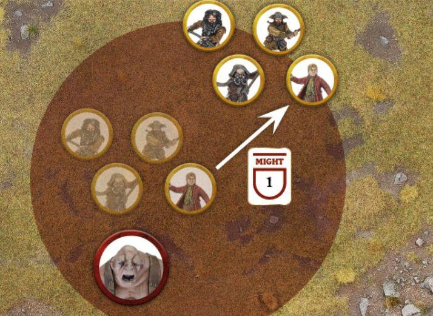

### WITH ME

A Hero who is performing a Heroic Move may choose to shout "With Me" as soon as they are Activated. If they do, note their starting position before they Activate. All friendly models within 6" of the Hero when they shout With Me are automatically affected, and after the Hero has finished their Activation, they must choose to do one of two things: Activate as normal in an order chosen by their controlling player. Any model that Activates as part of a With Me must finish their Activation within 6" of the Hero that shouted With Me. If the model attempts to finish their Activation within 6" of the Hero, but fails a roll (such as a Courage Test, Jump Test or Climb Test) that makes this impossible, they simply stop where they are. Forego their Activation, in which case they do not Activate and cannot do so later in the Move Phase. A model that cannot finish its Activation within 6" of the Hero that shouted With Me must choose this option. In either case, the affected models cannot be Activated again later in the Move Phase for any reason. A Hero that shouts With Me doesn't have to Move as part of their Activation, and as With Me is shouted at the start of their Activation, if anything would render them unable to Move as part of their Activation (such as failing a Courage Test to Charge an enemy with the Terror special rule) then they will still shout With Me. However, should the Hero be removed as a casualty for any reason (such as fleeing or suffering Falling Damage) then their Heroic Move and With Me will immediately be cancelled. If two friendly Hero models within 6" of each other both declare a Heroic Move, and the one that goes first shouts With Me, the second Hero has two options: Activate as normal for a model affected by With Me, in which case their Heroic Move will be cancelled. Forego their Activation, in which case they do not Activate later in the Move Phase and their Heroic Move will be cancelled. If a Hero who shouted With Me Moves off the board, then any friendly models who are affected by their With Me may also Move off the board if able; however, if they cannot then they must choose to forego their Activation. If a model is affected by a Hero model's With Me, then they can only Move off the board if that Hero also does so.

### HEROIC SHOOT (SHOOT PHASE)

A Heroic Shoot allows a Hero to Shoot before all other models in the Shoot Phase. A Hero does not need to have a Missile Weapon to declare a Heroic Shoot, but they cannot declare a Heroic Shoot if they are Engaged in Combat.

### LOOSE

A Hero who is performing a Heroic Shoot may choose to shout "Loose". The Hero does not need to Shoot first (or at all if they don't wish to) when they shout Loose. If they do, all friendly models within 6" of the Hero when they shout Loose are automatically affected, and may also Shoot at the same time as the Hero - in an order chosen by their controlling player. Friendly models affected by the Loose of a friendly Hero do not need to target the same enemy model, and may Shoot as normal. However, any model affected by a friendly Hero model's Loose that chooses not to Shoot as part of it cannot then do so later that Shoot Phase.

### HEROIC COMBAT (FIGHT PHASE) (64)

When a Hero declares a Heroic Combat, their Combat is resolved first before any others. In addition, if the Hero wins their Combat and all enemy models involved in that Combat are removed as a casualty, then the Hero and any friendly models that were involved in that Combat (with the exception of any War Beast or Chariot models) may immediately Move in the same way as they would during the Move Phase - however, the only things they may do is to Move or Charge. If they Charge, then they will fight again in the ordinary way - i.e., in an order chosen by the player with Priority. If models Charge during this Move, then the way the Combats should be divided may be altered. In this situation, the player with Priority will Pair Off Combats again after each successful Heroic Combat. A model may only benefit from one Heroic Combat per turn; so, if a model that was involved in one Heroic Combat Moves to join another Combat that is also a Heroic Combat, which is then itself successful, the model may then not Move again as part of the second Heroic Combat. There may be a situation where two opposing Hero models in the same Combat both declare a Heroic Combat. When this happens, if either side causes all enemy models to be removed as a casualty, then they are considered to have made a successful Heroic Combat and may Move as described above, regardless of which player's choice of Heroic Combat it was.

***Example 64:** Haleth is fighting a lone Hill Tribesman, a Combat he is very likely to win. Because of this, Haleth has declared a Heroic Combat and spends 1 Might Point. Haleth wins the Duel Roll and slays the Hill Tribesman, allowing him to Move again and even Charge if he wishes. Haleth uses this extra Move to Charge the other Hill Tribesman, and will fight it during the normal order of Combats.*

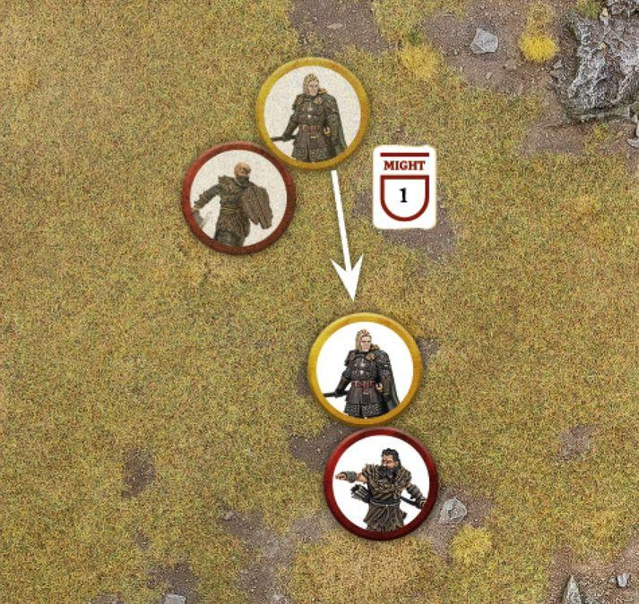

## SPECIALISED HEROIC ACTIONS

Some Heroic Actions can only be declared by certain Hero models. In each Hero model's profile there will be a section listing the additional Heroic Actions that Hero can declare. These Heroic Actions are described here:

***Example 65:** The Goblins are trying to catch the fleeing Thorin's Company, and so the Goblin Captain declares a Heroic March. When they Move as part of their Activation, the Goblin Captain and friendly models within 6" of it will be able to Move 5" (as per their Move Value) plus an additional 3" for the Heroic March; though they must finish their Move within 6" of the Goblin Captain.*

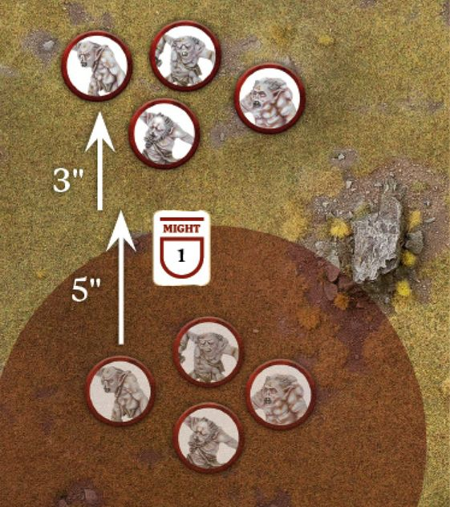

### HEROIC CHANNELLING (MOVE PHASE)

A Hero who declares Heroic Channelling will count the result of their next Casting Test this turn as a 6. As a result, they do not need to roll the dice for the Casting Test but will still need to spend a Will Point to Cast the Magical Power as normal.

### HEROIC MARCH (MOVE PHASE) (65)

A Hero who declares a Heroic March adds 3" to their Move Value for the duration of the Move Phase if they have the Infantry, Chariot or War Beast keyword; if they have the Cavalry keyword or have the Fly special rule, then they add 5" to their Move Value instead. Additionally, the Hero may not Charge under any circumstances during the same Move Phase. If a Hero who has declared a Heroic March is Charged and Engaged in Combat, or rendered unable to Activate in some other way, then their Heroic March is cancelled and the Might Point spent is lost.

### AT THE DOUBLE

A Hero who is performing a Heroic March may choose to shout "At the Double" as soon as they are Activated. If they do, note their starting position before they Activate. All friendly models within 6" of the Hero when they shout At the Double are automatically affected and, after the Hero model has Activated, gain the following benefit: A model affected by At the Double adds 3" to their Move Value for the duration of the Move Phase if they have the Infantry, Chariot or War Beast keyword; if they have the Cavalry keyword or have the Fly special rule, then they add 5" to their Move Value instead. Additionally, the model may not Charge under any circumstances during the same Move Phase. Models affected by At the Double must finish their Activation within 6" of the Hero that shouted At the Double. If the model attempts to finish their Activation within 6" of the Hero, but fails a roll (such as a Courage Test, Jump Test or Climb Test) that makes this impossible, they simply stop where they are. A model that cannot finish their Activation within 6" of the Hero who shouted At the Double must forego their Activation, and cannot be Activated later on in the same Move Phase. Models can choose not to Activate when affected by a Heroic March, in which case they will also forego their Activation. Should the Hero be removed as a casualty for any reason (such as fleeing or suffering Falling Damage) then their Heroic March and At the Double will immediately be cancelled. Models can only ever be affected by one Hero model's At the Double each turn - you can't stack multiple Heroic Marches together! If a Hero who shouted At the Double Moves off the board, then any friendly models who are affected by their At the Double may also Move off the board if able; however, if they cannot then they must choose to forego their Activation. If a model is affected by a Hero model's At the Double, then they can only Move off the board if that Hero also does so. Specialised Heroic Actions

### HEROIC RESOLVE (MOVE PHASE) (66)

When a Hero declares a Heroic Resolve it has two effects, the first of which is resolved as soon as the Heroic Action is declared. Friendly models within 6" of a Hero who declared a Heroic Resolve gain an additional free dice when making Resist Tests until the End Phase of the turn. Note that for models that have no Will Points (or none remaining), this allows them to make a Resist Test on one dice rather than none. Additionally, a Hero who declares a Heroic Resolve will automatically pass any Courage Tests they are required to make that turn as a result of their Army being Broken. If a Hero who has declared a Heroic Resolve is Charged and Engaged in Combat before they are able to Activate, they are still able to Activate solely in order to provide a Stand Fast even though they would not normally be able to (though this is the only thing they can do in this Activation). However, a Hero who has been rendered unable to Activate by some other means (such as being Transfixed) still cannot provide a Stand Fast as normal.

### HEROIC ACCURACY (SHOOT PHASE) (67)

When a Hero declares a Heroic Accuracy, they gain the Sharpshooter special rule until the End Phase of the turn if they don't already have it. Additionally, the Hero may re-roll any failed In The Way Tests when making a Shooting Attack. This includes any failed In The Way Tests when targeting a Cavalry model with a Shooting Attack to determine whether the target part of the model has been hit. A Hero may not declare a Heroic Accuracy if they are Engaged in Combat or otherwise rendered unable to Activate.

### TAKE AIM

A Hero who is performing a Heroic Accuracy may choose to shout "Take Aim". The Hero does not need to Shoot first (or at all if they don't wish to) when they shout Take Aim. If they do, all friendly models within 6" of the Hero when they shout Take Aim are automatically affected, and may also re-roll any failed In The Way Tests when making a Shooting Attack. This includes any failed In The Way Tests when targeting a Cavalry model with a Shooting Attack to determine whether the target part of the model (usually the rider) has been hit. Friendly models affected by the Take Aim of a friendly Hero do not need to target the same enemy model, and may Shoot as normal.

***Example 66:** Gandalf the White's Army has been Broken and he has declared a Heroic Resolve. Friendly models within 6" of Gandalf gain an additional free dice to any Resist Tests they take this turn. During the Move Phase, Gandalf has been Charged by the Witch-king before he can Activate. Normally, this would mean that Gandalf could not provide a Stand Fast to keep his allies fighting; however, as he declared a Heroic Resolve, Gandalf will automatically pass his Courage Test for being Broken, and may still provide his Stand Fast even though he is Engaged in Combat.*

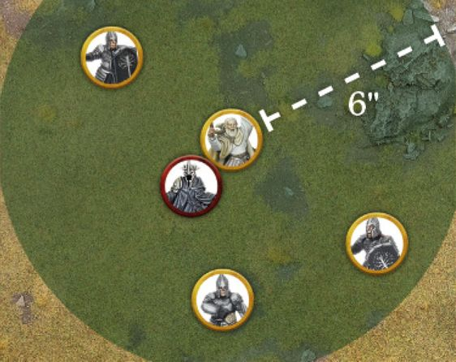

***Example 67:** Tauriel and her Mirkwood Rangers are about to loose arrows at some Hunter Orcs. Because the Orcs are protected by some terrain, Tauriel spends 1 Might Point to declare a Heroic Accuracy. Tauriel gains the Sharpshooter special rule, and when she or any friendly models within 6" of her Shoot this turn, they may re-roll any failed In The Way Tests.*

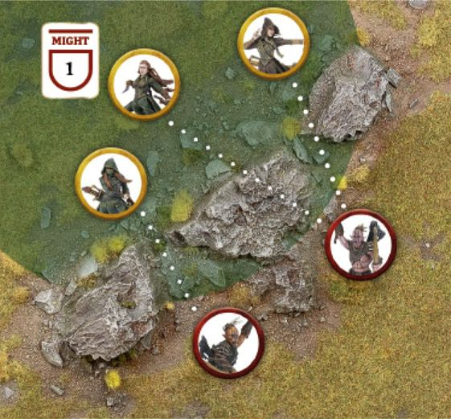

***Example 68:** Thorin has declared a Heroic Challenge against Azog, who is within 6" of him. Azog decides to accept Thorin's challenge. Until one of them is slain, both Thorin and Azog must Charge each other if possible and both will gain a bonus of +1 Attack when fighting against each other and +1 To Wound when making Strikes against the other. Whoever slays their opponent will gain 1 Might Point.*

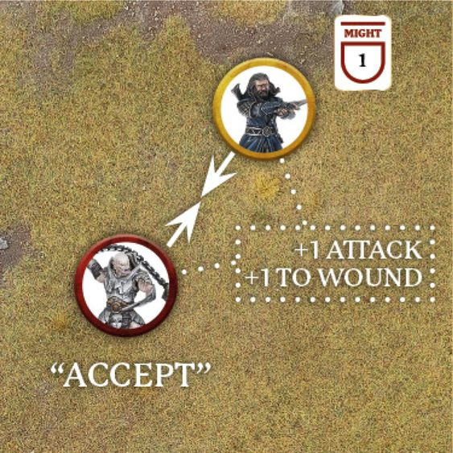

***Example 69:** Haleth has declared a Heroic Challenge against Wulf, who is within 6" of him. Wulf doesn't want to fight Haleth and so chooses to decline. If Haleth gets into a Combat with Wulf, then he will still gain the +1 Attack and +1 To Wound when making Strikes against Wulf; however, as he chose to decline, Wulf doesn't gain any of the benefits himself though he isn't required to Charge Haleth. If Haleth slays Wulf, he will gain 1 Might Point.*

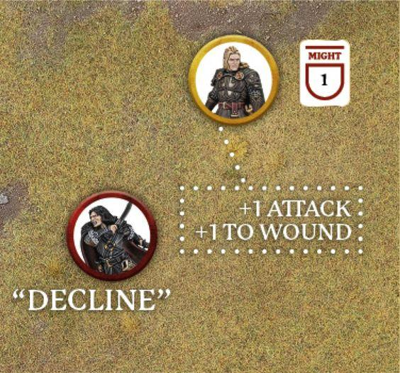

### HEROIC CHALLENGE (FIGHT PHASE) (68, 69)

When a Hero declares a Heroic Challenge they must also declare an enemy Hero within 6" of them, with the same Heroic Tier or higher, to be the target of the Heroic Challenge. If there is no enemy Hero within 6" with the same Heroic Tier or higher, then the Hero cannot declare a Heroic Challenge. Whilst Engaged in Combat with their target, the Hero gains a bonus of +1 Attack (both in the Duel Roll and when making Strikes) and a bonus of +1 To Wound when making Strikes against their target. Additionally, if they slay their target (i.e., they inflict the final Wound that causes them to be removed as a casualty) then the Hero immediately gains 1 Might Point, though this cannot take them above their starting limit. The target of the Heroic Challenge can choose to either accept or decline the challenge. If they accept, then they get the same benefits as the Hero who declared the Heroic Challenge as listed above (as if the Hero who declared the Heroic Challenge was their target). Additionally, if the target chooses to accept, then when either Hero Activates, they must Charge each other if possible. A Hero who accepts a Heroic Challenge cannot declare a Heroic Challenge themselves until the Hero who challenged them is slain. If a Hero accepts a Heroic Challenge, no other Hero may declare a Heroic Challenge against either Hero involved in the Heroic Challenge until one of them has been slain. If the target declines, then they gain none of the benefits listed; though the Hero who declared the Heroic Challenge will still gain them. Additionally, if the target declines, they cannot then themselves declare a Heroic Challenge against the Hero who they declined against. A Hero who has already issued a Heroic Challenge against a target cannot declare another Heroic Challenge until their target has been removed as a casualty.

### HEROIC DEFENCE (FIGHT PHASE)

A Hero model that declares a Heroic Defence will only suffer a Wound on the roll of a natural 6 in the ensuing Fight Phase, regardless of any special rules, modifiers, Brutal Power Attacks or the use of Might. If the Hero would normally be wounded on a 6+/4+, 6+/5+ or 6+/6+, then they will only be wounded if both rolls are a natural 6. Heroic Defence does not confer to a Hero model's Mount if it has one.

### HEROIC STRENGTH (FIGHT PHASE)

A Hero that declares a Heroic Strength will count their Strength characteristic as double (to a maximum of 10) when making Strikes until the End Phase of the turn.

### HEROIC STRIKE (FIGHT PHASE)

A Hero that declares a Heroic Strike will add D3 to their Fight Value for the duration of the Fight Phase (to a maximum of 10). This D3 is rolled at the start of the first Combat that the Hero is involved in that Fight Phase, and will last for the duration of the Fight Phase. This bonus is always applied after any other effects that would affect a model's Fight Value. Some Heroic Actions allow a Hero to shout something in order to benefit their allies (With Me, Loose, etc.). In the heat of battle it can be easy for a player to declare a Heroic Action and then forget to say that their Hero is going to shout whichever particular phrase. Though these are optional, it is sporting and good practice to check with your opponent if they meant to shout the relevant phrase as part of their Heroic Action or if they purposefully did not - you should always check with them if you can. If they have just forgotten, it is expected that players will still allow their opponent to do so - after all, they had clearly planned to but just forgot to say it out loud.

***Example 70:** Bofur wishes to Charge the Goblin King and must take a Courage Test to do so due to the Terror special rule. Bofur has a Courage characteristic of 5+, however, he has rolled a 1 and a 3 for his Courage Test for a total of 4 - a fail. Bofur decides to spend 1 Will Point to improve his Courage Test by one, to 5. Bofur has now passed his Courage Test and can Charge the Goblin King. Will*

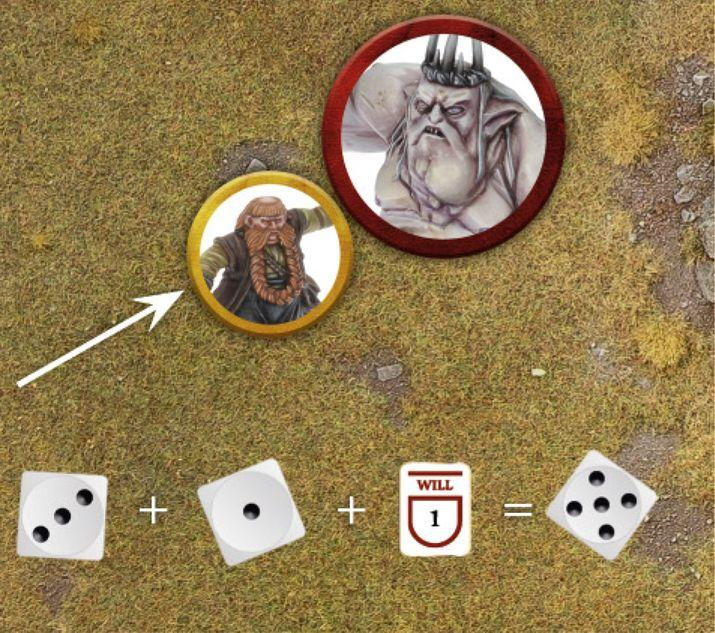

## WILL

Many characters in Middle-earth possess an indomitable strength of will; an iron resolve that allows them to carry on the fight even in the face of seemingly insurmountable odds. This heroic willpower can manifest as steely bravery and enable the hero to set aside their fears and charge headlong into battle for glory. Many inhabitants of Middle-earth also harbour some innate form of magic, allowing them to invoke subtle magical powers upon their foes or allies. The act of using, and attempting to shrug off such powers, both require a sufficient reserve of will. Hero models may expend Will Points in one of three ways:

### PASS A COURAGE TEST (70)

A Hero may spend one or more Will Points to increase the result of a Courage Test. For each Will Point spent, the Hero may increase the result of their Courage Test by 1. A Hero may spend a mixture of both Might Points and Will Points to increase their Courage Test in this manner.

### CAST A MAGICAL POWER

A Hero who has Magical Powers in their profile can spend Will Points in order to attempt to Cast them. For each Will Point spent, the Hero may add one D6 to their Casting Test. Magical Powers are covered fully on page 112.

### RESIST A MAGICAL POWER

A Hero who has been targeted by a Magical Power can spend Will Points in order to try to Resist the effects. For each Will Point spent, the Hero may add one D6 to their Resist Test. Resisting Magical Powers is covered fully on page 114.

## FATE (71, 72, 73)

The greatest in Middle-earth seem to be able to cheat death, avoiding wounds that would otherwise slay a lesser being and surviving injuries that by all accounts should see them perish. Whether this is down to some divine favour, or perhaps some darker power, is a mystery, though what is certain is that fate has a plan for these heroes. To represent this in our games, Hero models have a store of Fate Points which can prevent Wounds. Whenever a model with Fate Points suffers a Wound, their controlling player may choose to spend a Fate Point in order to attempt to prevent that Wound. When a Hero spends a Fate Point, mark down that they have spent it, and then roll a D6. On a 4+ the Wound is prevented and has no effect - do not reduce the Hero model's remaining Wounds. If the Fate Roll is unsuccessful, and the Hero has more Fate Points remaining, they may spend another one in the same manner. Fate Points must be rolled one at a time and fully resolved before spending another Fate Point. If a model wishes to spend Might to increase their Fate Roll, then they must choose to do so before spending another Fate Point. So, if a Fate Roll comes up with a 3, you must decide if you wish to Might it to a 4 before making another Fate Roll - if the next roll is worse, you can't go back! Some special rules may allow a model to do multiple Wounds from a single Strike if the To Wound Roll is successful, or even kill a model outright. In these instances, the effect will only be resolved if the Wound is successful (i.e., it will reduce the target model's remaining Wounds), so a single successful Fate Roll will prevent all of the damage the Strike would cause. Whilst Fate can prevent any manner of Wound dealt to a Hero, it cannot save them from fleeing the board as a result of a failed Courage Test and being removed from the board as a casualty. In these instances the Hero has shown a craven heart and fate has clearly abandoned them!

***Example 72:** Thorin has defeated Grinnah in Combat and has inflicted 2 Wounds upon the Goblin. Orcrist has the Goblinbane special rule, which will mean that each successful Wound will do D3 Wounds instead. Grinnah spends his 1 Fate Point to try to prevent the first Wound, rolling a 5 and preventing the Wound, which will therefore not become D3 Wounds. However, as he has no Fate remaining, the other Wound is successful and will then become D3 Wounds. Thorin rolls a 6, dealing 3 Wounds and cleaving the Goblin's head right off! Fate*

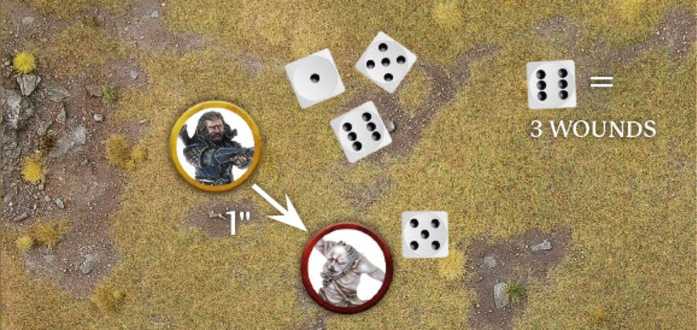

***Example 71:** Éowyn has been wounded by Gothmog and decides to spend 1 Fate Point. Unfortunately, she only rolls a 1 and the Wound is not prevented. Éowyn then decides to spend a second Fate Point, and this time rolls a 5 - preventing the Wound entirely.*

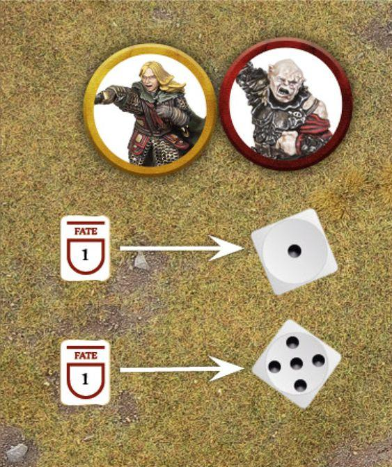

***Example 73:** Háma has been shot by a Hill Tribesman and suffered a Wound. Háma spends 1 Fate Point and rolls a 3, which is not enough to prevent the Wound. Háma decides to spend 1 Might Point to improve his Fate Roll to a 4, meaning the roll is successful and the Wound is ignored.*

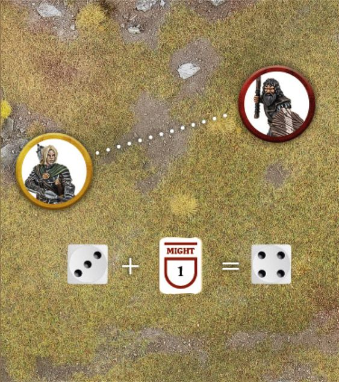
