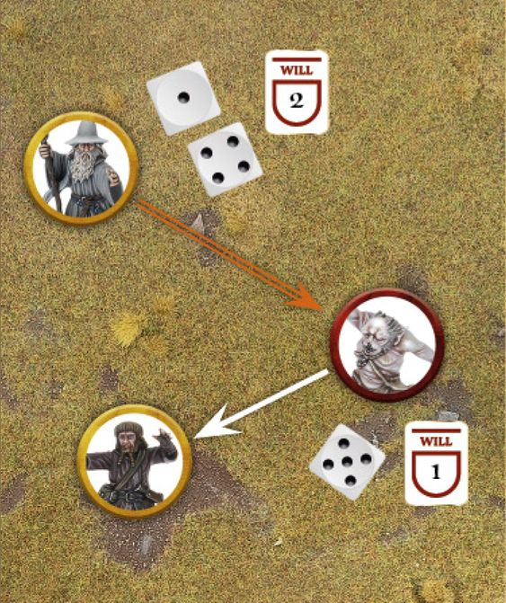

Certain individuals within Middle-earth have the ability to harness magic, utilising all manner of arcane powers to subtly affect those around them and have an impact on the course of a battle. From cunning weaves designed to manipulate a foe, noble powers used to protect allies from harm, to dark sorceries that are used maliciously to weaken and cripple a target, and perhaps even inflicting death, magic has countless forms. Those that can conjure such magic can be a valuable ally - or a terrible foe to be on the wrong side of...

A number of models in the Strategy Battle Game can utilise Magical Powers, providing them with an alternative way of being effective on the battlefield. Though magic may not be a dominant force, bringing ruin upon an army in a fiery cataclysm (magic in Middle-earth is typically a subtle affair), the use of a well-timed power can be crucial in altering the outcome of a battle. It is folly to underestimate the power of a Wizard or a servant of the Dark Lord, and those that do may often find themselves confounded by illusion or on the wrong end of a magical barrage.

## USING MAGICAL POWERS

Models that can use Magical Powers will have a section in their profile listing the Magical Powers they have the ability to Cast. Casting Magical Powers requires a model to spend Will Points and so, typically speaking, a model must have Will Points remaining in order to Cast a Magical Power. A model with no Will Points remaining cannot Cast a Magical Power. A Prone model cannot Cast a Magical Power.

### WHEN CAN YOU USE A MAGICAL POWER?

A model with Magical Powers (and Will Points remaining) can attempt to Cast a single one (and only one) during their Activation. They can use their Magical Power at any point during their Activation, after any abilities that must happen at the start of their Activation. This means that a model could Cast a Magical Power before their Move, after their Move, or even part way through their Move should they wish.

A model that is Flying must land in order to Cast a Magical Power, and so cannot Cast a Magical Power whilst it is above other models. A model can use a Magical Power in the same turn in which it Charges, and even if it decides not to Move. If a model enters the Control Zone of an enemy model and then Casts a Magical Power that means they are no longer in that model's Control Zone, then they are not obliged to Charge that model unless they then enter that model's Control Zone during their remaining Move. A model that cannot Activate for whatever reason cannot then Cast Magical Powers that turn.

### WHO CAN YOU TARGET?

Magical Powers come in three basic types: those that target a specific model, those that target all models within a given range, and those that don't target any specific model. Who, or what, the Magical Power can target will be stated in the description of the Magical Power.

A model can be the target of a Magical Power even if it is Engaged in Combat, unless the rules for the Magical Power state otherwise.

When a Magical Power targets a Cavalry model, then it will target the whole model (and both parts will be affected) unless it specifically states that the caster must choose either the rider or the Mount to be the target. In these instances, the caster must declare if the rider or the Mount is the target before making the Casting Roll.

Good models cannot Cast a Magical Power if by doing so they would risk wounding a friendly model.

### CHECK RANGE AND LINE OF SIGHT

A model will need Line of Sight to the target in order to Cast a Magical Power upon them. The range of a Magical Power will be listed either in the model's profile, or sometimes in the description for the Magical Power itself. If the range is listed as 'self' then the Magical Power must target the caster themselves. Using Magical Powers

### MAKING A CASTING ROLL (81)

To Cast a Magical Power, the model must take a Casting Test. Every Magical Power will have a Casting Value, which is given as a dice score and can be found in the model's profile. Some models will be able to Cast certain Magical Powers easier than other models can - after all, mastery of magic just comes easier to some than it does to others!

To make a Casting Test, the model's controlling player states which Magical Power they are using, what they are targeting, and declares how many Will Points they are spending to attempt to Cast that Magical Power. For each Will Point spent, the caster rolls a D6. The model must decide how many Will Points they are spending before making their Casting Test - they cannot roll some, see the result, and then roll more. If the result of any of the dice rolled equals or beats the Casting Value of the Magical Power, then it has been successfully Cast - resolve the effects as stated in the Magical Power's description.

If none of the dice equal or beat the Casting Value, then the Magical Power has not been Cast and has no effect. Hero models can spend Might Points to improve the result of their Casting Test, but must do so before the target attempts to Resist, if applicable.

***Example 81:** Gandalf is trying to help Thorin's Company escape from the pursuing Goblins, and attempts to Cast Transfix on Grinnah to stop him Charging Ori. Gandalf requires a Casting Test of 4+ and so rolls two dice, rolling a 1 and a 4, which is enough. Not wanting to be prevented from Activating, Grinnah decides to spend 1 Will Point to make a Resist Test, and rolls a 5 - which is enough to Resist Gandalf's Transfix. The Magical Power has been resisted and does not take effect.*

{ width=563 height=671 }

### RESISTING A MAGICAL POWER (81)

If a model is targeted by a Magical Power, then there is a chance that they can Resist its effects. After the Casting Roll has been made, but before applying the effects of the Magical Power, a model must decide if it wants to spend any Will Points to make a Resist Test.

For each Will Point spent, the model making the Resist Test will roll a D6. If any of the dice rolled equal or beat the highest score in the Casting Test, then the Magical Power has been resisted and has no effect. The model must decide how many Will Points they are spending before making their Resist Test - they cannot roll some, see the result, and then roll more. Hero models may use Might to improve the result of their Resist Test.

If, when making a Resist Test, a Hero rolls a dice that results in a natural 6, they immediately regain the Will Point spent to roll that dice. Note that rolling a natural 6 on dice from a 'free' Will Point (such as from Heroic Resolve or Resistant to Magic) does not confer this effect - the Will Point was already free!

If a Magical Power targets a specific part of a Cavalry model, then either part of the model may attempt to Resist its effects, regardless of whether or not they were the targeted part of the model.

Some models may be indirectly affected by a Magical Power - for instance, a model may be flung back by a Magical Power and hit another model. In cases where a model is indirectly affected by a Magical Power, but is not listed as a target of the Magical Power, they may not attempt to Resist it. Be careful where you place your models!

### RESISTING WITH NO TARGET

Some Magical Powers have no specific enemy target, such as those that target the caster or only models friendly to the caster. In these instances, no Resist Test can be made.

### RESISTING WITH MULTIPLE TARGETS

Some Magical Powers will target multiple enemy models, such as those that target all models within a certain range. In these instances, a single target model may attempt to make a Resist Test. The model that may make the Resist Test is chosen by their controlling player, and they can select any of their models that was a target to make a Resist Test as normal. If the Resist Test is passed, the Magical Power is resisted as normal.

If the Resist Test is failed, then the Magical Power succeeds and all target models will be affected.

### MAGICAL POWER DURATIONS

Every Magical Power has a duration that specifies how long it lasts for. The effects of a Magical Power will immediately come to an end if the caster is slain or leaves the battlefield for any reason. The three types of Magical Power duration are explained below:

#### INSTANT

These Magical Powers take place straight away; after they are resolved, they end. These Magical Powers tend to be ones that cause damage.

#### TEMPORARY

These Magical Powers last until the End Phase of the turn they were Cast in, at which point they end.

#### EXHAUSTION

These Magical Powers remain in play until the caster reaches 0 Will Points remaining, at which point they immediately end.

## MAGICAL POWERS LIST

### AURA OF COMMAND

`DURATION: EXHAUSTION`

This Magical Power targets the caster. Whilst this power is in effect, the caster and all friendly models within 6" of them automatically pass all Courage Tests they are required to take.

### AURA OF DISMAY

`DURATION: EXHAUSTION`

This Magical Power targets the caster. Enemy models within 6" of the caster suffer a -1 penalty to any Courage Tests they are required to take.

### BANISHMENT

`DURATION: INSTANT`

This Magical Power targets one enemy Spirit model within range. The target immediately suffers 1 Wound. If this Magical Power targets a Cavalry model, the caster must choose whether the rider or the Mount is the target.

### BLACK DART

`DURATION: INSTANT`

This Magical Power targets one enemy model within range. The target immediately suffers one Strength 6 hit. If this Magical Power targets a Cavalry model, the caster must choose whether the rider or the Mount is the target.

### BLADEWRATH

`DURATION: TEMPORARY`

This Magical Power targets one friendly model within range. In the ensuing Fight Phase, all Strikes made by the target are resolved at a Strength of 6, regardless of any other modifiers.

### BLESSING OF THE VALAR

`DURATION: INSTANT`

This Magical Power targets one friendly model within range. The target immediately regains 1 Fate Point spent earlier in the battle.

### BLINDING LIGHT

`DURATION: TEMPORARY`

This Magical Power targets the caster. Whilst the power is in effect, the area within 6" of the caster is always considered to be daylight (perfect if you are playing a battle at night). Additionally, whilst this power is in effect, enemy models that make a Shooting Attack that targets a model within 6" of the caster will only hit on a To Hit Roll of a 6. Models cannot benefit from this Magical Power if there is a piece of impassable terrain, such as a wall or building, directly between all parts of the model and the source of the light.

### CALL WINDS

`DURATION: INSTANT`

This Magical Power targets one enemy model within range. The target is immediately blown D3+3" directly away from the caster in a straight line. If the model comes into contact with another model or piece of terrain, then it will immediately stop. After it has been blown back, the target is knocked Prone. If the target was Engaged in Combat, the effect is the same and they can be blown out of a Combat.

### CHILL SOUL

`DURATION: INSTANT`

This Magical Power targets one enemy model in range. The target immediately suffers 1 Wound. If this Magical Power targets a Cavalry model, the caster must choose whether the rider or the Mount is the target.

### COLLAPSE ROCKS

`DURATION: INSTANT`

This Magical Power targets one enemy model in range that is within a ruin, stone or brick building, cave, rock pile, or some other piece of terrain where the caster could crack rock either underfoot or overhead. The target suffers one Strength 7 hit and is knocked Prone. If the target was a Cavalry model, they will automatically count as suffering the Knocked Flying result on the Thrown Rider Chart.

### COMPEL

`DURATION: INSTANT`

This Magical Power targets one enemy model in range. The caster may Move the target up to half its Move Value, even if the target has already Moved this turn. They cannot Move the target out of Combat, make them take a Jump, Climb, Leap or Swim Test, lie them down or make them dismount. They can, however, make them Move into Difficult Terrain or Charge an enemy model (if able), in which case no Courage Test would be required to Charge an enemy with the Terror special rule. They can make the target drop an Object they are carrying as part of a Scenario (but not Wargear) or put on the One Ring if they carry it. Once the target has been Moved, it cannot Move any further that turn for any reason but may otherwise act normally. If the model affected by this Magical Power would normally have to Charge as part of their Move, they are not forced to when under the influence of this Magical Power.

### CURSE

`DURATION: INSTANT`

This Magical Power targets one enemy model in range. The target immediately loses 1 Fate Point. If this Magical Power targets a Cavalry model, the caster must choose whether the rider or the Mount is the target.

### DRAIN COURAGE

`DURATION: INSTANT`

This Magical Power targets one enemy model in range. The target immediately worsens their Courage value by 1 for the remainder of the game; so a model with a Courage of 5+ that is affected by this Magical Power would then have a Courage of 6+. A model can be affected by this Magical Power multiple times over the course of the battle, worsening its Courage value each time. If this Magical Power targets a Cavalry model, the caster must choose whether the rider or the Mount is the target.

### ENCHANT BLADES

`DURATION: TEMPORARY`

This Magical Power targets one friendly model within range. In the ensuing Fight Phase, the target may re-roll all failed To Wound Rolls when making Strikes.

### ENRAGE BEAST

`DURATION: TEMPORARY`

This Magical Power targets one friendly Beast model within range. The target increases its Fight Value, Strength and Attacks by 2, and gains the Fearless special rule, until the End Phase of the turn, at which point the target will immediately suffer 1 Wound.

### FLAMEBURST

`DURATION: INSTANT`

This Magical Power targets one enemy model in range. The target immediately suffers one Strength 6 hit. This is a fire-based attack, so if a model is immune to fire-based attacks, they are immune to this Magical Power.

### FOG OF DISARRAY

`DURATION: EXHAUSTION`

This Magical Power targets the caster. Enemy models within 6" of the caster suffer a -1 penalty to any Intelligence Tests they are required to take.

### FOIL MAGIC

`DURATION: INSTANT`

This Magical Power targets one enemy model within range. The caster may choose one Magical Power Cast by the target with the Exhaustion duration that is currently in play. That Magical Power immediately ends.

### FORTIFY SPIRIT

`DURATION: EXHAUSTION`

This Magical Power targets one friendly model within range. Each time the target becomes the target of a Magical Power Cast by an enemy model, they gain an additional free dice to any Resist Test they would take. This free dice can still be rolled even if the target has no Will Points or chooses not to use any from their store.

### FURY (X)

`DURATION: EXHAUSTION`

This Magical Power targets the caster. Friendly models within 6" of the caster who have the same keywords as those shown in brackets will automatically pass any Courage Tests they are required to take.

### INSTIL FEAR

`DURATION: TEMPORARY`

This Magical Power targets the caster. Enemy models within 6" of the caster are considered to have the Fearful special rule.

### NATURE'S WRATH

`DURATION: INSTANT`

This Magical Power targets all enemy models within range, even if they are not in Line of Sight of the caster. All target models are immediately knocked Prone. Cavalry models are automatically treated as suffering a Knocked Flying result on the Thrown Rider Chart.

### PANIC STEED

`DURATION: INSTANT`

This Magical Power targets one enemy Cavalry model within range. The rider is thrown and the Mount immediately flees and is removed as a casualty. The rider is automatically treated as suffering a Knocked Flying result on the Thrown Rider Chart.

### PARALYSE

`DURATION: EXHAUSTION`

This Magical Power targets one enemy model in range. The target immediately becomes Paralysed. A Paralysed model immediately becomes Prone and may do nothing until it recovers. This includes Activating, making Shooting Attacks, declaring Heroic Actions or using Active abilities. If a Paralysed model is Engaged in Combat, it may contribute no dice to the Duel Roll, and does not provide its Fight Value - it may also not make Strikes or stand up if its side wins. If a Paralysed model is the only model from its side involved in a Combat, then it automatically loses the Duel Roll - no dice are rolled.

At the end of the End Phase of each turn, a Paralysed model may roll a D6. On a 6, the model immediately recovers (they may use Might to improve this roll). Additionally, after making this roll, any friendly model in base contact with a Paralysed model may also roll a D6 one at a time. If any model rolls a 6, the Paralysed model immediately recovers (a Hero model may use their own Might to improve this roll).

If a Paralysed model is in a water feature at the end of the Move Phase, then it must take a Swim Test to see if it sinks.

### PROTECTION OF THE VALAR

`DURATION: TEMPORARY`

This Magical Power targets one friendly model within range. The target cannot be chosen as the target of enemy Magical Powers or enemy special rules that specifically target a model. Additionally, enemy models that target the protected model with a Shooting Attack will suffer a -1 penalty to their To Hit Roll.

### RENEW

`DURATION: INSTANT`

This Magical Power targets one friendly model in range. The target immediately regains 1 Wound lost earlier in the battle. If this Magical Power targets a Cavalry model, the caster must choose whether the rider or the Mount is the target.

### SORCEROUS BLAST

`DURATION: INSTANT`

This Magical Power targets one enemy model in range. The target immediately suffers one Strength 5 hit. If they survive, the target is immediately knocked Prone. If the target was a Cavalry model, they will automatically count as suffering the Knocked Flying result on the Thrown Rider Chart. If the target was Engaged in Combat, then any other model that is also Engaged in the same Combat will also be knocked Prone if it has a Strength of 5 or lower - make sure to Pair Off Combats before working out which models are knocked Prone in this manner.

### STRENGTHEN WILL

`DURATION: INSTANT`

This Magical Power targets one friendly model within range. The target immediately regains a single Will Point spent earlier in the battle. If this Magical Power targets a Cavalry model, the caster must choose whether the rider or the Mount is the target.

### TERRIFYING AURA

`DURATION: EXHAUSTION`

This Magical Power targets the caster. Whilst this Magical Power is in effect, the caster has the Terror special rule.

### TRANSFIX

`DURATION: TEMPORARY`

This Magical Power targets one enemy model in range. Until the End Phase of the turn, the target cannot Activate, declare Heroic Actions, use Active abilities, or make Shooting Attacks. If the target wins a Duel Roll, they may not make Strikes. If the target has a piece of wargear that has an Active ability, they still have that piece of wargear but cannot use the ability tied to it.

### TREMOR

`DURATION: INSTANT`

Draw an imaginary 1mm line that extends D3+3" directly away from the caster in a direction chosen by the caster. This Magical Power targets every model (friend or foe) that lies under the line. Each target immediately suffers one Strength 4 hit and is knocked Prone; if the target was a Cavalry model, they will automatically count as suffering the Knocked Flying result on the Thrown Rider Chart. If a target is Engaged in Combat, then all other models in the same Combat are also considered to be a target - make sure to Pair Off Combats before working out which models are a target. Models with the Fly special rule can never be a target of this Magical Power under any circumstances.

### WITHER

`DURATION: INSTANT`

This Magical Power targets one enemy model in range. The target immediately reduces their Strength value by 1 for the remainder of the game. A model can be affected by this Magical Power multiple times over the course of the battle, reducing its Strength value each time. Should a model ever have its Strength reduced to 0, they are immediately slain and removed as a casualty. If this Magical Power targets a Cavalry model, the caster must choose whether the rider or the Mount is the target.

### WRATH OF BRUINEN

`DURATION: INSTANT`

This Magical Power targets all enemy models within range, even if they are not in Line of Sight of the caster. All target models immediately suffer one Strength 2 hit and are knocked Prone. Cavalry models are automatically treated as suffering a Knocked Flying result on the Thrown Rider Chart. If a target is within a water feature, they will suffer one Strength 8 hit instead of one Strength 2 hit.

### WRITHING VINES

`DURATION: TEMPORARY`

This Magical Power targets the caster. Place a 25mm Vine Marker wholly within 3" of the caster. Enemy models treat the area within 3" of the Vine Marker as Difficult Terrain. Remove the Vine Marker during the End Phase.

### YOUR STAFF IS BROKEN

`DURATION: INSTANT`

This Magical Power targets one enemy model that has a Staff of Power within range. The target's Staff of Power is immediately destroyed - remove it from their wargear.
