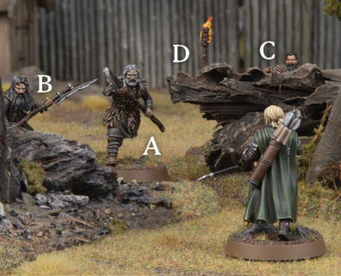
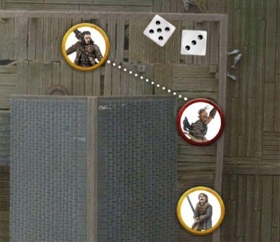
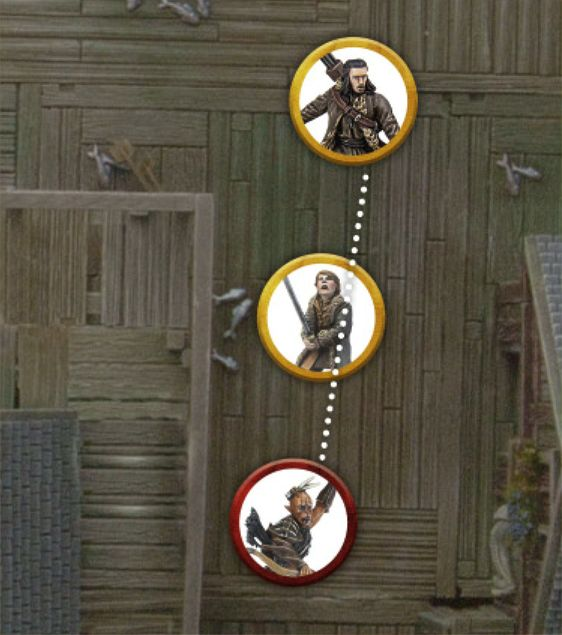
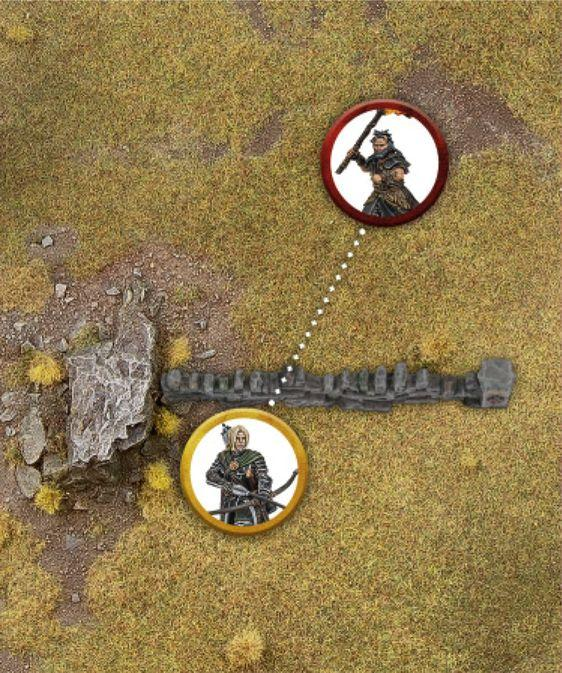
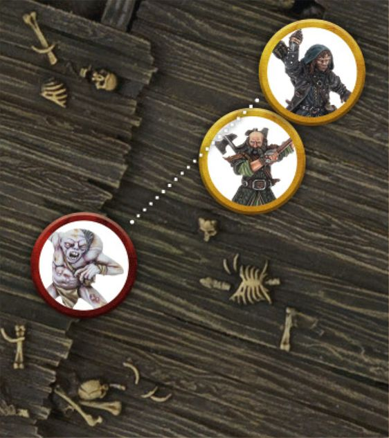
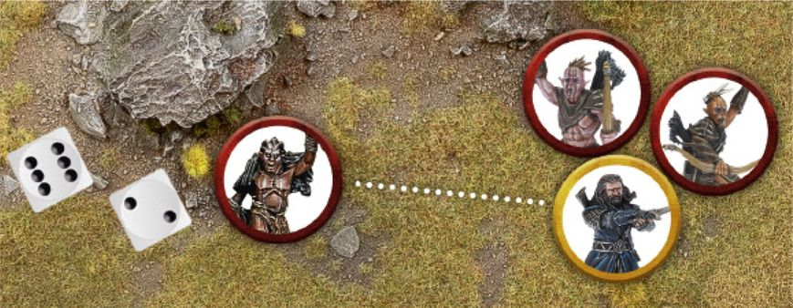
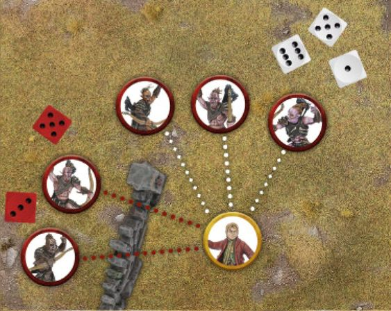

Many armies in Middle-earth employ the use of ranged weaponry when they march to war. The likes of archers, crossbowmen or other such specialists in the use of ranged warfare are tasked with raining down death from afar in the hope of thinning out enemy ranks before the battlelines clash. Ranged weapons come in all shapes and sizes, from the humble bow to more unique pieces such as throwing spears, slings and crossbows. Though they may all be different in style, they all have the same purpose in the heat of battle - felling the enemy before they can reach the fight. The Shoot Phase can be broken down into a number of steps as shown below: Start of Shoot Phase Any special rules that come into play at the start of the Shoot Phase are resolved here. Declare Heroic Actions Any Heroic Actions that can be declared in the Shoot Phase are declared here. Player with Priority's Shooting Phase The Player with Priority can Shoot with each of their models in turn. If a model has any special rules that come into play at the start of their player's Shooting Phase, they are resolved here before any friendly model is chosen to Shoot. Player without Priority's Shooting Phase The Player without Priority can Shoot with each of their models in turn. If a model has any special rules that come into play at the start of their player's Shooting Phase, they are resolved here before any friendly model is chosen to Shoot. End of Shoot Phase Any special rules that come into play at the end of the Shoot Phase are resolved here.

## HOW TO SHOOT

### SHOOTING PHASE

When it is time for a player's Shooting Phase, they get the chance to Shoot with each of their models in an order of their choosing. When a model is chosen to Shoot, they follow the steps below: Start of Shoot Any special rules that come into play at the start of a model's Shoot are resolved here, before the model Shoots. Make Shooting Attack The model may make a single Shooting Attack with one of their Missile Weapons. Any special rules that come into play during a model's Shoot are resolved here. End of Shoot Any special rules that come into play at the end of a model's Shoot are resolved here, after the model has finished Shooting. Shooting is a fairly simple practice, especially once you have done it a few times. When making a Shooting Attack, follow the steps below: Check Line of Sight to your intended target. Make sure that the model making the Shooting Attack can actually see an eligible part of the model they wish to Shoot at. Work out if there are any models or Obstacles in the way. If the Line of Sight to the target model is obscured, you will need to know what it is that is blocking the Line of Sight as this may determine whether or not the model can Shoot. Roll To Hit. Roll a D6 to see if the model has hit their target based on their Shoot Value.

Make any In The Way Rolls. If there are any models or terrain along the path to the target, you will need to see if the shot has hit its intended target or something else along the way. Roll To Wound. If the shot hits a model, roll to see if the hit model suffers a Wound or not. Remove Casualties. Any model that was reduced to 0 Wounds is slain and is removed as a casualty.

***Example 21: Háma is readying himself***

to take a shot and there are four Hill Tribesmen (A, B, C and D) before him. Hill Tribesman A is in the open and therefore is an eligible target. Hill Tribesman B is partially concealed by a rock but is still a viable target. Hill Tribesman C is almost entirely obstructed but as Háma can see its head, it is still a viable target. Hill Tribesman D on the other hand is completely concealed apart from the flaming brand it is waving around - it cannot be targeted.

### SHOOTING FROM OR AT ELEVATED POSITIONS

Due to the dynamic terrain on many battlefields, there will often be times when a model making a Shooting Attack may be Shooting up or down from where it is standing. Most of the time this will have no impact as the target will likely be in range regardless, however, there may be times when it is not completely clear. When a model is Shooting down from an elevated position, measure the range from the base of the Shooting model to the closest part of the model it is Shooting at rather than its base (unless its base is closest). When a model is Shooting up at an elevated position, measure the range from the base of the Shooting model to the base of the elevated model as normal.

## WHO CAN SHOOT?

There are a number of factors that determine whether or not a model can Shoot during their Shooting Phase. If a model has a Missile Weapon, isn't Engaged in Combat, has a target to Shoot at, hasn't moved too far during their Activation, and hasn't been rendered unable to Shoot by some other rule, then it may make a Shooting Attack. Unless otherwise stated, a model may only ever make a single Shooting Attack each turn.

### MISSILE WEAPONS

In order to Shoot, a model must be equipped with a Missile Weapon. The list of common Missile Weapons can be found on page 107.

### PICKING A TARGET

A model must have an eligible target to Shoot at. For an enemy model to be a viable target they must be within the Shooting model's Line of Sight and in range of their Missile Weapon. When a model makes a Shooting Attack, they may choose any eligible target to Shoot at.

### LINE OF SIGHT (21)

When you select a model to Shoot, you need to check if they have Line of Sight to any enemy models in order to make a Shooting Attack.

### MEASURE RANGE

You will also need to see if the enemy model is in range. Every Missile Weapon has a maximum range which tells you how far it can Shoot in inches; this can be found on the Missile Weapon Chart on page 107. If the distance from the Shooting model's base to the nearest point of the enemy model's base is equal to or less than the Missile Weapon's range, then that enemy model is in range.

### MOVING AND SHOOTING

It is hard to shoot a Missile Weapon whilst moving at full speed over a battlefield. As such, a model that has Moved over half its Move Value during the preceding Move Phase cannot make a Shooting Attack. Additionally, a model that has attempted to Jump, Leap, Climb or Swim may not make Shooting Attacks that turn. Prone models may never make Shooting Attacks. A model that Moved during the preceding Move Phase, but did not Move more than half their Move Value, may still make a Shooting Attack, although it will be harder to do. To represent this, any model that wishes to Shoot after Moving during the preceding Move Phase will worsen their Shoot Value by 1 for the duration of the Shooting Attack. Therefore a model with a Shoot Value of 4+ that Moved will have a Shoot Value of 5+ for that turn. A roll of a natural 6 will always hit during a Shooting Attack. Bear in mind that certain terrain has an impact on slowing models down further, as described in the Move Phase, and this is also applied to Moving and Shooting. For example, a model Moving within Difficult Terrain would only be able to Move a quarter of their Move Value and still Shoot that turn - halving it once for the Difficult Terrain, and then only being able to Move half of that value if they wish to Shoot. E.g., A model with a Move Value of 6" would only be able to Move 3" through Difficult Terrain, and only 1.5" if it wanted to Shoot that turn.

## ROLLING TO HIT

Once a target has been chosen, you will need to see if the shot hits. To do this, you will need to make a Shoot Roll. To make a Shoot Roll, roll a D6 and compare the result to the shooter's Shoot Value. If the roll equals or exceeds the Shoot Value, then it is a hit. If the roll is less than the shooter's Shoot Value, then the shot has veered off target and misses. A roll of a natural 6 will always count as a hit, regardless of modifiers.

## IN THE WAY (22)

You may find that there are objects, or even other models, obscuring the shots you wish to make. When you are taking a look to see if your model can see its target, keep a look out for any obstructions such as these. If the Shoot Roll was a hit, you will need to make an In The Way Test for each obstruction. Taking an In The Way Test is simple - roll a D6 for each obstruction in turn. If the result is a 4+, then the shot has successfully passed the obstruction and moves onto the next one - or hits the target if there are no more obstructions to roll for. On a 1-3, the shot hits the obstruction. If the obstruction is another model, then you will need to roll To Wound it as normal. If there are multiple obstructions In The Way of the shot, you will need to make an In The Way Test for each of them in turn, starting with the obstruction closest to the shooter. As soon as the shot hits an obstruction, no more In The Way Tests need to be made.

### MODELS IN THE WAY (23)

Sometimes there will be other models obscuring the target you wish to Shoot at. This is slightly more complicated than when it is terrain that is obscuring the shot. Firstly, Good models cannot make a shot if there would be any risk of hitting a friendly model - i.e., if an In The Way Test would be required for a friendly model, or an enemy model Engaged in Combat with a friendly model. Evil models do not have this restriction and may take shots if there are friendly models In The Way of the target. The shooter must still be able to see their target; if the intervening models block their target completely, then the shot cannot be attempted.

### IN THE WAY

***Example 22: Bard wants to Shoot at***

the Hunter Orc bearing down on Bain. However, the Hunter Orc is partially concealed by a house and so Bard would require an In The Way Test to see whether or not he hits the Hunter Orc. Bard rolls To Hit and rolls a 5 - a hit! He then rolls an In The Way Test and rolls a 3, meaning the arrow will stick firmly in the house and not hit the Hunter Orc - bad news for Bain!

***Example 23: Bard wants to take a shot***

at the Hunter Orc closing in on Bain. Bard's controlling player takes a look to see if the shot is clear and realises that Bain is obscuring the shot. Because Bard is a Good model, he may not risk hurting a friendly model and so the shot cannot be made.

***Example 24: Háma is behind a low***

wall and wishes to Shoot at the Hill Tribesman beyond it. As Háma is in base contact with the wall, he can Shoot across it without penalty.

***Example 25: Kíli is standing behind***

Dwalin and wishes to Shoot at the Goblin dashing towards them. Because he is in base contact with Dwalin, and Dwalin has the same base size as him, Kíli can Shoot past him and no In The Way Test is required.

### SHOOTING FROM BEHIND COVER (24)

A model that is in base contact with an Obstacle or piece of cover that it can see over or around will ignore that piece of terrain for the purposes of an In The Way Test when Shooting. This represents the shooter using the likes of a low wall, tree or crop of boulders for cover whilst Shooting. A degree of common sense is required here; this does not allow for a model to Shoot over an entire building or forest by being in base contact with it.

### SHOOTING FROM BEHIND FRIENDS (25)

Though other models are generally considered to be obstructions when making a Shooting Attack, there is an exception to the rule. A model that is in base contact with a friendly model that has the same base size or smaller, ignores that friendly model when determining In The Way Tests for making a Shooting Attack - unless that friendly model is Engaged in Combat. This is to represent the model Shooting over the shoulder of an ally, or their ally ducking out of the way. If a model is Shooting from behind a friendly model in this manner, and that friendly model is in base contact with a Barrier which it can therefore ignore, the model Shooting over their friend can also ignore the Barrier as described above.

### SHOOTING INTO A COMBAT (26)

Evil models can Shoot at an enemy model that is Engaged in Combat - Good models cannot, for fear of them accidentally Shooting their allies. However, as a Combat isn't a static affair, there is a risk that an Evil model Shooting in this manner will hit one of their allies. To Shoot at a model Engaged in Combat, the shooter must be able to see their target as normal. They then roll To Hit and make any In The Way Tests as normal, with the exception of for any models in the same Combat as the target. Note that In The Way Tests are only taken for things that are obstructing the target, not for things that are obscuring other models in the same Combat. Finally, if the shot reaches the Combat, the shooter will need to make a special In The Way Test to see who in the Combat is hit. On a 4+, the initial target is hit. However, on a 1-3, the friendly model closest to the shooter and within line of sight will be hit instead.

***Example 26: Narzug wants to Shoot at Thorin who is Engaged in***

Combat with two Hunter Orcs. Because he is an Evil model, Narzug may take the shot. First he rolls To Hit, and rolls a 6 - a very clear hit! Next, Narzug must make a special In The Way Test to see who he hits in the Combat, either Thorin or one of his allies. Narzug rolls a 2, meaning that he will hit a friendly model rather than Thorin, and therefore hits the Hunter Orc closest to him.

### TO WOUND CHART (27)

| Strength / Defence | 1 | 2 | 3 | 4 | 5 | 6 | 7 | 8 | 9 | 10 |
|:--:|:--:|:--:|:--:|:--:|:--:|:--:|:--:|:--:|:--:|:--:|
| 1 | 4+ | 4+ | 3+ | 3+ | 3+ | 3+ | 3+ | 3+ | 3+ | 3+ |
| 2 | 5+ | 4+ | 4+ | 3+ | 3+ | 3+ | 3+ | 3+ | 3+ | 3+ |
| 3 | 5+ | 5+ | 4+ | 4+ | 3+ | 3+ | 3+ | 3+ | 3+ | 3+ |
| 4 | 6+ | 5+ | 5+ | 4+ | 4+ | 3+ | 3+ | 3+ | 3+ | 3+ |
| 5 | 6+ | 6+ | 5+ | 5+ | 4+ | 4+ | 3+ | 3+ | 3+ | 3+ |
| 6 | 6+/4+ | 6+ | 6+ | 5+ | 5+ | 4+ | 4+ | 3+ | 3+ | 3+ |
| 7 | 6+/5+ | 6+/4+ | 6+ | 6+ | 5+ | 5+ | 4+ | 4+ | 3+ | 3+ |
| 8 | 6+/6+ | 6+/5+ | 6+/4+ | 6+ | 6+ | 5+ | 5+ | 4+ | 4+ | 3+ |
| 9 | - | 6+/6+ | 6+/5+ | 6+/4+ | 6+ | 6+ | 5+ | 5+ | 4+ | 4+ |
| 10 | - | - | 6+/6+ | 6+/5+ | 6+/4+ | 6+ | 6+ | 5+ | 5+ | 4+ |

***Example 27: Háma's arrow has hit its***

target, so now we need to work out if it has done any damage. Checking the To Wound Chart we compare the Strength of Háma's bow (which is 2) to the Defence of the Hill Tribesman he has hit (which is 3) and discover that we need to roll a 5+ in order to cause a Wound. Háma rolls To Wound and rolls a 5, meaning that the Hill Tribesman will suffer a Wound and, as it only has a single Wound, is slain!

## ROLLING TO WOUND (27)

When a shot hits a model, there is a chance it will cause some serious injury or even death. Of course, there is also the chance that it merely causes a flesh wound or bounces off a model's armour, causing no damage at all. Every Missile Weapon has a Strength Value, which is shown on their entry on the Missile Weapon Chart. When rolling to see if the hit will wound the target, compare the Strength of the Missile Weapon with the Defence of the target on the To Wound Chart. The result indicates the minimum dice roll required to inflict a Wound on the target. A score of a 6+/4+, 6+/5+ or 6+/6+ means you must roll a single dice and score a 6+, followed by a further dice which must score a 4+, 5+ or a 6+ respectively. In these instances, both dice rolls are individual rolls and so either (or both) can be re- rolled as the result of a relevant special rule or ability. A '-' on the chart means that model cannot wound that target - they are just too tough to be harmed. If the dice roll is not high enough, no Wound is inflicted.

### ROLLING TO WOUND

## RECORD WOUNDS AND REMOVE CASUALTIES

When a model suffers a Wound, check against its profile to see how many Wounds it has. A model with a Wounds characteristic of 1 is slain and removed as a casualty as soon as it suffers its first Wound. A model with a Wounds characteristic of 2 must suffer two Wounds before they are slain, and so on. For models with multiple Wounds, it can help to place a marker next to the model to indicate how many Wounds they have remaining, or to make a note on a piece of paper so you don't forget. When a model loses its last Wound, it is slain and removed as a casualty. Simply remove it from the board and place it carefully to one side.

## TAKING SHOTS TOGETHER (28)

Sometimes you may have multiple models all Shooting at the same targets. To save time, these situations can be resolved quicker by taking all the shots together. To do this, count up the number of shooters and roll that many dice at once. Work out which have hit the target, and then roll To Wound. To make things clearer, it helps to roll different coloured dice for different variables. If the Shooting models have different Shoot Values, have different obstructions In The Way or will require different rolls To Wound the target are all good examples of this. For example, you could say 'blue dice need a 3+ To Hit, red dice need a 4+ To Hit, and white dice need a 4+ To Hit and have an In The Way Test for that tree' for instance - so long as it is clear to all players. Taking shots together can really make your game flow quicker and smoother, and works really well so long as both players clearly communicate their intent and are open with each other as they play. If you have multiple models Shooting at multiple targets, it is best to break them up into smaller groups and resolve shots at individual targets as above.

***Example 28: Bilbo Baggins is in trouble***

- five Hunter Orcs are lining up shots against him. Two of the Hunter Orcs will need to take an In The Way Test, indicated by the red lines, whilst three will be unobscured, indicated by the white lines. To keep track of this and to make rolling all of the dice quicker, the Evil player rolls two red dice for the Hunter Orcs that need an In The Way Test, and three white dice for the Hunter Orcs that do not. Once it is clear which shots have hit, all of the To Wound Rolls can be made together.

### TAKING SHOTS TOGETHER
