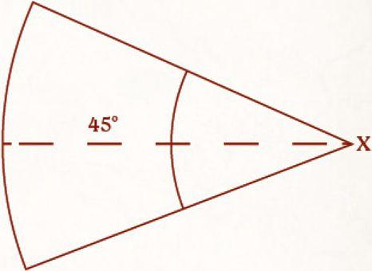

Throughout the storied history of Middle-earth, there have been numerous cities that have been put under siege by grand hosts or seemingly endless tides of enemies. Such battles are a different beast to those that take place upon open fields or traversable terrain where armies can engage one another, and as such require vastly different tactics. To this end, armies will often employ the use of siege engines, great weapons of war that are designed to smash down fortress walls or to blow great holes in the ranks of the attackers. Whatever form they take, siege engines pose a serious threat to any army and can vastly change the flow of a battle.

In this section, we present the rules for using a Siege Engine in your games. Every Siege Engine will have its own profile which will differ to a standard profile as a number of characteristics simply aren't relevant to an inanimate lump of wood and metal! A Siege Engine profile only contains four characteristics: Range, Strength, Defence and Wounds - as shown in the example below:

| | Range | Strength | Defence | Wounds |
|---|---:|---:|---:|---:|
| Gondor Battlecry Trebuchet | 12" - 96" | 10 | 10 | 3 |

A Siege Engine does not Activate. Additionally, a Siege Engine will always be defined as either Large or Small, which will have an impact on how easy it will be to Move or Shoot. This will be covered later on.

### SIEGE CREW

A Siege Engine will also have a number of crew listed in its profile; these are the warriors who are trained to operate the Siege Engine. The profile for the siege crew will also be given in the profile for the Siege Engine, showing their characteristics, wargear and any special rules they may have.

Siege crew can operate any Siege Engine from their Army List, not just their own.

### SIEGE VETERAN

Additionally, one of the crew members is always a Siege Veteran. A Siege Veteran has exactly the same profile as the normal crew, with the exception that they exchange the Warrior keyword for the Hero keyword, and have a single point each of Might, Will and Fate. A Siege Veteran may use their Might Point to improve the To Hit, Scatter or To Wound Roll of the Siege Engine.

A Siege Veteran is a Minor Hero; however, their Warband can only ever include the Siege Engine and the crew. A Siege Engine never counts as a model for the purpose of holding objectives or areas of the battlefield when working out how many models are in your Army or when working out your Army's Break Point.

## DEPLOYING A SIEGE ENGINE

In a Matched Play game, a Siege Engine does not follow the usual rules for deployment. Instead, all Siege Engine models are deployed before any other models, starting with the player who is deploying the first Warband and then alternating from there. A Siege Engine must always be deployed wholly within its player's deployment zone, and wholly within 6" of a table edge.

In Scenarios where players don't have a deployment zone (such as those that use Maelstrom of Battle), all Siege Engine models are deployed before the first turn of the game. As players don't have a deployment zone in these Scenarios, both players roll off before the game begins, with the player that rolls highest choosing one table edge to deploy their Siege Engine models wholly within 6" of. Their opponent then deploys their Siege Engine models wholly within 6" of the opposite table edge. If only one player has Siege Engine models, they are automatically counted as winning this roll-off. A Siege Engine that deploys in this manner does not count as having Moved on the first turn. Deploying a Siege Engine

## SIEGE ENGINES AND MOVING

As you may have guessed, a Siege Engine Moves in a very different way to other models, and in some instances they cannot Move at all. The way the crew of a Siege Engine Moves also differs slightly, and we will cover all of that here.

### MOVING A SIEGE ENGINE

A Siege Engine cannot Move by itself and does not have an Activation; however, a Siege Engine may be Moved by friendly models. The number of friendly models required to Move a Siege Engine depends on its size. Three models are required to Move a Large Siege Engine, whereas only two models are required to Move a Small Siege Engine.

To Move a Siege Engine, the models wishing to Move it must all be in base contact with the Siege Engine at the start of the Move Phase. When they Activate, they can all Activate simultaneously in order to Move the Siege Engine, which can then Move up to the Move Value of the slowest model helping to Move it. When Moving a Siege Engine, it can also be rotated about its centre point as part of this Move. If a player wishes to rotate a Siege Engine but not Move it, this is done in the same way, however, the Siege Engine will only rotate and not Move - both Moving and rotating a Siege Engine will have an impact on when, or if, the Siege Engine shoots later that turn. A Monster counts as three models when calculating how many models are Moving a Siege Engine.

A Siege Engine cannot Move through Difficult Terrain, cross Barriers or make Jump, Climb, Leap or Swim Tests. A Siege Engine cannot be Moved if an enemy model is in base contact with it.

If a Siege Engine has the Static special rule, then it cannot be Moved or rotated.

### MOVING THE CREW

The crew Move in the same way as normal models. However, crew cannot Move further than 6" away from their Siege Engine unless it has been destroyed.

## SIEGE ENGINES AND SHOOTING

Siege Engine models may Shoot in the Shoot Phase like any other model following all of the usual steps, provided it has not been Moved during the preceding Move Phase and has enough crew in base contact with it who are not Engaged in Combat. A Large Siege Engine requires two unengaged crew members, whilst a Small Siege Engine only requires one.

### FIRING A SIEGE ENGINE

A Siege Engine isn't able to Shoot just in any direction, and needs to be facing its target in order to Shoot it. As a result, a Siege Engine has an Arc of Sight: this is a 45 angle that a Siege Engine can Shoot within. To determine if a model is in the Arc of Sight of a Siege Engine, place the Firing Arc Template below over the centre of the Siege Engine with the middle line facing the same way as the Siege Engine, as shown in the diagram below. If a model is within this Firing Arc, then the Siege Engine has Arc of Sight to it.

A Siege Engine cannot make a Shooting Attack if there is an enemy model in base contact with it.

{ width=466 height=340 }

When making a Shooting Attack with a Siege Engine, start by picking a target model within the range of the Siege Engine, in Line of Sight from the Siege Engine and within its Arc of Sight. Many Siege Engine models have a minimum and maximum range (e.g., 12"-60") and as such they cannot choose a target that is closer than their minimum range or further than its maximum range. Every model can be described as either a Battlefield Target or a Siege Target, which will determine how easy it is to hit.

Once a target has been chosen, determine which crew members are firing the Siege Engine and then roll To Hit using the Shoot Value of the crew. If the crew members firing the Siege Engine have different Shoot Values, use the highest numerical value. So, if two crew were firing and one had a Shoot Value of a 3+, and one had a Shoot Value of a 4+, then you would use the Shoot Value of 4+ when rolling To Hit. If a Siege Engine was rotated in the preceding Move Phase, then it suffers a -1 penalty when rolling To Hit.

If the To Hit Roll fails, the shot veers wildly off course and misses - nothing happens. If the target is a Siege Target and the To Hit Roll succeeds, the shot hits as normal. If the target is a Battlefield Target and the To Hit Roll succeeds, then the Siege Engine will need to roll on the Scatter Table to determine which model is actually hit by the shot. A shot can scatter onto a target that is out of the maximum range of the Siege Engine, or out of their Arc of Sight - this represents the shot veering or being blown off course.

### TARGET TYPES

Battlefield Targets: Infantry models, Cavalry models, Monster models, Chariot models, doors, Small Siege Engine models.

Siege Targets: Large gates, War Beast models (including their Howdah), Smaug, houses, boats, Large Siege Engine models.

When playing your games, you may wish to Shoot at something not covered in this list. In these instances, players should agree whether the target is a Siege or Battlefield Target. If it is something that both players agree would be easy for trained crew to hit, then it should be a Siege Target, so make sure to discuss this before you start your game.

### SCATTER TABLE

## Scatter Table

| D6 | Result |
|---|---|
| 1 | **Wide of the Mark:** Your opponent may choose one Battlefield Target (from either Army) within 6" of the initial target. The chosen model becomes the actual target. The chosen model must be within the Line of Sight of the Siege Engine, otherwise it cannot be chosen. If there is no alternative Battlefield Target within 6", or if your opponent does not wish to choose an alternative, then the shot misses completely. |
| 2-5 | **Slight Deviation:** Your opponent may choose one Battlefield Target from their own Army within 6" of the initial target. The chosen model must be within the Line of Sight of the Siege Engine, otherwise it cannot be chosen. The chosen model becomes the actual target. If there are no alternative targets, treat the result as Dead On instead. |
| 6 | **Dead On:** The shot hits the initial target, who becomes the actual target. |

### SIEGE ENGINES AND IN THE WAYS

Depending on how a Siege Engine Shoots, there may be models or terrain in the paths of the shot between the Siege Engine and the actual target - the one who was actually hit by the shot. A Siege Engine will Shoot in one of two ways, either an Arcing Shot or a Direct Shot, which will be stated in the special rules of that Siege Engine.

#### ARCING SHOT

A Siege Engine that Shoots by Arcing Shot does not need Line of Sight to its target, or to a model its shot would scatter on to, so long as another friendly model has Line of Sight to the initial target. After determining the actual target, a Siege Engine with Arcing Shot does not make In The Way Tests for intervening models and terrain (the shot goes over them). However, anything that is clearly taller than the actual target and would be above the actual target when the shot comes down will incur an In The Way Test. This could include the likes of trees, ledges, or rocks that jut out from cliff faces; a degree of common sense will be needed here - a whole tree would provide this In The Way, but a single branch would not!

This is also the case for when a Siege Engine with Arcing Shot hits a War Beast with a Howdah, as the Howdah is above the War Beast and so will provide an In The Way Test.

#### DIRECT SHOT

A Siege Engine that Shoots by Direct Shot will need Line of Sight to the initial target. Additionally, if the shot scatters onto another target, the Siege Engine will need to have Line of Sight to this target in order for them to be selected as the actual target. In both of these instances, this Line of Sight is drawn from the firing point of the Siege Engine, so the tip of a ballista or siege bow for example.

After determining the actual target, a Siege Engine with Direct Shot will make In The Way Tests in the same way as any other Shooting Attack.

### FRIENDS IN PROXIMITY

Like normal Shooting Attacks, a Good Siege Engine cannot make a shot if having it land as intended would cause harm to friendly models (including any area effect the Siege Engine may have), or if there are any friendly models In The Way of the initial target. A Good Siege Engine also cannot Shoot into a Combat.

However, a Good Siege Engine can still make a shot if the only way it would end up risking hitting its allies is from the scatter.

### UNTRAINED CREW

Other friendly models may need to help a Siege Engine Shoot should the crew be slain during the game, in which case they are referred to as untrained crew. Any other friendly model can do this in the same manner as normal crew, however, any untrained crew that wishes to help will always treat their Shoot Value as 6+ whilst helping to Shoot the Siege Engine, and will never use their own Shoot Value. Hero models that act as untrained crew cannot use their Might to influence the To Hit, Scatter or To Wound Rolls of the Siege Engine.

### ROLLING TO WOUND

Once a Siege Engine has made a Shooting Attack, and the actual target has been determined, then a To Wound Roll needs to be made in the same way as normal, using the Strength of the Siege Engine.

A Siege Target that is wounded will suffer 1 Wound.

A Battlefield Target that is hit is immediately knocked Prone. Additionally, a Battlefield Target that is the actual target and is wounded will be instantly slain and removed as a casualty, unless they are able to prevent the Wound (such as by using Fate). Models hit by the area of effect of a Siege Engine (if applicable) will not be automatically slain in this manner.

The only exceptions to this auto-slain rule are if the actual target has a Defence or Wounds characteristic of 10 or more. In these instances, a successful Wound will deal a number of Wounds equal to half the actual target's starting Wounds characteristic instead.

If a Cavalry model is hit by a Siege Engine, then all parts of the model (rider, Mount and any passengers) will all be hit individually - make a To Wound Roll for each of them as described above.

## ATTACKING A SIEGE ENGINE

A Siege Engine can be shot at in the same manner as other models. A Siege Engine can also be the target of a Magical Power or special rule, but will ignore all effects of any Magical Power or special rule with the exception of damage.

If, during the End Phase of a turn, a model is in base contact with an enemy Siege Engine, that model hasn't done anything during that turn except Move (i.e., has not made a Shooting Attack, Cast a Magical Power, been Engaged in Combat), and that model was not affected by a Magical Power that turn, then it can disable the Siege Engine.

A Siege Engine that is disabled immediately reduces its remaining Wounds to 0. When a Siege Engine is reduced to 0 Wounds for any reason, remove it from play. Remember that a Siege Engine never counts as a model in regards to the total number of models in the Army, or towards an Army's Break Point.

A Siege Engine does not have a Control Zone, cannot be Engaged in Combat, and cannot be knocked Prone for any reason. A Siege Engine counts as having a Strength of 6 for the purpose of rules that refer to a model's Strength. Attacking a Siege Engine
