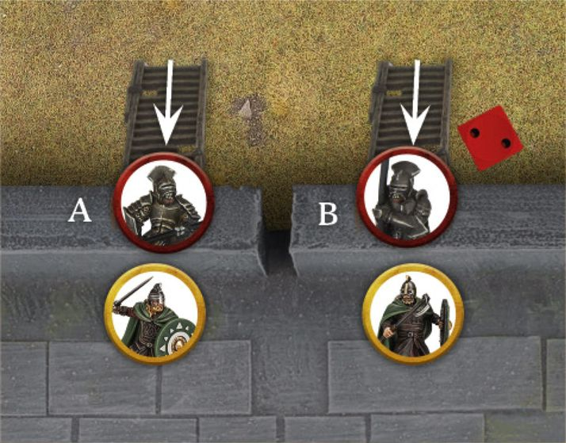
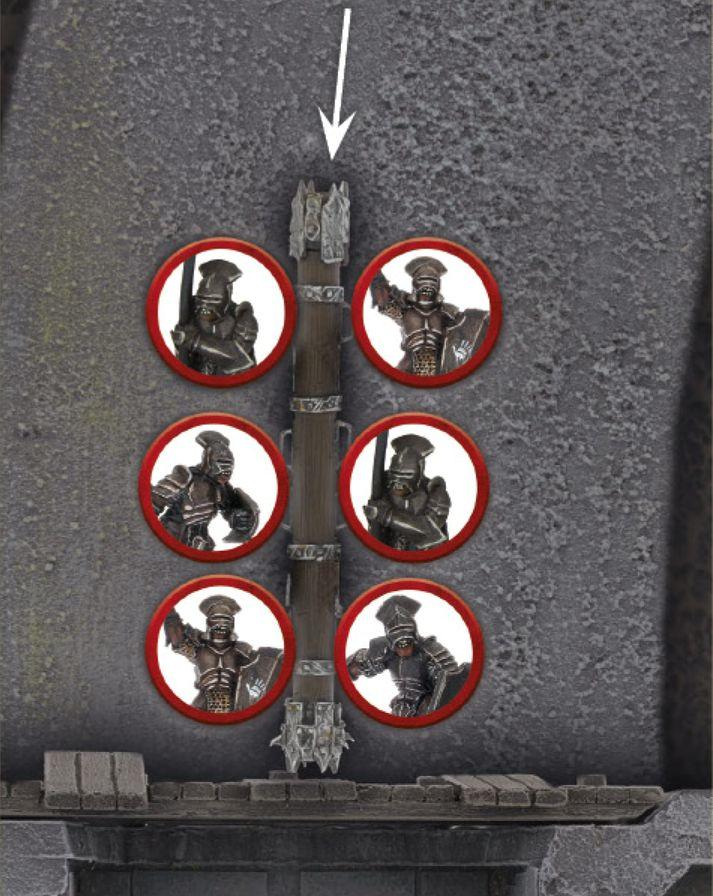

Throughout the long history of Middle-earth, many devastating sieges have taken place during times of war. From the siege of Helm's Deep where the valiant Men of Rohan desperately defended their people from the relentless onslaught of Saruman's Uruk-hai, to the Battle of Pelennor Fields where arguably the greatest army of the Third Age was amassed to breach the walls of Minas Tirith and bring the realm of Gondor to its knees, sieges have served as a titanic clash of armies in one final push to win a war. Over the following pages, we present you with the additional rules you will need to play your own siege battles, as well as a Siege Scenario for you to use when you recreate these epic battles.

## CASTLES AND FORTRESSES

These rules are designed to help you fight battles across purpose-built fortifications, recreating the danger and thrill of laying siege to a castle or attacking the walls of a great fortress against a determined defender. A castle, fortress or other such fortification is made up of two main elements: the walls and the gates and doors. Purpose-built defensive walls that are taller than the height of a model cannot be Climbed by that model - the wall will be too sheer and will have no foot or hand holds to grasp onto. Models with the Swift Movement special rule can Climb such walls, provided they can make it all the way to the top and be placed flat on the walls, otherwise they cannot Climb them. For models to assault those atop the walls, they will need a Siege Ladder or even a Siege Tower. We don't make allowances for smashing down walls in our games - it's impossible to imagine what kind of fortress you have created at home and, in our experience, siege games can get quite complicated enough without this. However, should you wish to create your own rules for destroying walls in your own games, feel free to do so - though it's not advisable to have the likes of ordinary models be capable of destroying such things! Almost every fortress will have the likes of gates and doors

### ATTACKING GATES AND DOORS

Gates and doors can be shot at like any other model, and can be attacked in the Fight Phase. Shooting Attacks with a Strength of 5 or more may damage gates or doors, however, Shooting Attacks with a Strength of 4 or lower cannot damage gates or doors. For a model to attack a gate or door, it must be in base contact with it at the end of the Fight Phase, and not have been Engaged in another Combat that turn. Models may Support those attacking a gate or door, provided that they also haven't been Engaged in a Combat, or Supported a Combat, that turn. When a model attacks a gate or door, no Duel Roll is made - they will automatically win. Models may then Strike against the gate or door following the normal rules, counting the gate or door as Trapped. Should a gate or door be reduced to 0 Wounds, it is destroyed and models from either side can Move through them feely. Monster models may not use Brutal Power Attacks against a gate or door. Below is a list of the various types of gates and doors, along with their Defence and Wounds characteristics. It is always a good idea to discuss with your opponent what each type of gate or door will count as before the game starts. dotted throughout them, ranging from the impressive heavy gates used as the main entrance, to standard doors in between buildings. These are quite capable of being destroyed or moved through during the course of a game. Type Fortress/Castle Gate Dwarven Door Heavy Armoured Door Armoured Door Heavy Door External Domestic Door Internal Domestic Door

### DEFENCE

10 9 9 8 7 6 5 Wounds 3 3 2 2 2 2 1 Castles and Fortresses

### MOVING AROUND THE FORTRESS

Generally speaking, models will move around a fortress in much the same way as a battlefield. After all, fortresses are usually well-paved and easy to navigate. However, there are some aspects of a fortress that function slightly differently, which we will cover here.

### DOORS, GATES AND HATCHES

Defending models may Move through the likes of doors, gates and hatches without penalty. However, attacking models will need to batter them down and destroy them to Move through them, as described earlier.

### MOVING THROUGH BUILDINGS

Depending on the configuration of your fortress, there may be doorways and trapdoors that lead through internal rooms and staircases. In these instances, players should decide between themselves how much of a model's Move Value is required to Move through such areas to reach the exit, and also whether models can stop halfway within such areas.

### STAIRS

Models can Move freely up and down stairs, though Cavalry have some alternative interactions with stairs as described in the Cavalry rules on page 68. Fighting on stairs is much the same as fighting anywhere else, with one exception. Should a model have to Back Away down the stairs, they must roll a D6 before the winner makes Strikes. On a 1-3, the model that Backed Away will slip and become Prone.

***Example 82: These Uruk-hai have both Charged up***

ladders and become Engaged in Combat with the Warriors of Rohan. Uruk-hai A wins their Combat and successfully kills their target; they may then Move onto the walls. However, Uruk-hai B loses their Combat though is not slain by the Warrior of Rohan. After the Strikes have been resolved, Uruk-hai B rolls a D6, scoring a 2 meaning they fall and suffer Falling Damage.

### ASSAULTING THE FORTRESS

In a siege game, one side will be the attacker (the one trying to get into the fortress) and one will be the defender (the one trying to protect the fortress). Attacking a fortress is simple in principle but much harder in practice. The attacker must simply breach the gates or scale the walls to get inside, though this is much easier said than done! There are a number of different methods that the attacker can use when assailing a fortress. They can use the likes of Siege Ladders propped up against the walls for their troops to climb up, heavy battering rams that are used to smash down the gates and open them up for the rest of the army to flood through, or even great siege towers that can carry numerous warriors within its structure, before unleashing them upon the battlements. We will cover each of these aspects here.

### SIEGE LADDERS

A Siege Ladder is a Heavy Object, however, it is not mounted on a 25mm base and will simply use the template of the model when carried. If it is not being carried, a Siege Ladder can be shot at and attacked as normal; it counts as having a Defence of 8 and 2 Wounds. If any model that is carrying a Siege Ladder Moves into base contact with the walls of the fortress, the Siege Ladder is immediately raised; place it in position against the wall. Models may Move up a Siege Ladder in the same way as a normal ladder.

### FIGHTING UP LADDERS (82)

Models may Charge up Siege Ladders against a defender on the walls, in which case they will be Engaged in Combat with that defender, and may Move onto the battlements if possible. If the defender is in base contact with the battlements where the ladder was placed, then the Charging model will remain at the top of the ladder when they fight. A model Charging up a ladder can only Charge a single enemy model if it remains on the ladder. A model cannot Support a model on a ladder. Defending models cannot Charge models fighting atop a ladder in this manner as they are already Engaged in Combat, though they may Support their ally in the Combat. If a model fighting up a ladder wins the Combat, their opponent will Back Away as normal. If they slay their enemy, they may immediately Move onto the walls into base contact with the battlements where their Siege Ladder is placed. If a model fighting up a ladder loses the Combat then, after any Strikes have been resolved, they must roll a D6 instead of Backing Away. On a 1-3, the model will fall off the ladder and suffer falling damage. If there are any other models climbing up the ladder, roll a D6 for each of them as well. On a 1-3, they will also fall and suffer Falling Damage.

### PUSHING DOWN SIEGE LADDERS

If a model on the walls is in base contact with the battlements at the same point where a Siege Ladder is propped up, they can attempt to push it down during their Activation so long as there is no attacker at the top of the ladder, in which case they would need to Charge the attacker. A model that attempts to push down a ladder cannot do anything else in its Activation after attempting to do so. When a model attempts to push down a ladder, roll a D6. Apply a +1 modifier to the roll for each friendly model in base contact with the pushing model that is not Engaged in Combat. Apply a -1 modifier to the roll for each enemy model that is currently on the ladder. A Monster will modify the dice roll by 3 in either direction, depending on if they are pushing or on the ladder. If, after all modifiers have been applied, the result is a 4+, then the ladder is pushed down and all models on the ladder suffer Falling Damage.

### BATTERING RAMS

A Battering Ram is a Heavy Object, however, it is not mounted on a 25mm base and will simply use the template of the model when carried. If it is not being carried, a Battering Ram can be shot and attacked as normal; it counts as having a Defence of 8 and 3 Wounds. A Battering Ram must always have a minimum of two models carrying it, otherwise it cannot be carried.

### BATTERING DOWN DOORS AND GATES (83)

To use a Battering Ram, it must be in base contact with a door or gate at the start of the Fight Phase. After any Heroic Combats have been resolved, but before any other Combats are resolved, a Battering Ram can be used against the doors or gates. It will automatically hit its target, and will make a single Strike against it. Note that as a door or gate is always considered Trapped, the Battering Ram will make two rolls To Wound as a result. The Strength of the Battering Ram is equal to the Strength of the strongest model helping to carry it, +1 for each additional model carrying it, to a maximum of 10. If a Battering Ram would have a Strength of higher than 10, then it may re-roll any failed To Wound Rolls.

***Example 83: These Uruk-hai are about to use a***

Battering Ram against the gates of the Hornburg. The Strength of the battering ram is 4 (the Strength of the Uruk-hai) plus 5 for the additional 5 Uruk-hai that are carrying it, for a total Strength of 9. The Battering Ram can then make one Strike against the gates, making two To Wound Rolls because the gate is considered to be Trapped - the gate is in deep trouble!

### SIEGE TOWER

A Siege Tower should be tall enough for the ramp to reach the battlements of the fortress when lowered and should be no more than 4" wide across the ramp. Infantry models may be deployed within or on top of a Siege Tower, with the exception of Monster models. A Siege Tower can be pushed by friendly models, and will Move 6" when they do so. It requires six Infantry models to push a Siege Tower, with an additional Infantry model required for each model in or on the Siege Tower. Monster models count as six models for the purpose of pushing a Siege Tower. To count as pushing a Siege Tower, a model must be in base contact with either the rear or side of the Siege Tower, or in base contact with another model that is pushing from the rear. If a Siege Tower moves into base contact with the fortress in the Move Phase, then the ramp is immediately lowered. Models in the Siege Tower do not count as Moving whilst the Siege Tower is being pushed, unless they specifically Move within it. A Siege Tower can be shot at or attacked normally, has a Defence of 10 and 4 Wounds, and is a Battlefield Target. If a siege tower would be destroyed, all models in or on it will suffer Falling Damage.

## ATTACKER AND DEFENDER EQUIPMENT

equipment that will aid them in the battle. Attacker equipment has largely already been covered and so just have their point costs listed here; however, the defender equipment will have some additional rules that they can use in their games.When choosing your forces for a siege game, both the attacker and the defender can spend their points on extra

### ATTACKER EQUIPMENT

SIEGE LADDER...............................................................................................................................................................................5 POINTS BATTERING RAM..........................................................................................................................................................................15 POINTS SIEGE TOWER..............................................................................................................................................................................40 POINTS

### DEFENDER EQUIPMENT

BARRICADE....................................................................................................................................................................................5 POINTS A Barricade should be no more than 3" in length, 1" in width and 1" in height. A Barricade can be defended in the same way as a Barrier (see page 54), and can be Jumped over in the same way as an Obstacle. A Barricade has a Defence of 7 and 2 Wounds. SPIKED BARRICADE...................................................................................................................................................................10 POINTS A Spiked Barricade follows all the rules for a regular Barricade, with the following additions: Any model that attempts to Jump over a Spiked Barricade will suffer one Strength 3 hit after resolving their Jump Test, unless they rolled a 6. Any model that is fighting across a Spiked Barricade and accidentally Strikes it instead of their opponent immediately suffers one Strength 3 hit. RALLYING POINT.........................................................................................................................................................................25 POINTS A Rallying Point is represented by a 25mm base. Models may Move over a Rallying Point but cannot finish their Move overlapping it. Defending models treat a Rallying Point as a banner. Additionally, defending models within 6" of a Rallying Point apply a +1 modifier to any Courage Tests they are required to take. If, during the End Phase of a turn, an enemy model is in base contact with a Rallying Point, that model hasn't done anything during that turn except Move (i.e., has not made a Shooting Attack, Cast a Magical Power, been Engaged in Combat), and that model was not affected by a Magical Power that turn, then it can destroy the Rallying Point - remove it from play. ROCKS.............................................................................................................................................................................................5 POINTS A pile of Rocks is represented by a 25mm base and is a Light Object. A defending model in base contact with the Rocks and in base contact with the battlements can make a Shooting Attack with them during the Shoot Phase. This Shooting Attack can only target enemy models within 1" of the walls, or climbing a Siege Ladder, and has a range of 8". A model making a Shooting Attack with a rock treats their Shoot Value as 4+ regardless of its actual value. Any model hit by a rock suffers one Strength 6 hit. A model climbing a Siege Ladder that is hit must roll a D6, and on a 1-3 they will fall off and suffer Falling Damage. BOILING OIL.................................................................................................................................................................................25 POINTS A vat of Boiling Oil is a Heavy Object and is represented by a 40mm base. If two defending models are in base contact with the Boiling Oil, and are not Engaged in Combat, they can pour it on an attacker as a Shooting Attack. This Shooting Attack can only target enemy models within 1" of the walls, or climbing a Siege Ladder, and has a range of 8". Models making a Shooting Attack with Boiling Oil treat their Shoot Value as 4+ regardless of its actual value. Any model hit by Boiling Oil suffers one Strength 8 hit, and any model (friend or foe) within 2" of the target suffers one Strength 4 hit. A model climbing a Siege Ladder that is hit must roll a D6, and on a 1-4 they will fall off and suffer Falling Damage. After making a Shooting Attack with Boiling Oil, the defender rolls a D6. On a 1, the supply of oil has run dry and that vat of Boiling Oil cannot be used for the remainder of the game. Attacker and Defender Equipment

## THE GRAND SIEGE

claiming the fortification for their own - or seeing it razed to the ground…Contained within their fortress, the defenders must fend off the impending siege from their foes, who are intent on

### SCENARIO OUTLINE

The defenders must defend the fortress at all costs, whilst the attackers seek to lay claim to it.

### THE ARMIES

Players may either decide who is the attacker and defender, or may roll a D6 with the player who rolls highest choosing which to be. Players then build their Armies as described on pages 154-155. The attacker gains an additional 25% of the points value of the defender's Army to add to their own. So, If the defender's Army is 1,000 points, then the attacker may have up to 1,250 points. Both the attacker and defender may purchase items from their respective siege equipment list.

### LAYOUT

The fortress will run the length of the board 12" from a board edge. The gate of the fortress is in the centre of the walls, and there may be a selection of towers along the length of the walls.

### STARTING POSITIONS

The defender deploys their Army anywhere atop or behind the wall of the fortress. The attacker then deploys their Army wholly within 12" of the board edge opposite to the fortress.

### INITIAL PRIORITY

Players roll off for Priority on the first turn as normal.

### OBJECTIVES

The game lasts until the end of a turn in which one player has completed their objective. The attacker wins if during the End Phase of any turn there are 12 or more attacking models either on or within the walls of the fortress. The defender wins if during the End Phase of any turn, the attacker has been reduced to 25% or less of their starting numbers. If both sides complete their objective in the same turn, the game is a draw.

### SPECIAL RULES

Ride Out - If needed, the defenders can open the gates of the fortress and charge out. The defender may choose to open the gates at the start of any Move Phase. From this point on, the gates will be open and models can Move through them with no penalty. This cannot be done if the gates have already been destroyed - they are already open at that point! Breach the Gates - If the gates are destroyed by the attacker, then defending models within the fortress suffer a -1 penalty to any Courage Test they have to take as a result of being part of a Broken Army. The Grand Siege
