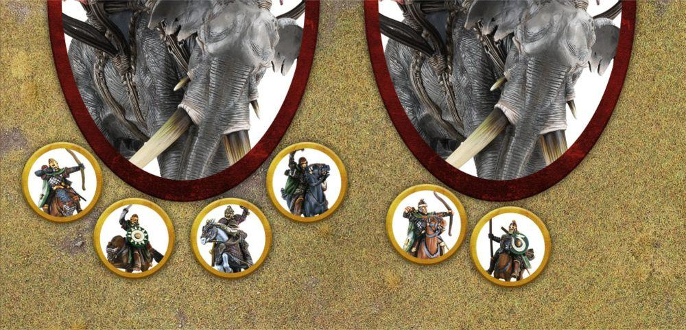

Some truly monstrous beasts roam parts of Middle-earth; huge, lumbering creatures that tower over even the likes f Trolls and fortifications. Some races have been able to harness such creatures, using them as massive weapons of war to trample their enemies underfoot or riding atop them in howdahs (or similar) from where they can fire down upon their enemies. From the mutilated Troll Brutes used by Azog's legions to the fearsome Mûmakil used by the Haradrim at the Battle of Pelennor Fields, these huge war beasts are a powerful force to be reckoned with. Whilst a War Beast is its own unit type and has its own keyword, a War Beast will also be affected by any special rules that affect Monster models. However, as they function very differently to standard Monster models, they do not benefit from the Monster rules on pages 90-91 and instead use those listed here.

## WHAT IS A WAR BEAST?

A War Beast is always composed of two parts: the actual War Beast and its Commander. These count as two separate models for the purpose of working out an Army's Break Point, and when working out how many models are in your Army. Both will have their own separate profiles and characteristics. The Commander will always be a Hero, and will count as the Warband's Captain. The War Beast never takes up a space in their Commander's Warband. A War Beast, its Commander and any models in the Howdah automatically pass all Courage Tests for being part of a Broken Army.

### HOWDAH

Some War Beast models will have a Howdah. If they do, the rules for what can go in their Howdah will be provided in their profile. Enemy models may never go in the Howdah of a War Beast. A Howdah has its own Defence and Wounds characteristics, which will be listed in the profile of the War Beast. If a Howdah is reduced to 0 Wounds remaining, then it is destroyed and any models riding in it will automatically suffer Falling Damage - any that survive are placed Prone and in base contact with the War Beast, in a position chosen by their controlling player. What is a War Beast?

## WAR BEASTS AND MOVEMENT

A War Beast Moves differently to other models. Instead of following the normal rules for Movement, a War Beast will instead Trample, as described below. The Commander and any models within the Howdah follow the normal rules for Movement, and are covered shortly.

### TRAMPLE (77)

When a War Beast Activates and Moves, it does so by Trampling. A War Beast must Move if able. To Trample, pivot the War Beast around the centre point of the base to face any direction you wish by the shortest route. If the War Beast comes into contact with other models when pivoting, simply move them out of the way by the shortest route to allow the War Beast to finish its pivot. If the War Beast comes into contact with terrain whilst pivoting, move the War Beast away just enough to finish its pivot. After the War Beast has pivoted to face its desired direction, it will Move forwards the full distance of its Move Value in a straight line. A War Beast ignores enemy Control Zones, and any model it comes into base contact with whilst it Tramples (not whilst pivoting) will suffer a number of Impact Hits; the exact number and Strength of these Impact Hits will be stated in the War Beast model's profile. Cavalry models suffer these Impact Hits on both the rider and Mount. If the model is slain, the War Beast will continue with its Trample. If the model is not slain then the War Beast will stop and move into base contact with them, counting as Charging and be Engaged in Combat. A War Beast affected by a Heroic March can still Trample as normal. When a War Beast Tramples, it may cross any obstacles that are 2" or smaller without penalty; though it cannot cross any Obstacles higher than this. A War Beast is unimpeded by Difficult Terrain or water features, and may Trample through them as normal; however, a War Beast cannot enter a piece of woodland terrain. A War Beast cannot make Jump, Climb or Leap Tests, cannot Lie Down and cannot defend a Barrier. If a War Beast comes into contact with a piece of terrain it cannot cross, or hits the edge of the battlefield, then it will immediately stop. If a War Beast comes into contact with another War Beast then it will inflict three Strength 8 hits on it and will suffer three Strength 8 hits in return. A War Beast can still be Activated even if it has been Charged, and may even still be able to Trample. If, when a War Beast is Activated, the combined Strength of enemy models that have Charged it is higher than that of the War Beast, then it cannot Trample and must remain stationary. However, if the combined Strength of enemy models that have Charged it is equal to or less than that of the War Beast, then it may Trample as described above. If it does, then all enemy models that had Charged it must be Trampled first, before the War Beast pivots, and will all be Trampled simultaneously. A War Beast that is entering the board via the rules for Reinforcements cannot Trample any models on the turn in which it arrives.

***Example 77:** These Mûmakil have been Charged and Engaged in Combat before they have been Activated. The Mûmak on the left has been Charged by Théoden and three Riders of Rohan, whose combined Strength adds up to 13 - this Mûmak cannot Trample. The Mûmak on the right has been Charged by two Riders of Rohan, whose combined Strength adds up to 6, which is less than the Mûmak's Strength. The right Mûmak can therefore Trample, and does so on the two Riders of Rohan it is in Combat with first, killing them both. It may then pivot and Trample as normal.*

War Beasts and Movement

### THE COMMANDER

The Commander of a War Beast is always in a fixed position on the War Beast, and whilst riding it may not Move from that position. Should the Commander be slain whilst riding a War Beast, then another model in the Howdah immediately takes their place as the new Commander - move the model to the Commander's position if required. Any Heroic Moves or Heroic Marches that the Commander declares will always affect their War Beast, and if they shout With Me or At the Double, then it will only affect the War Beast and any models in the Howdah. A War Beast may only ever benefit from a Heroic Move or Heroic March declared by their Commander, and may never benefit from a Heroic Combat unless specifically stated otherwise. The Commander can never make Shooting Attacks.

### MOVING WITHIN THE HOWDAH

Models in the Howdah may Move as normal, treating the Howdah as Open Ground, including Moving up levels if the Howdah has them. Models in the Howdah cannot leave it unless they have a special rule that specifically states otherwise. Models in a Howdah cannot Lie Down, and if knocked Prone must Stand Up as quickly as possible. Models in the Howdah that remain stationary will not count as having Moved for the purpose of Shooting, regardless of how far the War Beast has Moved. Models in the Howdah cannot be knocked out of it, and if they would be forced out of the Howdah they will simply be knocked Prone where they stand instead. This includes the Commander.

## WAR BEASTS AND MAGIC

Models may target a War Beast with Magical Powers, though must select either the Commander, one of the models in the Howdah or the War Beast as the target. Magical Powers that affect all models in a given range will affect the War Beast, and the Commander/models in the Howdah if they are in range. A War Beast is completely immune to any Magical Power that would prevent it from Activating, moving its full Move Value, or that would attempt to Move it. If the Commander is affected by a Magical Power (or special rule) that would prevent it from Activating, then this will only affect the Commander. The War Beast will still Activate as normal, however, it will not be able to pivot before it Tramples. Additionally, in these instances, the War Beast cannot use the Commander's Courage if it is required to take any Courage Tests to see if it Stampedes, and must instead use its own.

## WAR BEASTS AND SHOOTING

Being such massive creatures, Shooting at a War Beast can throw up some interesting situations, which we will cover here.

### SHOOTING AT A WAR BEAST

A War Beast can be shot at as normal, and the Howdah never counts as In The Way of the War Beast. Additionally, a War Beast will always have the Large Target special rule. Models in the Howdah, including the Commander, are considered to be separate models and so can be shot at separately (unless otherwise stated). If a Siege Engine Shoots at the Howdah, or a model in the Howdah, and rolls a Slight Deviation on the Scatter Chart, then it will automatically be allocated to the War Beast. The Howdah is always considered to be In The Way for any model in the Howdah, or for the Commander, regardless of how clearly it may seem they can be seen.

### SHOOTING FROM A WAR BEAST

Models in a Howdah are never considered to be Engaged in Combat and so can always Shoot as normal, measuring the range and Line of Sight from each individual model. Models in the Howdah may Shoot regardless of how far the War Beast has Moved, so long as they themselves haven't Moved over half their Move Value or gone up or down a level. War Beasts and Magic War Beasts and Shooting

## WAR BEASTS AND COMBAT

When a War Beast is in a Combat, then it is the War Beast itself that is considered to be fighting and not the Commander, and so the Commander cannot contribute any of its characteristics, use Might Points to influence the Duel Roll or To Wound Rolls, or declare any Heroic Actions that would affect the Combat, unless they have a rule that specifically states otherwise. However, as it is the Commander that is controlling the War Beast, any kills the War Beast makes in a Combat are attributed to the Commander themselves.

### IRRESISTIBLE FORCE

If a War Beast ends a Trample in base contact with an enemy model, then it will count as Charging them and will fight them as normal in the Fight Phase. If the War Beast wins the ensuing Combat, then all enemy models involved in the Combat with a Strength of equal to or lower than that of the War Beast will be knocked Prone.

### IMMOVABLE OBJECT

A War Beast can never be knocked Prone for any reason, cannot be Hurled or Barged, and never counts as Trapped. Additionally, a War Beast will never Back Away if it loses a Combat - its opponents must Back Away instead. The only exception is if the War Beast is fighting another War Beast, or a model with a similar special rule (such as Smaug). In these instances, the smaller of the two models will Back Away. If both are the same size, roll a D6. On a 1-3 the Evil player's model will Back Away, on a 4+ the Good player's model will Back Away. War Beasts and Combat War Beasts and Damage

## WAR BEASTS AND DAMAGE

When wounded, there is the chance that a War Beast will lose control and Stampede, causing it to careen uncontrollably across the battlefield.

### STAMPEDE

Each time a War Beast suffers a Wound, it must take a Courage Test using the Courage value of the model currently commanding it. This is an exception to taking multiple Courage Tests of the same type in the same turn. If there is no model commanding it, use the Courage value of the War Beast itself. If any of these Courage Tests are failed, the War Beast will Stampede at the start of its next Activation. If a player has a War Beast that is going to Stampede during its Activation at the start of their Activation Phase, then they must Activate the War Beast first and cannot choose not to Activate it. Additionally, if a War Beast begins its Activation with no models riding it, then it must take a Courage Test using its own Courage value. If it fails, it will immediately Stampede. The Commander of a War Beast may use Might and Will to improve the result of this Courage Test as normal. When a War Beast Stampedes, the opposing player may pivot the War Beast to face any direction (as described earlier) and then have it Trample its full Move Value in that direction, exactly as described earlier. If, when a War Beast Stampedes, it comes into contact with a piece of terrain it cannot cross, or another War Beast, then it will immediately inflict three Strength 8 hits on it (if applicable) and will suffer three Strength 8 hits in return. If, when a War Beast Stampedes, its Move would take any part of its base off the board, it is removed as a casualty along with any models riding it. When a War Beast Stampedes, then any models riding it cannot make Shooting Attacks that turn. At the end of an Activation in which a War Beast Stampedes, it will revert back to the control of its controlling player.

### SLAIN WAR BEASTS

Should a War Beast be slain, then the Howdah (if any) is also destroyed and any models riding the War Beast will suffer Falling Damage. If any survive, place them Prone and within the footprint of the base of the War Beast.
