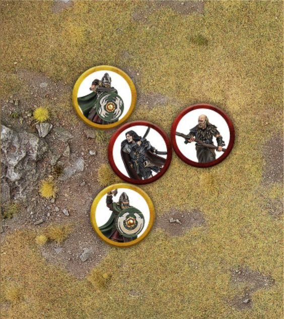
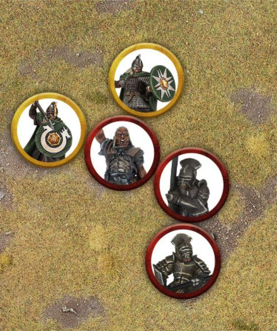
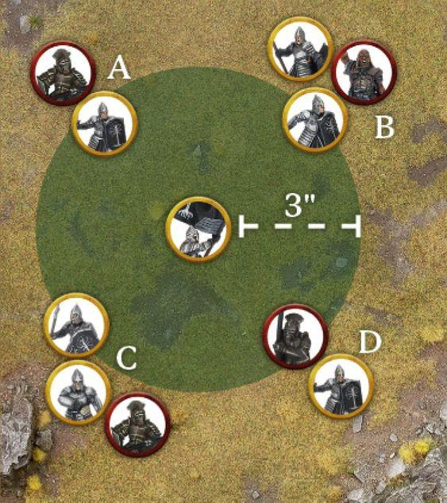

The weapons used in warfare within Middle-earth come in all manner of types, shapes and sizes. From the elegantly crafted and finely balanced blades of the Elves to the hardened axes of the Dwarves wrought out of steel and iron, and the crude and wicked weapons of the Orcs: weapons can take all kinds of forms. There are even some weapons that have, through their valorous use in battle and their wielder's epic deeds, themselves been forged into legend.

Up until now, we have made no distinction as to what a model is armed with, what type of armour it may be wearing or any other wargear they may be carrying, such as banners or war horns. The Strategy Battle Game has a variety of different weapons and wargear that models can use in battle, many of which will have a massive impact on their effectiveness, and in this section we are going to cover what these all do.

In each model's profile it will state all the pieces of wargear they carry, such as weapons, armour, equipment and sometimes pieces of wargear unique to them (which will be detailed in their profile). Some profiles will also have a section stating any additional wargear the model can purchase.

This section is split into two sections: Weapons and Wargear.

## WEAPONS

Weapons are what models use to try to cause damage, and can be split into Melee Weapons and Missile Weapons.

## MELEE WEAPONS

Melee Weapons are used by models in Combat during the Fight Phase in order to try to wound each other. There may be cases where a model may be armed with multiple types of Melee Weapon. In these instances, the model's controlling player must decide which Melee Weapon is being used before the Duel Roll is made. Here we will explain the various types of Melee Weapons and what they do.

### HAND WEAPON

These are the standard kind of weapon a model may carry, and is anything wielded in a single hand, such as a sword, an axe, a mace or all manner of other weapons. The exact kind of weapon being carried doesn't matter; all hand weapons function the same. A hand weapon has no specific rules attached to it.

### TWO-HANDED WEAPON

A two-handed weapon is the kind that requires two hands to wield; as a result, a model wielding a two-handed weapon cannot use any other wargear that would also require the use of a hand (such as a shield) in the same Combat in which they use a two-handed weapon. If the only Melee Weapon a model carries is a two-handed weapon, then they must use it in a Combat - they cannot choose not to.

When a model fights with a two-handed weapon in a Combat, they suffer a -1 penalty to their Duel Roll. However, if the model rolls a natural 6 for their Duel Roll, they do not suffer this penalty. When a model with a two-handed weapon makes a Strike against an enemy model, they apply a +1 modifier to their To Wound Roll - so a 3 would become a 4, a 4 would become a 5, and so on. In the case of when two rolls are required (such as needing a 6+/4+), this will affect both rolls.

### HAND-AND-A-HALF WEAPON

A model armed with a hand-and-a-half weapon can choose to fight with it as either a hand weapon or a two-handed weapon. When a model with a hand-and-a-half weapon takes part in a Combat, they must decide if they are using their weapon as a hand weapon or a two-handed weapon before they make their Duel Roll.

### UNARMED MODELS

Some models don't carry any weapons at all; such models are said to be Unarmed. A model is only ever considered to be Unarmed if their profile explicitly states so, or if they started the game with some form of weapon and those weapons have been lost or destroyed during the course of the game. An Unarmed model suffers a -1 penalty to any Duel Roll they make, and also suffers a -1 penalty to any To Wound Rolls they make when making Strikes. Weapons Melee Weapons

### SPEAR (78)

An Infantry model armed with a spear may assist a friendly model during a Combat, so long as their ally has the same base size or smaller - this is called Supporting.

If a spear-armed model is not Engaged in Combat, then it can Support a friendly model in base contact. When they do, they contribute a single dice to the Duel Roll of the Combat the model they are Supporting is part of. This dice uses the Supporting model's own Fight Value, and if they win they will make a single Strike using their own Strength. In a Multiple Combat, a Supporting model doesn't have to Strike the same model as the model it is Supporting.

Models that are Supporting do not count as being involved in the Combat they are Supporting. As a result, they cannot be targeted by Strikes, will not be knocked Prone by a Charging Cavalry model, cannot benefit from a Heroic Combat, and never count as being part of the Combat for the purpose of special rules or determining how many models are taking part on each side. A spear-armed model can only Support a single Combat during each Fight Phase.

A spear-armed model cannot Support a Combat after already being Engaged in Combat. The only exception to this is that a spear-armed model that is involved in a successful Heroic Combat, and therefore gets to Move, may Move to Support a Combat, provided it hasn't Supported another Combat that Fight Phase.

A model with a spear can use it as a hand weapon when they are Engaged in Combat. A model can't Support if it is Prone, rendered unable to Activate or has made a Shooting Attack during the same turn.

A Hero that is Supporting may use Might Points to improve a Duel Roll or To Wound Rolls as normal. However, a Hero that has declared a Heroic Action in the Fight Phase cannot Support during that Fight Phase.

***Example 78:** Wulf is fighting a pair of Warriors of Rohan, and so a Hill Tribesman with a spear has come to aid him. Because the Hill Tribesman is in base contact with Wulf, they can Support. In the Duel Roll, the controlling player will roll three dice for Wulf as usual, and one extra dice for the Hill Tribesman.*

{ width=564 height=634 }

### PIKE (79)

Pikes function in much the same way as spears, and allow models to Support in exactly the same way as those armed with a spear (see above).

Additionally, a model armed with a pike can Support another friendly model armed with a pike that is Supporting a friendly model Engaged in Combat - essentially giving two Supports to the same model.

A pike requires two hands to use, and so a model armed with a pike will suffer a -1 penalty to their Duel Rolls if they are armed with a shield or a Missile Weapon.

As models armed with pikes can effectively Support at three models deep (one Engaged in Combat and two Supporting), it can be very easy to cause your own models to be Trapped, as only one model may Back Away not two. This is the risk of Supporting in such depth.

Additionally, if a Cavalry model Charges a model armed with a pike, then the model with a pike will gain a bonus of +1 To Wound when making Strikes against the Mount in the ensuing Combat.

***Example 79:** This Uruk-hai Captain is holding the centre of a battleline. Because the Uruk-hai Captain is Supported by two Uruk-hai Warriors with pike, in addition to its own 2 Attacks, the controlling player will roll an additional two dice in the Duel Roll - one for each Supporting Uruk-hai with pike.*

{ width=562 height=671 }

### LANCE

A Cavalry model using a lance applies a +1 modifier on any To Wound Rolls when making Strikes in a Combat in which it Charged. This modifier is not applied if the Cavalry model Charges whilst within Difficult Terrain.

If a Cavalry model Dismounts or loses their Mount, then they must discard their lance.

### WAR SPEAR

A war spear follows the rules for a spear when wielded by an Infantry model, and follows the rules for a lance when wielded by a Cavalry model. The only exception is that a Cavalry model doesn't have to discard the war spear when they Dismount or lose their Mount.

### STAFF OF POWER

A Staff of Power is a hand-and-a-half weapon. Additionally, the wielder of a Staff of Power gains a free Will Point at the start of each turn. If this free Will Point is not spent by the end of the turn, it is lost.

### WHIP

A whip counts as a throwing weapon with a Strength of 1 and a range of 2". It can also be used as a hand weapon in a Combat.

### ELVEN WEAPON

Some weapons will be described as an Elven weapon; for example, a model may have an Elven hand weapon or an Elven two-handed weapon.

If a model fights with an Elven weapon in a Combat, they will be more likely to win the Duel Roll in the result of a Drawn Combat. In these instances, a Good model armed with an Elven weapon will win the roll-off on a 3+, whilst an Evil model armed with an Elven weapon will win the roll-off on a 1-4. If both sides have an Elven weapon, neither side gains the benefit.

Some Missile Weapons may also be classed as Elven weapons; however, the above bonus only applies to Melee Weapons as a model cannot choose to fight with a Missile Weapon in a Combat.

Any weapon with the word 'Elf' in its name is automatically considered to be an Elven weapon.

### MASTER-FORGED

Some weapons may be classed as Master-forged. A model using a Master-forged weapon doesn't suffer the -1 penalty to the Duel Roll for using it as a two-handed weapon.

### FIRE-BASED ATTACKS

Some weapons, special rules, or even Magical Powers will say they are fire-based attacks. This has no inherent effect, though some models may be immune to fire- based attacks. A weapon, special rule, Magical Power, etc., is only a fire-based attack if it specifically states so in its profile.

## MISSILE WEAPONS

Missile Weapons are used during the Shoot Phase to make Shooting Attacks, and come in all shapes and sizes. If a model has a Missile Weapon it will be listed in their profile; some models may be able to purchase Missile Weapons. In some cases, a model may be armed with multiple Missile Weapons. In these instances, their controlling player must decide which Missile Weapon is being used to make the Shooting Attack before rolling To Hit - they cannot use both.

All Missile Weapons have a range and a Strength, which are used when measuring the range of the Shooting Attack and when making any To Wound Rolls for successful hits caused by the Missile Weapon.

### BOW

The term bow covers a wide range of Missile Weapons, including bows, longbows, Elf bows, Dwarf bows, and so on - essentially any Missile Weapon with 'bow' in its name (with the exception of a crossbow). All bows function the same; a model can make a Shooting Attack with a bow during the Shoot Phase provided it has not Moved over half its Move Value during the preceding Move Phase.

The only difference between the various types of bow will be the Strength and range of that particular bow, as shown on the Missile Weapon Chart later on.

### CROSSBOW

A model with a crossbow cannot make a Shooting Attack with it in the same turn in which it Moved.

### BLOWPIPE

A model with a blowpipe can make a Shooting Attack with it in the Shoot Phase provided it has not Moved over half its Move Value during the preceding Move Phase. Additionally, a blowpipe benefits from the Poisoned Attacks special rule.

Blowpipes do not count towards an Army's Bow Limit.

### SLING

A model with a sling can make two Shooting Attacks with it in the Shoot Phase, providing they did not Move at all during the preceding Move Phase. If the model Moved up to half their Move Value in the preceding Move Phase, they may make a single Shooting Attack. If they Moved over half their Move Value in the preceding Move Phase, they may not make a Shooting Attack in the Shoot Phase.

### THROWING WEAPONS

A model with a throwing weapon can make a Shooting Attack with it in the Shoot Phase, even if it Moved its full Move Value in the preceding Move Phase.

Alternatively, once per turn, a model may make a Shooting Attack with a throwing weapon during the Move Phase as it Charges an enemy model. If a model wishes to use a throwing weapon in this manner, then when it Charges it will stop 1" away from the model it wishes to Charge, and then make a Shooting Attack against the model. If the model using the throwing weapon begins its Move within the Control Zone of an enemy model it wishes to Charge, then it doesn't need to Move first before throwing the weapon. This is made using all the normal rules for a Shooting Attack, with the exception of that throwing weapons thrown in this manner do not suffer the -1 penalty To Hit for Moving and Shooting.

If the target is not slain, then the model continues their Charge as normal and must Charge the target of their Shooting Attack. If the target is slain, then the model may continue to Move as normal, and may even Charge a different target if they wish.

Throwing weapons do not count towards an Army's Bow Limit. However, an Army can only have one third of its models armed with throwing weapons, unless specifically stated otherwise.

Throwing spears follow the same rules as throwing weapons, but have a slightly different profile, as shown on the Missile Weapon Chart.

### MISSILE WEAPON CHART

| Name | Range | Strength |
|---|---|---|
| Blowpipe | 12" | 2 |
| Bow | 24" | 2 |
| Crossbow | 24" | 4 |
| Dwarf bow | 18" | 3 |
| Dwarf longbow | 24" | 3 |
| Elf bow | 24" | 3 |
| Esgaroth bow | 24" | 3 |
| Great bow | 24" | 4 |
| Longbow | 24" | 3 |
| Orc bow | 18" | 2 |
| Short bow | 18" | 2 |
| Sling | 12" | 1 |
| Throwing spear | 8" | 3 |
| Throwing weapon | 6" | 3 |
| Uruk-hai bow | 18" | 3 |

## WARGEAR

Wargear can be loosely described as the items that models use during a fight that aren't used as weapons. Wargear can be split into two types: equipment and armour. There is also a section for the most powerful piece of wargear of all - the One Ring.

## EQUIPMENT

Equipment are the kinds of wargear that are commonly seen on the battlefield, and are all used to gain some form of advantage during the course of a battle. From banners that fly the colours of their lord to inspire their followers, to the likes of horns and drums used to rouse warriors to march in quick time or steel themselves against foreboding odds - equipment can take many forms.

### BANNER (80)

A banner has a 3" area of effect that extends out from the model carrying the banner (although some special banners may have a larger range). If a friendly model is within the range of one or more friendly banners, can draw Line of Sight to that banner, and is either Engaged in Combat or Supporting a friendly model, then that Combat is affected by the banner. If a Combat is affected by a banner then a single friendly model in that Combat (including a Supporting model) can re-roll a single dice in the Duel Roll. If a Combat is affected by multiple friendly banners, then this will still only allow a single dice to be re-rolled as part of the Duel Roll, not one for each banner. A model cannot use a banner to re-roll a dice in a Duel Roll that the model is currently winning, in order to try to lose the Combat.

A banner must be flying in order to inspire its followers. If a model carrying a banner is Prone, then friendly models cannot benefit from it, or any special rules associated with the banner if applicable.

If a Hero has a special rule that means that friendly models in a certain range treat them as a banner, then the Hero must be standing in order for the effect of the banner to be applicable.

It is possible that one player will use their banner to re-roll a dice and then find themselves winning the Duel Roll, in which case their opponent may wish to use a banner of their own. This is perfectly fine, though each side may still only re-roll a single dice as the result of using a banner or a special rule that counts as a banner.

If a banner states that it only affects models with certain keywords, then those models must be in range of the banner themselves for the banner to affect that Combat, and only those models may re-roll a dice as a result of the banner.

A model carrying a banner suffers a -1 penalty to their Duel Rolls.

If a Warrior carrying a banner (not a Hero) is removed from the battlefield as a casualty for any reason (such as being slain or fleeing the board as the result of being part of a Broken Army), then they may pass their banner onto another friendly Warrior model in base contact. However, they cannot pass their banner onto a model that is Prone, Engaged in Combat or to a model that could not normally take a banner as part of their profile. Swap the models over if they are the same type of Warrior, or find a suitable model in your collection. When a model takes a banner in this manner, it will count as having the wargear its profile allows it to have when it is upgraded to carry a banner as part of its profile, and will drop all others. So, if a Warrior of Minas Tirith with a spear and shield were to pick up a banner, it would have to drop its shield and spear as a Warrior of Minas Tirith that has a banner does not also have a spear and shield.

***Example 80:** Here a Warrior of Minas Tirith carrying a banner is within 3" of four different Combats: A, B, C and D. The Warrior of Minas Tirith in Combat A is within 3" of the banner bearer, and so may benefit. Combat B may benefit as it has one friendly model within 3" of the banner, allowing either model to re-roll even if they are not in range of the banner themselves. Combat C may also benefit from the banner as it has a Supporting model within 3" of the banner. Combat D may not benefit as, even though it is within 3" of the banner, only enemy models are in range. Wargear Equipment*

{ width=563 height=633 }

### ELVEN CLOAK

A model wearing an Elven cloak has the Stalk Unseen special rule. Additionally, models targeting an Infantry model wearing an Elven cloak with a Shooting Attack suffer a -1 penalty when rolling To Hit.

### WAR DRUM (X)

A model with a war drum may use it during the Declare Heroic Actions step of each Move Phase to declare a Heroic March for free, without spending a Might Point, even if they are not a Hero. This free Heroic March has the following exceptions:

- A model with a war drum that declares a Heroic March must always shout At the Double.
- The range of this At the Double is 12" rather than 6". Additionally, friendly models must finish their Activation within 12" rather than 6".
- The Heroic March declared when a model uses a war drum will only affect friendly models with the same keywords as the ones shown in brackets after the war drum. So if a model has a war drum (Mordor) then it will only affect models with the Mordor keyword.

As a war drum allows a model to declare a free Heroic March, models cannot be affected by both a war drum and a normal Heroic March in the same turn.

### WAR HORN

Models within 24" of a friendly model with a war horn gain a bonus of +1 to any Courage Tests they take. Additionally, a model with a war horn gains the Dominant (2) special rule and can use it once per game to increase the range of a friendly Hero model's [Stand Fast] by 3", so long as the model with the war horn is in range of the Hero model's [Stand Fast] before this increase. If a Hero model has a war horn themselves, they may use it to increase the range of their own [Stand Fast] by 3" instead. A war horn is treated as an Active ability (see page 123).

## ARMOUR

Armour is designed to protect the wearer from harm, deflecting blows or stopping otherwise wounding attacks from injuring its wearer. Armour provides a bonus to the wearer's Defence characteristic. Where a model is listed as having a type of armour in its profile, then the improvement in its Defence characteristic will already have been included in their profile. If a model has the opportunity to upgrade one type of armour to another, then they will replace one with the other - they will not get the Defence benefits of both.

Shields are also covered in this section; however, they are not considered to be a type of armour and so any rules that affect armour will not affect a shield.

### ARMOUR

A model wearing armour will add 1 to their Defence characteristic.

### LIGHT ARMOUR

A model wearing light armour will add 1 to their Defence characteristic against Shooting Attacks. If a model is wearing light armour then the Defence improvement will not have been added onto their profile.

### HEAVY ARMOUR

A model wearing heavy armour will add 2 to their Defence characteristic.

### HEAVY DWARF ARMOUR

A model wearing heavy Dwarf armour will add 3 to their Defence characteristic.

### MITHRIL ARMOUR

A model wearing Mithril armour will add 3 to their Defence characteristic. Additionally, Monster models cannot use the Rend Brutal Power Attack against a model wearing Mithril armour. Armour Shields

## SHIELDS

A model carrying a shield adds 1 to their Defence characteristic. Where a model is listed as carrying a shield in its profile, then the improvement in its Defence characteristic will already have been included in their profile.

A shield is cumbersome, and so a model carrying a shield that wishes to use their hand-and-a-half weapon as a two-handed weapon during a Combat cannot gain the Defence bonus for carrying a shield during that Combat. Additionally, a model carrying a shield does not gain the Defence bonus if it also carries a type of bow, crossbow, two-handed weapon or pike.

A model with a shield can also use the Shielding special rule:

### SHIELDING

A model carrying a shield may declare they are Shielding at the start of a Combat they are involved in, before the Duel Roll is made. If they do, the Shielding model will double their Attacks characteristic for the duration of the Combat; however, if they win the Duel Roll they cannot make Strikes having put their effort into surviving. They also don't gain any advantages of the special rules of their weapons (such as if they have an Elven weapon) as they are not using them in the Combat and are using their shield instead.

In a Multiple Combat, if one model wishes to declare they are Shielding, then all friendly models must do so. If some of them cannot, then no models may declare they are Shielding. Models that are Shielding cannot be Supported.

Cavalry models cannot declare they are Shielding. Additionally, Shielding is treated as an Active ability (see page 123).

A Prone model can declare they are Shielding - in fact, it is a sensible way of trying to get them to stand back up as a Prone model can't make Strikes anyway!

### LIGHT SHIELD

A model with a light shield does not gain a bonus to its Defence. However, it may use the Shielding special rule as described above.

## THE ONE RING

Forged in the fires of Mount Doom by the Dark Lord himself, the One Ring contains great power that can be used to devastating effect, yet may corrupt those who wear it for too long.

A model who carries the One Ring is referred to as the Ringbearer.

### WEARING THE RING

A Ringbearer can put on the One Ring at any point during their Activation. As soon as they do they benefit from the Invisible special rule (see page 127). A Ringbearer who is unable to Activate (such as if they are Engaged in Combat) cannot put on the Ring.

If a model puts on the Ring whilst they are mounted, then their Mount will immediately bolt and flee the battlefield (the Mount is therefore removed), and the model must immediately take a Thrown Rider Test.

### SAURON'S WILL

If a Ringbearer begins its Activation wearing the One Ring, then their controlling player must test to see if the model can overcome the call of the Ring. To do this, the Ringbearer's controlling player rolls a D6 before doing anything else for the Ringbearer during their Activation. A Hero may use Might to improve this roll. On a 3+, the Ringbearer is able to keep control and may Activate as normal. However, on a 1-2 the opposing player may Move the Ringbearer during their Activation, and may even make them Charge - in this case, the model passes all Courage Tests for the Terror special rule. The opposing player cannot make the Ringbearer remove the Ring when they Move them.

The opposing player cannot make the Ringbearer pick up or put down items, perform anything that may bring the Ringbearer to harm (such as Jumping off a cliff or making a Leap Test), or make them leave the board in Scenarios that allow it.

It's important to note that even when an opposing player gets to Move the Ringbearer in this manner, they are still part of their controlling player's Army, and all other actions such as Shooting, fighting in Combat, or anything else the Ringbearer can do remains under the control of their controlling player.

### REMOVING THE RING

Such is the hold of the Ring, that any model who is wearing it and wants to remove it must take a Courage Test. This can be done at any point in the model's Activation, though after making the roll for Sauron's Will (if applicable). If the model fails this Courage Test then they cannot take the Ring off this turn and must wait until the following turn to try again.

### MY PRECIOUS!

During a Matched Play game, if the Ringbearer is the only model left on their side and is Invisible (i.e., they are wearing the Ring), then they succumb to the call of the Ring and are removed as a casualty. If the opposing side's objective is to kill the Ringbearer, then this is still achieved if the Ringbearer is removed in this manner.

There may be the odd occasions in Matched Play games where there is more than one model on the battlefield who can carry the One Ring. As the One Ring is unique, there is a hierarchy as to who carries the One Ring in the case of multiple Ringbearers. The model closest to the top of the hierarchy table below will get to use the Ring - the other will not be a Ringbearer at all for that battle.

1. The Dark Lord Sauron
2. Isildur
3. Bilbo Baggins or Bilbo Baggins, Master Burglar
4. Frodo Baggins
5. Bilbo Baggins, Ageing Hobbit
6. Gollum

In the rare situation where both players have a Ringbearer, and both are at the same highest point on the hierarchy table, then both may carry the One Ring - though one of them is clearly a fake, and only the winner can claim that theirs was the real One Ring!
