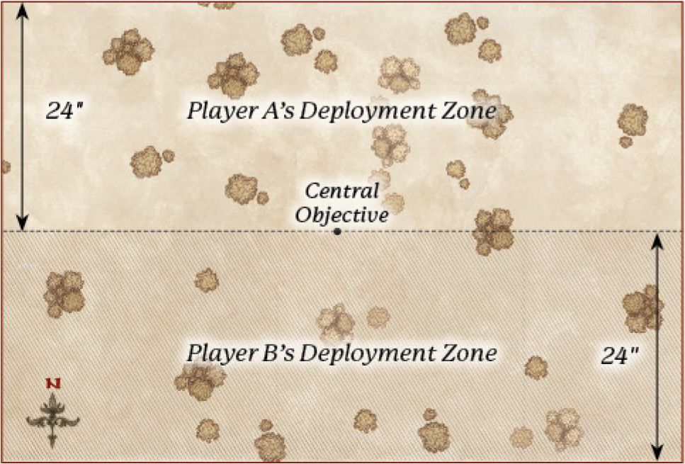
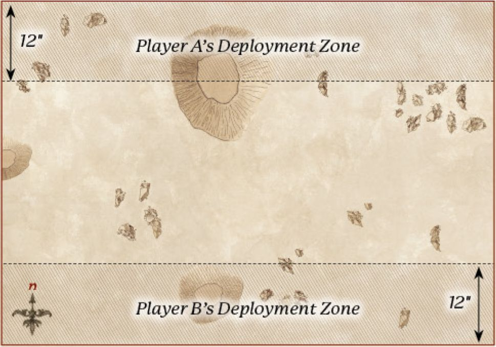
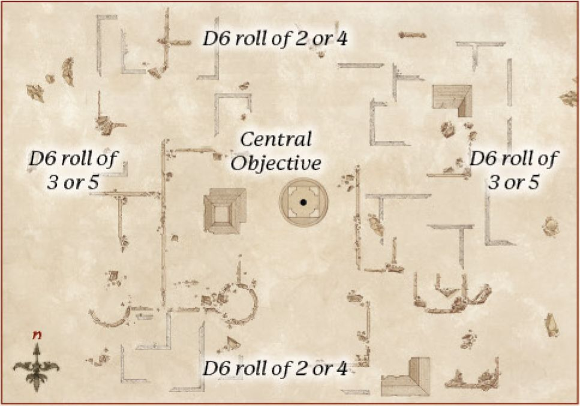
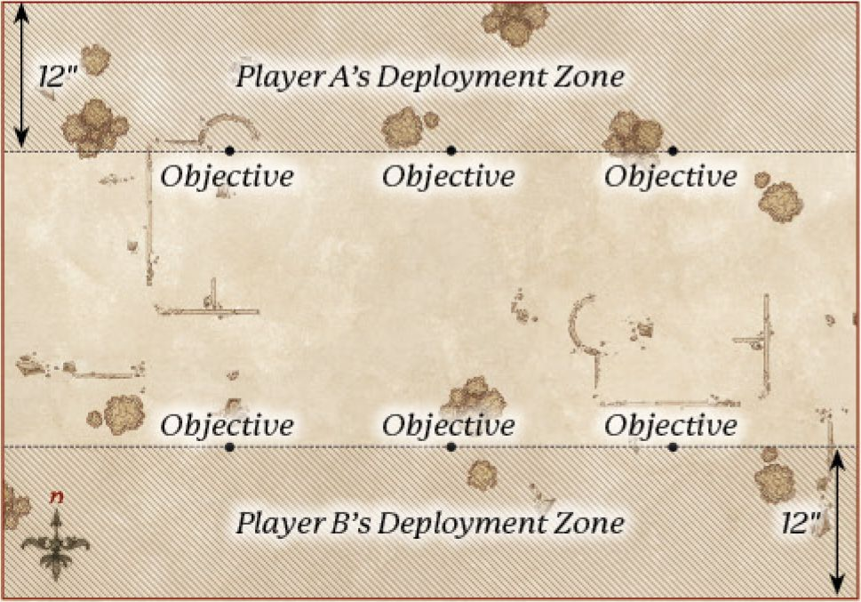
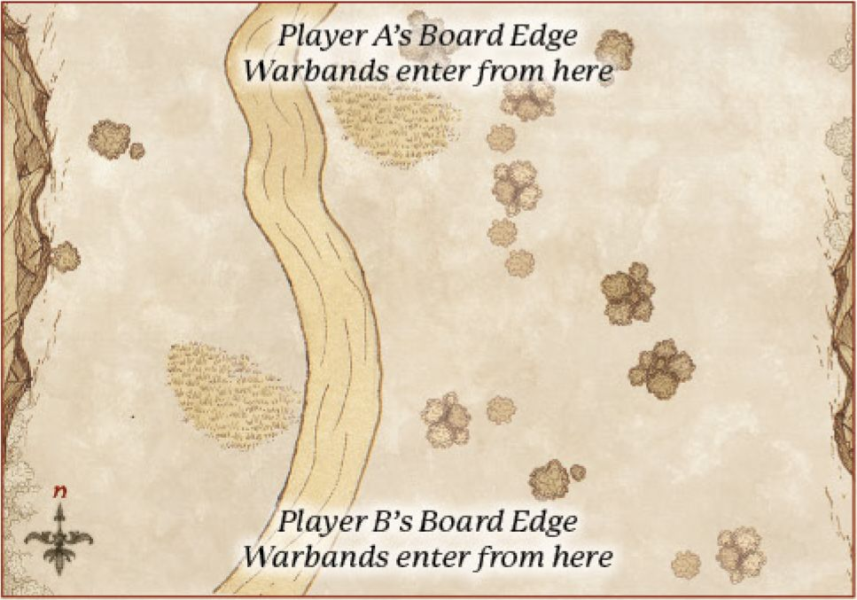
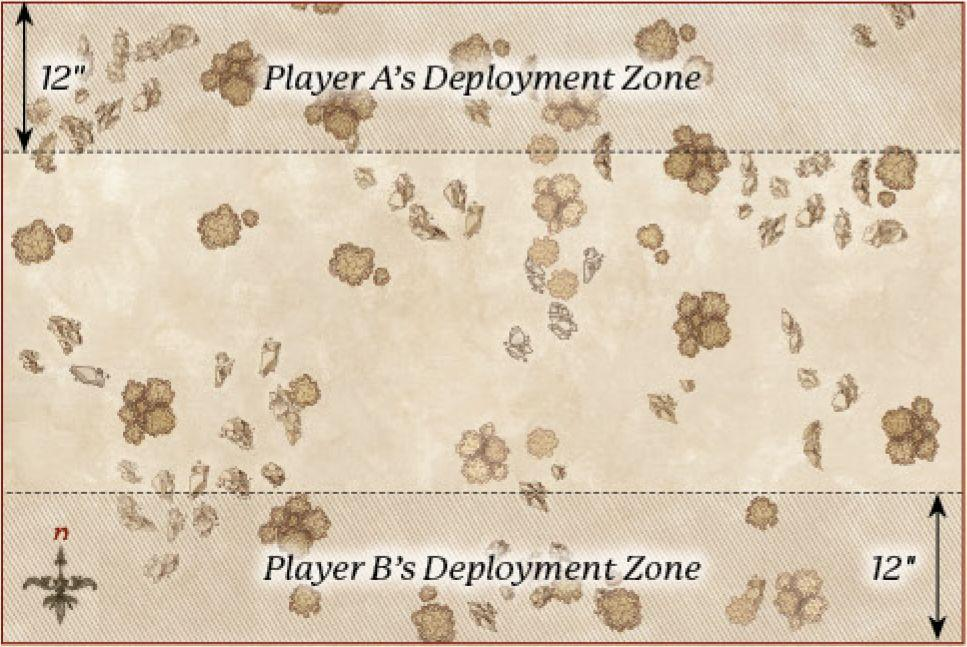

## SCENARIO 1 - DOMINATION

**SCENARIO OUTLINE**

Players fight to control five objectives scattered across the battlefield.

**THE ARMIES**

Players choose their Armies, as described on page 154, to an equal points value.

**LAYOUT**

Set up terrain as described on page 157. Then, place five Objective Markers on the battlefield; one is automatically placed in the centre of the board. To place the other objectives, both players roll a D6. The player with the highest score places one objective anywhere on the battlefield at least 12" away from the existing objective and 6" away from any board edge. Their opponent then places a third objective at least 12" away from existing objectives and at least 6" away from any board edge. The players then alternate placing the remaining two objectives, according to the restriction noted earlier.

**STARTING POSITIONS**

Both players roll a D6 - the player with the highest result chooses one of the deployment zones. They then select a Warband in their Army to deploy wholly within 24" of their board edge. Models must be deployed within 6" of the Captain of their Warband.

When this has been done, the opposing player chooses one of their Warbands and deploys it wholly within 24" of their board edge, as described above. Players then alternate until all of their Warbands have been placed.

**INITIAL PRIORITY**

Both players roll a D6. The player who rolls highest chooses who has Priority in the first turn.

**OBJECTIVES**

The game lasts until the end of a turn in which one Army has been reduced to a quarter (25%) of its starting number of models or below, at which point the player that has scored the most Victory Points wins the game. If both players have the same number of Victory Points, the game is a draw.

**SCORING VICTORY POINTS**

* For each Objective Marker, you score 1 Victory Point if you have more models within 3" than your opponent. If you have at least twice as many models as your opponent within 3", you instead score 2 Victory Points. If you are the only player to have models within 3", you instead score 3 Victory Points.
* You score 1 Victory Point if the enemy General was wounded during the game. If the enemy General was removed as a casualty, you instead score 2 Victory Points.
* You score 1 Victory Point if the enemy Army is Broken at the end of the game. If the enemy Army is Broken and your Army is not, you instead score 3 Victory Points.

---

## SCENARIO 2 - TO THE DEATH!

**SCENARIO OUTLINE**

Victory goes to the force which can crush the foe and slay the enemy leader.

**THE ARMIES**

Players choose their Armies, as described on page 154, to an equal points value.

**LAYOUT**

Set up terrain as described on page 157.

**STARTING POSITIONS**

Both players roll a D6 - the player with the highest result chooses one of the deployment zones. They then select a Warband in their Army to deploy wholly within 12" of their board edge. Models must be deployed within 6" of the Captain of their Warband.

When this has been done, the opposing player chooses one of their Warbands and deploys it wholly within 12" of their board edge, as described above. Players then alternate until all Warbands have been placed.

**INITIAL PRIORITY**

Both players roll a D6. The player who rolls highest chooses who has Priority in the first turn.

**OBJECTIVES**

The game lasts until the end of a turn in which one Army has been reduced to a quarter (25%) of its starting number of models or below, at which point the player who has scored the most Victory Points wins the game. If both players have the same number of Victory Points, the game is a draw.

**SCORING VICTORY POINTS**

* You score 1 Victory Point if the enemy General was wounded during the game. If the enemy General has been wounded, and only has 1 Wound remaining, then you instead score 3 Victory Points. If the enemy General was removed as a casualty, you instead score 5 Victory Points.
* You score 3 Victory Points if the enemy Army is Broken at the end of the game. If the enemy Army is Broken and your Army is not, you instead score 5 Victory Points.
* You score 2 Victory Points if your opponent has no banners remaining at the end of the game (if they didn't have a banner to start with, you automatically score this).
* You score 1 Victory Point if you have at least one banner remaining at the end of the game. If you have more banners remaining than your opponent, then you instead score 2 Victory Points.
* You score 3 Victory Points if the enemy Army has been reduced to 25% of its starting models at the end of the game.
* You score 1 Victory Point for each enemy Hero model that has been removed as a casualty, up to a maximum of 3 Victory Points.

---

## SCENARIO 3 - HOLD GROUND

**SCENARIO OUTLINE**

Control the centre of the battlefield, no matter the cost.

**THE ARMIES**

Players choose their Armies, as described on page 154, to an equal points value.

**LAYOUT**

Set up terrain as described on page 157. Once the battlefield has been set up, an Objective Marker is placed in the centre of the battlefield. Players must also agree which direction is north - this is important for determining where and when Reinforcements arrive from.

**STARTING POSITIONS**

At the battle's start, the Armies are yet to arrive - models are not deployed at the start of the game, but will enter as the game continues (see Special Rules later).

**INITIAL PRIORITY**

Both players roll a D6. The player who rolls highest chooses who has Priority in the first turn.

**OBJECTIVES**

Once one Army has been Broken, the game might suddenly end. At the end of each turn, after this condition has been met, roll a D6. On a 1-2, the game ends - otherwise, the battle continues for another turn.

At the end of the game, the player who has scored the most Victory Points wins the game. If both players have the same number of Victory Points, the game is a draw.

**SCORING VICTORY POINTS**

* You score 4 Victory Points if you have more models within 6" of the objective than your opponent. If you have twice as many models within 6" of the objective than your opponent, then you instead score 8 Victory Points. If you have three times as many models within 6" of the objective than your opponent, or you are the only player to have models within 6" of the objective, then you instead score 12 Victory Points.
* You score 1 Victory Point if the enemy General was wounded during the game. If the enemy General was removed as a casualty, you instead score 3 Victory Points.
* You score 1 Victory Point if the enemy Army is Broken at the end of the game. If the enemy Army is Broken and your Army is not, you instead score 3 Victory Points.
* You score 2 Victory Points if your opponent has no banners remaining at the end of the game (if they didn't have a banner to start with, you automatically score this).

**SPECIAL RULES**

**Maelstrom of Battle** - At the end of your Move Phase, roll a D6 for each of your Warbands not on the battlefield and consult the chart that follows (the Warband's Captain can use Might to increase this roll). Roll for each Warband separately, Activate the models in the Warband, then roll for the next. Warbands yet to arrive count as being on the battlefield for the purposes of determining if your Army is Broken.

| D6 | Result |
| --- | --- |
| 1 | The Warband does not arrive. |
| 2 | Your opponent chooses a point on either the north or south board edges at least 6" from a corner - the Warband arrives from this point via the rules for Reinforcements. |
| 3 | Your opponent chooses a point on either the east or west board edges at least 6" from a corner - the Warband arrives from this point via the rules for Reinforcements. |
| 4 | You choose a point on either the north or south board edges at least 6" from a corner - the Warband arrives from this point via the rules for Reinforcements. |
| 5 | You choose a point on either the east or west board edges at least 6" from a corner - the Warband arrives from this point via the rules for Reinforcements. |
| 6 | You choose a point on any board edge at least 6" from a corner - the Warband arrives from this point via the rules for Reinforcements. |

---

## SCENARIO 4 - DESTROY THE SUPPLIES

**SCENARIO OUTLINE**

Destroy your opponent's supplies whilst protecting your own.

**THE ARMIES**

Players choose their Armies, as described on page 154, to an equal points value.

**LAYOUT**

Set up terrain as described on page 157. Then, place three Objective Markers in each player's deployment zone so that the objectives are equidistant along the edge of each player's deployment zone, with one in the centre.

The first is placed 12" from the centre of the player's board edge. The others are then placed halfway between the central objective and the board edges on either side, so that all three objectives are equidistant along the edge of one player's deployment zone.

**STARTING POSITIONS**

Both players roll a D6 - the player with the highest result chooses one of the deployment zones. They then select a Warband in their Army to deploy wholly within 12" of their board edge. Models must be deployed within 6" of the Captain of their Warband.

When this has been done, the opposing player chooses one of their Warbands and deploys it wholly within 12" of their board edge, as described above. Players then alternate until all of their Warbands have been placed.

**INITIAL PRIORITY**

Both players roll a D6. The player who rolls highest chooses who has Priority in the first turn.

**OBJECTIVES**

The game lasts until the end of a turn in which one Army has been reduced to a quarter (25%) of its starting number of models or below, at which point the player who has scored the most Victory Points wins the game. If both players have the same number of Victory Points, the game is a draw.

**SCORING VICTORY POINTS**

* You score 3 Victory Points for each enemy Supply Marker that has been destroyed.
* You score 1 Victory Point for each enemy Supply Marker that has not been destroyed, but you have more models within 3" than your opponent.
* If you have destroyed more Supply Markers than your opponent, you score 1 Victory Point.
* You score 1 Victory Point if the enemy General was wounded during the game. If the enemy General was removed as a casualty, you instead score 3 Victory Points.
* You score 1 Victory Point if the enemy Army is Broken at the end of the game. If the enemy Army is Broken and your Army is not, you instead score 3 Victory Points.
* You score 2 Victory Points if your opponent has no banners remaining at the end of the game (if they didn't have a banner to start with, you automatically score this).
* You score 1 Victory Point if you have at least one banner remaining at the end of the game. If you have more banners remaining than your opponent, then you instead score 2 Victory Points.

**SPECIAL RULES**

**Supply Markers** - The Objective Markers represent a series of supplies that both sides are trying to destroy. To destroy an enemy Supply Marker, a model must be standing and in base contact with the marker during the End Phase of a turn having not Cast any Magical Powers, used a Missile Weapon, been Engaged in Combat, Supported a Combat, been rendered unable to Move any further that turn due to a special rule or result of a test (such as a Thrown Rider Test) or been under the effects of an enemy Magical Power that turn. Once a Supply Marker has been destroyed, remove it from play.

---

## SCENARIO 5 - RECONNOITRE

**SCENARIO OUTLINE**

Ensure more of your models escape the battlefield than your opponent.

**THE ARMIES**

Players choose their Armies, as described on page 154, to an equal points value.

**LAYOUT**

Set up terrain as described on page 157.

**STARTING POSITIONS**

At the battle's start, the Armies are yet to arrive - models are not deployed at the start of the game. Both players roll a D6. The player with the highest result chooses one of the long table edges to be their board edge - the opposing player has the opposite board edge as their board edge (see Special Rules later).

**INITIAL PRIORITY**

Both players roll a D6. The player who rolls highest chooses who has Priority in the first turn.

**OBJECTIVES**

The game lasts until the end of a turn in which one Army has been reduced to a quarter (25%) of its starting number of models, or below, at which point the player that has scored the most Victory Points wins the game. If both players have the same number of Victory Points, the game is a draw. Models that have escaped the board count as being on the board for the purpose of determining if an Army is Broken or reduced to 25%.

**SCORING VICTORY POINTS**

* You score 4 Victory Points if more of your models have escaped the battlefield via your opponent's board edge than vice versa. If at least two of your models and twice as many models than your opponent have escaped the board, then you instead score 8 Victory Points. If at least three of your models, and three times as many models than your opponent have escaped the board, then you instead score 12 Victory Points.
* You score 1 Victory Point for each of your Hero models that escapes the board, to a maximum of 3 Victory Points.
* You score 1 Victory Point if the enemy General was wounded during the game. If the enemy General was removed as a casualty, you instead score 2 Victory Points.
* You score 1 Victory Point if the enemy Army is Broken at the end of the game. If the enemy Army is Broken and your Army is not, you instead score 3 Victory Points.

**SPECIAL RULES**

**Reinforcements** - At the end of your Activation Phase, roll a D6 for each of your Warbands that are not on the battlefield and consult the chart below (the Warband's Captain can use Might to improve the roll). Models enter the board via the rules for Reinforcements.

Roll for each Warband separately, Activate the models in the Warband, then roll for the next. Warbands yet to arrive count as being on the battlefield for determining if your Army is Broken. Warbands that have still not arrived by the start of turn 4 will automatically arrive on turn 4.

| D6 | Result |
| --- | --- |
| 1-3 | The Warband does not arrive, but receives +1 to this dice roll next turn. This is cumulative, so will arrive on a 3+ on turn 2, a 2+ on turn 3, and automatically on turn 4. |
| 4-6 | The controlling player chooses a point on their board edge at least 6" from a corner - the Warband arrives from this point via the rules for Reinforcements. |

***Designer's Note** - Special rules that allow for models to arrive on from any table edge (such as the Goblin Mercenary Captain's Mercenary Ambush) must choose the controlling player's table edge for this Scenario.*

---

## SCENARIO 6 - FOG OF WAR

**SCENARIO OUTLINE**

Outwit your opponent by concealing your true objective.

**THE ARMIES**

Players choose their Armies, as described on page 154, to an equal points value.

**LAYOUT**

Set up terrain as described on page 157.

**STARTING POSITIONS**

Both players roll a D6 - the player with the highest result chooses one of the deployment zones. They then select a Warband in their Army to deploy wholly within 12" of their board edge. Models must be deployed within 6" of the Captain of their Warband.

When this has been done, the opposing player chooses one of their Warbands and deploys it wholly within 12" of their board edge as described above. Players then alternate until all Warbands have been placed.

**INITIAL PRIORITY**

Both players roll a D6. The player who rolls highest chooses who has Priority in the first turn.

**OBJECTIVES**

Once one Army has been Broken, the game might suddenly end. At the end of each turn after this condition has been met, roll a D6. On a 1-2, the game ends - otherwise, the battle continues for another turn.

At the end of the game, the player who has scored the most Victory Points wins the game. If both players have the same number of Victory Points, the game is a draw.

**SCORING VICTORY POINTS**

* At the start of the game, secretly note down one of your own Hero models - this may not be your General unless you only have one Hero. You score 1 Victory Point if the nominated Hero is still alive at the end of the game. If the nominated Hero is still alive and has suffered no Wounds, you instead score 3 Victory Points. If the nominated Hero is still alive and has suffered no Wounds, and spent no Fate Points, you instead score 5 Victory Points.
* At the start of the game, secretly note down one of your opponent's Hero models - this may not be your opponent's General unless they only have one Hero. You score 1 Victory Point for causing one or more Wounds on the nominated Hero. Wounds prevented by a successful Fate roll do not count. If the nominated Hero has been removed as a casualty, you instead score 3 Victory Points. If the nominated Hero has been removed as a casualty as a result of one of your models wounding them in Combat, you instead score 5 Victory Points.
* At the start of the game secretly note down a single terrain piece wholly within your opponent's half of the board. You score 1 Victory Point if at the end of the game you have more models than your opponent on or in base contact with your chosen terrain piece. If at the end of the game, you have at least two models and twice as many as your opponent on or in base contact with your chosen terrain piece, you instead score 3 Victory Points. If your opponent has no models on or in base contact with your chosen terrain piece and you have at least two, you instead score 5 Victory Points.
* You score 1 Victory Point if the enemy General was wounded during the game. If the enemy General was removed as a casualty, you instead score 2 Victory Points.
* You score 1 Victory Point if the enemy Army is Broken at the end of the game. If the enemy Army is Broken and your Army is not, you instead score 3 Victory Points.

**Designer's Note** - In this Scenario you should not reveal any of your objectives to your opponent, even if you successfully complete them during the game. Part of the skill of this Scenario is trying to work out what your opponent is attempting to accomplish, whilst simultaneously trying to mislead them into thinking that you are trying to accomplish something that you aren't.

