## RAMPAGE OVER ROHAN

**PARTICIPANTS**

**Good:** Captain of Rohan with shield; 24 Warriors of Rohan: 8 with shield, 8 with shield and throwing spears, 8 with bows.

**Evil:** Wild Man Chieftain with light shield; 24 Wild Men of Dunland: 4 with light shield, 4 with light shield and Flaming Brand, 4 with spears, 4 with two-handed weapons, 8 with bows.

**LAYOUT**

The board represents one of the many villages that make up the Westfold of Rohan and, as such, should have a selection of houses, fences and hedges dotted around the board. There should be a total of five Rohan houses on the board; one in the centre of the battlefield and one in the centre of each quarter.

**STARTING POSITIONS**

The Good player deploys their models anywhere within 3" of a Rohan house. The Evil player then chooses a board edge and deploys their models anywhere within 6" of the chosen edge.

**OBJECTIVES**

The game lasts for 10 turns. If, at the end of 10 turns, less than half of the Rohan houses are on fire, the Good player is the winner. If at the end of 10 turns, more than half of the Rohan houses are on fire, the Evil player is the winner.

**SPECIAL RULES**

* **"To arms, to arms!"**

From the fourth turn onwards, a Rohan model that ends its move in base contact with the central Rohan house while the house is not on fire may ring the bell tower. Until the end of the turn, all Rohan models count as being in range of a banner.

* **"Burn the houses!"**

Any Dunland model that ends its move in base contact with a Rohan house during the Move Phase can attempt to set it on fire. Roll a D6; on a 5+, the building is set on fire. Add 1 to the result if the Dunland model has a Flaming Brand.

* **"Put the fire out!"**

Any Rohan model that ends its move in base contact with a Rohan house that is on fire may attempt to put it out. Roll a D6; on a roll of a 6, the fire has been put out. However, on a roll of a 1, the house is consumed by flames and cannot be put out for the remainder of the game.

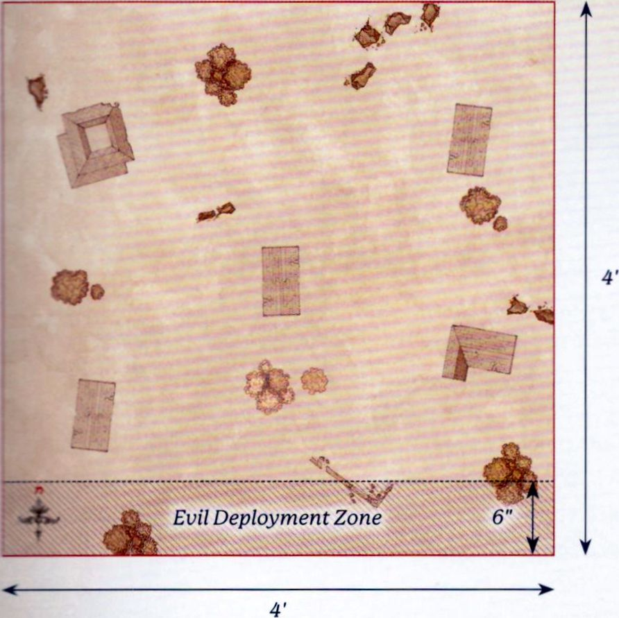{ width=892 height=891 }

---

## THE PRINCE OF ROHAN

**PARTICIPANTS**

**Good:** Théodred, Prince of Rohan with shield and Brego; 12 Riders of Rohan: 8 with throwing spears, 4 with no additional equipment.

**Evil:** Wild Man Chieftain with light shield; 25 Wild Men of Dunland: 4 with spear, 4 with two-handed weapons, 4 with light shield, 4 with light shield and Flaming Brand, 8 with bows, 1 with banner.

**LAYOUT**

The board represents a camp of the Dunlendings set up amongst the smouldering ruins of a Rohan village. Starting with the Evil player, players alternate placing a Dunlending tent anywhere on the board at least 6" from a board edge and at least 8" from another Dunlending tent, until there are seven tents on the board. The rest of the board should have a selection of burnt-out Rohan houses, fences and hedges scattered around.

**STARTING POSITIONS**

The Evil player places the Wild Man with a banner as close to the centre of the board as possible. The Evil player then deploys a single Dunland Warrior in base contact with each Dunlending tent. The Good player then chooses a board edge and places their models in base contact with it. The remaining Evil models are kept to one side to arrive later.

**OBJECTIVES**

The game lasts until one force completes their Objective. The Good player wins if they destroy at least five Dunlending tents and the Evil player has no banner remaining on the board. The Evil player wins if they have killed more than 75% of the Good force before this can happen. If Théodred is slain, the best result the Good player can achieve is a draw.

**SPECIAL RULES**

* **They came in the Night**

This Scenario takes place at night and follows the rules for Fighting at Night as described on [page 137](../rules_manual/advanced_rules.md#fighting-at-night) of the *Middle-earth Strategy Battle Game Rules Manual*. In addition, at the start of each of the Evil player's Activation Phases, they may roll 2D3 and up to that many Dunlendings not yet in play may enter the battlefield. Each of these models moves onto the battlefield from base contact with a Dunlending tent, and may Move and Charge on the turn they enter. No more than two models may be placed in base contact with a single tent each turn.

* **Scatter the Foes**

At the start of the End Phase, a Rohan model that is in base contact with a Dunlending tent may destroy it - remove the tent from the board.

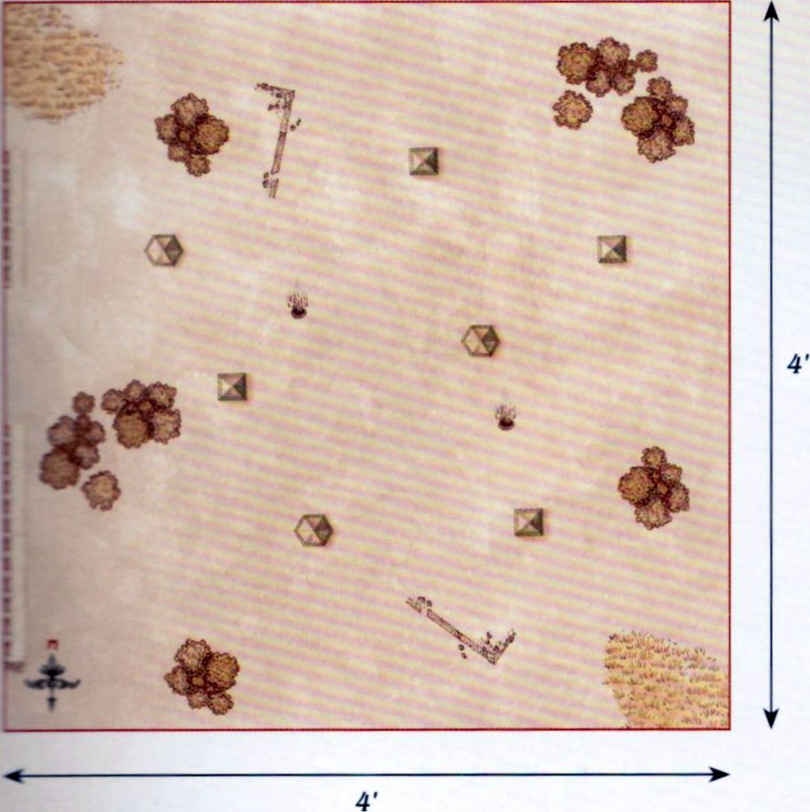{ width=887 height=890 }

---

## THE FORDS OF ISEN

**PARTICIPANTS**

**Good:** Théodred, Prince of Rohan with Brego and shield; Elfhelm, Captain of Rohan with horse; Captain of Rohan with heavy armour and shield; 12 Riders of Rohan: 8 with throwing spears, 4 with no additional equipment; 25 Warriors of Rohan: 8 with shield, 8 with throwing spears, 8 with bow and 1 with banner.

**Evil:** 2 Uruk-hai Scout Captains; Uruk-hai Drummer; Wild Man Chieftain with light shield; 25 Uruk-hai Scouts: 8 with shield, 8 with no additional equipment, 8 with Uruk-hai bow and 1 with banner; 12 Wild Men of Dunland: 4 with Flaming Brand and light shield, 4 with spear, 4 with bow; 6 Isengard Warg Riders: 2 with shield, 2 with shield and throwing spears, 2 with Orc bow.

**LAYOUT**

The board represents the Fords of Isen. There should be a river that is 6" wide flowing down the centre of the board from north to south. In the middle of the river is the ford, a 6" wide area in the centre of the board. The rest of the board is mainly bare fields with the odd bush, hedge or tree dotted around.

**STARTING POSITIONS**

The Good player deploys Théodred as close to the centre of the board as possible. The Good player then deploys 12 Warriors of Rohan on the eastern side of the river and within 6" of Théodred. The Good player then deploys the Captain of Rohan and the remaining Warriors of Rohan within 12" of the eastern board edge. Finally, the Evil player deploys their army within 18" of the western board edge. All other models are kept aside until later.

**OBJECTIVES**

The game lasts for 12 turns. The battle has a number of objectives to fight over and whichever player has achieved the most objectives by the time the game ends is declared the winner.

- **Théodred** - If Théodred is alive at the end of the game, the Good player claims this objective. If Théodred has been slain, then the Evil player claims this objective.
- **The Fords of Isen** - Whichever side has the most models on the ford at the end of the game claims this objective.
- **Elfhelm** - If Elfhelm is alive at the end of the game, the Good player claims this objective. If Elfhelm has been slain, then the Evil player claims this objective.
- **Saruman's Commanders** - If at least 3 Evil Hero models have been slain by the end of the game, the Good player claims this objective. If at least 2 Evil Hero models are alive, then the Evil player claims this objective.
- **Breakthrough** - If 12 or more Evil models are within 12" of the eastern board edge at the end of the game, the Evil player claims this objective. If less than 12 are, then the Good player claims this objective.

**SPECIAL RULES**

* **The River Isen**

The river is counted as Deep Water for all purposes, except at the ford, which is counted as Open Ground.

* **Théodred's Doom**

If Théodred is not Engaged in Combat, then when an Evil model Moves it must always charge Théodred if possible. Evil models must re-roll failed To Wound rolls against Théodred when making Strikes.

* **Elfhelm**

During the End Phase of each turn the Good player must roll a D6 and add the turn number to the result. If the total result is 8 or more, Elfhelm and the remaining Good models will arrive at the end of the Good player's next Activation Phase from the eastern board edge via the rules for Reinforcements.

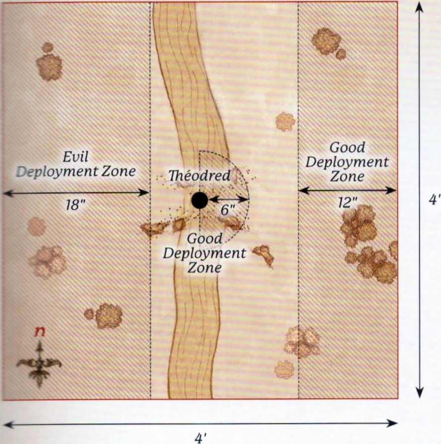{ width=888 height=893 }

---

## AMBUSH AT NIGHT

**PARTICIPANTS**

**Good:** Éomer, Marshal of the Riddermark with Firefoot; Meriadoc Brandybuck; Peregrin Took; 1 Captain of Rohan with shield and horse; 12 Riders of Rohan: 8 with throwing spears and 4 with no additional equipment.

**Evil:** Uglúk, Uruk-hai Scout Captain; Grishnákh, Orc Captain; Snaga, Orc Captain; 1 Uruk-hai Scout Captain; 12 Uruk-hai Scouts: 4 with shield, 4 with Uruk-hai bow, 4 with no additional equipment; 12 Isengard Orc Warriors: 4 with shield, 4 with spear, 2 with two-handed weapon, 2 with Orc bow.

**LAYOUT**

The board represents the plains by the edges of Fangorn Forest. The northern board edge is the boundary of the forest, and so should be lined with trees. In the centre of the board is a campfire. The rest of the board is grassland, with the odd bush or hedge dotted around.

**STARTING POSITIONS**

The Good player deploys Merry and Pippin as close to the centre of the board as possible, as shown on the map. The Evil player then deploys Grishnákh 3" away from them towards the southern board edge, and then deploys the rest of their models anywhere wholly within 6" of the centre of the board. The Good player then deploys Éomer and half of the Riders of Rohan wholly within 6" of the western board edge, and the Captain of Rohan and the remaining Riders of Rohan wholly within 6" of the eastern board edge.

**OBJECTIVES**

The game lasts until the end of a turn in which one side has been reduced to 25% of its starting numbers, and both Hobbits are no longer on the board. The Good side wins if the Evil army is reduced to 25%. The Evil side wins if the Good army is reduced to 25%. If both armies are reduced to 25% in the same turn, the game is a draw. If either Merry or Pippin are slain, the best result the Good player can achieve is a draw.

**SPECIAL RULES**

* **Surprise Attack**

Evil models may not Move during the first turn of the game. This Scenario takes place at night and follows the rules for Fighting at Night as described on [page 137](../rules_manual/advanced_rules.md#fighting-at-night) of the *Middle-earth Strategy Battle Game Rules Manual*.

* **Merry and Pippin**

Merry and Pippin begin the game Prone and bound. Whilst bound, the Hobbits may only Move by Crawling and may not Charge. Enemy models may not Charge Merry or Pippin. Merry and Pippin do not have a Control Zone and may ignore enemy Control Zones and may Move through enemy models without penalty, though they may not finish their Move overlapping an enemy model's base. Enemy models may Move through Merry and Pippin in the same way.

* **"Their bonds were cut"**

At the end of each of Merry and Pippin's Activations, they may roll a D6. On the roll of a 6+, they successfully cut their bonds and are no longer Prone or bound. If when one of the Hobbits makes this roll they are in base contact with the other Hobbit, who is not bound themselves, they receive a bonus of +1 to this roll.

* **Grishnákh**

Grishnákh follows the same rules for Movement as the Hobbits, except that he Crawls 3" and cannot cut his bonds as he is not bound. Grishnákh is the only model that can Charge the Hobbits, and he will fight them in the Fight Phase if he does so. If Grishnákh is fighting one of the Hobbits, both models will fight as normal even though they are both Prone, ignoring the rules for being Prone. Additionally, as he is wounded, Grishnákh begins the game with only a single point of Might, Will and Fate, and only has 1 Attack.

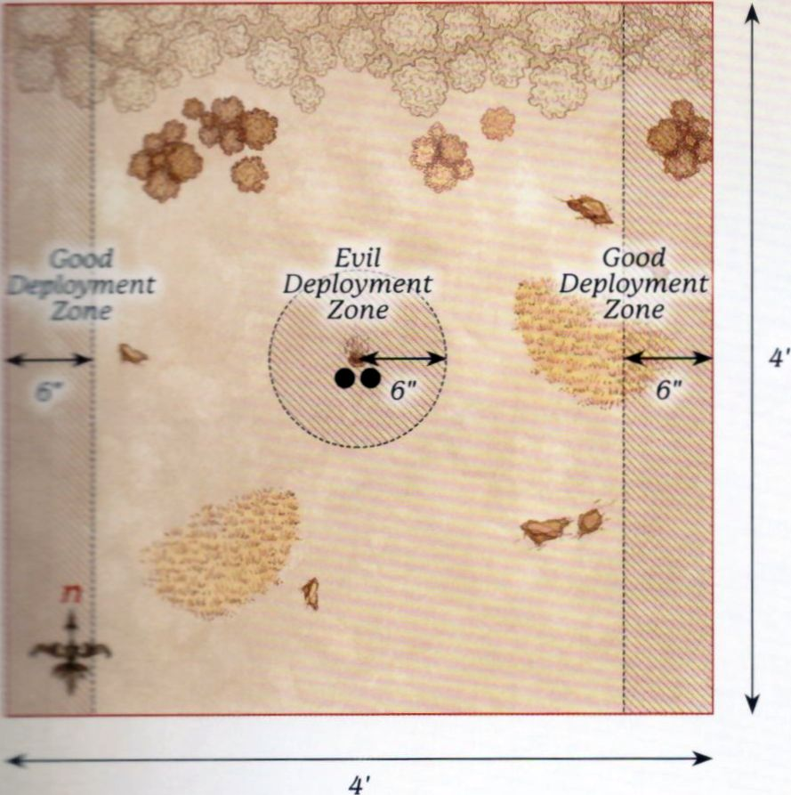{ width=889 height=893 }

---

## WARG ATTACK

**PARTICIPANTS**

**Good:** Théoden, King of Rohan with Snowmane; Aragorn (Strider) with Brego; Legolas Greenleaf with horse; Gimli, Son of Glóin; Gamling, Captain of Rohan with horse; Háma, Captain of Rohan; 6 Riders of Rohan: 4 with throwing spears; 2 with no additional equipment.

**Evil:** Sharku, Warg Rider Captain; Isengard Orc Captain with Warg; 18 Isengard Warg Riders: 6 with shield, 6 with Orc bow, 6 with throwing spears.

**LAYOUT**

The board represents the hills and plains the Rohirrim travel across on their way to Helm's Deep and, as such, should have a few hills, rocky outcrops and hedges dotted around.

**STARTING POSITIONS**

The Good player deploys Háma in the centre of the board, and then deploys Gamling within 3" of Háma in the eastern board half. The Evil player deploys the Orc Captain and two Warg Riders of their choice within 3" of Háma in the western board half. All other models are kept aside for later in the game.

**OBJECTIVES**

The game lasts for 12 turns. The Evil player wins if they can slay any three Good Hero models. The Good player wins if they can prevent this.

**SPECIAL RULES**

* **Surprise Attack**

The Evil player is considered to have Priority on the first turn of the game, and the Good player may not declare any Heroic Actions in the first turn of the game. Additionally, Evil Cavalry models gain a bonus +1 to their Fight Value on a turn in which they Charge.

* **Háma**

Háma starts the game Prone and with only a single Might Point.

* **"To battle!"**

At the end of each player's Activation Phase, they roll a D6 for each of their models not currently on the board. On a 3+, that model may enter the board. Good models enter from any point on the eastern board edge. Evil models enter from any point on the western board edge.

* **Gimli**

Gimli will start the game as a Passenger on Legolas' horse.

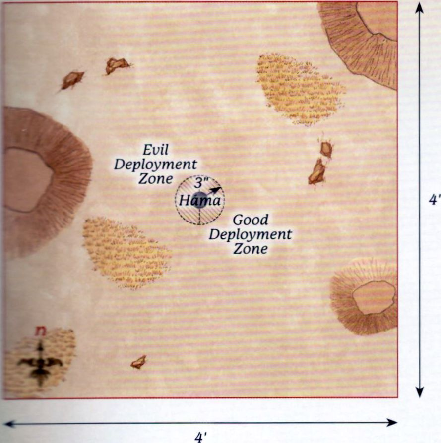{ width=889 height=894 }

---

## WALLS OF HELM'S DEEP

**PARTICIPANTS**

**Good:** Aragorn (Strider) with armour; Legolas Greenleaf with armour; Gimli, Son of Glóin; Haldir, Galadhrim Captain with heavy armour & Elf bow; 24 Galadhrim Warriors: 8 with shield and Elven spear, 8 with Elf bow, 8 with no additional equipment.

**Evil:** 4 Uruk-hai Captains; 20 Uruk-hai Warriors: 10 with shield, 10 with pike; 8 Uruk-hai Berserkers; 3 Uruk-hai Demolition Teams.

**LAYOUT**

The board represents the Deeping Wall and the land in front of it. The area within 4" of the western board edge is the Deeping Wall itself, with a culvert in the centre of the wall. A selection of Siege Ladders are placed against the wall as shown. The rest of the board is barren and plain, and so will be easy for the Uruk-hai to navigate.

**STARTING POSITIONS**

The Good player deploys their models on the Deeping Wall anywhere within 12" of its centre. The Evil player then deploys all of their models, except the Demolition Teams, anywhere on the Deeping Wall or within 3" of it but further than 1" away from any enemy model. The Demolition Teams are placed within 12" of the eastern board edge.

**OBJECTIVES**

The game lasts until one side has completed their objective. The Good player wins if they can kill 35 or more Evil models before the Deeping Wall can be breached. The Evil player wins if they can set off any Demolition Charge within 1" of the culvert.

**SPECIAL RULES**

* **Numbers Beyond Count**

Each time an Uruk-hai Warrior is slain (with the exception of the Uruk-hai Berserkers), keep it to one side. At the end of each of the Evil player's Activation Phases, any models kept aside in this manner may move onto the Deeping Wall from the Siege Ladders. Models that arrive in this way may Charge in the turn in which they arrive. Any models that cannot move onto the board in this way are kept aside until next turn.

* **Detonate the Charges**

Evil models add 1 to the result when rolling on the Detonation Table.

* **"There is always hope"**

Good Warrior models treat friendly Hero models as a banner.

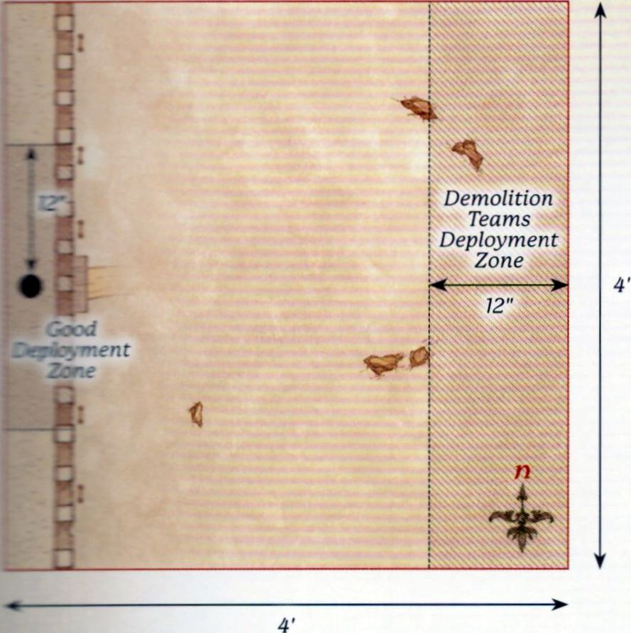{ width=889 height=891 }

---

## RIDE OUT FROM HELM'S DEEP

**PARTICIPANTS**

**Good:** Aragorn (Strider) with armour and Brego; Legolas Greenleaf with armour and horse; Théoden, King of Rohan with shield, heavy armour and Snowmane with armour; Gamling, Captain of Rohan with Royal Standard of Rohan and horse; 4 Rohan Royal Guard with horse and throwing spears.

**Evil:** 4 Uruk-hai Captains; 21 Uruk-hai Warriors: 10 with shield, 10 with pike and 1 with banner.

**LAYOUT**

The board represents the edge of the causeway and the land outside the fortress of Helm's Deep, as such the board should be relatively clear. The causeway should extend out 6" from the centre of the north-west corner of the board. The western board edge represents the walls of Helm's Deep.

**STARTING POSITIONS**

The Good player deploys all their models on the causeway. The Evil player then deploys all their models within 6" of the centre of the board.

**OBJECTIVES**

The game lasts until one player's force is wiped out, at which point the other player is the winner.

**SPECIAL RULES**

* **"Let this be the hour, when we draw swords together"**

Cavalry models gain a bonus of +1 Strength on a turn in which they Charge. In addition, once per game, at the start of any Move Phase, the Good player can declare the horn of Helm Hammerhand is being blown. Until the end of that turn, all Good Cavalry models gain the Terror special rule.

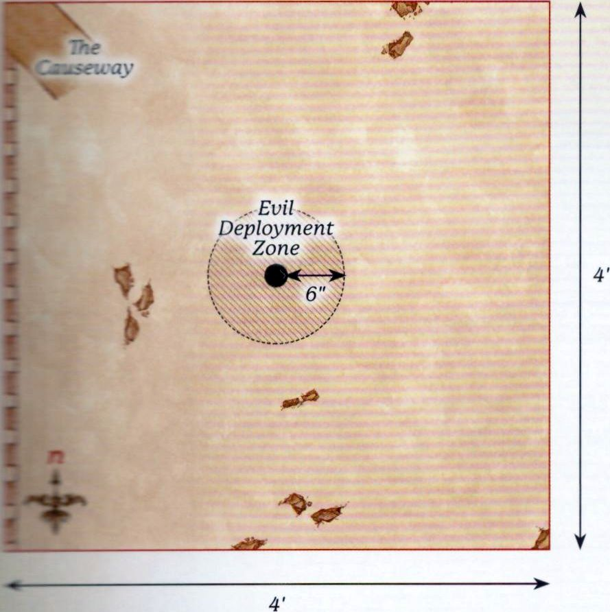{ width=889 height=892 }

---

## ÉOMER'S RETURN

**PARTICIPANTS**

**Good:** Éomer, Marshal of the Riddermark with shield and Firefoot with armour; Gandalf the White on Shadowfax; 24 Riders of Rohan: 16 with throwing spears, 8 with no additional equipment.

**Evil:** 3 Uruk-hai Captains; 30 Uruk-hai Warriors: 15 with shield, 15 with pike.

**LAYOUT**

The board represents the southern hill that forms the valley Helm's Deep resides in, as well as some of the land outside the fortress. The areas within 3" of the eastern and western board edges in the southern half of the board are impassable rock faces that create the path down to the fortress. The northern half of the board is the land outside Helm's Deep and should be relatively barren.

**STARTING POSITIONS**

The Good player deploys Éomer 3" away from the centre of the southern board edge, and then deploys the rest of their models within 3" of the southern board edge. The Evil player deploys their forces within 12" of the northern board edge.

**OBJECTIVES**

The game lasts until, at the end of a turn, one side has completed their objective. The Good player wins if they can kill at least 75% of the Evil force. The Evil player wins if they can slay both Éomer and Gandalf before this can happen. If both players complete their objective in the same turn, the game is a draw.

**SPECIAL RULES**

* **Riders of Éomer**

The special rules for the Riders of Éomer Army List (see [page 99](../good_army_list/riders_of_eomer.md) of *Armies of the Lord of the Rings*) apply to the Good Army during this scenario.

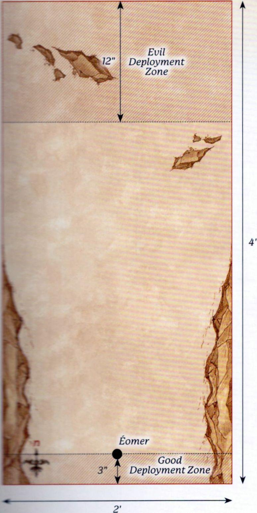{ width=774 height=1539 }

---

## SIEGE OF HELM'S DEEP

**PARTICIPANTS**

**Good:**

**Defenders of the Hornburg:** Théoden, King of Rohan with heavy armour and shield; Gamling, Captain of Rohan with Royal Standard of Rohan; 25 Warriors of Rohan: 8 with shield, 8 with shield and throwing spears, 8 with bow, 1 with banner.

**Defenders of the Deeping Wall:** Aragorn (Strider) with armour; Legolas Greenleaf with armour; Gimli, son of Glóin; Haldir, Galadhrim Captain with heavy armour and Elf bow; Haleth, Son of Háma; Aldor, Rohan Archer; 25 Warriors of Rohan: 8 with shield, 8 with shield and throwing spears, 8 with bow, 1 with banner; 1 with War Horn, shield and throwing spears; 25 Galadhrim Warriors: 8 with shield, 8 with shield and Elven spear, 8 with Elf bow, 1 with banner.

**Relief Force:** Éomer, Marshal of the Riddermark on Firefoot with armour; Gandalf the White on Shadowfax; 1 Captain of Rohan with shield on horse; 24 Riders of Rohan: 8 with throwing spears, 16 with no additional equipment.

**Evil:**

**Legions of Isengard:** 5 Uruk-hai Captains; 1 Isengard Assault Ballista; 5 Uruk-hai Demolition Teams; 83 Uruk-hai Warriors: 35 with shield, 35 with pike, 10 with crossbow, 3 with banner; 16 Uruk-hai Berserkers; 10 Siege Ladders.

**LAYOUT**

The board represents the fortress of Helm's Deep and the lands outside it. The Hornburg is situated in the 2'x2' area at the north-west corner of the board, with the causeway extending out onto the battlefield from it. The Deeping Wall runs from the Hornburg to the centre of the southern board edge, and should be around 24" away from the western board edge at all times (see map). In the centre of the Deeping Wall is a culvert, and the area of the Deeping Wall within 6" of the culvert should be removable. The rest of the board should be clear to allow plenty of space for the Uruk-hai to make their way to the fortress walls.

**STARTING POSITIONS**

The Good player deploys the Defenders of the Deeping Wall anywhere on the Deeping Wall. They then deploy the Defenders of the Hornburg anywhere wholly within the Hornburg. The Relief Force is kept aside for later. The Evil player then deploys the Legions of Isengard anywhere wholly within 12" of the eastern board edge.

**OBJECTIVES**

The Siege of Helm's Deep is a huge battle fought across the entire fortress; as such, this scenario has seven objectives for both sides to fight over. As this scenario will take a long time, we suggest you gather your friends and decide amongst yourselves how long to play for (we recommend at least five hours - possibly the whole weekend!) and whichever team has achieved the most objectives by the time the game ends is declared the winner!

1. **Théoden** - If Théoden is alive at the end of the game, Good claims this objective. If Théoden has been slain, then Evil claims this objective.
2. **The Deeping Wall** - If the Deeping Wall is not destroyed at the end of the game, Good claims this objective. If the Deeping Wall is destroyed, Evil claims this objective.
3. **The Hornburg** - Whichever side has the most models wholly within the Hornburg at the end of the game claims this objective.
4. **The Causeway** - Whichever side has the most models wholly on the Causeway at the end of the game claims this objective.
5. **The Heroes of Helm's Deep** - There are eight Good Hero models within Helm's Deep: Aragorn, Legolas, Gimli, Théoden, Gamling, Haldir, Haleth and Aldor. If more of these models are alive than dead at the end of the game, Good claims this objective. If more of these models are dead than alive at the end of the game, Evil claims this objective.
6. **Éomer** - If Éomer is alive at the end of the game, Good claims this objective. If Éomer has been slain, then Evil claims this objective.
7. **Uruk-hai Commanders** - If at least 3 of the Uruk-hai Captains have been slain, Good claims this objective. If at least 3 Uruk-hai Captains are alive at the end of the game, Evil claims this objective.

**SPECIAL RULES**

* **Ride Out**

At the start of the eighth turn, and any turn that follows, any Good Hero within 6" of the gates of the Hornburg that could be mounted on a horse (or a named horse if relevant) may immediately gain a Mount.

* **The Deeping Wall**

If a Demolition Charge is successfully detonated whilst within 3" of the culvert of Helm's Deep, the removable section of the Deeping Wall is removed from play. Any model on that part of the wall immediately suffers a Strength 9 hit and will suffer falling damage as described in the *Middle-earth Strategy Battle Game Rules Manual*.

* **"Look to my coming"**

At the end of the Good side's tenth Activation Phase, the Relief Force will enter the board from the southern board edge on the eastern half of the board. When they enter they will follow the rules for Reinforcements, with the exception that they may Charge on the turn in which they arrive.

* **A Great Siege**

This scenario follows all of the rules for Sieges, including siege equipment, as found in the *Middle-earth Strategy Battle Game Rules Manual*.

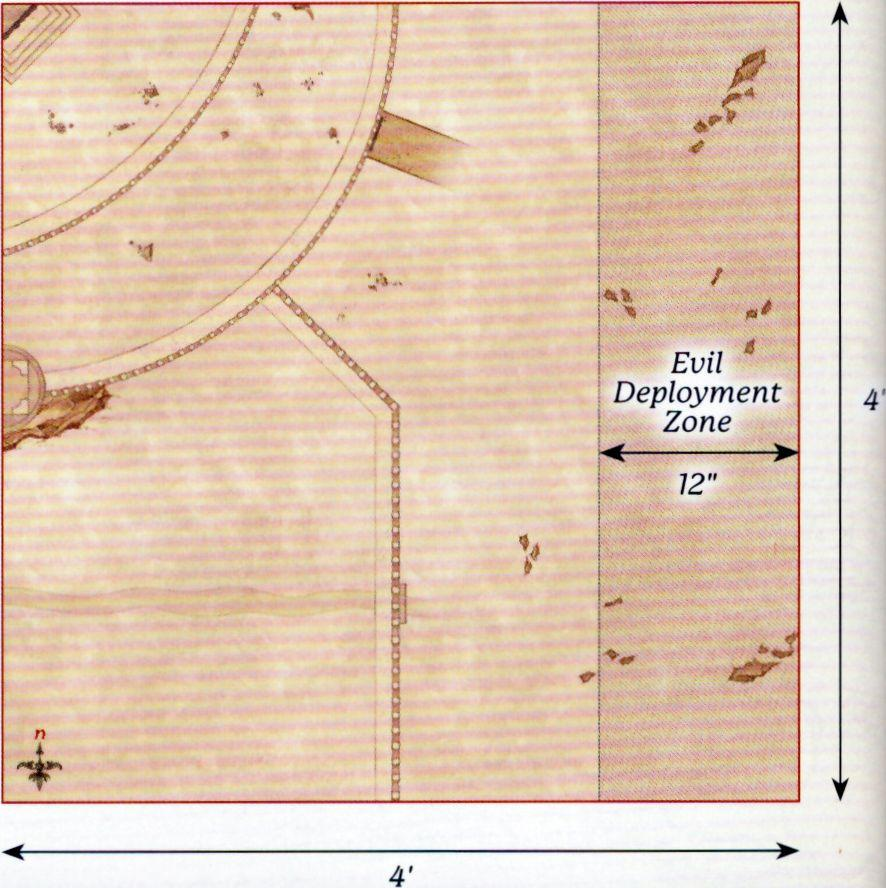{ width=886 height=888 }

---

## PATHS OF THE DRÚADAN

**PARTICIPANTS**

**Good:** Théoden, King of Rohan with shield, heavy armour and Snowmane with armour; Éomer, Marshal of the Riddermark with shield, throwing spears and Firefoot with armour; Éowyn, Shieldmaiden of Rohan with horse, shield, armour, throwing spears and Merry; Gamling, Captain of Rohan with horse and Royal Standard of Rohan; 12 Riders of Rohan: 8 with throwing spears, 4 with no additional equipment; Ghân-buri-Ghân; 12 Woses Warriors.

**Evil:** 3 Morannon Orc Captains with shield; 36 Morannon Orc Warriors: 18 with shield, 18 with spear & shield.

**LAYOUT**

This board represents the Drúadan Forest and should be covered with trees and various other wooded areas.

**STARTING POSITIONS**

The Evil player deploys their force anywhere between 12" and 24" of the southern board edge. The Good player then deploys all their models anywhere within 12" of the northern board edge.

**OBJECTIVES**

The Good player wins if at least half of the Rohan models exit the board via the southern board edge. The Evil player wins if they can prevent this from happening. If at least half of the Rohan models exit the board, but Théoden has been slain, the game is a draw.

**SPECIAL RULES**

* **Wild Men Know all Paths**

All Rohan models gain the Woodland Creature special rule so long as they are mounted; each model's Mount also gains the special rule.

* **Ambush!**

Evil models may not move on the first turn of the game.

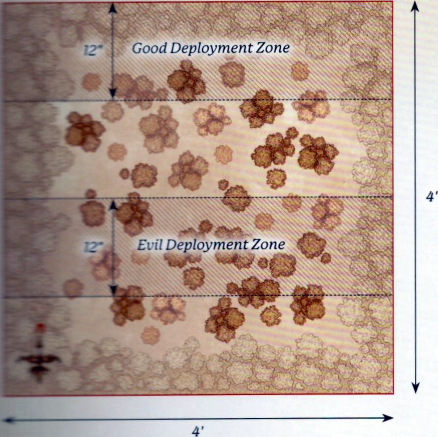{ width=890 height=888 }

---

## RIDE OF THE ROHIRRIM

**PARTICIPANTS**

**Good:** Théoden, King of Rohan with shield, heavy armour and Snowmane with armour; Éomer, Marshal of the Riddermark with shield, throwing spears and Firefoot with armour; Déorwine, Chief of the King's Knights with horse; Gamling, Captain of Rohan with horse and Royal Standard of Rohan; Éowyn, Shieldmaiden of Rohan with Merry, armour, shield, throwing spears and horse; Elfhelm, Captain of Rohan with horse; 6 Rohan Royal Guard with horse and throwing spears; 36 Riders of Rohan: 24 with throwing spears, 12 with no additional equipment.

**Evil:**

**Army Of Gothmog:** Gothmog, Lieutenant of Sauron; Gothmog's Enforcer; 2 Morannon Orc Captains with shield; 48 Morannon Orc Warriors: 24 with shield, 24 with spear and shield.

**Haradrim:** Mûmak War Leader with 12 Haradrim Warriors in the Howdah: 6 with bow, 6 with spear; 2 War Mûmakil of Harad, each with 12 Haradrim Warriors in the Howdah: 6 with bow, 6 with spear.

**LAYOUT**

The board represents the fields of Pelennor, the barren ground upon which the battles outside the gates of Minas Tirith will be fought. The board should contain little else aside from a few small areas of rocks and scrubland.

**STARTING POSITIONS**

The Evil player deploys the Army of Gothmog between 18" and 24" from the northern board edge. The Good player then deploys the Rohirrim within 12" of the northern board edge. The Mûmakil are kept aside for later in the game.

**OBJECTIVES**

The battle lasts for 10 turns. The battle has a number of objectives to fight over and whichever player has achieved the most objectives by the time the game ends is declared the winner. If both players have achieved the same number of objectives, the game ends in a draw.

- **The Armies of Mordor** - If the Army of Gothmog is Broken at the end of the game, Good claims this objective. If the Army of Gothmog is not Broken, then Evil claims this objective.
- **The Heroes of Rohan** - There are seven Good Hero models charging upon the Pelennor: Théoden, Éomer, Gamling, Éowyn, Merry, Déorwine and Elfhelm. If four or more of these models are alive at the end of the game, Good claims this objective. If four or more of these models have been slain at the end of the game, Evil claims this objective.
- **Gothmog** - If Gothmog has been slain by the end of the game, Good claims this objective. If Gothmog is alive at the end of the game, Evil claims this objective.
- **Mûmakil** - Three Mûmakil are active on this section of the Pelennor. If the Mûmak War Leader and at least one other Mûmak have been slain by the end of the game, Good claims this objective. If not, Evil claims this objective.
- ***"Make safe the city"*** - At the start of a turn, if ten or more Good models are within 10" of the southern board edge, Good claims this objective. If Good has not claimed this objective by the end of the game, Evil claims this objective.

**SPECIAL RULES**

* **Mûmakil**

At the start of the Evil player's Activation Phase on the third turn, the Mûmakil enter the battlefield from any point on the eastern board edge via the rules for Reinforcements.

* **"Drive them to the river"**

Evil Armies can become Broken in this scenario, even though an Army does not normally become Broken in Narrative Play Scenarios. In addition, the Army of Gothmog and the Haradrim count as separate Armies; they each have their own Break Point, calculated using only the models within the respective Armies, and one can be Broken while the other is not.

* **"Arise! Arise Riders of Théoden"**

So long as Théoden is on the board, a single Rohan Cavalry model may declare a Heroic Combat each turn for free. This may be either a Hero or a Warrior.

* **"A sword-day, a red day"**

Good models automatically pass Courage tests. Whenever an Evil Unique Hero model is slain, the Good player chooses up to two Rohan Hero models - these models regain a Might Point.

* **"Ride for ruin and the world's ending"**

So long as Théoden is on the board, friendly Rohan Cavalry models gain a bonus +1 to their Fight Values and +1 to their Strength on a turn in which they Charge.

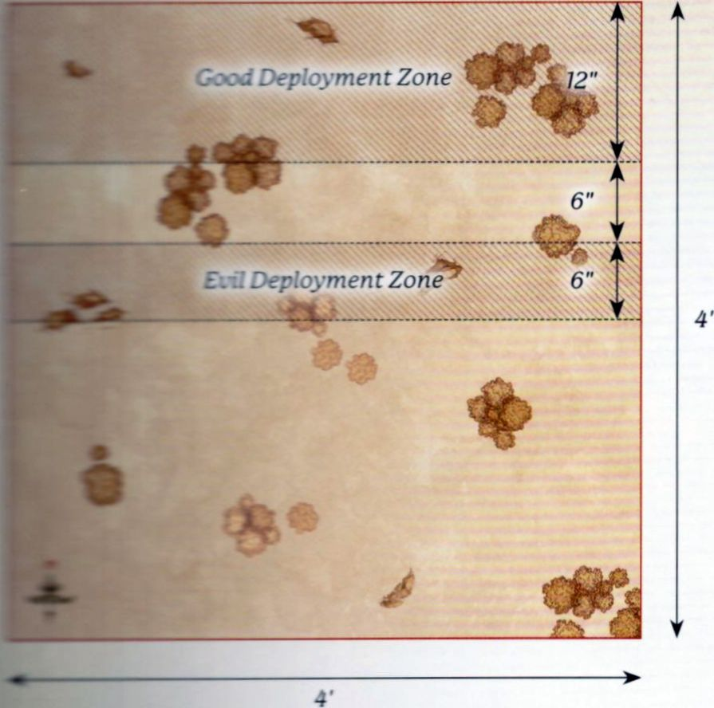{ width=895 height=888 }
