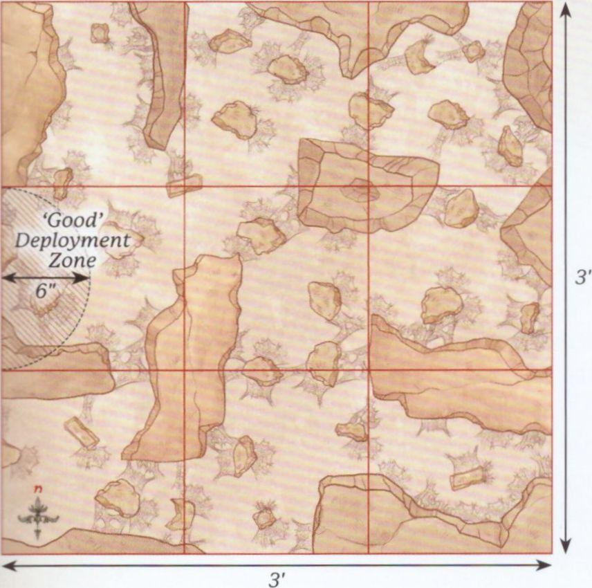
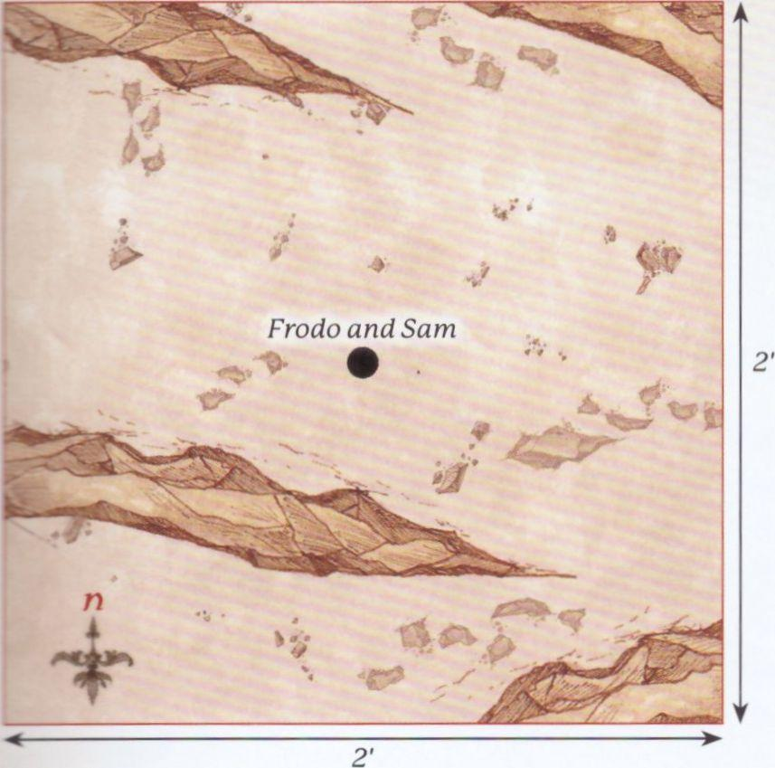
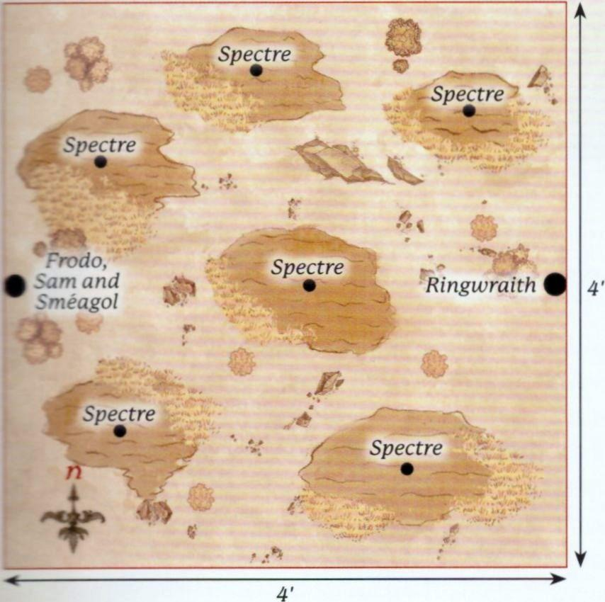
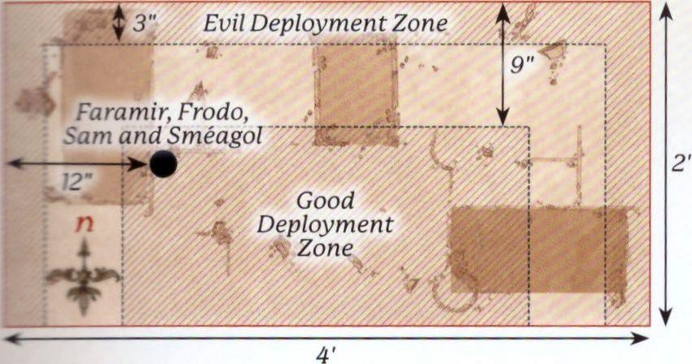
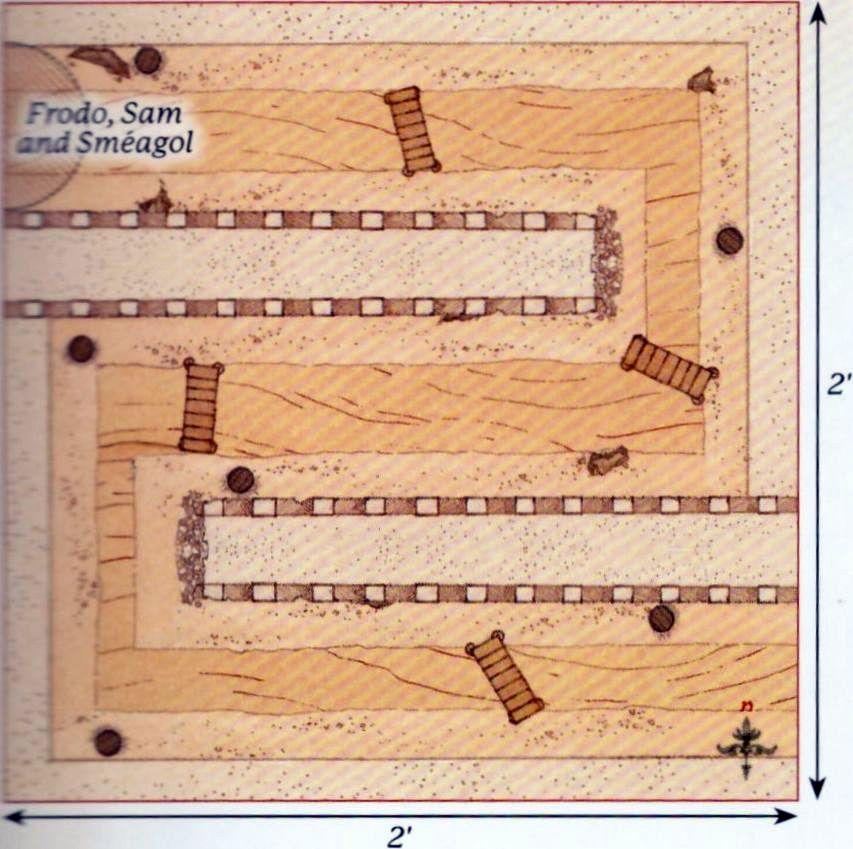
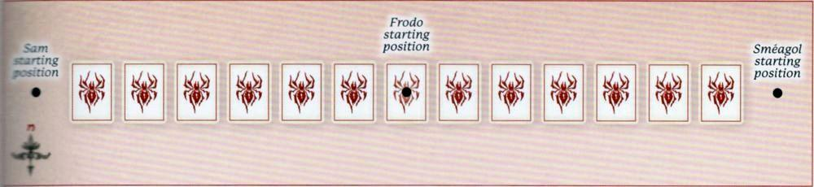
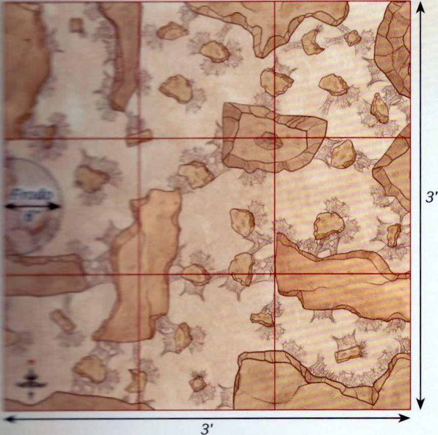
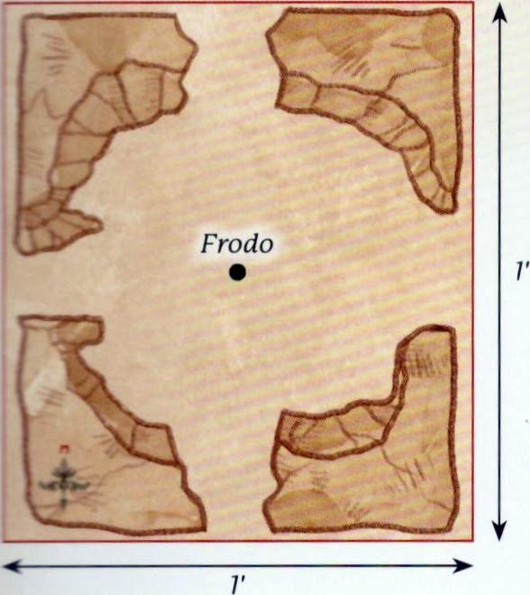
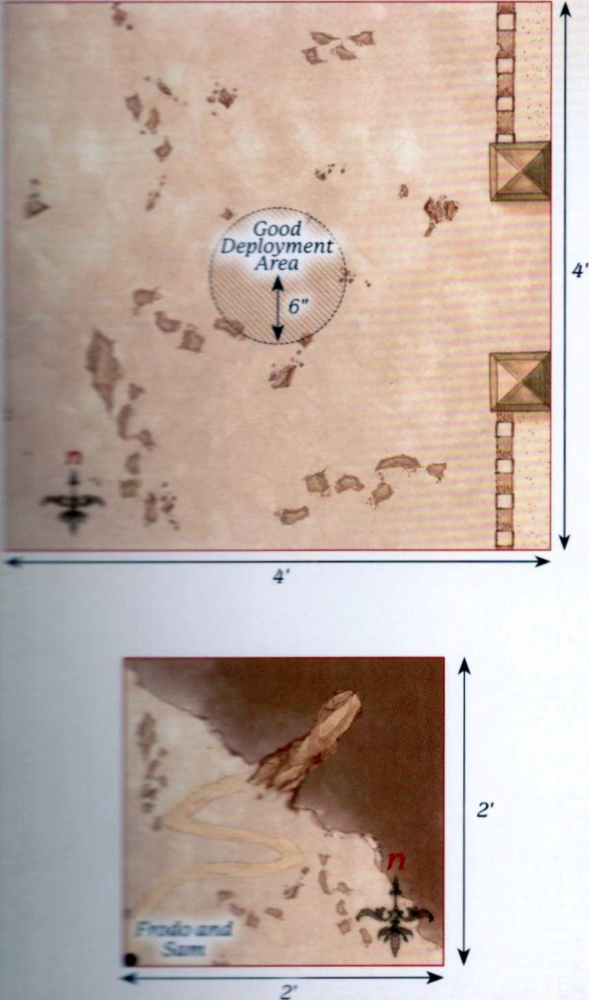

## THE PATHS OF CIRITH UNGOL

**PARTICIPANTS**

**Good:** 1 Mordor Orc Captain; 12 Mordor Orc Warriors: 4 with shield, 4 with spear, 2 with two-handed weapon, 2 with Orc bow.

**Evil:** Shelob.

**LAYOUT**

This Scenario takes place in Shelob's Lair, which is a 3'x3' board made up of a series of 1'x1' tiles. Each tile will have a variety of pathways throughout, and must have an exit in the centre of the edge of each tile; though one tile may have a dead end. All pathways and exits must be at least 80mm wide, though we would recommend not too much larger than this. There must be at least two exits on the eastern board edge.

It is important for the Scenario that the Good player does not see how everything is set up - the game is much more fun when the Good player has to navigate an unknown winding lair with an unseen terror hunting them! When setting up the board, the Evil player arranges the tiles into a 3x3 grid. The Evil player then places 6 Web Markers anywhere within Shelob's Lair, though Web Markers cannot be placed within the centre tile of the western row of tiles. The Evil player then deploys Shelob anywhere wholly within the eastern row of tiles. Once all of this is done, the Evil player covers the tiles so that the Good player cannot see what is within them, with the exception of the centre tile of the western row - this is the tile where the Good player will start.

**STARTING POSITIONS**

The Good player deploys their models wholly within 6" of the centre of the western board edge. The Evil player has already deployed Shelob during set-up, so they don't need to do anything.

**OBJECTIVES**

The game lasts until there are no Good models left on the board. The Good player wins if at least 33% of their models (5 models) can escape the board via the eastern board edge. The Evil player wins if they can prevent this from happening.

**SPECIAL RULES**

* **Navigating the Lair**

At the start of the game only the tile the Good player's models start in is revealed. During the Good player's Activation Phase, if one of their models Moves through an exit into an unrevealed tile, their Activation is immediately paused and the Evil player reveals the tile. Once the tile has been revealed, the model's Activation resumes, though they cannot Charge that turn if they would now be able to. Good models cannot draw Line of Sight into an unrevealed tile.

* **A Nameless Terror**

At the start of the Evil player's Activation Phase, if Shelob is in a tile that has not been revealed, then the Good player must look away. The Evil player will then Activate Shelob as normal, replacing whatever is covering the unrevealed tiles afterwards, so as not to reveal where Shelob might be to the Good player.

* **The Webs**

At the start of the game, the Evil player will have placed 6 Web Markers on the board. These are each on a 40mm base but block an entire pathway. Web Markers cannot be moved through by Good models and have a Defence of 6 and 2 Wounds, can be targeted by shooting attacks and can be Charged. A model fighting a Web Marker will automatically win the Duel Roll, though a Web Marker will never count as Trapped and never Backs Away. If a model that has Charged a Web Marker is subsequently Charged by Shelob, then they are always Engaged in Combat with Shelob and will not fight the Web Marker. Additionally, Shelob never needs Line of Sight to Charge a model within 3" of a Web Marker, and may Move through Web Markers without penalty, though may not end her Activation overlapping them.

* **Secret Tunnels**

If at the beginning of her Activation Shelob is in a tile that contains no enemy models, and no enemy models can draw Line of Sight to her, then the Evil player can remove her from the battlefield and place her in base contact with a Web Marker, or anywhere on a revealed tile that an enemy model cannot draw Line of Sight to. She may then Activate as normal.

> **Designer's Note:** *Over the years, many warbands have attempted to take the pass of Cirith Ungol, only to be caught in Shelob's clutches. As an alternative, why not have the Good player put together 120 points from a chosen Army List to try to make it through Shelob's Lair? When making your force, you may ignore any Army building rules that require specific Hero models to be taken. Essentially, you choose an Army List and put together 120 points into legal Warbands - i.e., it must still have a Hero to lead each Warband.*

{ width=856 height=850 }

---

## THE TAMING OF SMÉAGOL

**PARTICIPANTS**

**Good:** Frodo Baggins with Sting, Mithril Coat and Elven cloak; Samwise Gamgee with Elven cloak.

**Evil:** Sméagol.

**LAYOUT**

The board represents the rocky terrain of Emyn Muil, and so should be covered with rocky outcrops, some large and some small.

**STARTING POSITIONS**

The Good player deploys Frodo and Sam in the centre of the board. The Evil player then deploys Sméagol (though he is very much Gollum at this point) anywhere touching the eastern board edge.

**OBJECTIVES**

Gollum has tracked the Hobbits since Moria, and now has the opportunity to strike and steal the Ring. If they become aware of Gollum, the Hobbits will try to subdue him.

The Good player wins if Gollum is subdued. The Evil player wins if Gollum kills Frodo and reclaims the Ring. If Gollum is subdued but Sam has been slain, the game is a draw.

**SPECIAL RULES**

* **Sleeping Hobbits**

The Hobbits start the game Prone and may not Activate until they are disturbed. As Gollum approaches there is a chance he will wake the Hobbits. Roll a D6 before Gollum moves. If the number rolled is higher than the distance between him and the Hobbits, or a 6 is rolled, then he has disturbed them and the Hobbits immediately stand up and act normally from this point onwards. If Gollum attacks a sleeping Hobbit, then the Hobbits have been woken and may act normally from this point onwards.

* **Subduing Gollum**

If Gollum suffers his last Wound then he is subdued rather than slain. However, Gollum cares not for the wellbeing of the Hobbits and will try to kill them as normal.

* **Sting**

Each time Gollum loses a Combat against Frodo he must make a Courage Test. If the test is failed then Gollum surrenders to the Hobbits and is automatically subdued.

{ width=857 height=849 }

---

## THE DEAD MARSHES

**PARTICIPANTS**

**Good:** Frodo Baggins with Sting, Mithril Coat and Elven cloak; Samwise Gamgee with Elven cloak; Sméagol.

**Evil:** 1 Ringwraith (1 Attack, 0 Might, 7 Will, 0 Fate) with Fell Beast; 6 Spectres.

**LAYOUT**

The board represents the Dead Marshes. There should be six areas of marshland around the board, one of which is in the centre. The rest of the board should have a selection of bushes, hedges and rocky outcrops dotted around.

**STARTING POSITIONS**

The Good player deploys Frodo, Sam and Sméagol touching the centre of the western board edge. The Evil player deploys one Spectre in the centre of each piece of marshland, and then deploys the Ringwraith touching the centre of the eastern board edge.

**OBJECTIVES**

With the Ringwraith overhead, Frodo and his companions must cross the Dead Marshes without being noticed if they wish to keep the Ring away from the Nazgûl.

The Good player wins if Frodo can escape the board via the eastern board edge. The Evil player wins if Frodo is slain.

**SPECIAL RULES**

* **Hunt the Ringbearer**

All Evil models start the game as Sentries. However, if a model would normally spot a Good model, they will not raise the alarm. Instead, only that model will have been alerted to their presence and may act normally, the others will remain as Sentries.

* **"Don't Follow the Lights"**

If a Good model is Moved into any of the areas of marshland as a result of a Spectre's 'A fell light is in them' special rule, they must roll a D6. On a 1 or 2 the model succumbs to the power of the Spectres and falls into the marsh; they are now Prone. A model that has succumbed to the Spectres cannot act in any way, and if they haven't been rescued and are in the marsh during the End Phase of the following turn then they are removed as a casualty. A friendly model can rescue a model that has succumbed by ending their Move in base contact with them; the rescued model may then act as normal.

* **Call of the Ring**

If Frodo puts the Ring on then the Ringwraith will no longer be a Sentry and will act as normal.

{ width=854 height=850 }

---

## OSGILIATH

**PARTICIPANTS**

**Good:** Faramir, Captain of Gondor; Madril, Captain of Ithilien; Damrod, Ranger of Ithilien; Frodo Baggins with Sting, Mithril Coat and Elven cloak; Samwise Gamgee with Elven cloak; Sméagol; 13 Warriors of Minas Tirith: 4 with shield, 4 with shield and spear, 4 with bow, 1 with banner; 12 Rangers of Gondor: 4 with spear, 8 with no additional wargear; 6 Osgiliath Veterans: 2 with shield, 2 with spear, 2 with bow.

**Evil:** 3 Mordor Orc Captains; 1 Ringwraith (2 Attacks, 1 Might, 10 Will, 1 Fate) with Fell Beast; 37 Mordor Orc Warriors: 12 with shield, 12 with spear, 6 with Orc bow, 6 with two-handed weapon, 1 with banner.

**LAYOUT**

The board represents the ruined city of Osgiliath. There should be three ruined buildings spread evenly across the board. The rest of the board should be littered with other smaller ruins, piles of rubble and rocks.

**STARTING POSITIONS**

The Good player deploys Faramir, Frodo, Sam and Sméagol 12" from the centre of the western board edge. The Good player then deploys the rest of their models anywhere on the board at least 9" away from the northern, eastern or western board edges. The Evil player then deploys the Orcs anywhere wholly within 3" of the northern, eastern or western board edges. The Ringwraith is kept aside for later in the game.

**OBJECTIVES**

Frodo must escape Osgiliath or the Ring may well be captured. The Orcs do not know of the presence of the Ringbearer and are more concerned with capturing the city. The game lasts until Frodo is no longer on the board. The Good player wins if Frodo can escape the board via the eastern board edge. The Evil player wins if they control more of the ruined buildings than the Good side at the end of the game. If both players achieve their objective, the game is a draw; however, if Frodo is slain, the Evil side automatically wins.

**SPECIAL RULES**

* **Capturing Buildings**

A building is considered to be controlled by a player if they have more models wholly within the building than their opponent. Control of a building can swap multiple times over the course of the battle.

* **"Nazgûl!"**

The Ringwraith will automatically arrive at the end of the Evil player's third Activation Phase from the western board edge via the rules for Reinforcements. Once per game, during the Priority Phase, the Nazgûl can let out a terrifying shriek, which will worsen all Good models' Courage Values by 3 until the end of the turn. Additionally, with Frodo beginning to fall more under the influence of the Ring he cannot risk putting it on. If Frodo puts on the Ring, he is removed as a casualty.

* **Reinforcements**

Each time a Warrior model is removed as a casualty, roll a D6. On a 1-3 that model takes no further part in the game. On a 4+, that model may re-enter the board at the end of its side's next Activation Phase via the rules for Reinforcements. Good models enter from the southern board edge. Evil models may enter from the northern, eastern or western board edges.

* **Poor Sméagol**

Sméagol is under the control of the Good player, however Good models may not benefit from any Heroic Action that Sméagol declares.

{ width=850 height=448 }

---

## ESCAPE THROUGH THE SEWERS

**PARTICIPANTS**

**Good:** Frodo Baggins with Sting, Mithril Coat and Elven cloak; Samwise Gamgee with Elven cloak; Sméagol.

**Evil:** 1 Mordor Orc Captain; 12 Mordor Orc Warriors: 4 with shield, 4 with spear, 2 with two-handed weapon, 2 with Orc bow.

**LAYOUT**

The board represents the winding sewers beneath Osgiliath leading out of the city. The board should be made up of a number of walkways, forming a single winding path leading from the north-western corner of the board to the south-eastern corner. The walkways should be bordered by walls and have a selection of crates, rubble and other scatter terrain on them, providing plenty of cover. There should be a waterway running through the walkways with a platform for models to walk on at either side of the water.

**STARTING POSITIONS**

The Good player deploys Frodo, Sam and Sméagol within 3" of the north-western corner of the board. The Evil player does not deploy their models. Instead, they deploy six 25mm Markers. These Markers cannot be in Line of Sight of Frodo, Sam or Sméagol, and cannot be within 6" of each other.

**OBJECTIVES**

Frodo and his companions need to find their way through the sewers in order to escape the battle raging in Osgiliath above, though they will have to avoid the patrolling Orcs to do so.

The game lasts until there are no Good models left on the board. The Good player wins if Frodo and at least one other Good model escape via the south-eastern corner of the board. The Evil player wins if Frodo is slain. Any other result is a draw.

**SPECIAL RULES**

* **Too Great a Risk**

Frodo may not put the Ring on in this Scenario.

* **Patrolling Orcs**

At the start of each Move Phase, before the Declare Heroic Actions Step, roll a D6 for each Marker still on the board. On a 1-3, the Evil player may Move that Marker up to 6". On a 4+, the Good player may Move that Marker up to 6". If at any point a Good model can draw Line of Sight to a Marker, they will reveal the patrolling Orcs. When a Marker is revealed, the Evil player rolls a D6 and consults the table below. If they roll a result they have rolled earlier in the game, they must re-roll:

| D6 | Result |
| --- | --- |
| 1 | Place 2 Mordor Orc Warriors in base contact with the Marker: 1 with shield and 1 with Orc bow. |
| 2 | Place 2 Mordor Orc Warriors in base contact with the Marker: 1 with spear and 1 with two-handed weapon. |
| 3 | Place 2 Mordor Orc Warriors in base contact with the Marker: 1 with shield and 1 with spear. |
| 4 | Place 3 Mordor Orc Warriors in base contact with the Marker: 1 with shield, 1 with two-handed weapon and 1 with Orc bow. |
| 5 | Place 3 Mordor Orc Warriors in base contact with the Marker: 1 with shield and 2 with spear. |
| 6 | Place the Mordor Orc Captain in base contact with the Marker. |

Evil models placed are not immediately under the control of the Evil player; instead they act as Sentries. However, if the alarm is raised, only the Orcs already revealed will be alerted. Any Markers not yet revealed will still act as described above; however, once they are revealed the Orcs will act as normal as the alarm has been raised.

* **Sewer Waters**

The sewer waters are treated as Shallow Water; Markers may Move through them though are never slowed. Additionally, any model that begins its Activation within the waters must roll a D6. On the roll of a 1, their Activation immediately ends.

> **Designer's Note:** *This Scenario will need plenty of columns and debris for the Hobbits to hide behind and avoid the Markers and Orcs acting as Sentries. We would recommend trying to get your board to look as close to the map as possible.*

{ width=853 height=849 }

---

## SMÉAGOL'S TREACHERY

**PARTICIPANTS**

**Good:** Samwise Gamgee.

**Evil:** Sméagol.

**SET-UP**

For this mini-game you will need a pack of ordinary playing cards. Separate the hearts out from the rest of the deck and shuffle them, then lay them out face-down in a single line as shown - this is the Path.

Next, shuffle the remaining three suits together to form the playing deck, and then deal a hand of five cards to each player.

**STARTING POSITIONS**

Sam starts the game to the left of the westernmost card, whilst Sméagol starts the game to the right of the easternmost card as shown. Additionally, a Frodo miniature is placed on the central card - reaching Frodo is the goal of both players.

**OBJECTIVES**

Both Sam and Sméagol are trying to convince Frodo to believe them and be rid of the other. Whichever of them reaches Frodo first is the winner.

**GAME TURN**

To decide who goes first both players roll off, re-rolling any ties, with whoever scored the highest going first. Players then alternate turns until there is a winner.

On a player's turn they may do one of three things:

- Attempt to Move
- Discard Hand
- Draw New Hand

**ATTEMPT TO MOVE**

When a player attempts to move their character, they will play a card from their hand face-up. The opposing player secretly looks at the next card in the Path for the moving character. If the played card is of equal to or higher value than the face-down card, flip the face-down card, then move the character onto it. They may then attempt to move their character again. Otherwise, the card remains face-down, the character does not move, and the player's turn immediately ends. It is important to be completely honest when playing this game, for the benefit of both players.

**DISCARD HAND**

If a player wishes, they can discard all of the cards in their hand and then draw a fresh hand of five cards from the playing deck. Their turn then ends.

**DRAW NEW HAND**

If a player has no cards in their hand, they may then draw a new hand of five cards. Their turn then ends.

> **Designer's Note:** *It is important to remember that, as the cards each player is moving along is a single suit, there will only be one of each card on that path. So, if you have seen the King on your opponent's side of the Path, then you know that there won't be one on your side. Also, you will often know what is on your opponent's side of the Path, whilst they will often know what is on your side.*

{ width=1000 height=230 }

---

## SHELOB'S LAIR

**PARTICIPANTS**

**Good:** Frodo Baggins with Sting, Mithril Coat and Elven cloak.

**Evil:** Shelob; Sméagol.

**LAYOUT**

The board is set up in the same manner as outlined on page 7, with the exception that only 4 Web Markers are deployed instead of 6.

**STARTING POSITIONS**

The Good player deploys Frodo wholly within 6" of the centre of the western board edge. The Evil player then deploys Sméagol touching any of the exits in the starting tile, with the exception of the one in the centre of the western board edge. The Evil player has already deployed Shelob during set-up.

**OBJECTIVES**

The game lasts until Frodo is no longer on the board. The Good player wins if Frodo can escape the board via the eastern board edge. The Evil player wins if Frodo is slain. If Sméagol is slain, then the best result the Evil player can achieve is a draw.

**SPECIAL RULES**

Navigating the Lair *(page 7)*, A Nameless Terror *(page 7)*, The Webs *(page 7)*

* **"Not here, not so close to the Eye!"**

Frodo may not put the Ring on in this Scenario.

* **Gollum's Cunning**

Sméagol may never Charge Frodo in this Scenario. Additionally, Sméagol may Move through unrevealed tiles in the same manner as Shelob, as described on page 7.

* **"Hurry! This Way"**

Frodo may not Charge Sméagol in this Scenario. At the beginning of each of his Activations, Frodo must take an Intelligence Test if he cannot draw Line of Sight to Shelob. If the test is failed, then the Evil player may Move Frodo during his Activation, though he must finish his Activation closer to Sméagol than when he started. If Sméagol is in an unrevealed tile, then the Good player must look away when the Evil player Moves Frodo so as not to see where anything in an unrevealed tile is. If Shelob is slain, ignore this special rule.

* **Unawares**

Shelob may not Activate at the start of the game. If a model Moves within 1" of a Web Marker, Shelob becomes aware of their presence. From that point onwards, Shelob may Activate as per the A Nameless Terror special rule and must Move as quickly as possible to the Web Marker's location; if she Moves into base contact with it, it is removed. When Shelob reaches the location, she cannot Activate again until a model Moves within 1" of another Web Marker. If at any point after Shelob has been first Activated she can draw Line of Sight to either Frodo or Sméagol at the start of a turn, then she must Move as close as possible to the nearest one. If they are not in Line of Sight when she Activates, but were at the start of the turn, then she must Move as close as possible to where she could last see them.

* **Shelob's Hunger**

In this Scenario, Shelob treats Sméagol as an enemy model. When Shelob Activates, if she can Charge an enemy model then she must do so via the shortest route, and enemy models cannot benefit from the Stalk Unseen special rule. If when she Activates she could Charge either Frodo or Sméagol, then she must Charge the one that is nearest via the shortest route. If both Frodo and Sméagol are the same distance away, roll a D6. On a 1-3 she Charges Sméagol, and on a 4+ she Charges Frodo. Additionally, Shelob may not make Strikes against a non-Paralysed model; she may only use her Caught in a Web Brutal Power Attack.

* **Elven Gifts**

Frodo carries the Light of Eärendil and so causes Terror. Additionally, Sting is vital in this Scenario. When making Strikes against Shelob, Frodo may make 2 Strikes rather than one, and gains a bonus of +1 To Wound. When making Strikes against Web Markers with Sting, any roll of a 4+ To Wound will automatically destroy the web and cause the Web Marker to be removed. Additionally, Shelob may not use Will Points in this Scenario. If Shelob is removed as a casualty and Sméagol is still alive, then Sméagol is allowed to Charge Frodo for the remainder of the Scenario.

{ width=856 height=850 }

---

## THE BRAVERY OF MASTER SAMWISE

**PARTICIPANTS**

**Good:** Samwise Gamgee with Elven cloak.

**Evil:** Shelob.

**LAYOUT**

This Scenario is played in a wide, open area of Shelob's Lair. The edges of the lair should be rocky walls with 80mm exits in the centre of each board edge, though the rest of the board should be open. A single 25mm Marker representing an ensnared Frodo Baggins should be placed in the centre of the board.

**STARTING POSITIONS**

The Evil player deploys Shelob anywhere in base contact with Frodo. The Good player then deploys Sam in base contact with the centre of any board edge.

**OBJECTIVES**

Frodo's life hangs in the balance, and Sam will give all he can to save him from a gruesome fate in the clutches of Shelob.

The game lasts until one side completes their objective. The Good player wins if either Shelob is slain or, more likely, Sam manages to fight her back into the depths of her lair. The Evil player wins if Sam is slain.

**SPECIAL RULES**

* **Samwise the Brave**

Sam will automatically pass all Courage Tests in this Scenario. Additionally, if the result of a Duel Roll between Sam and Shelob is a draw, ignore the Fight Values of both models - Sam will automatically win instead.

* **Light of Eärendil**

Sam has the Terror special rule in this Scenario.

* **Shadowed Hunter**

Shelob may not spend Will Points to pass Courage Tests in this Scenario. Additionally, Shelob may not use Brutal Power Attacks in this Scenario.

* **"Let him go, you filth!"**

Whenever Shelob fails a Courage Test for her Survival Instinct special rule, she is not removed from the board as a casualty. Instead, when she next Activates she must Move D6" directly away from Sam and end her Activation. If this Move would see Shelob touch any of the exits, then she slinks off into the gloom and retreats back into her lair.

* **Sting**

Sam carries Sting in this Scenario. Strikes from Sting gain a bonus of +1 To Wound when making Strikes against Shelob.

{ width=588 height=660 }

---

## THE END OF ALL THINGS

**PARTICIPANTS**

**Good:** Frodo Baggins; Samwise Gamgee with Sting; Aragorn, King Elessar; Gandalf the White; Legolas Greenleaf; Gimli, son of Glóin; Meriadoc Brandybuck, Esquire of Rohan with shield; Peregrin Took, Guard of the Citadel; Éomer, Marshal of the Riddermark; 25 Warriors of Minas Tirith: 8 with shield, 8 with shield and spear, 8 with bow and 1 with banner; 25 Warriors of Rohan: 8 with shield, 8 with shield and throwing spears, 8 with bow and 1 with banner.

**Evil:** 1 Mordor Troll Chieftain; The Mouth of Sauron on armoured horse; Sméagol; 3 Morannon Orc Captains with shield; 50 Morannon Orc Warriors: 12 with shield, 12 with spear, 12 with shield and spear, 12 with no additional wargear and 2 with banner.

**LAYOUT**

This Scenario is unusual as it requires two separate playing areas: a 2'x2' one for the Crack of Doom and a 4'x4' one for the Black Gate. The Crack of Doom board should have half of the board representing the outside of Mount Doom, with a pathway up to the door in the side of the mountain, which then leads to the walkway and the precipice above the lava (see map). The Black Gate board should have the Black Gate running along the eastern board edge whilst the rest of the board is relatively barren.

**STARTING POSITIONS**

The Good player deploys Frodo and Sam touching the south-west corner of the Crack of Doom board. They then deploy all of the rest of their models wholly within 6" of the centre of the Black Gate board. The Evil player deploys all of their models (except Sméagol) on the Black Gate board at least 6" away from any Good model.

**OBJECTIVES**

Frodo must destroy the Ring, and must do so quickly or his friends will perish.

The game lasts until either Frodo has destroyed the Ring, is taken over by the Ring or is slain. The Good player wins if the Ring is destroyed. The Evil player wins if Frodo is either slain or taken over by the Ring. Additionally, if all the Good Hero models at the Black Gate are slain, the best result the Good player can achieve is a draw.

**SPECIAL RULES**

* **"Not here, not so close to the Eye!"**

Frodo may not put the Ring on in this Scenario.

* **The Power of the Ring**

At the start of each turn, before Priority is rolled, the Evil player may use one of the following powers to try to slow Frodo down and corrupt him. To use one of these powers, the Evil player declares which power they wish to use and rolls a D6. If the score is equal to or higher than the score required, then they may use the power:

- **Exhaustion (3+)** - During the turn that this power is in effect, Frodo must take a Courage Test for each inch he wishes to move. If Frodo fails any of these Courage Tests then he collapses and is immediately Prone. Sam may carry Frodo as a Heavy Object.
- **Corruption (4+)** - Frodo begins the game with 6 Resistant Points, which are unique to this Scenario. When this power is used, the Evil player rolls a D6 and compares it to the number of Resistant Points Frodo has remaining. If the result is equal to or higher than Frodo's current Resistant Points, then Frodo immediately loses 1 Resistant Point. If Frodo's Resistant Points are reduced to 0, then he has been taken over by the Ring and the game ends.
- **Lure of the Ring (5+)** - The Ring provokes Sméagol to attack, and he is placed in base contact with the Ringbearer. They will fight as normal during the Fight Phase before Sméagol disappears back into hiding. If Sméagol is ever slain, this power can no longer be used.

* **Destroying the Ring**

To destroy the Ring, Frodo must be in base contact with the edge of the precipice over the lava. Frodo will then enter a battle of wills with the Ring. Both players roll a D6 (re-rolling any ties) and compare results. If the Good player wins this roll three times in a row, the Ring is destroyed. If the Evil player wins this roll three times in a row, the Ring corrupts Frodo and the game ends. Frodo may use Might to influence these rolls.

* **Gandalf's Staff**

Gandalf does not have his Staff of Power, and therefore does not gain a free Will Point each turn.

* **Teeming Hordes**

Each time a Mordor Orc model is slain, keep it to one side. At the end of each Evil Activation Phase, the Evil player may Move any models kept aside in this manner onto the board from the Black Gate via the rules for Reinforcements.

* **"Stand Your Ground!"**

Good models may not willingly Move more than 12" away from the centre of the Black Gate board.

* **Greatest of the Trolls**

The Mordor Troll Chieftain gains the Fearless special rule and an additional point of Might, Will and Fate.

{ width=857 height=1454 }
