Battles are won and lost in the maelstrom of close combat,where warriors fight face-to-face with the enemy in a clash of steel and battle of wits. Skill with a blade, a stout heart and no small amount of luck are required to achieve victory when the fighting gets up close and personal. Victory will go to the general who can best control the forces they command, not always to the one who has the most warriors.

In the Fight phase, both Good and Evil combatants battle for their lives in a series of Fights — a Fight is the Duel between two or more enemy models that are Engaged in combat.

Remember, enemy models are only able to be placed in base contact with
one another if one of the models has charged, and all enemy models in base contact (and thus Engaged in combat) must fight — there
is no standing idly by. You must resolve every fight — you cannot choose not to resolve some of them!

## WHEN TO FIGHT

Fights are resolved one at a time. The player with Priority picks a Fight that is yet to be resolved, and players use dice to determine who wins and whether any casualties are caused. Once the Fight is completely resolved, the player with Priority chooses another to resolve, repeating the process and continuing until all the Fights have been dealt with.

Note that the order that Fights are resolved in is often of little consequence, so it is usually best to work out the Fights in an arbitrary manner (left to right, or by saving whichever looks the most exciting until last, etc.). Sometimes, however, the order in which you conduct the Fights will make a big difference to the outcome of the battle — models might be trapped, banners might be in jeopardy, and so on. Because of situations such as these, it is well worth the player with Priority taking a look at how they can best play the Fights out in their favour!

## RESOLVING A FIGHT

Resolving a Fight is fairly simple once you have done it a couple of times. A Fight is broken down into the following four stages:

1. DUEL ROLL

Players roll a number of dice equal to the number of their Attacks to see who wins.

2. LOSER BACKS AWAY

The losing model (or models) must Back Away 1".

3. WINNER MAKES STRIKES
 
The winner (or winners) of the Duel roll now roll to see whether their Attacks cause any Wounds.

4. REMOVE CASUALTIES
 
Any models slain by the winners' Attacks are removed from play as casualties.

#### DUEL ROLL

To see who wins a Fight, you must make a Duel roll. To make a Duel roll, each player rolls a D6 and the player with the highest result wins.

*For example, Frodo Baggins and a Moria Goblin Warrior fighting one another would roll one dice each. Whichever player rolled the highest score is the winner of the Fight.*

**DUEL ROLL**

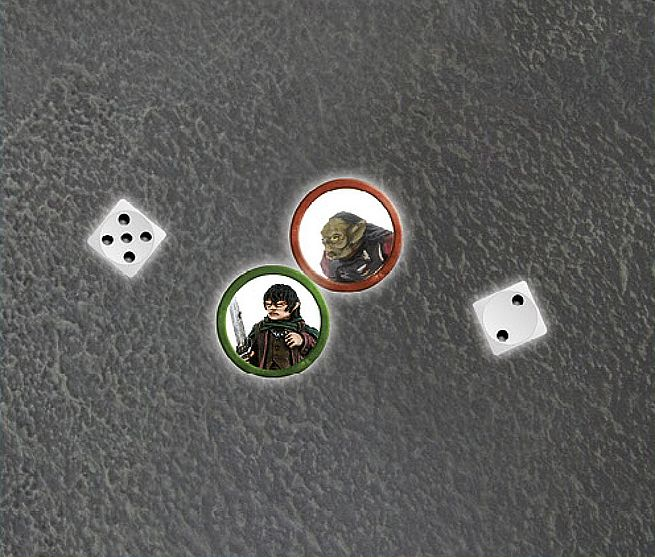

*Frodo Baggins is in a fight for his life against a Moria Goblin. The Hobbit and the Goblin roll a dice to see who wins the Fight. Frodo Baggins scores a 5, while the Moria Goblin only manages to score a 2. With the highest dice roll, the Hobbit wins the Fight, and the Goblin must Back Away.*

**WHEN RESOLVING A FIGHT, FOLLOW THE STEPS BELOW IN ORDER**

* Gather the number of dice you need for the Duel roll; use a different colour dice for each model with modifiers or Might points available.

* Declare any Special Strikes or two-handed attacks.

* Roll all of your dice.

* Apply any modifiers to the dice rolls.

* Use any re-rolls; banners, special rules, etc.

* Use Might.

* Winner makes Strikes.

#### DRAWN COMBATS

Quite often, the highest score that both players get in the Duel roll will be tied. When this is the case, compare the Fight value of the models — the model with the highest Fight value wins.

If the Fight values of the models are also drawn, then the player with Priority rolls a D6 to see who wins. On a 1-3, the Evil side wins the Fight, while on a 4-6, the Good side is victorious.

**DRAWN COMBATS**

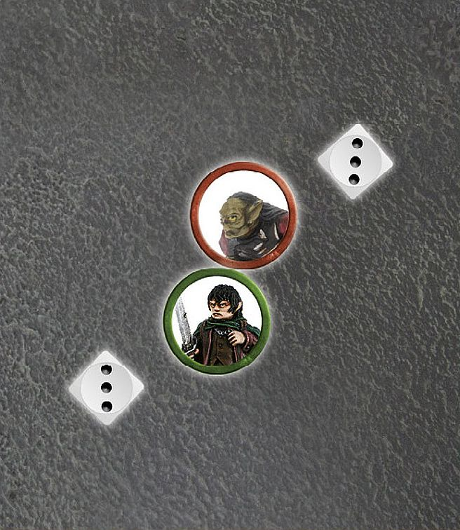

*Frodo Baggins is in battle against yet another Moria Goblin. Making a Duel roll, he scores a 3, and so does the Goblin — a tie! Comparing their Fight values; we see that Frodo Baggins has a Fight value of 3, while the Goblin's is only 2. Thus, Frodo Baggins wins the Fight. The Goblin Backs Away and the Hobbit makes a Strike (*[see page 46]*) against the unfortunate cave dweller.*

#### MULTIPLE ATTACKS

Many models have more than one Attack listed on their profiles. When a model such as this is involved in a Fight, simply roll a D6 for each of the model's Attacks when making the Duel roll, and use the result of the highest dice when checking to see who has won the Fight.

**MULTIPLE ATTACKS**

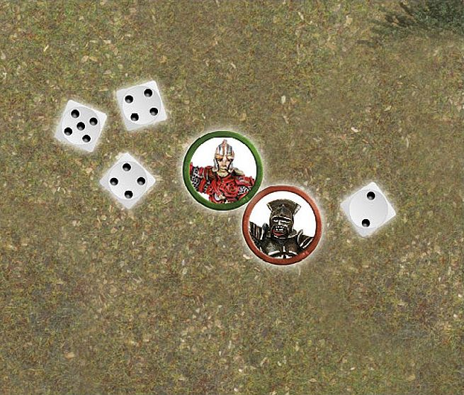

*Here,* Éomer *is in combat with an Uruk-hai. Being an expert fighter, Éomer has 3 Attacks on his profile. This allows him to roll three dice, compared to the Uruk-hai's one, when making the Duel roll.*

#### LOSER BACKS AWAY

With the Duel's winner determined, the loser must Back Away in a direction chosen by the controlling player. To Back Away, the loser must move 1" in a straight line away from the winner (though this does not have to be directly away). When a loser Backs Away, it can move through enemy Control Zones, but cannot move into base contact with an enemy model.

Backing away is not slowed by difficult terrain. Backing away cannot be used to cross Obstacles or to take Jump, Leap or Climb tests. However, a loser at the edge of a vertical drop, with nowhere else to Back Away to, must move off the edge. If the drop is equal to or less than the model's height, they suffer no damage. If the drop is greater than the height of the model, then the model suffers falling damage ([see page 31)].

**LOSER BACKS AWAY 1**

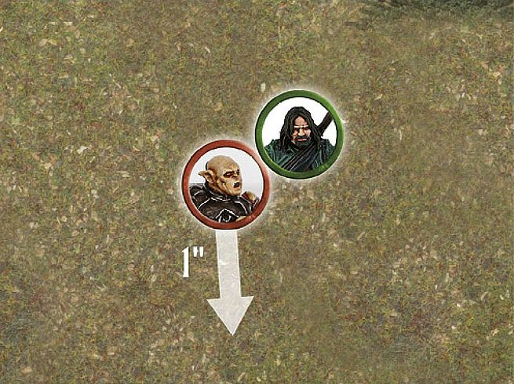

*Aragorn has defeated* Gothmog *in a fight and won the Duel roll. Gothmog must now Back Away 1". The direction that Gothmog moves is up to his controlling player, as long as he moves the full 1" away from the victor. As the Orc retreats backwards, Aragorn readies *Andûril, Flame of the West*, for the kill.*

**LOSER BACKS AWAY 2**

Bombur *has lost a Fight and now finds himself pinned into place by two Goblins, with his back to a sheer drop. Bombur is forced over the edge! First resolve the Strikes of the two Goblins (as he falls off the edge) and then, assuming Bombur survives, resolve any falling damage [(see page 31)].*

#### TRAPPED

In the swirl of close combat, it is quite common for a model to be unable to make a full Back Away move. This puts them in a position of extreme danger.

If a model cannot Back Away a full 1" when they lose a Fight, they are Trapped. Usually this occurs when the model is backed against terrain, such as a wall or boulder, or is completely surrounded by enemy models.

It is important for any surviving models to be separated once the Fight has been resolved, so be sure to back the loser away enough to separate the bases of the models if you can. If the losing model is unable to Back Away at all (because it is pinned in place by multiple attackers or by an Obstacle) then it does not move and the models are left in base contact until after the winners have made their Strikes ([see page 46]), after which separate them by just enough that you can see a little space between them (a few millimetres should suffice), so that they are no longer in base contact.

#### PRONE MODELS

Sometimes, models that are lying down will find themselves Engaged in a Fight — this can be a very dangerous predicament for the unfortunate model on the ground.

Whilst Prone, models may never Charge an enemy, if a Prone model is charged, they fight as normal — with one exception. If the Prone model wins the Fight, they will make no Strikes against their enemies ([see page 46)], but may immediately stand up instead if they wish.

If the Prone model loses the Duel roll, they will Back Away as normal, moving 1" whilst remaining Prone. Backing away cannot be used to stand a model up. When resolving Strikes against a Prone model, they are always considered to be Trapped.

If both models in a Fight are Prone, the Duel roll is still made, however, the winner will only get to stand up and not make Strikes and the loser is
still pushed 1" away.

#### MAKE WAY

Sometimes, a defeated model will find themselves Trapped because a friendly model is blocking their path of retreat. In these situations, it is possible for the friendly model to make a special Make Way move of up to 1" to clear a path for their ally to Back Away through. Simply move the ally the shortest distance possible to enable their comrade to escape being Trapped. The friendly model's Make Way move is not slowed by difficult terrain and it can Make Way even if it is Prone.

Models that are Engaged in combat may not Make Way for their friends — they are too busy fighting for their lives.

Making way for a friend may take a model into an enemy's Control Zone, but not into base contact with an enemy model. Making way cannot be used to cross Obstacles or to take Jump, Leap or Climb tests or to move off of a cliff or anything else that would cause falling damage. A model may Make Way into a water feature.

Finally, only one model may Make Way for a defeated friend — if one model making way is not enough to prevent a model from being Trapped, then no Make Way move is made and the model is still Trapped.

What this means is that large mobs of troops will often find themselves in situations where the models at the front are Trapped by the weight of numbers pressing up behind them!

**MAKING WAY**

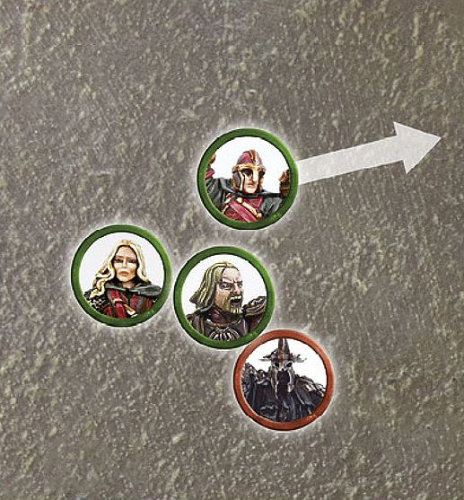

Théoden *has lost a Duel roll to* The Witch-king*, and finds himself Trapped by* Éowyn *and Merry. Not wanting to risk taking double Strikes from the formidable Lord of the Nazgûl, the Good player has Merry Make Way to allow Théoden the space he needs to Back Away.*

#### WINNER MAKES STRIKES

Once the loser has backed away, the winner of the Duel roll must Strike against their opponent. To make a Strike, roll To Wound, comparing the Strength of the winner against the loser's Defence to find the target number, in the same way as rolling To Wound when shooting ([see page 40]). If the target is wounded, reduce its remaining Wounds by 1 — if this reduces the model's Wounds total to 0, remove it as a casualty. If the To Wound roll is failed, there is no effect except a bruised ego (and possibly a few real bruises too!).

#### MULTIPLE ATTACKS

If a model with multiple Attacks wins a Fight, they make one Strike for each Attack on their profile when striking their victim. You may choose to fully resolve these Strikes one at a time (including using any Might — [see page 66]) or all together if you wish, so long as both players understand exactly what is happening. For more on resolving multiple Attacks, [see page 47].

#### STRIKING A TRAPPED MODEL

Each Attack that is directed against a Trapped model becomes a set of two Strikes rather than one. Thus, a model with one Attack would deal a set of two Strikes against their Trapped victim, a model with two Attacks would deal two sets of two Strikes, and so on. When making Strikes in this way, nominate the target of the first Attack and roll both Strikes for that Attack at the same time. Then nominate the target of the second Attack and do the same. Repeat this process until all Attacks have been allocated or there are no more enemies to allocate Attacks to.

Note that you cannot split these sets of Strikes — you get a set of two Strikes for each Attack you direct against a Trapped model, but both Strikes must be directed against the same target.

If a Trapped model was unable to Back Away, and survives the Strikes made against it, then their Attackers must Back Away just enough to separate the models instead of them, so that they are no longer in base contact.

**STRIKING A TRAPPED MODEL**

*In a frantic fight,* Gandalf the Grey *has forced this Moria Goblin against a rocky wall, trapping it. The Wizard wins the Fight and rolls To Wound — as the Goblin is Trapped, Gandalf the Grey's one Attack becomes two Strikes.*

#### REMOVE CASUALTIES

Any model that is reduced to 0 Wounds is immediately removed from play as a casualty.

## MULTIPLE COMBATS

In Fights where two or more models are fighting against one model, things work in exactly the same way as a one-on-one Fight.

#### DUEL

Both players make a Duel roll to see who wins the Fight. The player with multiple models rolls a number of dice for each model they have involved in the Fight equal to their Attacks characteristic.

When comparing the dice rolls to see which side has won, only consider the highest scoring dice and the highest Fight value on each side.

#### LOSER BACKS AWAY

If it is the lone model who wins the Duel roll, all of the enemy models in the Fight must Back Away. If the more numerous foes are victorious, the loser must Back Away.

#### WINNER MAKES STRIKES

If the lone model wins the Duel roll, it can make Strikes against any of the models that it is fighting.

If the lone model loses the Duel roll, the winners each make their Strikes against the loser in an order chosen by the winners' controlling player.

#### MULTIPLE ATTACKS

If the winner of a Multiple Combat has more than one Attack, they may choose to resolve Strikes against one target or against different models. It is allowed (and often a good idea) to see the result of one Strike before rolling for the next. Regardless of how a model directs its Attacks, you must resolve all of one model's Strikes before rolling for the next model.

**STRIKES ON MULTIPLE TARGETS**

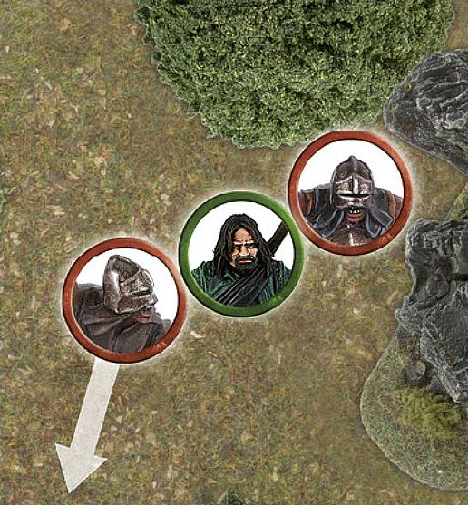

*Aragorn has an Uruk-hai Trapped against a wall, and another Uruk-hai has charged in against him. Aragorn easily bests his opponents and wins the Fight, and can now resolve his Strikes. He chooses to Strike against the Trapped Uruk-hai first, so this Attack becomes two Strikes. He rolls both dice together. If the Uruk-hai survives, Aragorn can direct another Attack against him (for a further two Strikes) or he can choose to Strike against the other opponent, instead making one Strike for each Attack.*

#### REMOVE CASUALTIES

As normal, any model that is reduced to 0 Wounds is immediately removed from play as a casualty.

## DEFENDED POSITIONS

Certain areas of the battlefield are ideally suited as defensive positions. From hedges, fences or fallen logs to doorways or even the tops of ladders, determined defenders can easily hold their ground against a more numerous foe if protected behind a barricade of some kind.

#### BARRIERS: HEDGES, FENCES, WALLS, ETC.

The first type of defended positions we will look at is Barriers. To count as defendable, a Barrier must be at least half the height of the attacking enemy, and the Defender must be able to see over it.

For a model to defend a Barrier, they must be in base contact with  it (it is also a good idea to place a Defender marker next to the model). When this is the case, the defending model's Control Zone is 'extended' to 1" past the Barrier, as shown in the example below. As with any other Control Zone, enemy models may not enter this space except to Charge the Defender. Further to this, an Attacker cannot attempt to jump across the Barrier within the Defender's Control Zone. In short, to cross the Barrier near to the Defender, you'll have to Charge and fight them!

Barriers offer no protection against models that are more than twice the height of the Barrier. In the case of such massive fighters, ignore the Barrier, move the models as close together as possible and then imagine they are in base contact and Engaged in combat. Resolve a Fight with such a foe involved without any advantage to the defending model.

#### CHARGING A MODEL BEHIND A BARRIER

To Charge a model that is defending a Barrier, simply move the charging model into base contact with the opposite side of the Barrier and within 1" of the Defender — we assume they are fighting across the Barrier, even though they are not actually in base contact.

An exception to the normal Control Zone rules exists in this situation. A defending model's Control Zone is not cancelled by enemies fighting it across the Barrier — only by a model that moves into base contact with it. Thus, a defending model's Control Zone could hamper several foes at once — even once they  are Engaged in combat.

As a note, a model that is on the same side of the Barrier as a defending model will be able to Charge them as normal — the Barrier only offers protection from models charging the Defender from the other side of the Barrier. Similarly, a model could simply cross the Barrier away from the Defender's Control Zone, and then Charge them — should they be able to.

**DEFENDED POSITION**

*Frodo Baggins is in base contact with a low wall. No enemy models may cross the low wall within 1" of the Hobbit unless they first Charge him and defeat him. The Moria Goblin must therefore decide whether to cross the wall further away from Frodo Baggins, or risk taking on a determined fighter behind a barricade!*

#### DUELLING ACROSS BARRIERS

The rules for a combat being fought across a Barrier are much the same as for other Fights. Determine the winner with a Duel roll as usual.

**DUELLING ACROSS BARRIERS**

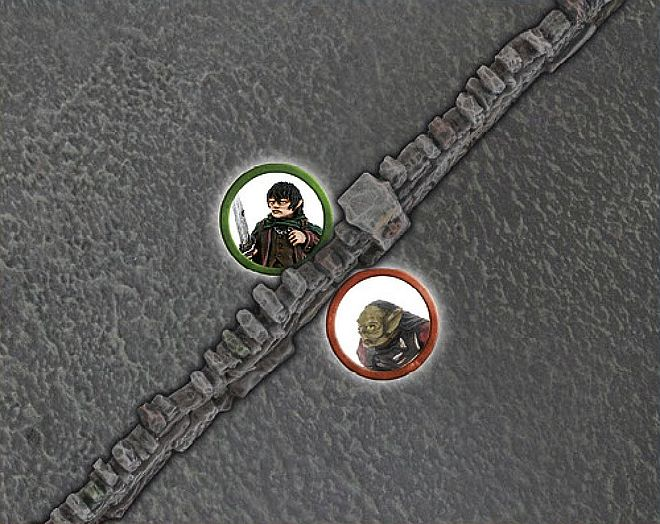

*Following our previous example, the Moria Goblin and the Hobbit make their Duel rolls. Frodo Baggins wins the Fight. Because he is the Defender, he makes his Strike against the Goblin without needing an In The Way roll. If the Goblin had won, he would have needed to pass an In The Way test for his Strike.*

#### MAKING STRIKES ACROSS BARRIERS

Unlike in other Fights, Strikes are made before models Back Away when fighting over a Barrier. If the Defender wins, they get to  Strike against the Attacker in the normal manner. If the Attacker  wins, then they must take an In The Way test for each of their    Strikes (see page 37). Strikes that fail their In The Way test cause no damage. Strikes that pass their In The Way test make To Wound rolls as normal.

#### BACKING AWAY FROM BARRIERS

If the Defender wins the Duel roll and the Attacker survives, the Attacker must now Back Away.

If the Defender loses the Duel roll, but is not slain by the Attacker's Strikes, they do not Back Away, as is usual in a Fight. Instead, the Attacker must Back Away! If, for some reason, the Attacker cannot Back Away a full 1", separate them enough to make it clear that they are no longer Engaged in combat.

## FIGHTING MULTIPLE OPPONENTS OVER A BARRIER 

Multiple Combats involving models who are defending a Barrier work differently to 'normal' combats. If two or more Attackers fight a single Defender, then the Attackers must fight the Defender one at a time. The attacking player can choose the order in which the Fights are resolved, potentially meaning that a single Defender will fight several times in a single Fight phase. 

Since each Fight is resolved one-on-one, if the Defender is not slain, then the Attacker must Back Away. If any of the attacking models are victorious in the Fight, and slay the Defender, then that model, and any other Attackers yet to fight that Defender, can immediately move across the Barrier as if they had rolled a 2‑5 result on a Jump test (providing there is space for them to do so). If there is no space, the models must remain where they are.

If a single Attacker is in the Control Zones of two or more Defenders, they must fight them all at once as they would for a normal Multiple Combat. If they win the Fight and succeed in slaying one or more Defenders, then the Attacker can cross the Barrier, taking the place of one of the slain Defenders; move the other Defenders aside so that there is a gap between the Attacker's and Defenders' bases.

**FIGHTING MULTIPLE OPPONENTS OVER A BARRIER**

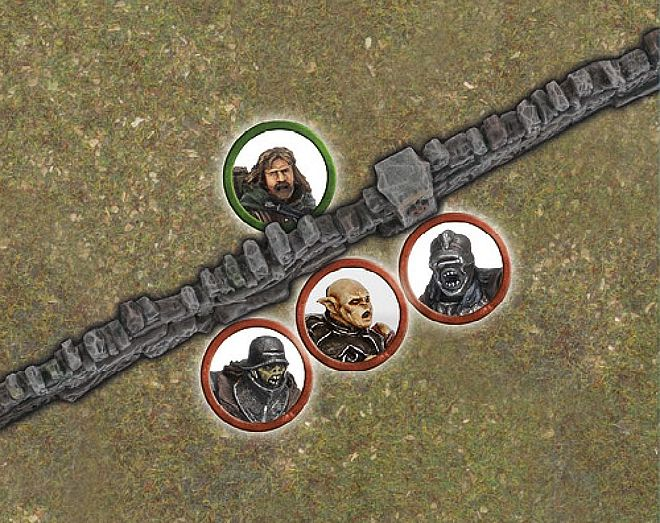

*Faramir is defending this low wall against Gothmog and two other Orcs. When the player with Priority decides to resolve these fights, Faramir will fight the Orcs one-on-one (in an order chosen by the attacking player). In this instance, the Attacker opts to have Gothmog fight Faramir first, just in case Gothmog is able to slay the young captain of Gondor.*

#### REINFORCING DEFENDERS

Friendly models can join a Defender fighting across a Barrier, by charging alongside them so they are touching the Barrier and are within 1" of an enemy. In this instance, the reinforcing models become Defenders too.

#### MULTIPLE FIGHTS ON BOTH SIDES

In situations where several models on both sides of a Barrier are in combat, the player with Priority must divide as many of these as possible into one-on- one Fights. Those that cannot be split into one-on-one combats will remain as Multiple Combats as described above.

#### ATTACKED FROM BOTH SIDES

Should a Defender also be charged by a model on their own side of the Barrier, then they lose any protection from the Barrier and the Fight becomes a normal Multiple Combat — all models ignore the Barrier when Striking. If the Attackers slay the Defender, they can immediately move across the Barrier as if they had rolled a 2‑5 result on a Jump test (providing there is space for them to do so). If there is no space, the models must remain where they are.

In an alternative situation, where an Attacker is charged by another model from the Defender's force, the Fight is resolved as a normal Multiple Combat, ignoring the Barrier. Note that in this case, the Attacker cannot cross the Barrier, even if they slay the Defender behind it.

**ATTACKED FROM BOTH SIDES**

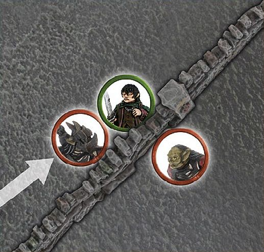

*Frodo Baggins is still defending his low wall, but now another* Moria *Goblin has arrived. Because this second Goblin is on his side of the wall, the* Hobbit *loses the advantage for defending a Barrier. If he loses the Duel roll, the Goblins will make their Strikes against him without needing to take In The Way tests. Frodo is now in for the fight of his life!*

#### DEFENDING DOORWAYS

A model in a doorway counts as defending a Barrier if they are charged, provided that the enemy model cannot move through the doorway without coming into base contact with the Defender. If the enemy can move through the doorway without coming into base contact with the Defender, then the Fight is resolved as normal, ignoring the doorway.

**DEFENDED DOORWAY**

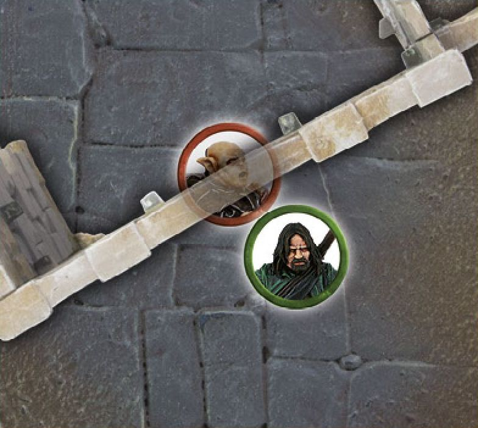

*Here Gothmog is blocking a doorway by standing in it. Because Aragorn cannot move through the doorway without first touching Gothmog, the sneaky Orc gets the advantage of defending the doorway — and he will need all the advantages he can get if he is to defeat the heir of Isildur!*

#### DEFENDING ELEVATED POSITIONS

A model at the top of a cliff edge or ladder garners a degree of protection as fighters scrambling to fight them are exposed and unsteady.

Models positioned on high ground, which is at least half the height of the enemy model, gain the advantage of an elevated position. Such positions might involve a model stood on a raised platform or against a steep climb, such as a cliff edge or the top of a ladder. The benefit of defending an elevated position is the same as defending a Barrier. This means that Attackers in this situation must fight the Defender one at a time, the Defender will not be pushed back if they lose the Fight, and the enemy will need to take In The Way tests to strike blows against them.

If any enemy wishes to Charge a Defender positioned in this way, check that their maximum Move distance is enough to reach the intended target (including the distance required to climb the cliff if it is too large to jump) and then move the charger to the bottom of the slope, as close to the target as possible. This counts as a Charge and both models are Engaged in combat.

Resolve the Fight as described for defending a Barrier. If the Attacker wins and kills their foe, they can immediately move to the top of the slope and take the place of the slain Defender. If the Defender survives, the Attacker must Back Away. If the elevated position is high enough that the model would have required a Climb test, then the defeated Attacker will fall and suffer any relevant falling damage ([see page 31)].

If the Defender at the top of the slope is attacked by a model already at the top, then it becomes an ordinary combat (so it is almost always easier to
clamber up somewhere that isn't defended).

**DEFENDING ELEVATED POSITIONS**

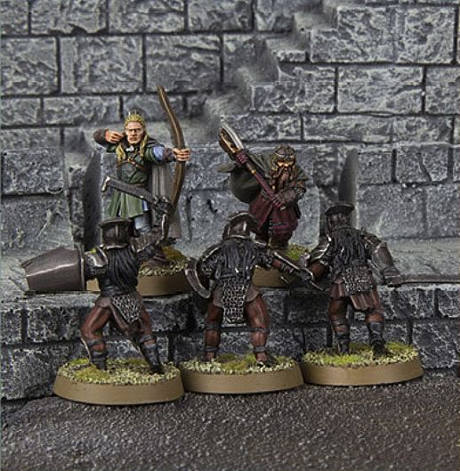

Legolas *and Gimli are atop a ledge, facing an onslaught of fighting* Uruk-hai*. Because their elevated position is higher than half the height of the *Uruk-hai*, both* Legolas *and Gimli will receive the bonuses for defending a Barrier.*
