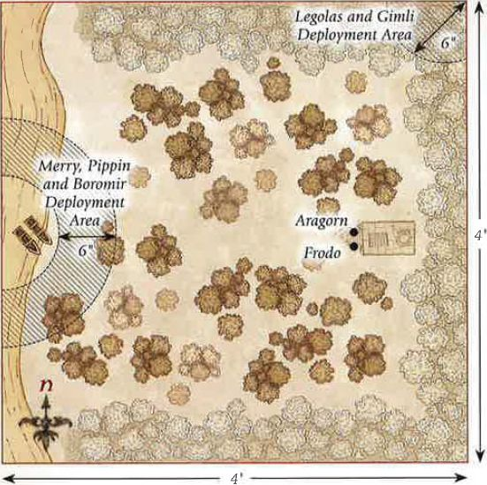
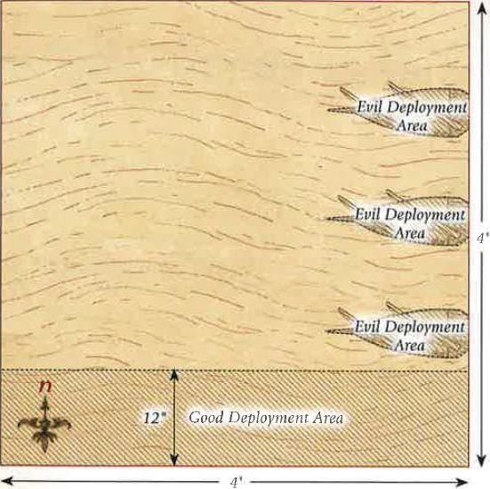
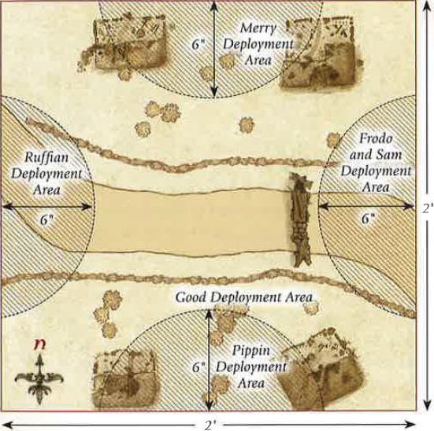

## THE LAST ALLIANCE

**LAYOUT**

This Scenario is played on a 6'x4' board. A board this size allows you to truly get a feel for the massive scale of the battle that is raging upon the slopes of Mount Doom. As this battle takes place in the ash-filled land of Mordor, the scenery should reflect that. There should be plenty of rocks and broken up areas of ground and you may even wish to include lava flows (counting as chasms) to add an extra level of detail to your board.

**STARTING POSITIONS**

The Evil player places all of their models, except for Sauron, within 12" of the northern board edge. The Good player then places all of their models within 12" of the southern board edge.

**OBJECTIVES**

This is the final battle of the Age; only by ensuring the destruction of the enemy's leaders can one force hope to claim victory. The Good player wins immediately if at any point the Ring is separated from the Dark Lord's finger and he is slain. The Evil player wins if at the end of any turn all four of the Good Heroes are slain.

**SPECIAL RULES**

* **The Power of the Ring could not be undone**

Sauron enters play from any point on the northern board edge at the end of the Evil player's fourth Move phase. Additionally, Sauron may cast two Magical Powers rather than one on the turn in which he arrives on the board.

* **The Black Legion of Barad-dur**

Each time an **Orc Warrior** is slain, place it to one side. At the end of each Evil Move phase, roll a dice for each **Orc Warrior** not currently on the board. On a 5+, that model may re-enter the battlefield from the northern board edge or either of the spots marked X (see map).

* **The Last Stand of Men and Elves**

Good **Hero** models do not need to take Courage tests to Charge Sauron.

* **The Fall of Kings**

If Gil-galad is slain, from that point onwards Elrond may call a Heroic Strike each turn without expending Might.

If Elendil is slain, from that point onwards Isildur may call a Heroic Strike each turn without expending Might.

**PARTICIPANTS**

**Good:** Elendil, High King of Gondor and Amor; Isildur; Gil-galad, High King of the Elves; Elrond, Master of Rivendell; 36 Warriors of Numenor: 12 with shield, 12 with spear & shield and 12 with bow; 37 High Elf Warriors: 12 with spear and shield, 12 with Elf bow, 12 with no additional equipment, 1 with banner.

**Evil:** The Dark Lord Sauron; 4 Orc Captains with shield; 2 Mordor Trolls; 72 Mordor Orcs: 24 with shield, 24 with spear, 12 with two-handed weapon, 12 with Orc bow.

---

## THE FALL OF KHAZAD-DUM

**LAYOUT**

This Scenario is played on a 4'x4' board. A 6" wide chasm spans the length of the board across the centre from east to west, with a series of bridges providing the way across. The rest of the board is littered with rocks, pillars and Dwarven scaffolding.

**STARTING POSITIONS**

The Good player deploys all of their models anywhere on the southern side of the chasm. The Evil player then deploys all of their models anywhere on the northern side of the chasm.

**OBJECTIVES**

The Balrog's wrath knows no bounds, and it has come to smite all those that stand in its path, bringing with it a tide of Goblins intent on pillaging the great wealth of the Dwarven halls. For the Dwarves to claim victory in these dark times the Balrog must be slain, for only then can the Goblins be driven from Khazad-dum.

The Good player wins if at the end of any turn the Balrog in slain. The Evil player wins if they can wipe out the entire Good force before this can happen.

**SPECIAL RULES**

* **From the depths**

At the end of each Evil Move phase, roll a D6 for each Goblin Warrior that has previously been slain. On a 5+, place the model anywhere in base contact with the edge of the central chasm.

* **Durin's Last Stand**

All Dwarf Hero models may re-roll any failed To Wound rolls.

**PARTICIPANTS**

**Good:** Durin, King of Khazad-dum; Mardin; Dwarf Captain with shield; 12 Khazad Guard with the Hearthguard upgrade; 12 Iron Guard; 6 Vault Warden teams; 24 Dwarf Warriors; Dwarf Ballista.

**Evil:** The Balrog; Moria Goblin Captain with shield; Moria Goblin Shaman; Moria Blackshield Captain; 12 Moria Blackshields; 12 Moria Goblin Prowlers; 36 Moria Goblins: 12 with shield, 12 with spear, 12 with Orc bow; Moria Goblin Drum; 3 Cave Trolls.

---

## THE FALL OF ARNOR

**LAYOUT**

This Scenario is played on a 4'x4' board. The centre of the board represents the ruined palace of Fornost, whilst the remainder of the board represents the remaining ruins of the city. The board should be covered in ruins and piles of rocks towards the edges, and much more substantial buildings towards the centre.

**STARTING POSITIONS**

The Good player deploys all of their models anywhere within 6" of the centre of the board. The Evil player then deploys their models anywhere within 6" of any board edge.

**OBJECTIVES**

The forces of Angmar have been given a single task, to wipe out the royal lineage of Arnor and claim Fornost for the Witch-king. Arvedui must survive this onslaught if his line is to endure, for a much larger army of fouler creatures draws ever nearer.

The Evil player wins immediately if both Arvedui and Malbeth are slain. The Good player wins if the Evil force is wiped out before this can happen. Alternatively, the game is a draw if Arvedui abandons Fornost and manages to escape the board via any board edge - and if the battle is going ill, this may be a good idea!

**SPECIAL RULES**

* **Malbeth the Seer**

Whenever Arvedui suffers a Wound within 6 " of Malbeth, he will ignore the Wound on a 4+ rather than a 5+.

* **Arvedui's Last Stand** 

Arvedui has the Fearless special rule.

**PARTICIPANTS**

**Good:** Arvedui, Last King of Arnor; Malbeth the Seer; Captain of Arnor; 24 Warriors of Arnor; 12 Rangers of Arnor.

**Evil:** Shade; Angmar Orc Captain with shield; Angmar Orc Shaman; Barrow-wight; 3 Dead Marsh Spectres; 24 Angmar Orcs: 8 with shield, 8 with spear, 4 with Orc bow, 4 with two-handed weapon; 2 Cave Trolls.

---

## AMBUSH AT AMON HEN

**LAYOUT**

This Scenario is played on a 4'x4' board. The board should be densely packed with trees and other foliage. The western board edge represents the River Anduin and should have two boats placed at the point marked X. The Seeing Seat should be placed in the eastern half of the board as per the map.

**STARTING POSITIONS**

Aragorn and Frodo start the game in base contact with the Seeing Seat, whilst Legolas and Gimli can be placed anywhere within 6" of the north-east corner of the board. Merry, Pippin and Boromir are placed between 6"-12" of the boats and no more than 1" away from each other.

The Evil player then places the Uruk-hai Scout Captain and 12 Uruk-hai Scouts within 6" of the Seeing Seat, and Lurtz and the other 12 Uruk-hai Scouts within 12" of Boromir, but no closer than 6".

Finally, Sam is set up anywhere on the board at least 12" away from any other member of the Fellowship.

**OBJECTIVES**

Frodo has made his decision; he is going to leave The Fellowship and journey to Mordor alone. The Uruk-hai are under strict orders to deliver the Hobbits to Saruman, alive and unspoiled.

The game ends as soon as Frodo leaves the board. If Frodo escapes the board by moving into base contact with the boats, the Good player is the winner. If Frodo is captured by the Uruk-hai, the Evil player is the winner.

The Evil player can claim a draw even if Frodo escapes the board, so long as they have captured any two of the remaining Hobbits.

**SPECIAL RULES**

* **Find the Halflings!**

Should a **Hobbit** suffer their final Wound, instead of being slain they will recover a single Wound and be knocked-out instead - treat them as being subject to the Paralyse Magical Power. Any Evil model may carry a knocked-out **Hobbit** as if he were a Heavy Object (see page 110 of the Middle-earth Strategy Battle Game Rules Manual). Should any Good model end its Move in base contact with a knocked-out **Hobbit**, they will automatically revive them and they may act as normal, although they will start their Move in the Prone position. Should any Evil model leave any table edge whilst carrying a knocked-out **Hobbit**, with the exception of the western edge, then the Evil player is considered to have captured that **Hobbit**.

* **The Legions of Isengard**

At the end of each Evil Move phase, roll a D6 for each Evil Warrior that has previously been slain. On a 4+, that model may enter play anywhere along the northern, eastern or southern board edges.

**PARTICIPANTS**

**Good:** Frodo Baggins with Sting and Mithril Coat; Samwise Gamgee; Meriadoc Brandybuck; Peregrin Took; Aragorn - Strider with bow; Legolas Greenleaf; Gimli, son of Gloin; Boromir of Gondor.

*All Good models have an Elven Cloak.*

**Evil:** Lurtz; Uruk-hai Scout Captain; 24 Uruk-hai Scouts: 8 with no additional equipment, 8 with shield, 8 with Uruk-hai bow.

---

## AMBUSH AT ITHILIEN

**LAYOUT**

This Scenario is played on a 4'x4' board. There should be lots of hedges, trees and bushes dotted around the board - although ideally not heavily impeding the movement across the centre of the board. The terrain should be denser along the northern and southern board edges.

**STARTING POSITIONS**

The Evil player deploys the two Mumakil touching the western board edge as shown. They may then deploy their remaining models anywhere within 6" of either Mumak. The Good player may then split their force in half - one half containing 12 Rangers and Faramir, and the remaining models in the other half. The Good player then deploys Faramir's half anywhere within 6" of the southern board edge, then their remaining models within 6" of the northern board edge.

**OBJECTIVES**

The Haradrim journey to Mordor to join with Sauron's armies before the assault on Minas Tirith, the more of them that can make it to the Black Gate, the stronger the Dark Lord will be. Faramir has noted that the lumbering Mumakil pose the greatest threat to Gondor and has tasked his Rangers to see to their downfall.

The game lasts until there are no Mumakil left on the board. The Evil side wins if both Mumakil can move off of the board via the eastern board edge. The Good player wins if they can slay both of the Mumakil. If only one Mumak has managed to escape the board, the game is a draw.

**SPECIAL RULES**

* **Unseen Hunters**

At the start of the game, before the first Priority is rolled, each Good model may make a 'free' shooting attack as if it were the Shoot phase. Additionally, for the first three turns of the game, all Good models gain the Stalk Unseen special mle and may re-roll any Is To Wound when making a shooting attack.

**PARTICIPANTS**

**Good:** Faramir, Captain of Gondor with bow; Madril, Captain of Ithilien; Damrod, Ranger of Ithilien; 24 Rangers of Gondor: 16 with no additional equipment, 8 with spear.

**Evil:** 2 War Mumakil of Harad each with 12 Haradrim Warriors with bow; 24 Haradrim Warriors with spear.

---

## THE DEEPING WALL IS BREACHED

**LAYOUT**

This Scenario is played on a 2'x2' board. Along the southern board edge should be the Deeping Wall extending out 3" from the edge. This should have some stairways coming down from it, and should also have a 4" section missing from the centre (where the bomb went off). The area within 6" of the centre of the southern board edge is shallow water.

**STARTING POSITIONS**

The Good player deploys the Galadhrim Warriors within 2" of the northern board edge and then deploys Haldir, Legolas and the Warriors of Rohan anywhere on the walls in the Prone position. Aragorn is deployed in the centre of the board, also in the Prone position. Gimli is then deployed anywhere within the shallow water.

The Evil player may then deploy up to 10 Uruk-hai Warriors, 2 Berserkers and a single Uruk-hai Captain within the shallow water, at least 1" from Gimli. The rest of the Evil models will be available as the game goes on.

**OBJECTIVES**

The legions of Isengard are streaming into Helm's Deep, intent on butchering all in their path. It is their sole purpose to cause as much death and destruction as possible. Aragorn must lead the defenders of Helm's Deep in defence of the fortress and fight off Saruman's armies.

The Scenario lasts for 10 turns, after which the side with the most Victory Points is declared the winner.

There are three ways to score Victory Points in this Scenario:

1. The Good player scores **1 Victory Point** for each named **Hero** that is still alive at the end of the game. The Evil player scores **1 Victory Point** for each named Hero that has been slain.*

2. The Good player scores **1 Victory Point** if at the end of the game more than 14 Good models are left alive. The Evil player scores **1 Victory Point** if at the end of the game less than 14 Good models are alive.

3. Evil models that are not within the shallow water are considered to be within the walls of Helm's Deep. The Evil player scores **2 Victory Points** if at the end of the game there are more Evil models within the walls than Good models. The Good player scores **2 Victory Points** if they can prevent this. Models that are on top of the walls do not count towards this total.

**SPECIAL RULES**

* **Legion of the White Hand**

At the end of each Evil Move phase, the Evil player rolls a D6 and adds 2. This is the number of models that the Evil player may move onto the board from the hole in the Deeping Wall. These can be any models that haven't yet entered the board, even models that have previously been slain earlier in the battle. Each Uruk-hai Captain may only enter the battlefield once each.

* **Explosion Aftermath**

All Good **Hero** models start the game with 0 Fate.

* **The Prince of Mirkwood**

Once per game, if Legolas starts his Move phase in base contact with the top of a staircase, he may choose to use his Elven agility to slide down it atop an Uruk-hai shield. When he does this, Legolas may fire his Elven bow three times, as if it was the Shoot phase, as he moves down the staircase. Any model on the staircase automatically takes one Strength 3 hit and is knocked Prone. Additionally, one model within 3" of the bottom of the staircase suffers one Strength 4 hit as Legolas thrusts the Uruk-hai shield into their chest. Finally, Legolas is placed in base contact with the bottom of the staircase. He can move no further that turn and may not shoot in the following Shoot phase.

**PARTICIPANTS**

**Good:** Aragorn - Strider with armour; Legolas Greenleaf with armour; Gimli, son of Gloin; Haldir with heavy armour and Elf bow; 12 Galadhrim Warriors: 4 with no additional equipment, 4 with spear, 4 with Elf bow; 12 Warriors of Rohan: 4 with shield, 4 with throwing spear & shield, 4 with bow.

**Evil:** 3 Uruk-hai Captains with heavy armour & shield; 8 Uruk-hai Berserkers; 20 Uruk-hai Warriors: 10 with shield, 10 with pike.

---

## LAST MARCH OF THE ENTS

**LAYOUT**

This Scenario is played on a 4'x4' board. Within the centre of the board stands the Tower of Orthanc. The board should be dotted with a variety of scaffolding and pits to represent the industrial heart of Isengard. In the centre of the western board edge should be the dam holding back the River Isen.

**STARTING POSITIONS**

The Good player deploys all of their models within 6" of the eastern board edge. The Evil player may deploy their models anywhere within the western board half, or atop any piece of scaffolding on the board.

**OBJECTIVES**

The Ents can only wash the filth of Saruman from Isengard by breaking the dam and releasing the River Isen. Should they fail to accomplish their task, the legions of the White Hand will become a force to be reckoned with in Middle-earth.

The Good player is the winner if they can destroy the dam. The Evil player wins if they can slay all of the Good models before this is accomplished.

**SPECIAL RULES**

* **Flaming Arrows**

Any Orc that hits an Ent with a shooting attack on the roll of a 6, and then subsequently Wounds their target, will cause 2 Wounds rather than 1. These Wounds are multiplied before Fate rolls are taken.

* **Bring them down!**

If an Ent loses a Fight, all Orc models involved in the Fight may choose to try to fell the Ent rather than Strike it as normal. Instead of making Strikes, each Orc in base contact with the Ent rolls a single D6. If any 6s are scored, then the Ent has been successfully brought down and is knocked Prone.

* **Release the River**

The dam has a Defence of 10 and 5 Wounds, and can only be harmed in combat.

**PARTICIPANTS**

**Good:** Treebeard with Merry & Pippin; 5 Ents.

**Evil:** 4 Orc Captains with shield; 48 Orcs Warriors: 16 with shield, 16 with spear, 8 with two-handed weapon, 8 with Orc bow.

---

## PATHS OF THE DRUADAN

**LAYOUT**

This Scenario is played on a 4'x4' board. The entire board should be covered with trees and various other wooded areas.

**STARTING POSITIONS**

The Evil player deploys their force anywhere between 12" and 24" of the southern board edge. The Good player then deploys all of their models anywhere within 12" of the northern board edge.

**OBJECTIVES**

The Rohirrim must reach the Pelennor before the battle is lost, time is of the essence and they cannot risk being delayed in the forest.

The Good player wins if half (or more) of the Rohan models exit the board via the southern board edge. The Evil player wins if they can prevent this from happening. If half (or more) Rohan models exit the board, but Theoden has been slain, the game is a draw.

**SPECIAL RULES**

* **Wild Men know all Paths**

All Good models gain the Fleetfoot and Woodland Creature special rules whilst they remain mounted.

* **Ambush!**

Evil models may not move at all on the first turn of the game.

**PARTICIPANTS**

**Good:** Theoden, King of Rohan; Eomer, Marshal of the Riddermark; Eowyn, Shield Maiden of Rohan; Gamling, Captain of Rohan; 12 Riders of Rohan (including 4 with throwing spear); Ghan-buri-Ghan; 9 Woses. 

All Rohan models must be mounted and may have armour and shields if they are able.

**Evil:** 3 Morannon Orc Captains with shield, 36 Morannon Orcs: 8 with shield, 8 with spear & shield.

---

## THE BLACK SHIPS

**LAYOUT**

This Scenario is played on a 4'x4' board. The entire board represents the River Anduin and so is completely covered by water. Touching the eastern board edge are three Corsair ships, each one roughly 12" long, 4" wide and 3" high (see map).

**STARTING POSITIONS**

The Evil player deploys 1 Corsair Captain, 1 Corsair Bosun and 8 Corsairs in each of the Corsair ships. The Good player then deploys all of their models anywhere within 12" of the southern board edge.

**OBJECTIVES**

The Corsairs of Umbar have been tasked with sailing to Gondor and plundering the city of Minas Tirith, but to do this they must sail up the Anduin. The Army of the Dead have been sent by Aragorn to capture the black fleet and slay the Evil Men that crew them. The Good player wins if all the Corsairs are slain before the ships can escape the board. The Evil player wins if two or more ships can escape the board via the western board edge with Corsairs still alive upon them. Any other result is a draw.

**SPECIAL RULES**

* **The Corsair Ships**

At the start of each turn, before Priority is rolled, each Corsair ship moves D6" directly towards the eastern board edge. This does not prevent models on the ships from moving during the Move phase. Corsair models may not leave the ship they were deployed on. If there are Good models in the path of a moving ship, they will be pushed the minimum distance so they are no longer in the ship's path.

* **Charge of the Dead**

Good models in base contact with a Corsair ship may move onto it without making a Climb test, counting each 1" moved up as 1" of movement. Additionally, Good models gain a bonus of +1 Fight value on a turn in which they charged.

* **The King of the Dead**

The King of the Dead counts as a banner with a range of 6" to all Good models. Additionally, after he has killed three or more models, the King of the Dead gains the Harbinger of Evil special rule.

**PARTICIPANTS**

**Good:** The King of the Dead; 10 Warriors of the Dead; 6 Riders of the Dead.

**Evil:** 3 Corsair Captains; 3 Corsair Bo'suns; 24 Corsairs of Umbar: 8 with shield, 8 with spear, 8 with bow.

---

## BATTLE OF PELENNOR FIELDS

**LAYOUT**

This Scenario is played on an 8'x6' board. Along the northern board edge are the walls of Minas Tirith, in the centre of which is the Gatehouse. The rest of the battlefield is barren, very befitting of the fields of Pelennor and providing plenty of space for the huge number of models that take part in this battle.

**STARTING POSITIONS**

The Evil player deploys the Mordor force (except the Witch- king of Angmar) anywhere between 24"-48" from the northern board edge and at least 24" from both the eastern and western board edges (see map). They then deploy the Easterling and Khand force anywhere between 12 "-24" of the southern board edge and at least 24" from both the eastern and western board edges. The Good player then deploys the Grey Company force anywhere within 6" of the western board edge and at least 24" from both the northern and southern board edges. They then deploy the Rohan force anywhere within 6" of the eastern board edge. The Witch-king of Angmar, and the Minas Tirith and Harad forces are kept to one side for later in the game.

**SPECIAL RULES**

* **Charge of the Rohirrim**

Any **Rohan** model that charged in the Move phase may call a Heroic Combat in the ensuing Fight phase without spending Might. This may be done by both **Warrior** and **Hero** models.

* **Dol Amroth for Gondor!**

At the end of the first Good Move phase, the Good player moves the Minas Tirith force onto the board via the Gates of Minas Tirith.

* **Men from the South**

At the end of the Evil player's fifth Move phase, the Evil player moves the Harad force onto the board via the southern board edge.

* **The Witch-king**

At the end of the Evil player's seventh Move phase, the Evil player moves the Witch-king of Angmar onto the board via the northern board edge.

**Merry** - Merry starts as a passenger upon the back of Eowyn's horse.

**OBJECTIVES**

The Battle of Pelennor Fields is the greatest battle of the Third Age, and as such this Scenario has five objectives for both sides to fight over. As this Scenario will take a long time, we suggest that you gather your friends and decide amongst you how long to play for (we recommend at least five hours - possibly a whole weekend!) and whichever team has achieved the most objectives by the time the game ends is declared the winner!

1. **Leaders of Men** - There are seven leaders of Men upon this battlefield: Aragorn, Theoden, Imrahil, Angbor, Forlong, Eomer and Duinhir. If, at the end of the game, there are more of these Heroes left alive than dead, the Good player claims this objective. If there are more of these Heroes dead than alive, the Evil player claims this objective.

2. **Leaders of the Dark Lord** - There are seven leaders of the Dark Lord upon this battlefield: The Witch-king, Gothmog, the Mahud Beastmaster Chieftain, Suladan, The Golden King, Amdur and the Khandish King. If, at the end of the game, there are more of these Heroes left alive than dead, the Evil player claims this objective. If there are more of these Heroes dead than alive, the Good player claims this objective.

3. **The Mumakil** - If, at the end of the game, there are two or more Mumakil left alive, the Evil player claims this objective. If there are no Mumakil left alive, the Good player claims this objective. Any other result is a draw.

4. **Gates of Minas Tirith** - At the end of the game, count the number of each side's models that are within 12" of the gates of Minas Tirith. Whichever side has more, claims this objective. If the score is the same, the result is a draw.

5. **The Pelennor** - There are four markers upon the battlefield (see map). Whichever side controls most of these will claim this objective. A marker is considered to be controlled by whichever side has the most models within 3" of it.

**PARTICIPANTS**

**GOOD** 

**Minas Tirith**

Prince Imrahil of Dol Amroth on armoured horse with lance; Forlong the Fat; 12 Knights of Dol Amroth on armoured horse with lance; 12 Axemen of Lossarnach.

**Rohan**

Theoden, King of Rohan; Eomer, Marshal of the Riddermark; Eowyn, Shield Maiden of Rohan; Gamling, Captain of Rohan; Meriadoc, Knight of the Mark; 30 Riders of Rohan.

All Rohan models must be mounted and may have armour and shields if they are able.

**Grey Company**

Aragorn - Strider with Anduril; Legolas with armour; Gimli, son of Gloin; Halbarad with the Banner of Arwen Evenstar; Elladan and Elrohir with heavy armour; The King of the Dead; Angbor the Fearless; Duinhir; 12 Rangers of the North; 12 Blackroot Vale Archers; 12 Clansmen of Lamedon; 10 Warriors of the Dead.

**EVIL** 

**Mordor**

The Witch-king of Angmar on Fell Beast with the Crown of Morgul and flail; Gothmog on Warg; 3 Morannon Orc Captains; 48 Morannon Orcs; 2 Mordor Trolls.

**Easterlings and Khand**

Amdur, Lord of Blades on horse; Easterling Captain with shield; Khandish King with bow on chariot; Khandish Chieftain; 20 Easterling Warriors; 9 Khandish Warriors; 4 Khandish Horsemen; 2 Khandish Charioteers.

**Harad**

Suladan the Serpent Lord on Horse; The Golden King of Abrakhan; 2 War Mumakil of Harad with 12 Harad Warrior crew; War Mumak of Far Harad with 12 Mahud Warrior crew; 6 Serpent Riders; 12 Harad Raiders; 12 Abrakhan Merchant Guard.

---

## THE BATTLE OF BYWATER

**LAYOUT**

This Scenario is played on a 2'x2' board. A long road runs across the centre of the board from east to west, and there are a few Hobbit holes and hedges dotted either side of the road. A barricade should be situated across the road on the eastern side as shown on the map.

**STARTING POSITIONS**

The Evil player deploys all of their Ruffians within 6" of the centre of the western board edge, Sharkey and Worm are kept to one side for later in the game. The Good player then deploys Frodo, Sam and the Shirriffs within 6" of the centre of the eastern board edge. Merry and the Battlin' Brandybucks are deployed within 6" of the centre of the northern edge. Pippin and the Tookish Hunters are deployed within 6" of the centre of the southern board edge.

**OBJECTIVES**

Without the travellers, the Shirefolk will lose all hope and surely fall to the will of the Ruffians. However, if Sharkey can be exposed for the liar that he is then the Hobbits can drive back his Ruffians and reclaim the Shire.

The Good player wins if at the end of any turn Sharkey has been slain. The Evil player wins immediately if all four of the travellers (Frodo, Sam, Merry & Pippin) have been slain.

**SPECIAL RULES**

* **Sharkey**

From the fourth turn onwards, roll a D6 at the end of each Evil Move phase. On a 5+, Sharkey and Worm enter the board from the western board edge via the rules for Reinforcements.

* **The Ruffian mob**

At the end of each Evil Move phase, roll a D6 for each Ruffian that has been previously slain. On a 6, that model may move on from the western board edge via the mles for Reinforcements.

* **Merry & Pippin**

Once per game, both Merry and Pippin can each call a Heroic Combat without spending Might.

**PARTICIPANTS**

**Good:** Frodo of the Nine Fingers on pony; Samwise the Brave on pony; Meriadoc, Captain of the Shire on pony; Peregrin, Captain of the Shire on pony; 8 Battlin' Brandybucks; 8 Tookish Hunters; 8 Hobbit Shirriffs

**Evil:** Sharkey & Worm; 24 Ruffians.

