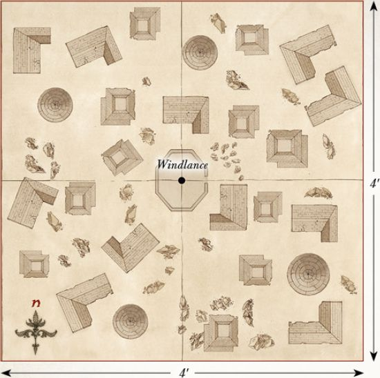
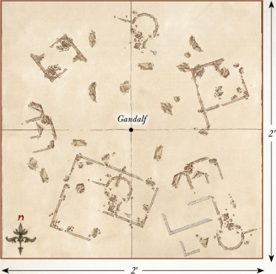

## DESTRUCTION OF DALE

**LAYOUT**

This battle takes place within Dale, City of Men. To represent this, you will want a board covered in buildings, roads, pathways and, of course, plenty of towers to fire at the Dragon from. The centre of the playing area should have the highest tower on the board (this needs to be accessible), and the Windlance should be placed on top of this — Dale's only hope at stopping the dreaded Smaug!

**STARTING POSITIONS**

The Good player deploys their force anywhere on the board, but at least 6" from any board edge and at least 6" from the Windlance. The Evil player does not deploy Smaug; he will move onto the board on the first turn.

**OBJECTIVES**

This is a fight to the death. The Men of Dale must slay the Dragon, or perish in the attempt. The first side to wipe out their opponent is declared the winner.

**SPECIAL RULES**

* **The Coming of Smaug**

At the end of the Evil player's first Move phase, Smaug will arrive. The Evil player rolls a D6. On a 1-3, the Good player may decide which board edge Smaug arrives from. On a 4+, the Evil player may choose instead.

* **Not Yet Loosened**

Smaug is not subject to his Missing Scale rule in this Scenario.

* **The Lord of Dale**

Girion automatically passes all Courage tests for this Scenario. Additionally, Girion may choose to re-roll a single D6 in each turn.

**PARTICIPANTS**

**Good:** Girion, Lord of Dale; 2 Captains of Dale; 30 Warriors of Dale.

**Evil:** Smaug.

---

## BATTLE OF AZANULBIZAR

**LAYOUT**

This battle takes place upon the slopes of the Dimrill Dale, a rocky battlefield of scree-strewn slopes and clumps of wiry foliage. The western board edge represents the thick rock walls of Khazad-dûm, and in the centre are the gates to the formerly great Dwarven realm.

**STARTING POSITIONS**

The Good player deploys their army anywhere within 12" of the eastern board edge. The Evil player then deploys their army anywhere within 12" of the western board edge, with Azog within 3" of the Dimrill Gate.

**OBJECTIVES**

The Dwarves are fighting to reclaim Moria and rid the lands of the Orc's leader, Azog. However, Azog's mission is far simpler — to end the line of Durin. The Good player wins if, at the end of any turn, Azog has been slain and there are at least twelve Good models within 6" of the Dimrill Gate. The Evil player wins immediately if all of the Good Heroes have been slain.

**SPECIAL RULES**

* **Long live the King!**

Whilst Thrór is alive and on the battlefield, Thráin receives no benefit from his Blood Feud special rule. Additionally, Thrór cannot benefit from the Arkenstone in this Scenario.

* **There was one I could follow**

If both Thrór and Thráin have been slain, and Young Thorin Oakenshield wins a Duel roll, then all **Dwarf** models on the board count as if they are in range of a banner until the end of the turn.

* **Hordes without End**

Whenever an Evil **Warrior** model is slain, place it to one side. At the end of each subsequent Evil Move phase, roll a D6 for each model set aside in this manner. On a 3+, it may enter play, via the rules for Reinforcements, from the Dimrill Gate or either of the two points marked Reinforcements. These Reinforcements stop immediately if Azog is slain. The Evil force cannot be Broken in this Scenario.

**PARTICIPANTS**

**Good:** Thrór; Thráin; Young Thorin Oakenshield; Young Balin the Dwarf; Young Dwalin the Dwarf; 36 Warriors of Erebor; 24 Grim Hammers.

**Evil:** Azog; The Keeper of the Dungeons; 3 Gundabad Orc Captains; 48 Gundabad Orcs.

---

## ROAST MUTTON

**LAYOUT**

This Scenario takes place in the Trolls' camp in a clearing in the Trollshaws. In the centre of the board, place the Trolls' Campfire. Around the edge of the board there should be a few trees and pieces of woodland terrain representing the surrounding forest.

**STARTING POSITIONS**

The Evil player places the Three Trolls within 3" of the Campfire. The Good player then places Bilbo within 3" of Bill and places Kíli touching the centre of any board edge. The rest of Thorin's Company will be available later.

**OBJECTIVES**

The Dwarves are trying to rescue Bilbo by slaying the Trolls, whilst the Trolls are after a good meal that won't taste like chicken. Thorin's Company wins if they can slay all of the Trolls before daybreak. The Trolls win if all members of Thorin's Company are slain or stuffed into sacks before the sun comes up. The game is a draw if, when the sun rises, all of Thorin's Company are not dead or in a sack, or if the Trolls are not dead. Additionally, if Bilbo is slain, the best result the Good player can achieve is a draw.

**SPECIAL RULES**

* **"The dawn will take you all!"**

At the start of turn 7, and each turn thereafter, roll a D6. On a 4+, Gandalf has broken the rocks surrounding the clearing, allowing sunlight to flood in and turn the Trolls to stone.

* **"I said drop him!"**

At the end of the Good player's first Move phase, roll a D6 for each member of Thorin's Company not on the board. On a 3+, they enter the board from the point that Kíli was deployed. Any Dwarves that do not arrive will enter from the same point at the end of the Good player's second Move phase.

* **A Burrahobbit?**

The Trolls may not make Strikes against Bilbo until the start of the third turn, or until Bilbo charges one of them.

**PARTICIPANTS**

**Good:** Thorin Oakenshield; Kíli the Dwarf; Fíli the Dwarf; Balin the Dwarf; Dwalin the Dwarf; Bifur the Dwarf; Bofur the Dwarf; Bombur the Dwarf; Ori the Dwarf; Nori the Dwarf; Dori the Dwarf; Óin the Dwarf; Glóin the Dwarf; Bilbo Baggins. As they have not yet ventured into the Troll's hoard, Thorin and Bilbo do not have Orcrist or Sting respectively. Bilbo also has not yet found The Ring.

**Evil:** Bill the Troll; Bert the Troll; Tom the Troll.

---

## HUNTING PARTY

**LAYOUT**

This Scenario takes place upon the rocky plains near the Hidden Valley. The board should be scattered with large rocks, rock piles and hills. There should be a rock pile that houses the entrance to the Hidden Valley in the centre of the board.

**STARTING POSITIONS**

The Evil player deploys their models anywhere within 6" of the centre of the board. The Good player then deploys their models anywhere more than 10" away from any Evil model.

**OBJECTIVES**

Having noticed the Orcs on their borders, Elrond has led the Knights of Rivendell against them in an attempt to drive them from the Elves' land. With the pursuit of his prey having failed, Yazneg must now escape to bring a report of the situation to his master; although the news of failure may not be something that the Pale Orc wishes to hear...

The game lasts for ten turns. The Good player wins if they can slay 50% of the Evil force. The Evil player wins if Yazneg manages to escape the board via any board edge. If both players (or neither) manage to achieve their objective, the game is a draw.

**SPECIAL RULES**

* **Elven Assault**

The Good player has Priority in the first two turns of this Scenario.

**PARTICIPANTS**

**Good:** Elrond with heavy armour and horse; 12 Rivendell Knights with shield.

**Evil:** Yazneg on Fell Warg; 12 Hunter Orcs on Fell Warg; 12 Fell Wargs.

---

## ESCAPE FROM GOBLIN-TOWN

**LAYOUT**

This Scenario takes place upon the rickety walkways that make up the vile dwelling of Goblin-town, deep within The Misty Mountains. The board should be covered with various walkways of all different shapes and sizes. There should be a large platform near the centre of the board where the Goblin King's throne sits and the Dwarves will start — the weapons pile will be located next to the Goblin King's throne. It is important to have multiple walkways on each board edge that leave the board in all directions to give Thorin's Company a selection of ways to escape Goblin-town.

**STARTING POSITIONS**

The Good player deploys the Dwarves anywhere within the marked area on the map. The Evil player then deploys Grinnah, the Goblin Scribe, the Goblin Captain and the Goblin Warriors anywhere on the board, at least 3" away from any Dwarf. The Goblin King is deployed touching his throne. Gandalf is kept aside for later in the game.

**OBJECTIVES**

The company of Thorin Oakenshield must escape the clutches of the denizens of Goblin-town if they are to hope to continue on their quest towards Erebor. The Goblin King has heard of the price put upon Thorin's head by the Pale Orc, and must prevent the Dwarves from escaping in order to claim his reward.

At the start of the game, the Evil player nominates any board edge; this is the edge that Thorin's Company must escape from. The Good player wins if at least eight members of Thorin's Company escape the chosen board edge, whilst the Evil player wins if they can prevent this.

**SPECIAL RULES**

* **Take up arms**

The Dwarves all start the game unarmed. Any Dwarf that moves into base contact with the weapons pile at any point in their Move phase may pick up their weapons — at which point they are no longer considered to be unarmed.

* **A Wizard is never late**

At the end of the Good player's second Move phase, Gandalf will arrive; roll a D6. On a 1-3, the Evil player chooses any board edge for Gandalf to enter play from. On a 4+, the Good player may choose.

* **Kill them all!**

At the end of each of the Evil player's Move phase, the Evil player may move up to D6 previously slain Goblin Warriors onto the board from any point on any board edge chosen by the Evil player.

* **"I Know that Sword!"**

The Goblin King may not move during the first turn of the game.

**PARTICIPANTS**

**Good:** Thorin Oakenshield with Orcrist and Oakenshield; Kíli the Dwarf; Fíli the Dwarf; Balin the Dwarf; Dwalin the Dwarf; Bifur the Dwarf; Bofur the Dwarf; Bombur the Dwarf; Ori the Dwarf; Nori the Dwarf; Dori the Dwarf; Óin the Dwarf; Glóin the Dwarf; Gandalf the Grey.

**Evil:** The Goblin King; Grinnah; The Goblin Scribe; Goblin Captain; 36 Goblin Warriors.

---

## OUT OF THE FRYING PAN, AND INTO THE FIRE

**LAYOUT**

This Scenario is played in the woodland around The Misty Mountains, where Azog and his hunters corner the company of Thorin Oakenshield. A cliff runs along the eastern board edge, trapping the Dwarves between a sheer drop and their hunters. Several trees should be dotted along the eastern board edge, whilst the rest of the board is dotted with rocky outcrops and bushes.

**STARTING POSITIONS**

The Evil player deploys all of their models within 6" of the western board edge. The Good player then deploys Thorin in base contact with the tree nearest to the centre of the western board edge (see map). All other Good models will be available later in the game.

**OBJECTIVES**

The Eagles must rescue all of the Dwarves before Azog is able to slay Thorin. The Orcs are simply trying to kill Thorin and prevent the rest of the Dwarves from escaping.

The Good player wins if the Eagles safely carry all the markers, Thorin and Bilbo off any board edge. The Evil player wins if they can prevent this from happening.

**SPECIAL RULES**

* **Rescuing Dwarves**

Before the game starts, players take it in turn to nominate five trees, starting with the Good player. These are the trees where the Dwarves and Bilbo are hiding; place a marker beside each tree to remind you. At the end of the Good Move phase, any Eagle not involved in a fight (including Gwaihir) may pick up a marker it is in base contact with as if it were a Light Object. Thorin and Bilbo may be carried in the same way. If an Eagle leaves the board whilst carrying Dwarves, then those Dwarves are considered rescued.

* **The Eagles are Coming!**

The Eagles enter the board from the northern or southern board edge at the end of the Good player's second Move phase as Reinforcements. An Eagle that leaves the board carrying Dwarves, or that was previously slain, may re-enter the board from either the northern or southern board edge as Reinforcements. An Eagle carrying Dwarves may not use Brutal Power Attacks. If an Eagle is slain whilst carrying a marker, then the marker is lost and the Dwarves are slain.

* **Thorin's Wrath**

During each Good Move phase, Thorin must move as close as possible to Azog, charging him if he can.

* **Bilbo**

At the start of any Fight phase, the Good player may place Bilbo in base contact with any model involved in a fight with Thorin. If Bilbo enters this way, he must also be rescued (otherwise, he counts as being included with one of the markers).

**PARTICIPANTS**

**Good:** Thorin Oakenshield with Orcrist and Oakenshield; Bilbo Baggins with Sting; Gwaihir; 4 Great Eagles.

**Evil:** Azog on White Warg; Fimbul the Hunter on Fell Warg; 12 Hunter Orcs on Fell Warg; 12 Fell Wargs.

---

## FLIES AND SPIDERS

**LAYOUT**

This Scenario is set within the depths of Mirkwood, and as such the board should be covered in trees and forest terrain, with a few small clearings dotted around. The centre 6" of the board should also be clear of trees.

**STARTING POSITIONS**

Thorin's Company are deployed within the central clearing. The spiders are deployed anywhere at least 10" from the Dwarves. The Elves are kept aside for later.

**OBJECTIVES**

The Dwarves are fighting to survive against the bloated and ravenous spiders of Mirkwood. The spiders are simply after a tasty meal, and the Dwarves seem to be a fitting feast!

The game lasts for twelve turns. If at the end of twelve turns there are still ten or more members of Thorin's Company left alive, the Good player wins. The Evil player wins if they can slay at least six members of the company. Any other result is a draw.

**SPECIAL RULES**

* **Haze of Mirkwood**

At the start of each of the Dwarves' move, roll a D6. On a 4+, that Dwarf may not move that turn, may only roll a single dice for a Duel roll and may not make Strikes.

* **The Rangers**

At the end of the Good player's fourth Move phase, they may move Legolas, Tauriel and the Mirkwood Rangers onto the board as Reinforcements from any board edge.

* **The Spiders' Nest**

Any Mirkwood Spiders that are slain are kept to one side. At the start of each turn, before Priority is rolled, the Evil player may place any previously slain Mirkwood Spiders on the board at least 10" away from any Good models. These Spiders may act as normal.

**PARTICIPANTS**

**Good:** Thorin Oakenshield with Orcrist and Oakenshield; Kíli the Dwarf; Fíli the Dwarf; Balin the Dwarf; Dwalin the Dwarf; Bifur the Dwarf; Bofur the Dwarf; Bombur the Dwarf; Ori the Dwarf; Nori the Dwarf; Dori the Dwarf; Óin the Dwarf; Glóin the Dwarf; Legolas Greenleaf; Tauriel; 10 Mirkwood Rangers.

**Evil:** 10 Mirkwood Spiders.

---

## FIRE AND WATER

**LAYOUT**

This Scenario is played across the wooden jetties and walkways of Esgaroth. There should be five towers on the board; one in the centre, with the other four arranged as shown on the map. Plenty of other buildings and houses should be dotted around Lake-town, providing lots of hiding places from Smaug's flames.

**STARTING POSITIONS**

The Good player deploys Bard touching the eastern board edge. They then deploy Bain, Sigrid, Tilda, Tauriel, Kíli, Fíli, Bofur and Óin touching the western board edge. The Master of Lake-town, Alfrid and Braga are deployed touching the southern board edge. The Lake-town Guard are deployed anywhere on the board.

**OBJECTIVES**

Smaug has come to wreak death and destruction on the fishing settlement of Lake-town, and will not rest until it is naught but ash. The only way to stop the mighty beast is to slay him. This is a fight to the death; the first side to wipe out their opponent's force is the winner.

**SPECIAL RULES**

* **The Black Arrow**

Bain starts the game in possession of the Black Arrow, which is a Light Object. If both Bard and a model carrying the Black Arrow are both in the same tower, Bard may fire the Black Arrow as if he were firing the Windlance, and still benefits from the Black Arrow special rule. Bard may still fire the Black Arrow even if he moved this turn.

* **A Dragon's Wrath**

All Good Heroes gain the Stalk Unseen special rule. Any **Hero **in one of the towers will lose this special rule whilst they remain in the tower.

* **A Touch of Destiny**

Bard gains the Mighty Hero special rule. Additionally, Bard is not affected by Sigrid & Tilda's Something to Fight For special rule.

* **The Waters of the Long Lake**

Any model that has been Set Ablaze that moves into the waters of the Long Lake will immediately extinguish the flames.

* **The Defence of Lake-town**

Good models may shoot at Smaug even if he is Engaged in combat, with no risk of hitting friendly models. Any model that shoots at Smaug in this way suffers a -1 penalty when rolling To Hit — this is cumulative with other such penalties, such as moving and shooting.

**PARTICIPANTS**

**Good:** Bard the Bowman; Bain, Son of Bard; Sigrid & Tilda; Tauriel; Kíli the Dwarf; Fíli the Dwarf; Bofur the Dwarf; Óin the Dwarf; the Master of Lake-town; Alfrid the Councillor; Braga, Captain of the Guard and 24 Lake-town Guard: 8 with sword, 8 with spear and 8 with bow.

**Evil:** Smaug.

---

## THE FALL OF THE NECROMANCER

**LAYOUT**

The board represents one of the many courtyards within Dol Guldur. Broken rubble, partly-fallen statues and stairways should be scattered across the battlefield.

**STARTING POSITIONS**

The Good player deploys Gandalf in the centre of the board. The Evil player then deploys the Keeper of the Dungeons within 3" of Gandalf. The Good player then deploys Galadriel touching any board edge. All other models are kept to one side for later in the game.

**OBJECTIVES**

The White Council are trying to save Gandalf from the clutches of the Necromancer, whilst also banishing Sauron from Dol Guldur. Sauron's mission is simple, namely to slay the White Council and thus remove the major threat to his rise to power. The Good player wins immediately if Gandalf is rescued by having him move off of any board edge and the Necromancer has been banished, whilst the Evil player wins if they can slay any three members of the White Council. Any other result is a draw.

**SPECIAL RULES**

* **A Wizard Lays Dying**

Gandalf starts the game with no Might or Will, no Staff of Power, and under the effects of the Paralyse Magical Power. Friendly models may carry Gandalf, in which case he is a Heavy Object.

* **"I will Destroy You"**

Galadriel can target the Keeper of the Dungeons with the Banish Magical Power as if it were a **Spirit** model.

* **"Nine for Mortal Men, doomed to die..."**

As soon as the Keeper of the Dungeons is slain, place all nine Nazgûl of Dol Guldur on the board at least 6" away from any Good model.

* **"Are you in need of assistance?"**

The Good player may choose to have Saruman and Elrond enter the board at the end of any Good Move phase after the first turn. In the turn they arrive, Saruman and Elrond may use up to two Magical Powers. These may even be the same Magical Power twice if you prefer.

* **Radagast to the Rescue**

The Good player may choose to have Radagast arrive at the end of any Good Move phase after Saruman and Elrond have arrived. Gandalf may be loaded onto Radagast's Sleigh, at which point he counts as a passenger.

* **Sauron's Return**

At the end of the ninth game turn, the Evil player places the Necromancer touching any board edge.

**PARTICIPANTS**

**Good:** Gandalf the Grey; Saruman the White; Radagast the Brown on Sleigh; Galadriel, Lady of Light and Elrond, Master of Rivendell.

**Evil:** The Necromancer; All 9 Nazgûl of Dol Guldur and the Keeper of the Dungeons.

---

## BATTLE OF THE FIVE ARMIES

**LAYOUT**

The board represents the plains before Erebor — there should be a few scattered rocks and scrubland dotted around (not too much as there are a lot of models in this Scenario!). The eastern board edge represents the walls of Erebor, the centre of which marks the gates of Erebor.

**STARTING POSITIONS**

The Evil player deploys the Signal Tower as shown on the map, with Azog and all seven of his Lieutenants within 3" of it. They then deploy the Gundabad Orc Captains, Gundabad Orcs, Gundabad Trolls, Ogres and Catapult Troll between 12" and 36" of the western board edge. The Good player then deploys Dain and the Iron Hills Dwarves in the eastern half of the board within 12" of the centre of the board. They then deploy Thranduil and the Mirkwood Elves between 12" and 24" of the eastern board edge. Finally, the Good player deploys the members of Thorin's Company within 6" of the gates of Erebor. All other models are kept to one side.

**OBJECTIVES**

The game lasts until one force has been reduced to 25% of its starting numbers. There are five main objectives that both sides are trying to achieve. Whichever side achieves the most objectives is the winner:

1. **Azog:** If Azog has been slain at the end of the battle, the Good player achieves this objective. If Azog is alive at the end of the battle, the Evil player achieves this objective.

2. **Thorin:** If Thorin has been slain at the end of the battle, the Evil player achieves this objective. If Thorin is alive at the end of the battle, the Good player achieves this objective.

3. **Thranduil:** If Thranduil moves off the western board edge to reach Dale, the Good player achieves this objective. If not, the Evil player achieves this objective.

4. **The Battlefield:** At the end of the game, whichever force has the most models within 6" of the centre of the board achieves this objective.

5. **Strength of Number:** Whichever force reduces their opponent to 25% of their starting number first achieves this objective.

**SPECIAL RULES**

* **Forth from Gundabad**

At the end of the Evil player's fifth Move phase, the Evil player moves Bolg, the Gundabad Berserkers, the Goblin Mercenaries and the War Bats onto the board from any point on the northern board edge that is within 36" of the western board edge.

* **The Eagles are Coming**

At the end of the Good player's seventh Move phase, the Good player moves Radagast, Gwaihir and the Great Eagles onto the board from any point on the northern board edge.

* **Beorn**

Beorn enters the board as a passenger on the back of any of the Great Eagles (not Gwaihir or the one carrying Radagast) and follows the normal rules for passengers, with the exception that Beorn may both Move and Charge on the turn he dismounts. Beorn may not transform into a bear whilst mounted upon this eagle, but will automatically transform as soon as he dismounts.

**PARTICIPANTS**

**GOOD**

**Erebor Reclaimed**

Thorin Oakenshield, King Under the Mountain; Kíli the Dwarf, Champion of Erebor; Fíli the Dwarf, Champion of Erebor; Balin the Dwarf, Champion of Erebor; Dwalin the Dwarf, Champion of Erebor; Bifur the Dwarf, Champion of Erebor; Bofur the Dwarf, Champion of Erebor; Bombur the Dwarf, Champion of Erebor; Ori the Dwarf, Champion of Erebor; Nori the Dwarf, Champion of Erebor; Dori the Dwarf, Champion of Erebor; Óin the Dwarf, Champion of Erebor; Glóin the Dwarf, Champion of Erebor.

**The Iron Hills**

Dáin Ironfoot, Lord of the Iron Hills on war boar; Iron Hills Captain; Iron Hills Captain with Mattock; 36 Iron Hills Dwarves: 12 with spear, 12 with mattock, 12 with crossbow; Iron Hills Chariot.

**Halls of Thranduil**

Thranduil, King of the Woodland Realm on elk; 2 Mirkwood Elf Captains; 36 Mirkwood Elves; 12 with shield; 12 with Elven-made glaive; 12 with Elf bow.

**Radagast's Alliance**

Beorn; Radagast the Brown on Great Eagle; Gwaihir; 4 Great Eagles.

**EVIL**

**Azog's Legion**

Azog with heavy armour, stone flail and Signal Tower; Bolg; 5 Gundabad Orc Captains with shield; 2 Goblin Mercenary Captains; 60 Gundabad Orcs: 30 with shield, 30 with spear; 2 Gundabad Trolls with crushing club; 2 Gundabad Trolls with scythe gauntlets; Troll Brute; 6 Gundabad Ogres; 24 Gundabad Berserkers; 24 Goblin Mercenaries; 6 War Bats; Catapult Troll.

---

## BATTLE FOR DALE

**LAYOUT**

This Scenario takes place within the city of Dale. The city is closely packed with houses, providing plenty of streets of various sizes in which to fight. The area within 6" of the centre of the board is clear and represents the courtyard. It is the streets that make this Scenario exciting; some should be big enough for only one or two models, whereas others should fit many more. The centre of the southern board edge represents the gates of Dale. Five Objective markers should be placed as shown on the map.

**STARTING POSITIONS**

The Good player deploys all of their models except the Elves (these are kept aside for later) anywhere within 12" of the northern board edge. The Evil player deploys half of their models anywhere within 12" of the southern board edge, and the other half anywhere between 12" and 24" of the southern board edge.

**OBJECTIVES**

The Orcs are trying to take the city, and will not stop until all those within it are dead. The Men and Elves are trying to prevent the city falling into Orcish hands. Both forces are trying to capture key areas of Dale (represented by the markers). The game lasts until one force has been reduced to 25% of its starting number; at which point whichever side has captured the most objectives by having more models within 3" of them is the winner. Additionally, if both Thranduil and Bard have been slain, the best result the Good player can achieve is a draw.

**SPECIAL RULES**

* **The Elven Host**

At the end of the Good player's second Move phase, the Elves move onto the board through the gates of Dale.

* **"You're not a Man, you're a Weasel"**

Alfrid may not use his Dubious Counsel special rule.

* **Radagast's Staff**

Whenever Gandalf declares that he is casting a Magical Power, declare how many Will points are being used, then roll a single D6 before rolling to cast. On a 1 or 2, the Magical Power is not cast and any Will points declared are lost.

**PARTICIPANTS**

**Good:** Bard the Bowman with armour; Bain, son of Bard; Sigrid & Tilda; Percy; Hilda Bianca; Alfrid the Councillor; Gandalf the Grey; Bilbo Baggins, Master Burglar;
Thranduil, King of the Woodland Realm; Mirkwood Elf Captain; 36 Lake-town Militia: 12 with shield, 12 with spear, 12 with bow; 24 Mirkwood Elves: 8 with shield, 8 with Elven-made glaive, 8 with Elf bow.

**Evil:** 4 Gundabad Orc Captains with shield; 48 Gundabad Orcs: 24 with shield, 24 with spear; 4 Ogres.

