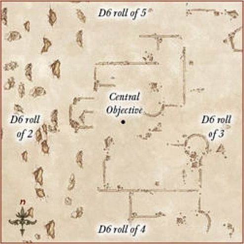
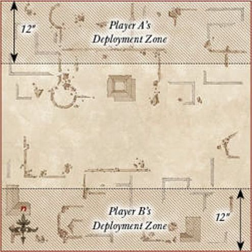
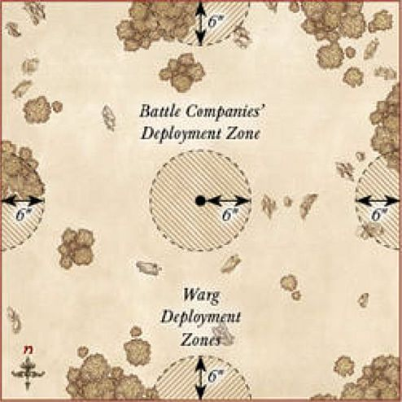
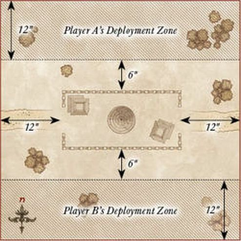
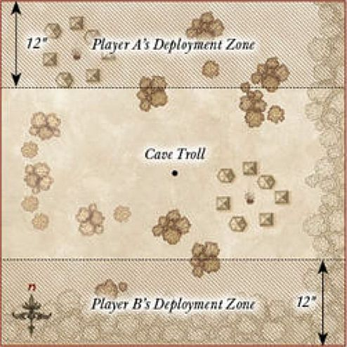
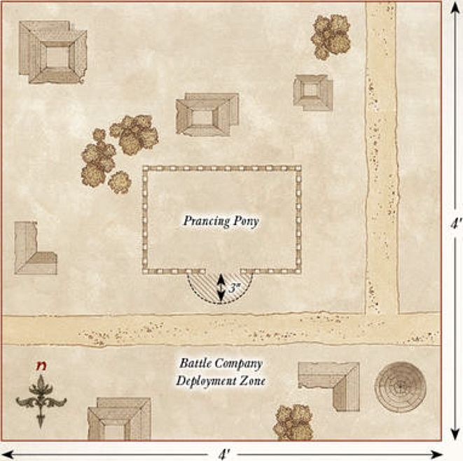
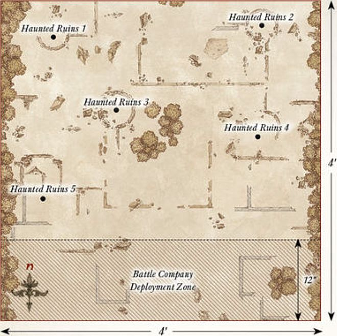
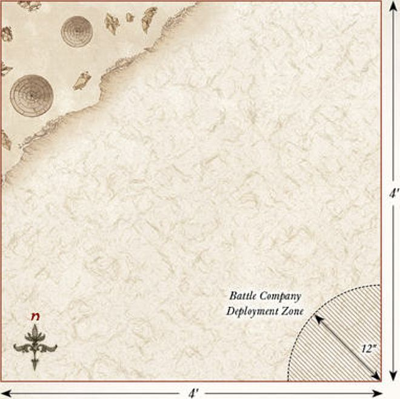
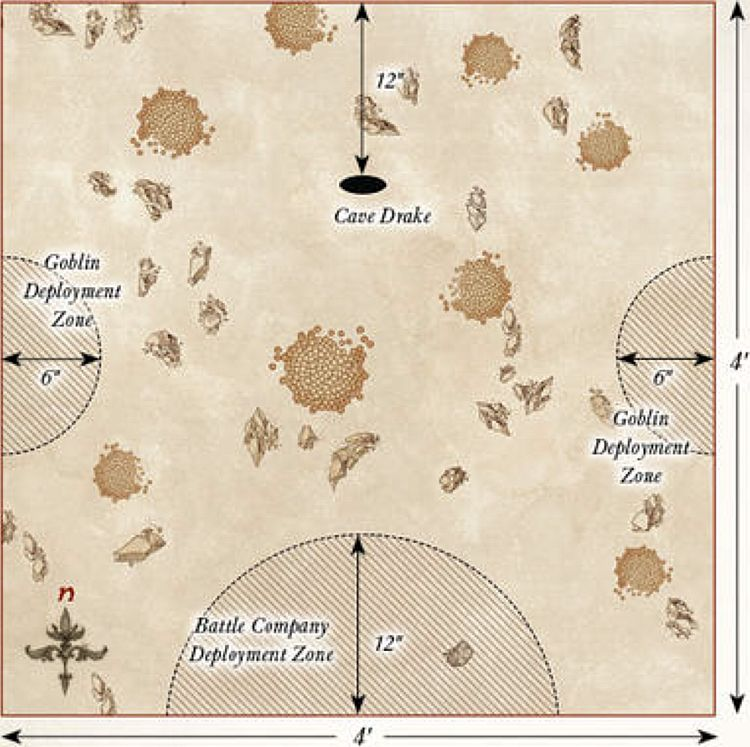

## SEIZE GROUND

**STARTING POSITIONS**

Both players roll a D6, with the highest scoring player choosing their table edge. Players will need five Objective markers. One is placed in the centre of the board. Players then alternate placing the remaining objectives, starting with the player who chose their table edge. No objective can be placed within 8" of the edge of the battlefield, or within 12" of another.

**OBJECTIVES**

Both sides must claim as many key areas of the battlefield as possible. Victory will go to the company who can lay claim to the most.

An objective will only be considered claimed if there are only friendly models within 3" of it. If there are both friendly and enemy models within 3", then it is unclaimed.

Once one Battle Company has been Broken, the game might suddenly end. At the end of each turn after this condition has been met, roll a D6. On the result of 1-2, the game ends — otherwise, the battle continues for another turn!

- **Victory** — Your Battle Company has claimed more objectives than your opponent's. 
- **Defeat** — Your Opponent's Battle Company has claimed more objectives than yours. 
- **Draw** — Both Battle Companies have claimed the same number of
objectives.

---

## SECURE THE AREA

**STARTING POSITIONS**

Place an Objective marker in the centre of the board; this is what both sides are fighting over.

**OBJECTIVES**

Both sides are seeking to lay claim to the objective, and must not only fight their way to it, but also defend it once there.

Once one Battle Company has been Broken, the game might suddenly end. At the end of each turn after this condition has been met, roll a D6. On the result of 1-2, the game ends — otherwise, the battle continues for another turn!

- **Victory** — Your Battle Company has at least twice as many models within 3" of the objective than your opponent's.
- **Defeat** — Your opponent's Battle Company has at least twice as many models within 3" of the objective than yours.
- **Draw** — Any other situation.

**SPECIAL RULES**

* **Wild Search** 

At the end of your Move phase, roll a D6 for each of your models not on the battlefield and consult the chart below (**Hero** models can use Might to alter the roll either up or down). Models can't Charge in the turn that they arrive but otherwise act normally. Roll for each model separately, deploy the model, then roll for the next. Models yet to arrive count as being on the battlefield for the purposes of determining if your force is Broken.

| D6 | Result                         |
|----|---------------------------------------------------------|
| 1 | The model does not arrive yet.             |
| 2 | The model enters the battlefield from the western board edge. |
| 3 | The model enters the battlefield from the eastern board edge. |
| 4 | The model enters the battlefield from the southern board edge. |
| 5 | The model enters the battlefield from the northern board edge. |
| 6 | The model enters the battlefield from any board edge chosen by the controlling player. |

---

## A SHOW OF STRENGTH

**STARTING POSITIONS**

Both players roll a D6, with the highest scoring player choosing their table edge.

They then place their Battle Company within 12" of their chosen edge. Their opponent then places their Battle Company within 12" of the opposite board edge.

**OBJECTIVES**

Whichever leader can slay the most will be the victor. Note that if your leader is missing this game, use the Sergeant in your Battle Company with the highest points cost instead.

The game lasts until the end of a turn in which one Battle Company has been reduced to 25% of its starting models.

- **Victory** — Your leader has killed more models than your opponent's.

- **Defeat** — Your opponent's leader has killed more models than yours.

- **Draw** — Both leaders have killed the same number of models.

---

## CLAIM THE TREASURE

**STARTING POSITIONS**

Both players roll a D6, with the highest scoring player choosing their table edge.

They then place their Battle Company within 12" of their chosen edge. Their opponent then places their Battle Company within 12" of the opposite board edge. Place the objectives as shown on the map.

**OBJECTIVES**

Whichever Battle Company can hold the most objectives will be the winner.

The game lasts until the end of a turn in which one Battle Company has been reduced to 25% of its starting models.

- **Victory** — Your Battle Company holds more objectives than your opponent's. 
- **Defeat** — Your opponent's Battle Company holds more objectives than yours. 
- **Draw** — Both Battle Companies hold the same number of objectives.

**SPECIAL RULES**

* **Objectives**

The six objectives on the board are Light Objects, as detailed on page 109 of the main rules manual. This means that models may pick up and carry the objectives; in fact, a model will only count as holding an objective once they have picked it up. If a model holding an objective flees, it is immediately dropped where they stood before they fled, or as close as possible. Models may carry more than one objective.

---

## DEFEND THE GATE

**STARTING POSITIONS**

Both players roll a D6, with the player who scored lowest becoming the Defender. The Defender deploys their Battle Company within 6" of the gate as shown on the map. The Attacker then places their entire Battle Company within 24" of the southern board edge.

**OBJECTIVES**

The defending player must try to defend the gate by having their Battle Company within 6" of it, whilst keeping the Attacker at bay.

Once one Battle Company is reduced to less than 50% of its starting numbers, the game may suddenly end. At the end of each turn after this condition has been met, roll a D6. On a 1-2 the game ends, otherwise it continues for another turn.

- **Attacker Victory** — The Attacker has more models within 6" of the gate. 
- **Defender Victory** — The Defender has more models within 6" of the gate. 
- **Draw** — Any other result.

**SPECIAL RULES**

* **Let nothing through!**

Models from the Defender's Battle Company automatically pass all Courage tests they are required to make.

---

## RECOVERY

**STARTING POSITIONS**

Both players roll a D6, with the highest scoring player choosing their table edge. Players will need five identical Objective markers, one secretly marked as the relic. These should be mixed up so that neither player knows which is the relic. One is placed in the centre of the board. Players then alternate placing the remaining objectives, starting with the player who chose their table edge. No objective can be placed within 12" of either player's board edge, within 6" of the edge of the battlefield, or within 8" of each other.

All models will walk onto the board from their table edge during their first Move phase.

**OBJECTIVES**

The Battle Companies are searching for the relic, and once it is found, they must escape with it in their grasp.

The game lasts until either the relic has been moved off of one board edge, or there are no models left on the battlefield.

- **Victory** — Your Battle Company has moved the relic off of your opponent's table edge. 
- **Defeat** — Your opponent's Battle Company has moved the relic off your table edge. 
- **Draw** — Neither Battle Company recovers the relic.

**SPECIAL RULES**

* **The Relic**

When a model moves into base contact with an Objective marker, flip it over. If it is not the relic, remove it from the game. If it is the relic, the model takes possession of it and all other markers are removed. The relic is treated as a Heavy Object.

* **The Glories to be Had**

The model that moves the relic off the board will be richly rewarded. If this is a **Warrior**, it will count as rolling A Hero in the Making after the game. If this is a **Hero**, they will receive a free roll on the Experience table, in addition to any other Experience bonuses. If two models simultaneously carry the relic off the board, choose one of them to get the benefits.

---

## CHANCE ENCOUNTER

**STARTING POSITIONS**

Both players roll a D6, with the highest scoring player choosing their table edge.

They then place their Battle Company within 12" of their chosen edge. Their opponent then places their Battle Company within 12" of the opposite board edge.

**OBJECTIVES**

The leaders of both Battle Companies are looking for a quick victory, without taking too many casualties.

The game lasts until the end of a turn in which one Battle Company has been reduced to 25% of its starting models.

- **Victory** — Your opponent's Battle Company has been reduced to 25% of its starting models and yours has not. 
- **Defeat** — Your Battle Company has been reduced to 25% of its starting models and your opponent's has not.
- **Draw** — Both Battle Companies have been reduced to 25% in the same turn.

---

## KILL THE MESSENGER

**STARTING POSITIONS**

Both players roll a D6, with the highest scoring player choosing their table edge.

They then place their Battle Company within 12" of the centre of the board in their half of the board. Their opponent then places their Battle Company within 12" of the centre of the board in the opposite half of the board.

**OBJECTIVES**

Both Battle Companies need to find their enemy's messenger and slay them, but ensure that they keep their own alive.

The game lasts until the end of a turn in which one Battle Company has been reduced to 25% of its starting models.

- **Victory** — Your Battle Company has slain the enemy messenger and yours is alive. 
- **Defeat** — Your opponent's Battle Company has slain your messenger and their messenger is alive. 
- **Draw** — Both messengers are either alive or have been slain.

**SPECIAL RULES**

* **The Messenger**

At the start of the game, secretly note down which of your models is the messenger (this may not be a **Hero**) — they must survive the game. It is important to not reveal if your opponent has killed your messenger during the game, so as not to hand the advantage over to your opponent. The idea of this Scenario is to try to bluff your opponent into thinking that someone who is not your messenger is, so that they kill them instead of the real messenger.

---

## THE WOLVES ATTACK

For this Scenario, you will need 24 Fell Wargs in addition to both player's Battle Companies.

**STARTING POSITIONS**

Both players roll a D6, with the highest scoring player deploying one of their models within 6" of the centre of the battlefield. The other player then deploys one of their models also within 6" of the centre of the battlefield. Players then alternate deploying models as described above until all models from both Battle Companies have been deployed. The Fell Wargs are then split into four equal packs of six, and each pack is deployed within 6" of the centre of a different board edge.

**OBJECTIVES**

Both Battle Companies are fighting for survival against the oncoming Wargs, yet both are still trying to out perform each other.

The game lasts until either all the Fell Wargs have been slain, or both Battle Companies have been wiped out.

- **Victory** — Your Battle Company has models alive and has killed more Fell Wargs than the opposing company. 
- **Defeat** — Your opponent's Battle Company has models alive and has killed more Fell Wargs than your company. 
- **Draw** — Any other result.

**SPECIAL RULES**

* **The Wargs**

This Scenario requires 24 Fell Wargs. The Fell Wargs follow the usual profile for a Fell Warg. They will always move first in each Move phase, even before Heroic Moves, and will Charge the nearest model by the shortest possible route. If this is not possible, they will move as quickly as they can towards the nearest model from either Battle Company.

* **The Enemy of my Enemy**

Both Battle Companies are forced to work together, at least for now, and so the members of both will count as friendly models to each other. Players will still roll for Priority as normal, with the player that won Priority acting with the models from their Battle Company first in each phase if able.

---

## SEIZE THE OUTPOST

For this Scenario, you will need the outpost defenders; these are 4 Orc Warriors with shield, 4 Orc Warriors with spear, 2 Orc Warriors with Orc bow, and 2 Orc Warriors with two-handed weapon.

**STARTING POSITIONS**

Both players roll a D6, with the highest scoring player choosing their table edge. They then place their Battle Company within 12" of their chosen edge. Their opponent then places their Battle Company within 12" of the opposite board edge. Then, starting with the player with Priority, players take it in turns to deploy one model from the outpost's defenders within the confines of the outpost until all have been deployed. The outpost is the area at least 6" away from either deployment zone and at least 12" away from the eastern or western board edge.

**OBJECTIVES**

Both companies are trying to capture the outpost for themselves.

Once the outpost's defenders have been reduced to 50% or less of their starting numbers, the game may suddenly end. At the end of each turn after this condition has been met, roll a D6. On a 1-2 the game ends, otherwise it continues for another turn.

- **Victory** — Your Battle Company has the most models within the outpost. 
- **Defeat** — Your Opponent's Battle Company has the most models within the outpost. 
- **Draw** — Any other result.

**SPECIAL RULES**

* **The Outpost Defenders**

The Orc Warriors follow the usual profile for Orc Warriors found on page 119 of *Armies of The Lord of the Rings*. The Orcs will always move first in each Move phase, even before Heroic Moves, and will charge the nearest model by the shortest possible route. If this is not possible, starting with the player without Priority, players may alternate moving Orcs until all have been moved. Orcs armed with an Orc bow that move in this way may only move up to 3" and must shoot the nearest enemy model in the Shoot phase.

* **Defend the Outpost**

The outpost defenders may not leave the outpost for any reason.

---

## TAME THE BEAST

**STARTING POSITIONS**

A single Cave Troll is placed in the centre of the board. Both players roll a D6, with the highest scoring player choosing their table edge. They then place their Battle Company within 12" of their chosen edge. Their opponent then places their Battle Company within 12" of the opposite board edge.

**OBJECTIVES**

Both companies have made it their mission to slay the Troll, whichever is successful will vastly increase its status within the ranks of their army.

The game continues until either the Troll has been slain, or no other models remain on the board.

- **Victory** — Your Battle Company has slain the Troll. 
- **Defeat** — Your Opponent's Battle Company has slain the Troll. 
- **Draw** — Neither Battle Company has slain the Troll.

**SPECIAL RULES**

* **The Troll**

The Cave Troll follows the usual profile for a Cave Troll. The Troll will always move first in each Move phase, even before Heroic Moves, and will Charge the nearest model by the shortest possible route. If this is not possible, the player without Priority may move the Troll its full Move in a direction of their choice.

* **The Trollslayer**

Slaying a Troll is no easy feat, and a model who accomplishes this is clearly set for great things. If this is a **Warrior,** it will count as rolling A Hero in the Making after the game. If this is a **Hero,** they will receive a free roll on the Experience table, in addition to any other Experience bonuses.

---

## HOLD THE LINE

**STARTING POSITIONS**

The board should have a road running through the centre of it from north to south. Both players then roll a D6, with the player who scored lowest becoming the Defender. The Defender then deploys their Battle Company within 6" of the centre of the board. The Attacker moves their Battle Company onto the board from the southern board edge during their first Move phase.

**OBJECTIVES**

The attacking Battle Company must have as many of their models escape the board via the northern board edge, whilst the Defenders must attempt to prevent them.

The game lasts until the Attacker has no more models left on the battlefield.

- **Attacker Victory** — At least 33% of the Attacker's Battle Company escaped the board via the northern board edge. 
- **Defender Victory** — Less than 33% of the Attacker's Battle Company escaped the board via the northern board edge 
- **Draw** — This Scenario cannot be drawn.

**SPECIAL RULES**

* **Rewards of Escape**

Any models that successfully escapes the board via the northern board edge will gain an additional 1 Experience Point.

---

## STAND YOUR GROUND

**STARTING POSITIONS**

In the centre of the board there should be a hill with a diameter of no larger than 12". Both players roll a D6, with the lowest scoring player becoming the Defender. The Defender deploys their Battle Company anywhere upon the hill. The Attacker may then deploy their Battle Company anywhere at least 6" away from the hill.

**OBJECTIVES**

The Defender has been tasked with keeping the hill at all costs, whilst the Attacker must take it for their cause.

The game lasts until the end of a turn in which one Battle Company has been reduced to 25% of its starting models.

- **Attacker Victory** — The Attacker has more models on the hill. 
- **Defender Victory** — The Defender has more models on the hill. 
- **Draw** — Both Battle Companies have the same number of models on the hill.

**SPECIAL RULES**

* **Defend the Hill**

Models on the hill do not need to take Courage tests for being Broken.

---

## RESCUE

**STARTING POSITIONS**

Both players roll a D6, with the player who scored lowest becoming the Defender. The Defender selects one **Hero** from their Battle Company that they must rescue and places them in the centre of the board, along with up to two **Warrior** models from their Battle Company that are deployed within 3" of the **Hero**. The Attacker then places their entire Battle Company within 15" of any board edge.

**OBJECTIVES**

The defending player must try to save their **Hero** whilst trying to fend off their attackers. The attacking player must slay their target before they suffer enough casualties to force them to retreat.

The game ends when either the target **Hero** is slain, or the Attacker's Battle Company is reduced to less than 50% of its starting numbers.

- **Attacker Victory** — The Defender's **Hero** has been slain. 
- **Defender Victory** — The Attacker's Battle Company has been reduced to less than 50% of its starting models. 
- **Draw** — Both sides achieve their objective in the same turn.

**SPECIAL RULES**

* **Surprise Ambush**

The Attacker always has Priority in the first turn.

* **To the Rescue!**

The rest of the Defender's Battle Company moves onto the board from the opposite board edge to the Attacker at the end of the first turn.

* **Against the Odds**

Should the target **Hero** survive, they will gain an additional 1 Experience Point.

---

## PLUNDER THE CAMP

**STARTING POSITIONS**

The board will require a camp. This should be the area within 6" of the centre of the board marked with fences, hedges or other similar features. The camp should contain a few tents, huts or similar. Both players roll a D6, with the lowest scoring player becoming the Defender. The Defender deploys their Battle Company anywhere within the camp. The Defender then places five Objective markers anywhere within the camp, at least 2" away from each other. The Attacker may then deploy their Battle Company anywhere at least 6" away from the camp.

**OBJECTIVES**

The Attacker must set the objectives alight, destroying the Defender's provisions and equipment, and rendering them all but helpless.

Once one Battle Company has been Broken, the game might suddenly end. At the end of each turn after this condition has been met, roll a D6. On the result of 1-2, the game ends — otherwise, the battle continues for another turn!

- **Attacker Victory** — At least four objectives have been set alight. 
- **Defender Victory** — No more than two objectives have been set alight. 
- **Draw** — Three objectives have been set alight.

**SPECIAL RULES**

* **The Dark of Night**

Due to the reduced visibility, models cannot be targeted by shooting, Magical Powers or special abilities over 6" away. However, as it is much harder to avoid a shot in the dark, all shooting attacks gain a bonus of +1 when rolling To Wound.

* **Light the Fires!**

During the End phase, any attacking model that is in base contact with an Objective marker that did not make a Shooting attack or participate in the Fight phase (including supporting) may attempt to set it alight. Roll a D6. On a 4+, the objective is set alight. Once a marker is alight it cannot be put out, the flames are too unruly. Any model that moves, or is moved, into base contact with a lit objective is immediately Set Ablaze. A model that has a torch automatically counts as having rolled a 4+ when attempting to set an objective alight.

The area within 2" of a lit objective counts as daylight, so models in this area can be seen from any distance.

* **All or Nothing**

Should the Attacker set all five objectives alight, they will receive an additional 1 Influence Point at the end of the Scenario. Should the Defender prevent all objectives from being set alight, they will receive an additional 1 Influence Point at the end of the Scenario.

---

## A DARING RESCUE

**STARTING POSITIONS**

The player who is attempting to rescue their **Hero** is automatically the Attacker. The Attacker places the captured **Hero** in the centre of the board. The Defender then places their entire Battle Company anywhere within 3" of the centre of the board. The Attacker then places their Battle Company anywhere at least 12" from the any enemy model.

**OBJECTIVES**

The Attacker is trying to rescue their **Hero** from enemy hands, whilst the Defender is trying to fend off their foes or, if battle is going ill, slay their prisoner before they can be rescued.

The game lasts until either the captured **Hero** escapes the board or is slain.

- **Attacker Victory** — The captured **Hero** moves off the board via any table edge. 
- **Defender Victory** — The captured **Hero** is slain. 
- **Draw** — Any other result.

**SPECIAL RULES**

* **The Prisoner**

The captured **Hero** is still a member of the Attacker's Battle Company, and will move as such in each Move phase. Enemy models may not Charge the prisoner until either the Defender's Battle Company has been Broken, the prisoner Charges a Defender's model, or the prisoner has been freed.

* **Shackled by the Enemy**

The prisoner has had their hands bound by their captors and their weapons and other wargear taken from them. The **Hero** counts as unarmed and is without any wargear such as shields, bows or other equipment (though they do still keep their armour). Whilst bound, the prisoner may only ever make a single Attack and may not declare Heroic Actions. An Attacker's model may free the prisoner from their bonds during the End phase of any turn in which they are in base contact with the prisoner and did not participate in a Fight in the preceding Fight phase. Once the prisoner has been freed, they no longer count as being unarmed — they count as being armed with a dagger for the remainder of the Scenario.

---

## BAGGAGE TRAIN

**STARTING POSITIONS**

Both players roll a D6, with the highest scoring player becoming the Attacker.

The Defender deploys their Battle Company within 6" of the centre of the southern board edge. They also then deploy five Baggage Ponies touching the southern board edge; riderless horses are ideal for using as the Baggage Ponies. The Attacker then splits their force into two equal halves. They deploy one half within 3" of the eastern board edge, and the other within 3" of the western board edge.

**OBJECTIVES**

The Defender is trying to escape to safety with as many of their Baggage Ponies as possible. The Attacker is trying to prevent the Defender from doing so, and in return claim the cargo for themselves.

The game lasts until either Battle Company has been reduced to 25% of their starting number.

- **Attacker Victory** — At least three pieces of cargo and at least one model that is not a Baggage Pony have escaped the board via the northern board edge. 
- **Defender Victory** — The Defender has at least three pieces of cargo in their possession at the end of the game. 
- **Draw** — Any other result.

**SPECIAL RULES**

* **Baggage Ponies**

This Scenario requires five Baggage Ponies, which will use the profile below. These ponies are moved as part of the Defender's company, but may never Charge an enemy model. Baggage Ponies do not count towards the Defender's Break Point, and do not generate Experience Points if killed during the game. Each Baggage Pony is carrying a single piece of cargo.

| Mv | F  | S | D | A | W | C |
|:----:|:----:|:---:|:---:|:---:|:---:|:---:|
| 8" | 1/6+ | 3 | 4 | 1 | 1 | 2 |

* **Cargo**

The Baggage Ponies all carry some valuable cargo, gold, weapons or other items that are of use.

If a Baggage Pony is slain or flees the battlefield, place a 25mm Cargo marker where the model used to be. Any model can pick up a Cargo marker by moving into base contact with it; cargo is a Light Object. For each piece of cargo moved off the board via the northern board edge, the Defender gains an additional 1 Influence Point. For each piece of cargo in the Attacker's possession at the end of the game, the Attacker gains an additional 1 Influence Point.

---

## INFILTRATE & ASSASSINATE

**STARTING POSITIONS**

The board will require a camp. This should be the area within 6" of the centre of the board marked with fences, hedges or other similar features. The camp should contain a few tents, huts or similar. Both players roll a D6, with the lowest scoring player becoming the Defender. The Defender deploys their Battle Company anywhere within the camp with their leader (or most expensive **Hero** if their leader is missing the game) in the middle of the board. The Attacker may then deploy their Battle Company anywhere at least 6" away from the camp. 

**OBJECTIVES**

The Attacker must try to slay the enemy leader without suffering too many casualties, whilst the Defender must try to keep their leader alive.

The game ends when either the Defender's **Hero** is slain, or the Attacker's Battle Company is reduced to less than 50% of its starting numbers.

- **Attacker Victory** — The Defender's **Hero** has been slain. 
- **Defender Victory** — The Attacker's warband has been reduced to less than 50% of its starting models. 
- **Draw** — Both objectives have been completed in the same turn.

**SPECIAL RULES**

* **Sentries**

All of the Defender's models start as Sentries.

Before each Sentry takes their Move phase, the controlling player must roll on the chart below to see how they get to move this turn.

**SENTRY CHART**

| D6  | Result                                           |
|------|--------------------------------------------------------------------------------------------|
| **1**  | The Sentry is searching around in its vicinity. It may not Move this turn.         |
| **2-3** | The Sentry has been distracted by a noise elsewhere on the board. The opposing player may move the model up to half of its Move allowance in any direction. |
| **4-5** | The Sentry walks carefully to where they believe an intruder to be, the controlling player may move the model up to 3" in any direction. |
| **6**  | The Sentry is convinced it has spotted an intruder and moves as quickly as possible to investigate. The model may move as normal. |

If, during the End phase of any turn, there is an unengaged Sentry within 3" and Line of Sight of an enemy model then the alarm has been raised. Once the alarm has been raised, all Sentries revert back to the normal rules for movement for the remainder of the game.

* **The Slayer of Men**

If the Attacker successfully slays the Defender's **Hero**, then the model that did so will be rewarded. If this is a **Warrior**, it will count as rolling A Hero in the Making after the game. If this is a **Hero,** they will receive a free roll on the Experience table, in addition to any other Experience bonuses.

---

## NARRATIVE SCENARIO 1 - SKIRMISH IN BREE

**LAYOUT**

The board represents the village of Bree, and as such should have plenty of houses and buildings on the board. In the centre should be the Prancing Pony, with the door facing towards the southern board edge.

**STARTING POSITIONS**

The Battle Company deploys within 3" of the front door of the Prancing Pony. The Ruffians then deploy anywhere at least 12" away from any member of the Battle Company — it is a good idea to spread them out so that they can cover all routes of escape.

**OBJECTIVES**

Your company must evade the clutches of the Ruffians and escape the village of Bree unscathed. The Ruffians are trying to beat down the company in order to claim whatever riches they can. The game lasts until there are no models from the Battle Company left on the board.

- **Victory** — At least 50% of your Battle Company escape the board via the required board edge. 
- **Defeat** — Less than 25% of your Battle Company escape the board via the required board edge.
- **Draw** — Any other result.

**SPECIAL RULES**

* **Escape the Village**

The company must escape Bree, and they aren't too bothered in what way they manage this.

At the start of the game, after both forces have been deployed, roll a D6 to find out which board edge the Battle Company must escape from.

| D6 | Result                                                               |
|----|----------------------------------------------------------------------|
| 1  | The Ruffian player may choose which board edge the company must escape from. |
| 2  | The company must escape via the eastern board edge.                 |
| 3  | The company must escape via the western board edge.                 |
| 4  | The company must escape via the northern board edge.                |
| 5  | The company must escape via the southern board edge.                |
| 6  | The Battle Company's controlling player may choose which board edge the company must escape from. |

* **A Petty Squabble**

Ruffians may not use their bows in the Shoot phase.  Additionally, all members of your company removed as a casualty automatically make a Full Recovery. There is no need to roll.  

* **Important Knowledge**

If the leader of your company is removed as a casualty then the best result the company can achieve is a draw.

**PARTICIPANTS**

Your Battle Company.

12 Ruffians.

**REWARDS**

If you were victorious in the Scenario, roll on the chart below to see what reward your Battle Company receives.

| D6 | Result                                                                                                        |
|----|---------------------------------------------------------------------------------------------------------------|
| 1  | Your company gains an additional 1 Influence Point. |
| 2  | One **Hero** in your company may add a Dwarven Brew to their equipment. |
| 3  | Permanently add a Ruffian to your Battle Company. They cannot gain Experience and therefore cannot become a **Hero**. |
| 4  | Each member of your company may exchange their hand weapon for any other kind of hand weapon without spending Influence Points. |
| 5  | Add a Local Scout to your company's roster. |
| 6  | Your leader may be mounted on a horse without spending Influence Points, even if they couldn't usually do so. |

**WHAT IF I'M USING AN EVIL BATTLECOMPANY?**

If you are playing an Evil Battle Company, then the Breelanders are probably more likely to be trying to protect their lands rather than rob your company. Any members of your company that are removed as a casualty must roll for Injuries as normal. If you roll a 6 on the Rewards table, it is safe to assume that your Battle Company stole the horse, rather than were gifted it!

---

## NARRATIVE SCENARIO 2 - RUINS OF ANNÚMINAS

**LAYOUT**

The board represents the ruins of the seat of Annúminas, and should be covered in ruins and rubble. Five of the sections of ruins should be more substantial than the rest but not within 12" of the southern board edge; these are where the markers will be placed for the Haunted Ruins. The edges of the eastern and western board edges should be densely packed with trees and bushes.

**STARTING POSITIONS**

The Angmar player splits their Orcs into five equal groups, and then deploys each group anywhere within a different ruin. The Barrow-wight is kept aside for later. The Battle Company is deployed anywhere within 12" of the southern board edge.

**OBJECTIVES**

The company must clear the ruins of their foes, before they are themselves forced out by the Orcs and evil spirits.

The game lasts until the end of a turn in which one force has completed their objective.

- **Victory** — The Barrow-wight has been slain. 
- **Defeat** — Your Battle Company has been wiped out. 
- **Draw** — Both sides complete their objective in the same turn.

**SPECIAL RULES**

This Scenario uses the rules for Haunted Ruins provided on **page 85**. The Barrow-wight does not deploy as usual, but instead deploys using the rules for the Haunted Ruins. However, the Barrow-wight will act under the control of the Evil player rather than as described on **page 85**.

* **Fell Beings of Angmar**

All Orc models from the Angmar force gain the Terror special rule whilst within 3" of the Barrow-wight.

* **Slayer of Spirits**

Any model that slays the Barrow-wight gains an additional 1 Experience Point.

**PARTICIPANTS**

Your Battle Company.

1 Barrow-wight, 4 Angmar Orcs with shield, 4 Angmar Orcs with spear, 2 Angmar Orcs with two-handed weapon,  2 Angmar Orcs with Orc bow, 3 Orc Trackers.

**REWARDS**

If you were victorious in the Scenario, roll on the chart below to see what reward your Battle Company receives.

| D6 | Result                                                                                                                                                                    |
|----|---------------------------------------------------------------------------------------------------------------------------------------------------------------------------|
| 1  | Your Battle Company gains an additional 1 Influence Point.                              |
| 2  | Do not make any Injury rolls for the members of your company — they all count as making a Full Recovery. |
| 3  | One **Hero** in your company may have this Ancient Dagger. This is a dagger. Additionally, when making Strikes with the Ancient Dagger, the bearer never needs more than a 5+ To Wound an enemy. |
| 4  | Your leader gains the Healing Herbs piece of equipment. |
| 5  | The leader of your Battle Company may have the Barrow-wight's blade. This is a sword with the Bane of Kings special rule. |
| 6  | One Hero in your company may have this stone shard — this is a small piece of wargear. Once per game, so long as the bearer is on the battlefield, the controlling player may choose to re-roll their Priority roll. |

**WHAT IF I'M USING AN EVIL BATTLECOMPANY?**

There is no difference in this Scenario. The Orcs are still trying to kill you and you must still slay the Barrow-wight in order to claim victory!

---

## NARRATIVE SCENARIO 3 - AMBUSH IN THE HILLS

**LAYOUT**

The board represents your Battle Company's campsite and the hills that surround it. In the centre of the board is a campfire. There should be four hills placed as shown on the map.

**STARTING POSITIONS**

Your Battle Company deploys within 3" of the campfire. The Wargs then deploy anywhere upon any hill.

**OBJECTIVES**

Your company must fend off the Wargs quickly, before their howls draw even more to your camp. Should your company manage to fell the pack's leader, the other Wargs may begin to flee. Once the Warg force has been Broken, the game may suddenly end. At the end of each turn after this condition has been met, roll a D6. On the result of 1-2, the game ends — otherwise, the battle continues for another turn!

- **Victory** — Your Battle Company is unbroken. 
- **Defeat** — Your Battle Company has been wiped out. 
- **Draw** — Any other result.

**SPECIAL RULES**

* **Fog on the Hills**

All models on the battlefield can only see up to a distance of 6".

* **The Bonfire**

Models within 6" of the bonfire can be seen at distances up to 12". Additionally, Wild Wargs (but not the Chieftain) must pass a Courage test in order to Charge an enemy model within 3" of the bonfire.

* **The Pack Leader**

Whilst the Wild Warg Chieftain is alive, the Warg force does not break. As soon as the Wild Warg Chieftain has been slain, the Warg force will immediately break.

* **Ravenous Wargs**

The Wargs must always move towards the Battle Company, charging if possible.

**PARTICIPANTS**

Your Battle Company.

1 Wild Warg Chieftain, 18 Wild Wargs.

**REWARDS**

If you were victorious in the Scenario, roll on the chart below to see what reward your Battle Company receives.

| D6  | Result |
|-----------|-------------|
| 1         | Your company immediately gains an additional 1 Influence Point. |
| 2         | One **Hero** in your Battle Company may be given a Concealing Cloak. |
| 3         | One **Hero** in your Battle Company may wear the Warg Pelt. Whilst they do, they cause Terror. |
| 4         | Permanently add a Dúnedain to your Battle Company. They cannot gain Experience and will roll on the Hero Injury chart when necessary. |
| 5         | Your Battle Company's leader (or another **Hero,** if they did not participate in the game) gains a single Point of either Might, Will or Fate, up to the maximum for their chosen path. |
| 6         | One **Hero** in your company may add a great bow to their wargear. |

**WHAT IF I'M USING AN EVIL BATTLECOMPANY?**

If you roll a 4 on the Rewards chart, you do not gain a Dúnedain for your company. Instead, you may make an additional free roll on your company's Reinforcement chart instead.

---

## NARRATIVE SCENARIO 4 - ICEBAY OF FOROCHEL

**LAYOUT**

The board represents the banks of the Icebay of Forochel, and the ice that protrudes over the lake. Draw a line between the centre of the northern board edge and the centre of the western board edge; everything towards the north-west of that line is the banks of the Icebay as shown on the map, and should include the odd pile of rocks or small houses. The rest of the board is the sheet ice that extends out over the lake.

**STARTING POSITIONS**

Your Battle Company deploys anywhere within 12" of the south-east corner of the board. The Tribesfolk force then deploys anywhere on the banks of the Icebay.

**OBJECTIVES**

The company must reach the relative safety of the banks of the Icebay before they suffer too many casualties. The game lasts until the end of a turn in which one force completes their objective.

- **Victory** — All surviving members of your Battle Company are wholly within the banks of the Icebay during the End phase of a turn. 
- **Defeat** — Your Battle Company has been reduced to 25% of its starting numbers.
- **Draw** — Both sides complete their objective in the same turn.

**SPECIAL RULES**

* **Treacherous Footing**

The ice follows the same rules for Slippery Walkways, as presented on **page 87**.

* **Breaking the Ice**

At the end of each model's Movement where they are at least partially on the ice, roll a D6. On a 2+ everything is fine. On the roll of a 1, they slip — roll a further D6. On a 6, the model keeps their footing, however, they may only move half their Move allowance next turn. On a 2-5, the model is knocked Prone. On the roll of a 1, the ice breaks and the model falls into the freezing waters of Forochel — remove the model as a casualty. Any model from your Battle Company removed in this way suffers a -1 penalty when making their Injury roll.

**PARTICIPANTS**

Your Battle Company.

2 Tribesfolk Captains, 4 Tribesfolk with shield, 4 Tribesfolk with two-handed axe, 4 Tribesfolk with bow.

*\*The Tribesfolk Captains use the same profile as the Dunlending Captain, the Tribesfolk use the same profile as Dunlending Warriors.*

**REWARDS**

If you were victorious in the Scenario, roll on the chart below to see what reward your Battle Company receives.

**D6 Result**

| D6 | Result                                                                                                                                                                        |
|----|-------------------------------------------------------------------------------------------------------------------------------------------------------------------------------|
| 1  | Your Battle Company gains an additional 1 Influence Point.                                       |
| 2  | Do not make any Injury rolls for the members of your company — they all count as making a Full Recovery. However, models that were removed as a casualty by falling through the ice must still roll as normal. |
| 3  | Permanently add one Tribesfolk to your company. The Tribesfolk follows the profile for a Dunlending Warrior. |
| 4  | Permanently add a Sage to your Battle Company. |
| 5  | One **Hero** in your Battle Company may have this amulet. Whenever a friendly model within 6" of the bearer suffers a wound, roll a D6. On the roll of a Natural 6 the wound is ignored. |
| 6  | One **Hero** in your company can be given a Master-forged two-handed axe. |

**WHAT IF I'M USING AN EVIL BATTLECOMPANY?**

If you are using an Evil Battle Company, then if your company is victorious and rolls a 4, do not add a Sage to your company. Instead you may add a Shaman to your Battle Company, as described on **page 26**.

---

## NARRATIVE SCENARIO 5 - THE DRAKE'S TREASURE

**LAYOUT**

The board represents the Cave Drake's lair, and as such should be dotted with rocks and piles of its treasure hoard. The treasure piles should be placed so that models can move over them, though they will count as difficult terrain (walking over piles of gold is no easy feat!).

**STARTING POSITIONS**

The Cave Drake is deployed 12" from the centre of the northern board edge, as shown on the map. The Battle Company is then deployed anywhere within 12" of the centre of the southern board edge. The Goblins are split into two equal groups; one group is deployed within 6" of the centre of the eastern board edge, the other is deployed within 6" of the western board edge.

**OBJECTIVES**

This is a fight to the death; the company must slay the Cave Drake and the Goblins, or die in the attempt. The Scenario continues until once force is wiped out — it's do or die!

- **Victory** — The Cave Drake and all Goblins have been slain. 
- **Defeat** — The Battle Company has been wiped out. 
- **Draw** — Both forces are wiped out in the same turn.

**SPECIAL RULES**

* **The Last Stand** 

The company knows that this is their final test, and they will not back down under any circumstances. Neither side will Break in this Scenario, they will simply fight until one side has been wiped out!

* **The Drake's Lair**

The company has entered the Cave Drake's nest, and it will ferociously protect it at any cost. Do not place a marker for the Cave Drake's Protect the Nest special rule as normal; instead, the Cave Drake always counts as being within 3" of the marker and so will always gain the benefits.

**PARTICIPANTS**

Your Battle Company.

Cave Drake, 4 Moria Goblins with shield, 4 Moria Goblins with spear, 4 Moria Goblins with bow.

**REWARDS**

If you were victorious in the Scenario, roll on the chart below to see what reward your Battle Company receives. In addition, your Battle Company receives D6+6 Influence Points for winning, rather than the normal amount.

**D6 Result**

| D6 | Result                                                                                                                                                                          |
|----|---------------------------------------------------------------------------------------------------------------------------------------------------------------------------------|
| 1  | Every **Hero** in your Battle Company gains a single Point of either Might, Will or Fate — this can even be used to take your **Hero** above the usual maximum of 3/3/3. |
| 2  | **Armour of Arthedain** — A single **Hero** in your Battle Company may be given the Armour of Arthedain. This is heavy armour. Additionally, a model wearing this armour will only ever suffer a wound on the roll of a natural 6. |
| 3  | **Circlet of Annúminas** — A single **Hero** in your Battle Company may be given the Circlet of Annúminas. A model wearing this always counts as having had the Fortify Spirit Magical Power cast upon them. This is always in effect, even if the **Hero** has 0 Will remaining. |
| 4  | **Shield of Arnor** — A single **Hero** in your Battle Company may be given the Shield of Arnor. This is a shield. Additionally, each time an enemy model makes a Strike against a model with the Shield of Arnor and fails To Wound them, roll a D6. On a 6, the model that made the Strike suffers a wound. |
| 5  | **Daggers of Gondolin** — A single **Hero** in your Battle Company may be given the Daggers of Gondolin. These are a pair of Elven-made daggers. Additionally, the bearer of these daggers adds 1 to their Attacks characteristic when they fight with them and may re-roll failed To Wound rolls when making Strikes. A model with these daggers may not use a shield or missile weapon when they fight with them. |
| 6  | **Axe of the Blue Mountains** — A single **Hero** in your Battle Company may be given the Axe of the Blue Mountains. This is a Master-forged two-handed axe. Additionally, each wound dealt by this weapon is subject to the Mighty Blow special rule. |

Results 2-6 will add an extra 30 points to the value of whichever model is carrying the item they have gained when working out your Battle Company's Rating.

**WHAT IF I'M USING AN EVIL BATTLECOMPANY?**

There is no difference in this Scenario.

---

## RESCUE THE COMPANY

**PARTICIPANTS**

Players choose their force, as described in the main rules manual, to an equal points value before the game. The player with the Battle Company is automatically the Defender.

**LAYOUT**

Set up terrain as described in the main rules manual. The centre of the board should have a selection of terrain that is defensible, representing where the Battle Company has been hiding.

**STARTING POSITIONS**

The Defender deploys the leader of their Battle Company in the centre of the board, and then deploys the remaining members of the Battle Company within 6" of the leader. The Attacker then deploys their force at least 12" from the centre of the board and at least 9" away from any board edge. The Defender then deploys the remainder of their force anywhere within 3" of any board edge.

**INITIAL PRIORITY**

Both players roll a D6. The player with the highest score has Priority in the first turn.

**OBJECTIVES**

The game lasts until the end of a turn in which one force has been reduced to a quarter (25%) of its starting number of models, or below, at which point, the force that has scored the most Victory Points wins the game. If both players have the same number of Victory Points, the game is a draw.

Victory Points are scored for the following:

- The Attacker scores **1 Victory Point** for causing one or more Wounds on the Battle Company leader (Wounds prevented by a successful Fate roll do not count). If they kill the Battle Company leader, they instead score **3 Victory Points**.

- The Defender scores **1 Victory Point** if the Battle Company leader is alive at the end of the game. If the Battle Company leader is alive and has suffered no Wounds, they instead score **3 Victory Points**.

- You score **3 Victory Points** if the enemy force is Broken at the end of the game. If the enemy force is Broken and your force is unbroken, you instead score **5 Victory Points**.

- If there are at least 50% of the models from the Battle Company alive at the end of the game, the Defender scores **2 Victory Points**. If the Battle Company has been reduced to 25% or less of its starting numbers, the Attacker scores **2 Victory Points**.

- You score **1 Victory Point** if you have at least one banner remaining at the end of the game. If you have at least one banner remaining and your opponent has none remaining then you instead score **2 Victory Points**.

**SPECIAL RULES**

* **Fight to the Last!**

Members of the Battle Company do not take Courage tests for being Broken.

---

## THE GRAND BATTLE

**PARTICIPANTS**

Players choose their force, as described in the main rules manual, to an equal points value before the game.

**LAYOUT**

Set up terrain as described in the main rules manual.

**STARTING POSITIONS**

Both players roll a D6 — the player with the highest result chooses one of the deployment zones. They then select a warband in their force to deploy within 24" of their board edge. Models may not be deployed further than 6" from the captain of their warband.

When this has been done, the opposing player chooses one of their warbands and deploys it within 24" of their board edge as described above. Players then alternate until all warbands have been placed.

Both players' Battle Companies are kept to one side — these will be available later in the game.

**INITIAL PRIORITY**

Both players roll a D6. The player with the highest score has Priority in the first turn.   

**OBJECTIVES**

The game lasts until the end of a turn in which one force has been reduced to a quarter (25%) of its starting number of models or below, at which point, the force that has scored the most Victory Points wins the game. If both players have the same number of Victory Points, the game is a draw.

Victory Points are scored for the following:

- You score **1 Victory Point** for causing one or more Wounds on the enemy leader (Wounds prevented by a successful Fate roll do not count). If you kill the enemy leader, you instead score **3 Victory Points**.

- You score **1 Victory Point** if the enemy force is Broken at the end of the game. If the enemy force is Broken and your force is unbroken, you instead score **3 Victory Points**.

- You score **1 Victory Point** if you have slain at least half of the models in your opponent's Battle Company. If your Battle Company also has at least half of its models left alive, you instead score **3 Victory Points**.

- You score **1 Victory Point** if you have at least one banner remaining at the end of the game. If you have at least one banner remaining and your opponent has none remaining then you instead score **2 Victory Points**.

- If the leader of your Battle Company slays an enemy Hero in combat, you score **1 Victory Point**.

**SPECIAL RULES**

* **Relief Force**

At the end of each player's third Move phase, they may move their Battle Company onto the battlefield from the centre of either of the board edges that were not chosen as a player's deployment zone, as shown on the map. The player with Priority may choose which of these board edges they want their Battle Company to move on from, and their opponent will move their company on from the centre of the opposite board edge. Battle Companies move onto the board via the rules for Reinforcements found in the main rules manual.

