## CROSSING OF THE RIVER CARNEN

**LAYOUT**

The board represents the River Carnen and the surrounding area. There should be a 6" wide river running through the centre of the board from north to south. In the centre of the board, there should be a ford that is at least 6" wide that crosses the river, allowing for an easy place for the forces to cross. The rest of the board should be relatively barren and dotted with the odd tree, bush, and hedge.

**STARTING POSITIONS**

The Good player deploys their forces within 12" of the western board edge. The Evil player then deploys their force within 12" of the eastern board edge.

**OBJECTIVES**

Brand has come to the banks of the River Carnen to negotiate with the Easterlings; however, Sauron's army will not be dissuaded and is intent on crossing the river and marching to war.

The game lasts for 10 turns. The Evil player wins if at least 33% of their models have reached the western side of the river by the end of the game. The Good player wins if they can prevent this. Additionally, if Brand is slain, the best result the Good player can achieve is a draw.

**SPECIAL RULES**

* **The River**

The River counts as Deep Water.

* **Onwards to Erebor!**

Easterling models may re-roll failed To Wound rolls in the Fight phase.

**PARTICIPANTS**

**Good:** Brand, King of Dale; Captain of Dale with shield; 20 Warriors of Dale: 6 with shield, 8 with spear and shield, 6 with Esgaroth bow.

**Evil:** Rutabi, General of the Dragon Legion; Easterling Captain with armoured horse, sword and shield; Easterling War Priest; 20 Easterling Warriors: 8 with shield, 4 with pike and shield, 8 with bow; 5 Easterling Kataphrakts.

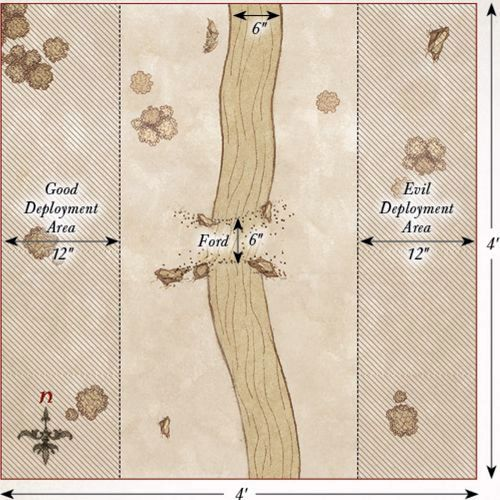

---

## THE HOSTS CLASH

**LAYOUT**

The board represents the lands between Erebor and Dale. The lands themselves are relatively barren and should have a few hedges, bushes, rocky outcrops, and other shrubbery dotted around.

**STARTING POSITIONS**

The Good player deploys their forces within 12" of the northern board edge. The Evil player then deploys their forces within 12" of the southern board edge.

**OBJECTIVES**

The Battle of Dale has begun, embroiling both sides in a desperate war. The game lasts for 15 turns; at which point the side which has killed the highest number of points worth of models is the winner.

**SPECIAL RULES**

* **To War!**

Models from both sides, apart from those armed with a bow, Esgaroth bow, or crossbow, must Charge if able to do so.

* **A Bond Forged in War**

If either Dáin or Brand would be Trapped in the Fight phase, then the other may declare a Heroic Combat without spending Might. If successful, they must join their Trapped ally's fight if possible. If this is not possible, they must move as close as possible to their Trapped ally.

* **Heroes of the Easterlings**

Easterling Hero models may re-roll a D6 in a Duel roll.

**PARTICIPANTS**

**Good:** Brand, King of Dale; Bard II, Prince of Dale; Dáin Ironfoot, King Under the Mountain; Thorin III Stonehelm; Captain of Dale with shield; Iron Hills Captain; 22 Warriors of Dale: 6 with shield, 8 with spear and shield, 6 with Esgaroth bow, 1 with banner, 1 with war horn; 12 Knights of Dale; 25 Iron Hills Dwarves: 12 with spear, 6 with mattock, 6 with crossbow, 1 with banner.

**Evil:** The Dragon Emperor of Rhûn; Rutabi, General of the Dragon Legion; Brórgîr the Conjurer; Easterling Captain with armoured horse, sword and shield; Easterling War Priest; Easterling Dragon Knight; 31 Easterling Warriors: 12 with shield, 6 with shield and pike, 12 with bow, 1 with banner; 5 Easterling Kataphrakts; 18 Black Dragons: 9 with shield, 9 with pike and shield; 12 Dragon Cult Acolytes; 4 Rhûnish War Drakes.

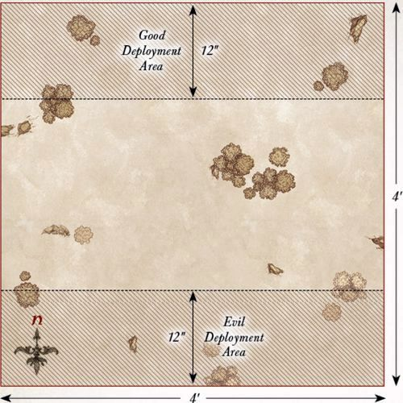

---

## PLAINS OF EREBOR

**LAYOUT**

The board represents the lands between Erebor and Dale. The lands themselves are relatively barren and should have a few hedges, bushes, rocky outcrops, and other shrubbery dotted around. There should be three Objective Markers on the board. The first is placed in the center of the board. One is placed halfway between the center of the board and the north-east corner, while the final one is placed halfway between the center of the board and the north-west corner.

**STARTING POSITIONS**

The Good player deploys their models anywhere within the northern half of the board. The Evil player then places their models anywhere within the southern half of the board, but not within 1" of an enemy model.

**OBJECTIVES**

The Easterlings have begun to force the alliance of Men and Dwarves back and now look to claim key areas of the battlefield. The game lasts for 10 turns. The Good player wins if they control at least two objectives at the end of the 10th turn. The Evil player wins if they control at least two objectives at the end of the 10th turn. Any other result is a draw.

**SPECIAL RULES**

* **Controlling Objectives**

An army is considered to be controlling an Objective Marker if there are more friendly models within 3" of the marker than enemy models. If both sides have the same number of models within 3", then neither side controls that Objective Marker.

* **A Bond Forged in War**

If either Dáin or Brand would be Trapped at the start of the Fight phase, then the other may declare a Heroic Combat without spending Might. If successful, they must join their Trapped ally's fight if possible. If this is not possible, they must move as close as possible to their Trapped ally.

* **Heroes of the Easterlings**

Easterling Hero models may re-roll a D6 in a Duel roll.

**PARTICIPANTS**

**Good:** Brand, King of Dale; Bard II, Prince of Dale; Dáin Ironfoot, King Under the Mountain; Thorin III Stonehelm; 12 Warriors of Dale: 3 with shield, 4 with spear and shield, 3 with Esgaroth bow, 1 with banner, 1 with war horn; 6 Knights of Dale; 13 Iron Hills Dwarves: 6 with spear, 3 with mattock, 3 with crossbow, 1 with banner.

**Evil:** The Dragon Emperor of Rhûn; Rutabi, General of the Dragon Legion; Brórgîr the Conjurer; 21 Easterling Warriors: 8 with shield, 4 with shield and pike, 8 with bow, 1 with banner; 12 Black Dragons: 6 with shield, 6 with pike and shield; 6 Dragon Cult Acolytes; 2 Rhûnish War Drakes.

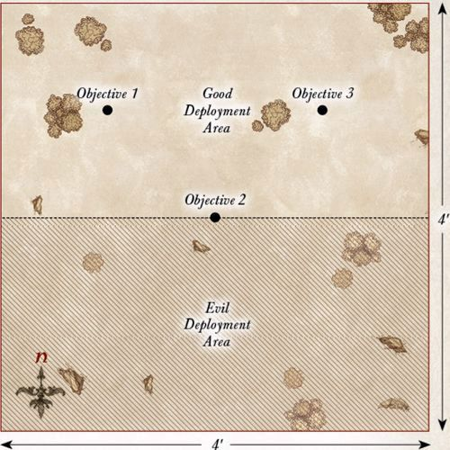

---

## DEATH OF BRAND

**LAYOUT**

The board represents the lands between Erebor and Dale. The lands themselves are relatively barren and should have a few hedges, bushes, rocky outcrops, and other shrubbery dotted around. In the center of the board should be a slightly raised area for Brand to defend.

**STARTING POSITIONS**

The Good player deploys Brand in the center of the board, and then deploys the Knights of Dale within 3" of him.

The Evil player deploys their force within 12" of the center of the board, but not within 6" of an enemy model. The Good player then deploys the rest of their models within 12" of the center of the northern board edge.

**OBJECTIVES**

Brand has been separated from his allies, and Dáin must now fight his way to Brand's side before the Easterling forces overwhelm him. The game lasts for 10 turns, or until Brand is slain. The Good player wins if Brand is alive at the end of the game. The Evil player wins immediately if Brand is slain.

**SPECIAL RULES**

* **Brand's Last Stand**

In this Scenario, Brand increases his Fight value to 6.

* **Allies in War**

Dáin may declare a Heroic Combat each turn without spending Might.

**PARTICIPANTS**

**Good:** Brand, King of Dale; Dáin Ironfoot, King Under the Mountain; 6 Knights of Dale; 12 Iron Hills Dwarves with spear.

**Evil:** Rutabi, General of the Dragon Legion; Brórgîr the Conjurer; 20 Easterling Warriors: 8 with shield, 4 with shield and pike, 8 with bow; 2 Rhûnish War Drakes.

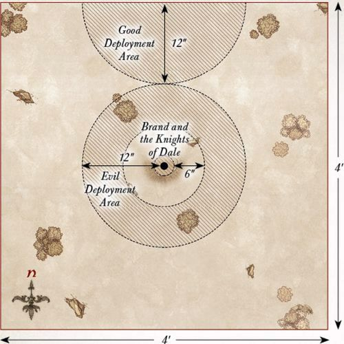

---

## DÁIN'S LAST STAND

**LAYOUT**

The board represents the lands between Erebor and Dale. The lands themselves are relatively barren and should have a few hedges, bushes, rocky outcrops, and other shrubbery dotted around. In the center of the board should be a slightly raised area for Dáin to defend.

**STARTING POSITIONS**

The Good player deploys Dáin in the center of the board, and then deploys their remaining models within 3" of him. The Evil player then deploys their models anywhere on the board at least 6" from any Good model.

**OBJECTIVES**

Incensed by the death of his friend, Dáin will defend Brand's body until either the battle ends or he himself falls. The game lasts for 12 turns or until Dáin is slain. The Good player wins if Dáin is alive at the end of 12 turns. The Evil player wins immediately if Dáin is slain.

**SPECIAL RULES**

* **The Wrath of Ironfoot**

Dáin Ironfoot must re-roll all failed To Wound rolls.

* **Victory within Reach**

Easterling models within 3" of the center of the board count as being in range of a banner.

**PARTICIPANTS**

**Good:** Dáin Ironfoot, King Under the Mountain; 12 Iron Hills Dwarves with spear.

**Evil:** Rutabi, General of the Dragon Legion; Brórgîr the Conjurer; 20 Easterling Warriors: 8 with shield, 4 with shield and pike, 8 with bow; 2 Rhûnish War Drakes.

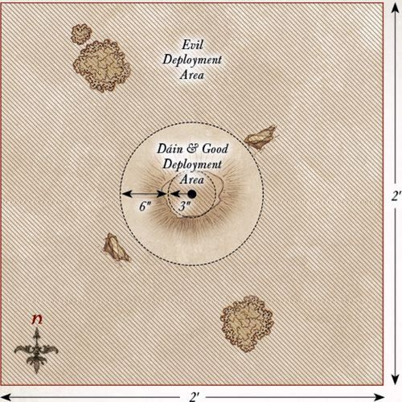

---

## RETREAT TO EREBOR

**LAYOUT**

The board represents the lands between Erebor and Dale. The lands themselves are relatively barren and should have a few hedges, bushes, rocky outcrops, and other shrubbery dotted around. The northern board edge represents the Lonely Mountain, in the center of which are the gates of Erebor, which are 6" wide in total.

**STARTING POSITIONS**

The Good player deploys their forces within 12" of the center of the southern board edge. The Evil player splits their force into two equal halves, each containing one named Hero. The half containing Rutabi deploys anywhere within 6" of the western board edge, but not within 12" of the northern board edge. The half containing Brórgîr deploys anywhere within 6" of the eastern board edge, but not within 12" of the northern board edge.

**OBJECTIVES**

With the armies of Erebor and Dale severely outnumbered, they must retreat to Erebor if they are to survive. However, the Easterling forces are trying to cut them off from the safety of the Lonely Mountain.

The game lasts until either the Good player completes their objective, or the Evil player kills enough Good models to make it impossible for the Good player to win. The Good player wins if 10 or more Good models move off the board via the gates of Erebor. The Evil player wins if they can prevent this. Additionally, if either Bard or Thorin are slain, the best result the Good player can achieve is a draw.

**SPECIAL RULES**

* **Fall Back!**

Bard and Thorin may declare Heroic March in this Scenario, even though they would not normally be able to do so.

Additionally, whenever Bard or Thorin declare a Heroic March, they do not need to spend Might points to do so — it is free.

* **The Heirs to the Kingdoms**

If either Thorin Stonehelm or Bard II would be Trapped in the Fight phase, then the other may declare a Heroic Combat without spending Might. If successful, they must join their Trapped ally's fight if possible. If this is not possible, they must move as close as possible to their Trapped ally.

**PARTICIPANTS**

**Good:** Bard II, Prince of Dale; Thorin III Stonehelm; 11 Warriors of Dale: 3 with shield, 4 with spear and shield, 3 with Esgaroth bow, 1 with banner; 6 Knights of Dale; 12 Iron Hills Dwarves: 6 with spear, 3 with mattock, 3 with crossbow.

**Evil:** Rutabi, General of the Dragon Legion; Brórgîr the Conjurer; 21 Easterling Warriors: 8 with shield, 4 with shield and pike, 8 with bow, 1 with banner; 12 Black Dragons: 6 with shield, 6 with pike and shield; 6 Dragon Cult Acolytes; 2 Rhûnish War Drakes.

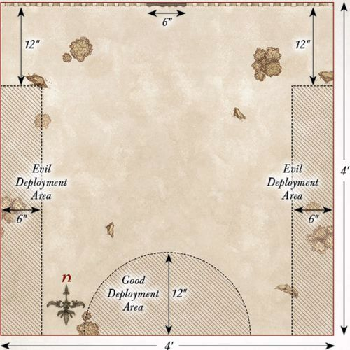

---

## SIEGE OF EREBOR

**LAYOUT**

The board represents the battlements of Erebor and the siege ladders propped up against the walls. The area within 9" of the northern board edge is the battlements and should be relatively clear. There are five siege ladders in this battle, spaced out as shown on the map. The area within 3" of the southern board edge is the plains outside Erebor — and is rather a long way down!

**STARTING POSITIONS**

The Good player deploys all of their models within 6" of the northern board edge. The Evil player then deploys their models within 1" of the Siege Ladders.

**OBJECTIVES**

The Easterlings have made it onto the battlements of Erebor, and now the Men and Dwarves must fight to prevent the walls from being overrun. If they can stem the tide of Easterlings, they may be able to buy themselves some more time.

The game lasts for 12 turns. The Good side wins if at the end of 12 turns they have managed to kill 35 or more Evil models (it's important to keep track). The Evil side wins if they can prevent this. If either Bard or Thorin die, the best result the Good side can achieve is a draw.

**SPECIAL RULES**

* **Numbers beyond Count**

Each time an Easterling Warrior is slain, keep it to one side. At the end of each Evil Move phase, any models kept aside in this manner may move onto the board from the siege ladders. Models that arrive in this way may Charge in the turn in which they arrive. Any models that cannot move onto the board in this way are kept aside for the next turn.

* **Battlements of Erebor**

The southern edge of the walls of Erebor is lined with battlements that can trap a model against them. Additionally, a model that is pushed from the battlements and onto the ground below is automatically slain — it's a rather steep fall!

**PARTICIPANTS**

**Good:** Bard II, Prince of Dale; Thorin III Stonehelm; 10 Warriors of Dale: 3 with shield, 4 with spear & shield, 3 with Esgaroth bow; 6 Knights of Dale; 12 Iron Hills Dwarves: 6 with spear, 3 with mattock, 3 with crossbow.

**Evil:** Rutabi, General of the Dragon Legion; Easterling Captain with shield; Easterling Dragon Knight; 21 Easterling Warriors: 8 with shield, 4 with shield and pike, 8 with bow, 1 with banner; 12 Black Dragons: 6 with shield, 6 with pike and shield; 6 Dragon Cult Acolytes.

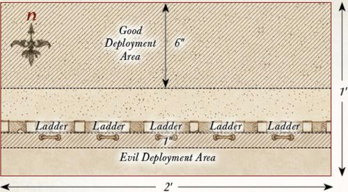

---

## THE TIDE TURNS

**LAYOUT**

The board represents the lands between Erebor and Dale. The lands themselves are relatively barren and should have a few hedges, bushes, rocky outcrops, and other shrubbery dotted around. The northern board edge is the Lonely Mountain, in the center of which are the gates of Erebor, which are 6" wide in total.

**STARTING POSITIONS**

The Good player deploys their force within 12" of the center of the northern board edge. The Evil player then deploys their forces within 24" of the southern board edge.

**OBJECTIVES**

With hope renewed, this is the last chance for the Men and Dwarves to achieve victory and defeat the Easterling invaders.

The game lasts until the end of a turn in which one force has been reduced to 25% of its starting numbers. The Good player wins if they can reduce the Evil force to 25%. The Evil player wins if they can reduce the Good player to 25%. If both forces are reduced to 25% in the same turn, the game is a draw.

**SPECIAL RULES**

* **The Heirs to the Kingdoms**

If either Thorin III Stonehelm or Bard II would be Trapped in the Fight phase, the other may declare a Heroic Combat without spending Might. If successful, they must join their Trapped ally's fight if possible. If this is not possible, they must move as close as possible to their Trapped ally.

* **Broken Morale**

The Evil force counts as Broken for this Scenario, and must test to see if they flee, even though forces do not normally break in Narrative Play games.

**PARTICIPANTS**

**Good:** Bard II, Prince of Dale; Thorin III Stonehelm; Captain of Dale with shield; Iron Hills Dwarf Captain; 21 Warriors of Dale: 6 with shield, 8 with spear and shield, 6 with Esgaroth bow, 1 with banner; 6 Knights of Dale; 25 Iron Hills Dwarves: 12 with spear, 6 with mattock, 6 with crossbow, 1 with banner.

**Evil:** The Dragon Emperor of Rhûn; Rutabi, General of the Dragon Legion; Brórgîr the Conjurer; Easterling Captain with shield; Easterling Dragon Knight; 21 Easterling Warriors: 8 with shield, 4 with shield and pike, 8 with bow, 1 with banner; 18 Black Dragons: 9 with shield, 9 with pike and shield; 12 Dragon Cult Acolytes; 2 Rhûnish War Drakes.

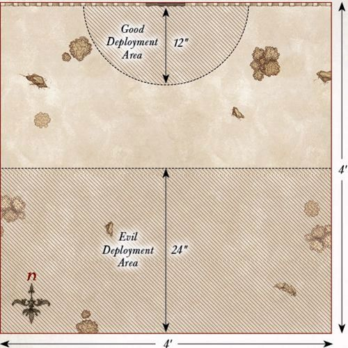

---

## GOLLUM'S ESCAPE

**LAYOUT**

The board represents an area of Mirkwood forest. As such, the board should be densely packed with trees, bushes, and other appropriate undergrowth.

**STARTING POSITIONS**

The Evil player places Gollum in the center of the board. The Good player then deploys their forces within 6" of the center of the board. The Evil player then deploys the rest of their models within 6" of any board edge.

**OBJECTIVES**

With the attack of the Orcs and Wargs, Gollum sees a chance to escape his Elven captors. The Elves must fend off the assault and ensure that they do not let Gollum slip through their fingers.

The game lasts until one force has completed their objective. The Good player wins if at the end of any turn all the Orcs and Wargs have been slain. The Evil player wins immediately if Gollum escapes the board via the southern board edge. 

**SPECIAL RULES**

* **Gollum**

Gollum does not have the Ring in this Scenario. Additionally, Gollum may not charge enemy models, though he will fight as normal if he is charged.

* **Elven Prisoner**

If Gollum is slain, the best result the Good player can achieve is a draw.

**PARTICIPANTS**

**Good:** Mirkwood Ranger Captain; 10 Mirkwood Rangers.

**Evil:** Gollum; Orc Captain with shield; 12 Orc Warriors: 4 with shield, 4 with spear, 2 with two-handed weapon, 2 with Orc bow; 6 Fell Wargs.

---

## AN UNEASY ALLIANCE

**LAYOUT**

The board represents the dense wooded area of Mirkwood where the Spider Queen's lair resides. As such, there should be plenty of trees, bushes, and undergrowth dotted around. Four Spider Nests, no more than 6" in diameter, should be placed on the board, one in the center of each 2'x2' area of the board. In the center of the eastern board edge is the entrance to the Spider Queen's lair, which is built into a rocky outcrop.

**STARTING POSITIONS**

The 'Good' player deploys the Spider Queen, 2 Mirkwood Spiders, 2 Giant Spiders, and the Bat Swarms within 12" of the entrance to the Spider Queen's Lair. They then place one spider in each of the Spider Nests. The Evil player deploys their forces within 12" of the western board edge.

**OBJECTIVES**

The Orcs have ventured into the Spider Queen's lair with the intent of bending her to their will and getting her to join their fight against the Elves. However, being a vicious creature, the Spider Queen does not take kindly to those that enter her lair.

The game lasts until one force has completed their objective. The 'Good' player wins if they can reduce the Evil force to 25% of its starting numbers at the end of any turn. The Evil player wins if they can force the Spider Queen to submit and bend to their will.

**SPECIAL RULES**

* **The Spider Queen**

Once the Spider Queen has been wounded, there is a chance she will submit in order to survive. If during the End phase of any turn the Spider Queen has 2 or fewer Wounds remaining, she must take a Courage test, which cannot be modified by Might or Will points. The third time this test is failed, the Spider Queen will submit to the Orcs and the game will end.

* **We Need Her Alive**

If the Spider Queen is slain, the game immediately ends and is a draw.

* **Spider Nests**

Evil models treat Spider Nests as difficult terrain. Additionally, whenever a Spider model is slain, keep it to one side. At the start of each turn, before Priority is determined, roll a D6 for each Spider model kept aside in this manner. On a 5+, that model will re-enter the board via one of the Spider Nests. To determine where they enter, roll a further D6. On a 1-3, the Evil player chooses which Spider Nest the model enters from; on a 4+, the 'Good' player decides. Models that arrive in this manner are placed anywhere within or touching the Spider Nest and may act as normal that turn.

**PARTICIPANTS**

**'Good':** The Spider Queen; 4 Mirkwood Spiders; 4 Giant Spiders; 2 Bat Swarms.

**Evil:** Razgûsh, War Leader of the North; Orc Captain with shield; 24 Orc Warriors: 8 with shield, 8 with spear, 4 with two-handed weapon, 4 with Orc bow; 6 Warg Riders: 2 with shield, 2 with throwing spear, 2 with Orc bow; 3 Orc Trackers.

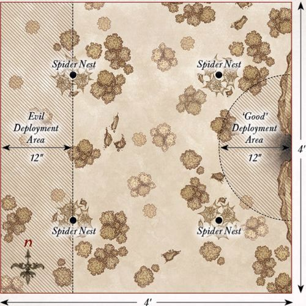

---

## ATTACK ON THE BEORNINGS

**LAYOUT**

The board represents a clearing near the Beorning homestead. The area within 12" of the center of the board should be clear, while the rest of the board should be densely packed with trees, bushes, and other undergrowth.

**STARTING POSITIONS**

The Good player deploys the Beornings within 6" of the center of the board. The Evil player then splits their forces into two equal halves and deploys one half within 12" of the eastern board edge, and the other half within 12" of the western board edge. Grimbeorn is kept aside for later in the game.

**OBJECTIVES**

The Beornings are fighting to stave off the assault on their home long enough for Grimbeorn to return and aid them. The Orcs are out to slay the Beornings so they cannot aid the Elves in Mirkwood.

The game lasts for 10 turns. The Good side wins if, at the end of the 10th turn, there are at least four Beornings left alive. The Evil side wins if they can slay enough Beornings to prevent this. If Grimbeorn is slain, the best result the Good player can achieve is a draw.

**SPECIAL RULES**

* **Grimbeorn**

From turn 2 onwards, roll a D6 at the start of each turn before Priority is determined and add the current turn number. On a score of 8 or more, Grimbeorn has arrived. Grimbeorn will enter the board from the center of any board edge via the rules for reinforcements. Additionally, Grimbeorn will already be in bear form, so there is no need to roll.

* **Unbridled Rage**

Grimbeorn must re-roll all failed To Wound rolls.

**PARTICIPANTS**

**Good:** Grimbeorn; 12 Beornings: 8 with hand-and-a-half axe, 4 with great bow.

**Evil:** 2 Orc Captains with shield; 24 Orc Warriors: 8 with shield, 8 with spear, 4 with two-handed weapon, 4 with Orc bow; 6 Warg Riders: 2 with shield, 2 with throwing spear, 2 with Orc bow; 6 Orc Trackers.

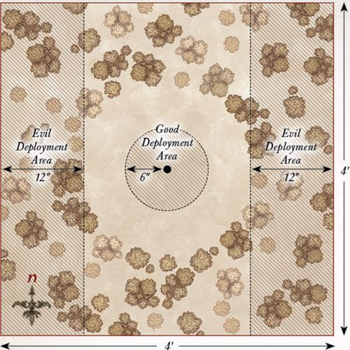

---

## BURNING OF MIRKWOOD

**LAYOUT**

The board represents an area of Mirkwood forest and should be densely packed with trees, bushes, and other undergrowth. There should be five larger trees that are spread equidistantly along the center line of the board from east to west; these are the objectives.

**STARTING POSITIONS**

The Good player deploys their forces within 12" of the northern board edge. The Evil player then deploys their forces within 12" of the southern board edge.

**OBJECTIVES**

The Orcs have come to burn down the Elven kingdom of Mirkwood, and plan on starting by torching some of the taller trees on the borders of their kingdom.

The game lasts for 10 turns. The Good player wins if at least three of the larger trees are still standing at the end of the game. The Evil player wins if at least three of the larger trees have been destroyed by the end of the game.

**SPECIAL RULES**

* **Destroying Trees**

During the End phase of each turn, any Orc model in base contact with one of the larger trees may attempt to destroy it, provided they have not fought in a combat, supported a combat, fired a missile weapon this turn, or are Prone. When an Orc attempts to destroy a tree, their controlling player rolls a D6. On a 5+, that tree has been destroyed.

* **Timber!**

Whenever a tree is destroyed, it will fall to the ground; roll a D6 to determine which way it falls and consult the chart below:

| D6  | Result |
|-----------|------------|
| 1         | The Evil player chooses the direction it falls. |
| 2         | The tree falls towards the southern board edge. |
| 3         | The tree falls towards the eastern board edge. |
| 4         | The tree falls towards the western board edge. |
| 5         | The tree falls towards the northern board edge. |
| 6         | The Good player chooses the direction it falls. |

When a tree falls, draw a 1mm wide line from the center of the tree that extends 6" in the required direction. Any model whose base is under that line suffers a Strength 8 hit and is knocked Prone. The tree is then removed from play.

**PARTICIPANTS**

**Good:** Tauriel; Mirkwood Captain; Mirkwood Ranger Captain; 12 Mirkwood Elves: 4 with shield, 4 with Elven-made glaive, 4 with Elf bow; 10 Mirkwood Rangers.

**Evil:** Razgûsh, War Leader of the North; The Spider Queen; Orc Captain with shield; 24 Orc Warriors: 8 with shield, 8 with spear, 4 with two-handed weapon, 4 with Orc bow; 6 Warg Riders: 2 with shield, 2 with throwing spear, 2 with Orc bow; 6 Orc Trackers; 2 Mirkwood Spiders; 2 Giant Spiders; 1 Bat Swarm.

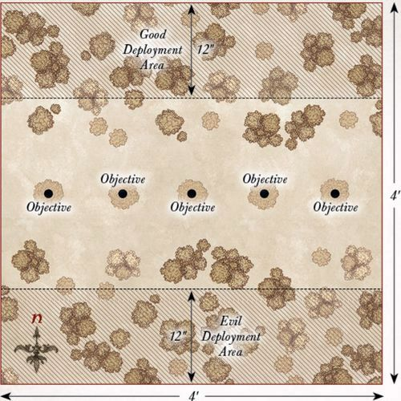

---

## BATTLE UNDER THE TREES

**LAYOUT**

The board represents an area of Mirkwood forest and should be densely packed with trees, bushes, and other undergrowth.

**STARTING POSITIONS**

The Good player deploys their forces within 12" of the northern board edge, but not within 12" of either the eastern or western board edges. The Evil player then deploys their forces within 12" of the southern board edge.

**OBJECTIVES**

The battle for Mirkwood has begun and both sides will use every ounce of strength to achieve victory.

The game lasts until the end of a turn in which one force has been reduced to 25% or less of its starting numbers.

The Good player wins if the Evil force has been reduced to 25%. The Evil player wins if the Good force has been reduced to 25%. If both sides are reduced to 25% in the same turn, the game is a draw.

**SPECIAL RULES**

* **Through the Forest**

Evil models gain the Woodland Creature special rule.

* **Death to the Elves**

Evil models gain the Hatred (Elf) special rule.

* **The War Leader**

Razgûsh gains a bonus of +1 to his Fight value when engaged with an enemy Elf model.

* **Defend the Forest**

Elf models must re-roll 1s To Wound during the Fight phase.

**PARTICIPANTS**

**Good:** Thranduil, King of the Woodland Realm, with heavy armour and additional Elven-made hand-and-a-half sword; Tauriel; Palace Guard Captain with shield; Mirkwood Captain; Mirkwood Ranger Captain; 10 Palace Guard: 4 with shield, 4 with spear, 2 with spear & shield; 12 Mirkwood Elves: 4 with shield, 4 with Elven-made glaive, 4 with Elf bow; 10 Mirkwood Rangers.

**Evil:** Razgûsh, War Leader of the North; The Spider Queen; 2 Orc Captains with shield; Orc Shaman; 36 Orc Warriors: 12 with shield, 12 with spear, 6 with two-handed weapon, 6 with Orc bow; 6 Warg Riders: 2 with shield, 2 with throwing spear, 2 with Orc bow; 6 Orc Trackers; 4 Mirkwood Spiders; 4 Giant Spiders; 2 Bat Swarms; 6 Fell Wargs.

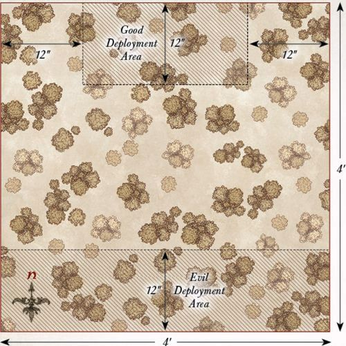

---

## CROSSING OF THE ANDUIN

**LAYOUT**

The board represents part of the River Anduin and the edges of Lothlórien. There should be a 6" wide river running down the center of the board from north to south, in the center of which should be a 6" wide ford for models to cross safely. The area within 12" of the western board edge is the forest of Lórien and should be densely packed with trees. The rest of the board should be relatively clear with the odd tree, bush, or bit of shrubbery dotted around.

**STARTING POSITIONS**

The Good player deploys their models within 12" of the western board edge. The Evil player then deploys their models within 12" of the eastern board edge.

**OBJECTIVES**

The Elves have seen the advancing Orcs and aim to prevent them from entering the Golden Wood.

The game lasts until one force has completed their objective. The Evil player wins if 10 or more Evil models escape the board via the western board edge. The Good player wins if they can slay enough models to make it impossible for the Evil player to win.

**SPECIAL RULES**

* **Defend our Borders**

Good models may not willingly move further than 12" away from the western board edge. If a Good model finds itself further than 12" from the western board edge at the start of its Move phase, it must try to move back within 12" if possible.

* **The Anduin**

The river is Deep Water, with the exception of the ford, which is treated as open ground. Additionally, any model that makes a Swim test for trying to cross the Anduin suffers an additional -1 penalty to their roll.

**PARTICIPANTS**

**Good:** Wood Elf Captain with Elf bow; 12 Wood Elf Warriors: 4 with throwing daggers, 4 with Wood Elf spear, 4 with Elf bow; 1 Wood Elf Sentinel.

**Evil:** Muzgúr, Orc Shaman; Orc Captain with shield; 12 Orc Warriors: 4 with shield, 4 with spear, 2 with two-handed weapon, 2 with Orc bow; 6 Warg Riders: 2 with shield, 2 with throwing spear, 2 with Orc bow; 6 Orc Trackers.

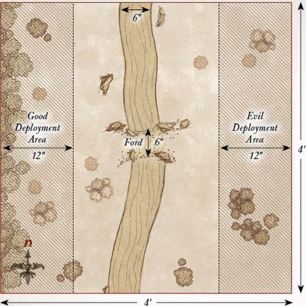

---

## ATTACK ON LÓRIEN

**LAYOUT**

The board represents an area of Lothlórien, and as such should be densely packed with trees, bushes, and other appropriate undergrowth. In the center of the board should be a Mallorn tree with a trunk with a diameter of 3".

**STARTING POSITIONS**

The Good player deploys their forces within 12" of the western board edge. The Evil player then deploys their forces within 12" of the eastern board edge.

**OBJECTIVES**

The Mallorn trees within Lothlórien grow to immense heights and are the pride of the Golden Wood, and it is these trees that the Orcs plan to destroy.

The game lasts for 10 turns. The Good player wins if the Mallorn tree is still alive at the end of the game. The Evil player wins immediately if the Mallorn tree is destroyed.

**SPECIAL RULES**

* **The Mallorn Tree**

The Mallorn tree has a Defence of 10 and 10 Wounds. Evil models may fight the Mallorn tree in the Fight phase, providing they have not already been or are in a Fight that turn, and have not made a shooting attack that turn. Models may use Special Strikes against the Mallorn tree, and may support models fighting the Mallorn tree. The Mallorn tree will always lose the fight and always counts as Trapped.

* **Decay**

Muzgúr and the Orc Shaman gain the following additional Magical Power:

*DECAY*
Range: 6"
Casting Value: 4+

This Magical Power may only target the Mallorn tree. The Mallorn tree suffers a Wound. Additionally, its Defence characteristic is reduced by 1 for the remainder of the game.

Additionally, both Muzgúr and the Orc Shaman gain a free Will point per turn, which can only be used to cast the Decay Magical Power.

**PARTICIPANTS**

**Good:** Orophin; Wood Elf Captain with Elf bow; 12 Galadhrim Warriors: 4 with shield, 4 with spear and shield, 4 with Elf bow; 12 Wood Elf Warriors: 4 with throwing daggers, 4 with Wood Elf spear, 4 with Elf bow.

**Evil:** Muzgúr, Orc Shaman; Orc Captain with shield; Orc Shaman; 24 Orc Warriors: 8 with shield, 8 with spear, 4 with two-handed weapon, 4 with Orc bow; 6 Warg Riders: 2 with shield, 2 with throwing spear, 2 with Orc bow; 6 Orc Trackers.

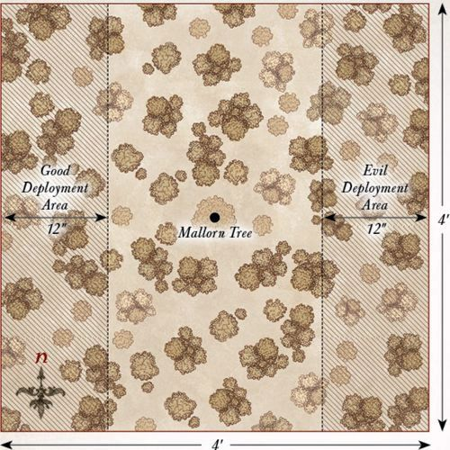

---

## TRAPPED ON BOTH SIDES

**LAYOUT**

The board represents an area of Lothlórien, and as such should be densely packed with trees, bushes, and other appropriate undergrowth.

**STARTING POSITIONS**

The Good player deploys their force within 6" of the centre of the board. The Evil player then splits their force into two halves, one with all the Mordor models and one with all the Moria and Spider models. The Mordor models are then deployed within 12" of the eastern board edge. The Moria and Spider models are deployed within 12" of the western board edge.

**OBJECTIVES**

With their reinforcements having arrived, the Elves are trying to fend off the combined forces of Orcs and Goblins from overrunning the forest.

The game lasts for 12 turns. At the end of the 12th turn, whichever side has the most models wholly within 6" of the centre of the board is the winner. If both sides have the same number of models wholly within 6" of the centre of the board, the game is a draw.

**SPECIAL RULES**

* **Cover of Darkness**

The battle takes place at night. As such, due to the reduced visibility, models cannot be targeted by shooting, Magical Powers, or special abilities over 12" away. However, as it is much harder to avoid a shot in the dark, all shooting attacks gain a bonus of +1 when rolling To Wound. Models with the Cave Dweller special rule can see as normal.

* **Dark Magics**

Evil models may re-roll any number of D6s when making a Casting roll.

* **Defend the Golden Wood**

All Good models automatically pass any Courage tests they are required to make.

**PARTICIPANTS**

**Good:** Rúmil; Orophin; Wood Elf Captain with Elf bow; 24 Galadhrim Warriors: 8 with shield, 8 with spear and shield, 8 with Elf bow; 12 Wood Elf Warriors: 4 with throwing daggers, 4 with Wood Elf spear, 4 with Elf bow; 4 Guard of the Galadhrim Court; 1 Wood Elf Sentinel.

**Evil:** Muzgúr, Orc Shaman; Drûzhag the Beastcaller; Ashrâk; Orc Shaman; 24 Orc Warriors: 8 with shield, 8 with spear, 4 with two-handed weapon, 4 with Orc bow; 6 Warg Riders: 2 with shield, 2 with throwing spear, 2 with Orc bow; 6 Orc Trackers; 24 Moria Goblins: 8 with shield, 8 with spear, 8 with Goblin bow; 4 Venom-back Spiders; 2 Warg Marauders.

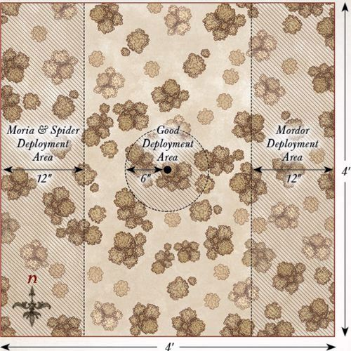

---

## FINAL ASSAULT ON LOTHLÓRIEN

**LAYOUT**

The board represents an area of Lothlórien, and as such should be densely packed with trees, bushes, and other appropriate undergrowth. Galadriel's mirror is deployed 12" from the centre of the northern board edge as shown on the map.

**STARTING POSITIONS**

The Good player deploys their force within 12" of the centre of the northern board edge. The Evil player then deploys their force within 12" of the southern board edge.

**OBJECTIVES**

This is the final assault on Lothlórien, and the combined forces of Orcs and Goblins have come to destroy Caras Galadhon.

The game lasts until the end of a turn in which one force has been reduced to 25% or less of its starting numbers. The Good player wins if the Evil force has been reduced to 25%. The Evil player wins if the Good force has been reduced to 25%. If both sides are reduced to 25% in the same turn, the game is a draw.

**SPECIAL RULES**

* **Galadriel**

If Galadriel is slain, the game immediately ends and the Evil side is victorious, regardless of any other factors.

* **Cover of Darkness**

The battle takes place at night. Due to reduced visibility, models cannot be targeted by shooting, Magical Powers, or special abilities over 12" away. However, all shooting attacks gain a bonus of +1 when rolling To Wound, as it is harder to avoid a shot in the dark. Models with the Cave Dweller special rule can see as normal.

* **Dark Magics**

Evil models may re-roll any number of D6s when making a Casting roll.

* **Defend the Golden Wood**

All Good models automatically pass any Courage tests they are required to make.

**PARTICIPANTS**

**Good:** Galadriel with mirror of Galadriel; Celeborn with heavy armour, shield, and Elven-made hand-and-a-half sword; Rúmil; Orophin; 24 Galadhrim Warriors: 8 with shield, 8 with spear and shield, 8 with Elf bow; 12 Wood Elf Warriors: 4 with throwing daggers, 4 with Wood Elf spear, 4 with Elf bow; 4 Guard of the Galadhrim Court; 3 Wood Elf Sentinels.

**Evil:** Muzgúr, Orc Shaman; Drûzhag the Beastcaller; Ashrâk; Orc Shaman; 24 Orc Warriors: 8 with shield, 8 with spear, 4 with two-handed weapon, 4 with Orc bow; 6 Warg Riders: 2 with shield, 2 with throwing spear, 2 with Orc bow; 6 Orc Trackers; 24 Moria Goblins: 8 with shield, 8 with spear, 8 with Goblin bow; 4 Venom-back Spiders; 3 Warg Marauders.

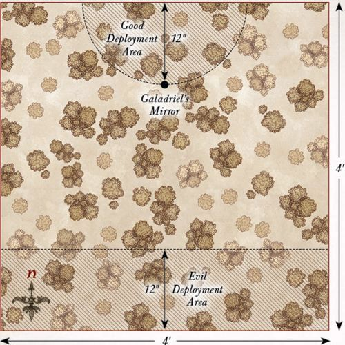

---

## FALL OF DOL GULDUR

**LAYOUT**

The board represents the ruins of Dol Guldur. There should be a total of seven sections of ruined walls, towers, or buildings spread out evenly, each no larger than 6" in diameter. None of these ruins may be within 6" of the southern board edge. The rest of the board should have areas of rubble and rocky outcrops dotted around.

**STARTING POSITIONS**

The Evil player deploys one Castellan of Dol Guldur within each ruin. The rest of their forces are then deployed as evenly as possible within each of the ruins. The Good player then deploys their force within 6" of the southern board edge.

**OBJECTIVES**

The Galadhrim have come to protect Galadriel, who intends to tear down the walls of Dol Guldur for good.

The game lasts until one player completes their objective.
The Good player wins immediately if they can destroy all seven of the ruins of Dol Guldur. The Evil player wins immediately if Galadriel is slain.

**SPECIAL RULES**

* **The Lady of Light**

Galadriel may only attempt to cast the following Magical Power during the game:

*BREAK STONE*
Range: 3"
Casting Value: 4+

This Magical Power may only target the ruins of Dol Guldur. The targeted ruins are immediately destroyed. Any models within the ruins, or within 1" of the ruins when they are destroyed, suffer a Strength 8 hit.

* **Weary from War**

Each Good Hero model starts the game with one fewer Might point than usual.

**PARTICIPANTS**

**Good:** Galadriel; Celeborn with heavy armour, shield, and Elven-made hand-and-a-half sword; Rúmil; Orophin; 24 Galadhrim Warriors: 8 with shield, 8 with spear and shield, 8 with Elf bow; 4 Guard of the Galadhrim Court.

**Evil:** 6 Castellans of Dol Guldur with Morgul Blade; 12 Hunter Orcs: 4 with Orc bow, 2 with two-handed pick, 6 with no additional wargear; 12 Fell Wargs; 4 Mirkwood Spiders.

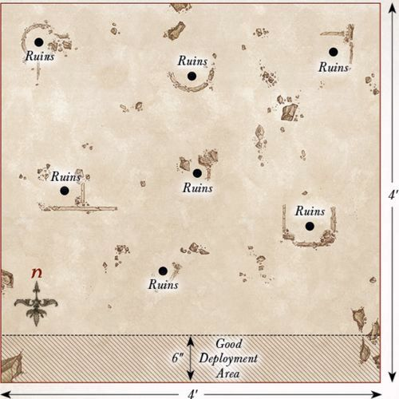
