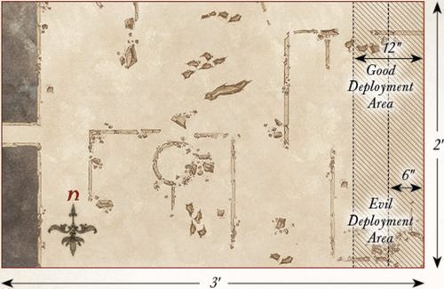

## THE FOUNDING OF DOL GULDUR

**LAYOUT**

The board represents the area around Amon Lanc. It should be densely covered with trees, rocky outcrops, hedges, and other undergrowth. Place a Woodsman's hut in the center of the board.

**STARTING POSITIONS**

The Good player deploys their force anywhere within 3" of the Woodsman's hut. The Evil player then deploys their force anywhere on the board at least 12" from any Good model.

**OBJECTIVES**

The Necromancer plans to build his fortress in secret, and so the Woodsmen must be removed from Amon Lanc to ensure that the Dark Lord's plan goes undiscovered.

The Evil player wins if at the end of any turn all the Woodsmen have been slain. The Good player wins immediately if the Necromancer is slain.

**SPECIAL RULES**

* **The Dark Lord**

The Necromancer begins the game with only 12 points of Will.

* **The Sense of Dread**

All Evil models have the Terror special rule in this scenario.

**PARTICIPANTS**

**Good:** Woodsmen Chieftain with shield; 12 Woodsmen: 4 with shield, 4 with throwing spear and shield, 4 with bow.

***Note:** The Woodsmen Chieftain uses the same profile as a Captain of Rohan, the Woodsmen use the same profile as a Warrior of Rohan.*

**Evil:** The Necromancer of Dol Guldur; 12 Orc Warriors: 4 with shield, 4 with spear, 2 with two-handed weapon, 2 with Orc bow.

---

## THE GATHERING EVIL

**LAYOUT**

The board represents an area of the Greenwood forest near the fortress of Dol Guldur. It should be densely packed with trees, bushes, and other undergrowth to provide plenty of cover for both sides.

**STARTING POSITIONS**

The Good player deploys their force within 6" of the center of the southern board edge. The Evil player then deploys the Necromancer in the center of the board. The Orcs are deployed anywhere in the northern half of the board.

**OBJECTIVES**

Sauron must see that the Elves are killed or risk alerting the Elvenking to the location of his fortress.

The Good side wins if any four Good models can escape the board via the northern board edge. The Evil player wins if they can slay all of the Elves. If at least one but fewer than four Elves escape the board, then the game is a draw.

**SPECIAL RULES**

* **The Dark Lord**

The Necromancer begins the game with only 12 points of Will.

* **The Darkness Descends**

Good models can only see up to 6" in this Scenario. Therefore, they cannot shoot enemy models that are more than 6" away from them. Sauron and his Orcs are accustomed to the darkness and can see as normal.

**PARTICIPANTS**

**Good:** Mirkwood Ranger Captain; 10 Mirkwood Rangers.

**Evil:** The Necromancer of Dol Guldur; 12 Orc Warriors: 4 with shield, 4 with spear, 2 with two-handed weapon, 2 with Orc bow.

---

## CORRUPTION OF THE GREENWOOD

**LAYOUT**

The board represents an area of the Greenwood. It should be densely packed with trees, bushes, and other undergrowth. There should be five objectives on the board. Three are placed equidistantly across the center line of the board from west to east. The other two are placed in the center of each of the north-west and north-east quarters of the board as shown.

**STARTING POSITIONS**

The Good player deploys their force within 12" of the northern board edge. The Evil player then deploys their force within 12" of the southern board edge.

**OBJECTIVES**

The Elves must protect this area of the forest from succumbing to the corruption that is befalling the Greenwood; otherwise, it will no longer be a safe place to travel.

The game lasts for 10 turns. The Good player wins if two or fewer of the objectives are corrupted at the end of the game. The Evil player wins if three or more objectives are corrupted at the end of the game.

**SPECIAL RULES**

* **Corrupting Objectives**

If, during the End phase of any turn, there is a non-Prone Evil model in base contact with an objective marker, and that model did not shoot or fight during that turn, then that objective has been corrupted.

* **Save the Greenwood**

If, during the End phase of any turn, there is a non-Prone Good model in base contact with a corrupted objective marker, and that model did not shoot or fight during that turn, then that objective is no longer considered to be corrupted.

**PARTICIPANTS**

**Good:** 2 Mirkwood Ranger Captains; 20 Mirkwood Rangers.

**Evil:** 4 Castellans of Dol Guldur; 6 Giant Spiders; 6 Mirkwood Spiders; 6 Fell Wargs; 2 Bat Swarms.

---

## LURKING IN THE SHADOWS

**LAYOUT**

The board represents the densely-wooded area of Mirkwood where the Spider Queen's lair is found. There should be plenty of trees, bushes, and undergrowth dotted around. Four Spider Nests, no more than 6" in diameter, should be placed on the board, one in the center of each 2'x2' area. In the center of the eastern board edge is the entrance to the Spider Queen's lair, which is built into a rocky outcrop.

**STARTING POSITIONS**

The Good player deploys their force within 6" of the center of the board. The Evil player deploys the Spider Queen, 4 Mirkwood Spiders, 4 Giant Spiders, and 2 Bat Swarms within 12" of the entrance to the Spider Queen's Lair. They then place one **Spider** in each of the Spider Nests.

**OBJECTIVES**

This band of Elves has strayed into the Spider Queen's lair and must kill her if they are to have any chance of escaping.

The game lasts until one force has completed their objective. The Good force wins if they can kill the Spider Queen. The Evil force wins if all the Elves are slain before this can happen.

**SPECIAL RULES**

**Spider Nests** — *The nests in the forest are home to the Spider Queen's offspring, and more will constantly come to her aid.*

Good models treat Spider Nests as difficult terrain.

Additionally, whenever a **Spider** model is slain, with the exception of the Spider Queen, keep it to one side. At the start of each turn, before Priority is determined, roll a D6 for each **Spider** model kept aside in this manner. On a 5+, that model will re-enter the board via one of the Spider Nests. To determine where they enter from, roll a further D6. On a 1-3, the Good player chooses which Spider Nest the model enters from; on a 4+, the Evil player decides. Models that arrive in this manner are placed anywhere within or touching the Spider Nest and may act as normal that turn.

**Swarm of Spiders** — *The writhing mass of broodlings on the back of the Spider Queen makes it hard to hit her from range, and the chances of piercing her hide are slim.*

Shooting attacks that target the Spider Queen suffer a -1 penalty when rolling To Hit. Additionally, shooting attacks will only Wound the Spider Queen on the roll of a natural 6.

**PARTICIPANTS**

**Good:** 2 Mirkwood Ranger Captains; 20 Mirkwood Rangers.

**Evil:** The Spider Queen; 6 Giant Spiders; 6 Mirkwood Spiders; 2 Bat Swarms.

---

## FLIGHT TO THE EAST

**LAYOUT**

The board represents the fortress of Dol Guldur. It should be covered with walls, ruins, and other terrain, providing plenty of cover across the board.

**STARTING POSITIONS**

The Evil player deploys six 40mm bases anywhere touching the western board edge; these represent the places the Necromancer could be (see the *Shadow of the Necromancer* special rule that follows). They then deploy the Castellans of Dol Guldur anywhere within 12" of the western board edge. The Good player then deploys Gandalf within 6" of the center of the eastern board edge.

**OBJECTIVES**

Gandalf is trying to discover the truth about who, or what, is casting the shadow over Mirkwood. Sauron cannot risk being discovered and so is trying to evade Gandalf and escape into the east.

The game lasts until one side completes their objective.

The Good side wins if the Necromancer has been revealed and Gandalf escapes the board via any board edge. The Evil player wins if the Necromancer has not been revealed when he escapes the board via the eastern board edge. Any other result is a draw.

**SPECIAL RULES**

* **Shadow of the Necromancer**

The Necromancer is not deployed at the start of the game. Instead, six 40mm bases are deployed touching the western board edge, each representing a place where the Necromancer could be. One of these bases is the Necromancer, and the Evil player should note down which one is Sauron; either by marking one underneath, or numbering all the bases and making a note of which numbered base is the Necromancer. These move in the same way as the Necromancer, and the Evil player will win if the base representing the Necromancer escapes the board via the eastern board edge.

* **Revealing the Necromancer**

If, at the end of any Good Move phase, Gandalf is within 6" of a 40mm base and can draw an unobscured Line of Sight to all parts of that base, then the Evil player must reveal if the base was a decoy or, in fact, the Necromancer himself. Additionally, if the Necromancer casts any Magical Powers, he will automatically be revealed.

* **The Cost of Deception**

The Necromancer loses a point of Will at the end of each Move phase in which he has not yet been revealed.

* **The Grey Pilgrim**

Gandalf has 2 Attacks in this scenario.

**PARTICIPANTS**

**Good:** Gandalf the Grey.

**Evil:** The Necromancer of Dol Guldur; 4 Castellans of Dol Guldur.

---

## THE WATCHFUL PEACE

**LAYOUT**

The board represents an area of the forest of Mirkwood. As such, the board should be densely packed with trees, bushes, and other undergrowth to help give the impression of the twisted and overgrown place that Mirkwood has become.

**STARTING POSITIONS**

The Good player deploys their models within 12" of the northern board edge. The Evil player then deploys their models within 24" of the southern board edge.

**OBJECTIVES**

The Elves have come across a band of Orcs and must kill enough of them to force the Orcs to turn tail and flee.

The game lasts until the end of a turn in which one side has completed their objective. The Good side wins if they can reduce the Evil side to 25% of their starting numbers (i.e., six models remaining). The Evil side wins if they can reduce the Good side to 25% of their starting number (i.e., three models remaining).

**SPECIAL RULES**

* **The Prince of Mirkwood**

If Legolas is slain, then the game ends immediately and the Evil side wins.

* **Silent Hunters**

Good models may re-roll failed To Hit rolls when making shooting attacks if they did not move during the preceding Move phase.

**PARTICIPANTS**

**Good:** Legolas Greenleaf, Prince of Mirkwood; Mirkwood Ranger Captain; 10 Mirkwood Rangers.

**Evil:** 2 Orc Captains with shield; 24 Orc Warriors: 8 with shield, 8 with spear, 4 with two-handed weapon, 4 with Orc bow.

---

## CLEARING THE NESTS

**LAYOUT**

The board represents an area of Mirkwood where there is a large Spider Nest. In the center of the board, there should be the Spider Nest — which has a diameter of 3". The rest of the board should be densely packed with trees, bushes, and other undergrowth.

**STARTING POSITIONS**

The Evil player deploys the Mirkwood Spiders within 3" of the Spider Nest. They then deploy three Giant Spiders within 3" of the center of the eastern board edge, and the other three Giant Spiders within 3" of the center of the western board edge. The Good player deploys their models within 6" of the center of the northern board edge.

**OBJECTIVES**

The Mirkwood Rangers have set out to destroy one of the larger Spider Nests, though its inhabitants will fiercely protect it.

The game lasts until one side has completed its objective. The Good side wins if the Spider Nest is destroyed. The Evil side wins if the Good side is wiped out.

**SPECIAL RULES**

* **The Spider Nest**

Good models may Charge the Spider Nest during the Move phase, and may attack it during the Fight phase provided they are not in base contact with any enemy models. Good models do not need to make a Duel roll against the Spider Nest; they will automatically win and may simply strike blows.

The Spider Nest has 3 Wounds and will only ever be wounded on the roll of a natural 6.

* **More Where They Came From**

Whenever a **Spider** model is slain, keep it to one side. At the start of each turn, before Priority is determined, roll a D6 for each **Spider** model kept aside in this way. On a 5+, the Evil player may place that **Spider** model within 6" of the Spider Nest, but not within the Control Zones of enemy models. Models that arrive in this manner are placed anywhere within or touching the Spider Nest and may act as normal that turn.

**PARTICIPANTS**

**Good:** Legolas Greenleaf, Prince of Mirkwood; Tauriel; 10 Mirkwood Rangers.

**Evil:** 6 Mirkwood Spiders; 6 Giant Spiders.

---

## ATTACK ON RHOSGOBEL

**LAYOUT**

The board represents Radagast's home of Rhosgobel. In the center of the board is Radagast's house, built into a large tree trunk with a diameter of 3" and a door on one side. The rest of the board should be dotted with trees, hedges, and other undergrowth. There should be six objective markers positioned as shown on the map, each representing a creature that needs rescuing.

**STARTING POSITIONS**

The Good player deploys Radagast touching the door to his house. The Evil player deploys the four Mirkwood Spiders so that each one is touching the center of a different board edge.

**OBJECTIVES**

Radagast is trying to rescue the creatures of the forest from the dark magic that is poisoning them, while the Spiders are hunting the Brown Wizard as their latest prey.

The game lasts until one side has completed their objective. The Good player wins if they can rescue all of the creatures within Rhosgobel and have Radagast enter his house by moving into it via the front door. The Evil player wins if Radagast is slain.

**SPECIAL RULES**

* **Rescuing Creatures**

The six objective markers represent the woodland creatures in need of rescue. Radagast may save a creature by ending his move in base contact with a marker, as long as he is not engaged in combat. When a creature has been successfully rescued, remove the marker from play.

* **Radagast's Determination**

Whenever Radagast rescues a creature, he may restore one Fate point spent earlier in the battle.

**PARTICIPANTS**

**Good:** Radagast the Brown.

**Evil:** 4 Mirkwood Spiders.

---

## EXPLORATION OF DOL GULDUR

**LAYOUT**

The board represents the old fortress of Dol Guldur. It should be scattered with broken walls, crumbling stairways, and piles of rubble, creating a varied battlefield. In the center of the southern board edge is the entrance to Dol Guldur. There should be six statues placed as shown on the map, each numbered from 1 to 6. These statues represent possible locations of the evidence Radagast is searching for.

**STARTING POSITIONS**

The Good player deploys Radagast in base contact with the entrance to Dol Guldur. The Evil player does not deploy the Witch-king initially; he will appear as the game progresses. The Good player automatically has Priority each turn until the Witch-king is revealed.

**OBJECTIVES**

Radagast must try to locate substantive evidence that something evil dwells within Dol Guldur, retrieve it, and then escape from the fortress.

The game continues until one player has completed their objective. The Good player wins if Radagast can find the evidence and escape the board via the entrance to Dol Guldur. The Evil player wins if Radagast is slain.

**SPECIAL RULES**

* **Investigating Statues**

If Radagast ends his movement in base contact with a statue, he may investigate it. Roll a D6 — on a 1-5, it is just a statue and nothing happens. On a 6, Radagast locates the evidence he needs — this is a Light Object. Each statue can only be investigated once.

* **The Witch-king**

At the start of the game, the Evil player secretly rolls a D6 and notes the result, making sure the Good player cannot see it. This number corresponds to the statue the Witch-king is hidden within.

If Radagast attempts to investigate the statue containing the Witch-king, the Evil player immediately places the Witch-king in base contact with Radagast. From this point on, Radagast no longer needs to locate the evidence (the ghostly creature before him is proof enough!). If Radagast slays the Witch-king, he immediately gains possession of the evidence.

If Radagast uncovers the evidence before the Witch-king is revealed, the Evil player may place the Witch-king anywhere on the board within 3" of the statue he was hiding inside, but at least 1" away from Radagast. The Witch-king may then move as normal.

In this Scenario, the Witch-king does not benefit from his *Unholy Resurrection* special rule. Instead, if the Witch-king is slain, the Evil player may immediately place the Witch-king in base contact with any statue, and at least 1" from Radagast. Any Might or Will previously spent remains spent.

* **The Will of the Necromancer**

Radagast suffers a -1 penalty when making a Casting roll. Additionally, the Witch-king of Angmar gains the *Resistant to Magic* special rule.

**PARTICIPANTS**

**Good:** Radagast the Brown with Sebastian.

**Evil:** The Witch-king of Angmar, Nazgûl of Dol Guldur.

---

## THRÁIN THE BROKEN

**LAYOUT**

The board represents the dungeons of Dol Guldur. It should consist of a series of tunnels, corridors, and passageways forming a twisting labyrinth where each tunnel interlinks with another; see the map for an example of how this may look. There should be five objectives placed around the board: one in the center of the board, and the others positioned so that each is approximately 6" from a different corner of the board.

**STARTING POSITIONS**

The Good player places Gandalf touching the center of the northern board edge. The Evil player places Thráin the Broken within 1" of the central objective. They then place one Hunter Orc within 1" of each of the objectives.

**OBJECTIVES**

Gandalf must break the spell of concealment that lies upon Dol Guldur and then restore the mind of Thráin. The inhabitants of the fortress seek to slay the Grey Wizard.

The game lasts until one player completes their objective. The Good player wins if they can disarm each objective first and then subdue Thráin. The Evil player wins if Gandalf is slain.

**SPECIAL RULES**

* **Sentries**

The Hunter Orcs begin the game as Sentries, as described in the main rules manual.

* **A Spell of Concealment**

Gandalf must disarm the spells that linger over the five objectives. To disarm an objective, Gandalf must be within 1" of the objective and successfully cast the *Command* Magical Power upon it.

* **The Wizard Has Come**

Gandalf causes *Terror* in this Scenario.

* **Grip of Madness**

Thráin is not subject to his *Shattered Spirit* rule in this Scenario; instead, he is simply treated as an Evil model.

* **Subduing Thráin**

Gandalf may not strike blows against Thráin if he wins a fight against him. This restriction ends when all five objectives have been disarmed, after which Gandalf will not actually slay Thráin; rather, he will break the madness that has taken hold of him.

* **Quietly in the Darkness**

Gandalf may not use the *Sorcerous Blast* or *Collapse Rocks* Magical Powers in this Scenario.

**PARTICIPANTS**

**Good:** Gandalf the Grey.

**Evil:** Thráin the Broken; 5 Hunter Orcs.

*Designer's Note:* *This Scenario was originally created as a fan-made Scenario by Damian O'Byrne and Tom Harrison when the extended edition of The Hobbit™: The Battle of Five Armies came out. They have kindly allowed us to make some small tweaks to update the Scenario and publish it within this supplement.*

---

## CAPTURE OF THE GREY WIZARD

**LAYOUT**

The board represents the ruins of Dol Guldur. It should be covered in crumbling ruins, with as many stairways and walkways as you can muster. The area within 6" of the western edge of the board is a chasm, and there should be a 3" wide bridge spanning it to give Gandalf and Thráin a means of escape.

**STARTING POSITIONS**

The Good player deploys Gandalf and Thráin in base contact with each other anywhere within 12" of the eastern board edge. The Evil player then deploys Azog and four Hunter Orcs anywhere within 6" of the eastern board edge. The remaining Evil models will become available as the game progresses.

**OBJECTIVES**

Gandalf and Thráin must escape from Dol Guldur, though the powers within are trying to ensure they are unable to leave the confines of the fortress.

The game lasts until one player completes their objective. The Good player wins if both Gandalf and Thráin escape the board via the western board edge. The Evil player wins immediately if Gandalf is slain. In the event that Gandalf escapes the board but Thráin is slain, the game is a draw.

**SPECIAL RULES**

* **A Flash of Light**

During the first turn of the game, all Evil models are treated as being under the effect of the *Immobilise* Magical Power.

* **The General of Dol Guldur**

If Azog moves off the board, the Evil player will instead bring the Necromancer into play on any 2D6 roll of a 7+ rather than a 12.

* **The Legions of Dol Guldur**

At the end of each Evil Move phase, the Evil player rolls 2D6 and consults the chart below to see what reinforcements enter that turn. Models that enter the board in this way may do so from any point on the northern, southern, or eastern board edges via the rules for Reinforcements. The only exception is the Necromancer who, when he arrives, may be placed anywhere on the board at least 3" away from Gandalf or Thráin. The Necromancer may not move any further that turn after he has arrived.

If your roll on the chart exceeds the number of models remaining to enter the board, instead treat the result as a 12. Once the Necromancer has entered the battlefield, do not make any further rolls on the chart.

2D6 Reinforcements Table:
- 2: No reinforcements this turn.
- 3-6: D3 Hunter Orcs.
- 7-9: 1 Hunter Orc on Fell Warg.
- 10-11: D3 Hunter Orcs on Fell Wargs.
- 12: The Necromancer of Dol Guldur.

* **Bring the Bridge Crashing Down**

During the Move phase, if Gandalf is on the bridge, he may attempt to smite it. Roll a D6 — on a 4+, Gandalf has blasted a section out from the bridge. Mark the bridge to show a 1" wide chasm spanning the bridge directly behind Gandalf's base. Models wishing to pass the chasm will need to pass a Jump test.

**PARTICIPANTS**

**Good:** Gandalf the Grey; Thráin the Broken.

**Evil:** The Necromancer of Dol Guldur; Azog; 6 Hunter Orcs on Fell Wargs; 12 Hunter Orcs.

**Designer's Notes:** *Winning this Scenario is very hard for the Good side — but not impossible. Gandalf can likely escape if he forsakes Thráin, but that would be quite uncharacteristic of the Grey Wizard!*

---

## MAKE HASTE TO DOL GULDUR

**LAYOUT**

The board represents the forest of Mirkwood. It should be densely packed with trees, bushes, and other undergrowth, but the gaps between should be wide enough for Radagast's Sleigh to maneuver through. Four Spider Nests are placed as shown on the map.

**STARTING POSITIONS**

The Good player deploys Radagast touching the center of the northern board edge. The Evil player then deploys three Spider models within 3" of each of the Spider Nests.

**OBJECTIVES**

Radagast must evade the Spiders in order to reach Dol Guldur; though the bloated, foul creatures seek to feast upon the Wizard.

The game lasts until one side completes their objective. The Good side wins if Radagast can escape the board via the southern board edge. The Evil player wins if Radagast is slain.

**SPECIAL RULES**

* **Spider Nests**

Good models treat Spider Nests as difficult terrain. Additionally, whenever a Spider model is slain, keep it to one side. At the start of each turn, before Priority is determined, roll a D6 for each Spider model kept aside in this manner.

On a 5+, that model will re-enter the board via one of the Spider Nests. To determine where they enter, roll a further D6. On a 1-3, the Good player chooses which Spider Nest the model enters from; on a 4+, the Evil player decides. Models that arrive in this manner are placed anywhere within or touching the Spider Nest and may act as normal that turn.

* **These are Rhosgobel Rabbits**

Whilst riding his Sleigh, whenever Radagast charges into combat, the Sleigh will inflict two Strength 3 hits upon one model it has charged. If, after this charge, Radagast is unengaged and has movement remaining, he may complete his move in any way the Good player wishes, and may even charge again if able.

**PARTICIPANTS**

**Good:** Radagast the Brown on Sleigh.

**Evil:** 6 Mirkwood Spiders; 6 Giant Spiders.

---

## THE FALL OF THE NECROMANCER

**LAYOUT**

The board represents one of the many courtyards within Dol Guldur. Broken rubble, partly-fallen statues, and stairways should be scattered across the battlefield.

**STARTING POSITIONS**

The Good player deploys Gandalf in the center of the board. The Evil player then deploys the Keeper of the Dungeons within 3" of Gandalf. The Good player then deploys Galadriel touching any board edge. All other models are kept to one side until later in the game.

**OBJECTIVES**

The White Council is trying to save Gandalf from the clutches of the Necromancer, while also banishing Sauron from Dol Guldur. Sauron's mission is simple: to slay the White Council and remove the major threat to his rise to power.

The Good player wins immediately if Gandalf is rescued by having him move off of any board edge and the Necromancer has been banished. The Evil player wins if they can slay any three members of the White Council. Any other result is a draw.

**SPECIAL RULES**

* **A Wizard Lies Dying**

Gandalf starts the game with no Might or Will, no Staff of Power, and under the effects of the *Paralyse* Magical Power. Friendly models may carry Gandalf, in which case he counts as a Heavy Object.

* **"I will Destroy You!"**

Galadriel can target the Keeper of the Dungeons with the *Banish* Magical Power as if it were a Spirit model.

* **"Nine for Mortal Men, Doomed to Die..."**

As soon as the Keeper of the Dungeons is slain, place all nine Nazgûl of Dol Guldur on the board at least 6" away from any Good model.

* **"Are You in Need of Assistance?"**

The Good player may choose to have Saruman and Elrond enter the board at the end of any Good Move phase after the first turn. In the turn they arrive, Saruman and Elrond may use up to two Magical Powers. These may even be the same Magical Power twice if you prefer.

* **Radagast to the Rescue**

The Good player may choose to have Radagast arrive at the end of any Good Move phase after Saruman and Elrond have arrived. Gandalf may be loaded onto Radagast's Sleigh, at which point he counts as a passenger.

* **Sauron's Return**

At the end of the ninth game turn, the Evil player places the Necromancer touching any board edge.

**PARTICIPANTS**

**Good:** Gandalf the Grey; Saruman the White; Radagast the Brown on Sleigh; Galadriel, Lady of Light; Elrond, Master of Rivendell.

**Evil:** The Necromancer; all 9 Nazgûl of Dol Guldur; and the Keeper of the Dungeons.

