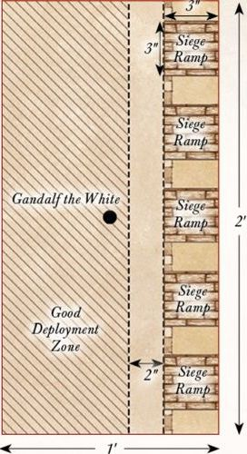

## DEFENCE OF OSGILIATH

**LAYOUT**

The board represents the ruined city of Osgiliath, and as such should be covered in ruins, buildings, statues and piles of rubble of all shapes and sizes. The board should have a variety of walkways of different sizes. Some could represent the major roads through the city and would be big enough for whole warbands to fight side- by-side upon. Others will be the narrow alleyways that separate the buildings and may fit one or two models through them. Three objectives should be placed, as shown on the map.

**STARTING POSITIONS**

The Good player deploys their force within 6" of the centre of the board. The Evil player then deploys their force within 12" of the eastern edge of the
board.

**OBJECTIVES**

The game lasts for ten turns. The Evil player wins if they can destroy all three objectives by the end of the tenth turn. The Good player wins if they can prevent this.

**SPECIAL RULES**

* **Hordes of Mordor**

Each time a Mordor Warrior model is slain, place it to one side. At the end of each Evil Move phase, roll a D6 for each Mordor Warrior model kept aside in this manner. On a 4+, place the model anywhere within the Evil player's deployment zone.

* **Faramir**

Faramir must always Charge if able to do so, however, he may spend a Will point not to Charge. Should Faramir be slain, then the best result the Good player can achieve is a draw.

* **Objectives**

Any Evil model can destroy an objective by being in base contact with it during the End phase of any turn, so long as they did not take part in a Fight (including supporting) in the preceding Fight phase.

**PARTICIPANTS**

**Good:** Faramir, Captain of Gondor with bow; Madril, Captain of Ithilien; Damrod, Ranger of Ithilien; 12 Warriors of Minas Tirith: 4 with shield, 4 with spear & shield, 4 with bow; 12 Rangers of Gondor: 8 with no additional wargear, 4 with spear.

**Evil:** 3 Mordor Orc Captains with shield; 36 Mordor Orcs: 12 with shield, 12 with spear, 6 with two-handed weapon, 6 with Orc bow.

---

## RETAKING OF OSGILIATH

**LAYOUT**

The board represents the ruined city of Osgiliath, and as such should be covered in ruins, buildings, statues and piles of rubble of all shapes and sizes. The board should have a variety of walkways of different sizes. Some could represent the major roads through the city and would be big enough for whole warbands to fight side- by-side upon. Others will be the narrow alleyways that separate the buildings and may fit one or two models through them.

**STARTING POSITIONS**

The Good player deploys their force anywhere within 12" of the western board edge. The Evil player then deploys their force anywhere within 12" of the eastern board
edge.

**OBJECTIVES**

The game lasts until one force has successfully completed their objective. The Good player wins if the Evil force is wiped out. The Evil player wins if both Boromir and Faramir are slain before this can happen. If both players achieve their objective in the same turn, the game is a
draw.

**SPECIAL RULES**

* **The Sons of the Steward**

Evil models may re-roll failed To Wound rolls against Boromir and Faramir.

* **For Gondor!**

In a turn in which Boromir or Faramir Charges into combat, all Gondor Warrior models that also Charged within 3" of either of them gain a bonus of +1 To Wound during the Fight phase.

**PARTICIPANTS**

**Good:** Boromir, Captain of the White Tower, with the Banner of Minas Tirith; Faramir, Captain of Gondor with bow; Madril, Captain of Ithilien; Damrod, Ranger of Ithilien; 12 Warriors of Minas Tirith: 4 with shield, 4 with spear & shield, 4 with bow; 12 Rangers of Gondor: 8 with no additional wargear, 4 with spear.

**Evil:** 3 Mordor Orc Captains with shield; 36 Mordor Orcs: 12 with shield, 12 with spear, 6 with two-handed weapon, 6 with Orc bow; 1 Mordor Troll.

---

## AMBUSH IN ITHILIEN

**LAYOUT**

This Scenario is played on a 4'x4' board. There should be lots of hedges, trees, and bushes dotted around the board - ideally not heavily impeding movement across the center of the board. These should be denser along the northern and southern board edges.

**STARTING POSITIONS**

The Evil player deploys the two Mûmakil touching the western board edge, as shown. They may then deploy their remaining models anywhere within 6" of either Mûmak. The Good player may then split their force into two equal parts - the first containing 12 Rangers and Faramir, and the second containing Madril, Damrod, and 12 Rangers. The Good player then deploys Faramir's half anywhere within 6" of the southern board edge, then their remaining models within 6" of the northern board edge.

**OBJECTIVES**

The Haradrim journey to Mordor to join with Sauron's armies before the assault on Minas Tirith - the more of them that can make it to the Black Gate, the stronger the Dark Lord's armies will be. Faramir has noted that the lumbering Mûmakil pose the greatest threat to Gondor and has tasked his Rangers to see to their downfall.

The game lasts until there are no Mûmakil left on the board. The Evil side wins if both Mûmakil can move off of the board via the eastern board edge. The Good player wins if they can slay both of the Mûmakil. If only one Mûmak has managed to escape the board, the game is a draw.

**SPECIAL RULES**

* **Unseen Hunters**

At the start of the game, before the first Priority is rolled for, each Good model may make a 'free' shooting attack as if it were the Shoot phase. Additionally, for the first three turns of the game, all Good models gain the Stalk Unseen special rule and may re-roll any 1s To Wound when making a shooting attack.

**PARTICIPANTS**

**Good:** Faramir, Captain of Gondor with bow; Madril, Captain of Ithilien; Damrod, Ranger of Ithilien; 24 Rangers of Gondor: 16 with no additional wargear, 8 with spear.

**Evil:** 2 War Mûmakil of Harad each with 12 Haradrim Warriors with bow; 24 Haradrim Warriors with spear.

---

## RAIDING OF PELARGIR

**LAYOUT**

The western half of the board should be covered in a variety of different buildings, with a series of roads that run between them. The eastern half of the board represents the docksides of Pelargir and so should have no buildings but instead be dotted with barrels, crates, and all manner of items that would be found on a dock. The eastern board edge represents the Anduin.

**STARTING POSITIONS**

The Good player deploys their models anywhere within 12" of the western board edge. The Evil player then deploys their models anywhere within 12" of the eastern board edge.

**OBJECTIVES**

The Corsairs of Umbar are ransacking the city of Pelargir, destroying houses, and setting buildings alight. Should they wreak enough havoc, then Pelargir will surely fall. Angbor and his clansmen have come to halt the Corsairs' acts of destruction and prevent the city of Pelargir from being captured.

The game lasts for ten turns. At the start of the game, starting with the Evil player, players take it in turn selecting buildings within the western half of the board edge until five buildings have been selected. At the end of the game, the Good player wins if more of the selected buildings are not on fire than have been set alight. The Evil player wins if more of the selected buildings have been set alight than have not.

**SPECIAL RULES**

* **Torching Buildings**

The five selected buildings are the targets that the Corsairs intend to set ablaze as they plunder the city. Any Corsair model that ends its move in base contact with one of the selected buildings during the Move phase can attempt to set it alight. Roll a D6. On a 6+, the building has been set alight.

* **Flaming Arrows**

Corsair models may shoot at any of the selected buildings as if they were enemy models, without taking In The Way tests for intervening models. Any building that is wounded by an arrow or crossbow bolt will immediately be set alight. Buildings count as having Defence 8.

* **Put the Fires Out!**

Any Good model that ends its move in base contact with a building that is on fire may attempt to put it out. Roll a D6. On a 6, the fire has been put out. However, should the Good player roll a 1, then the building will be consumed by the flames and cannot be put out for the remainder of the game.

**PARTICIPANTS**

**Good:** Angbor the Fearless; 24 Clansmen of Lamedon.

**Evil:** Dalamyr, Fleetmaster of Umbar; Delgamar, Gatemaster of Umbar; 24 Corsairs of Umbar: 8 with shield, 8 with spear, 8 with bow; 6 Corsair Arbalesters; 6 Corsair Reavers.

---

## FALL OF OSGILIATH

**LAYOUT**

The board represents the ruined city of Osgiliath, and as such should be covered in ruins, buildings, statues, and piles of rubble of all shapes and sizes. The board should have a variety of walkways of different sizes. Some could represent the major roads through the city and would be big enough for whole warbands to fight side-by-side upon. Others will be the narrow alleyways that separate the buildings and may fit one or two models through them.

**STARTING POSITIONS**

The Good player deploys their force anywhere within 6" of the center of the board. The Evil player then splits their force into two equal parts, with Gothmog and Gothmog's Enforcer in one half and Guritz in the other. Gothmog's half of the army is deployed anywhere within 12" of the eastern board edge. Guritz's half is deployed anywhere within 12" of the western board edge.

**OBJECTIVES**

The forces of Gondor must escape Osgiliath in order to remain alive, whilst the Orcs have simply been commanded to destroy the world of Men and plan on starting with those within Osgiliath. The Good side wins if at least 33% of their models can escape the board via the western board edge. The Evil player wins if they can prevent this. If Faramir is slain, the best result the Good side can achieve is a draw. If Faramir escapes the board, the best result the Evil side can achieve is a draw.

**SPECIAL RULES**

* **Hordes Without End**

Each time an Evil Warrior model is slain, place it to one side. At the end of each Evil Move phase, roll a D6 for any models placed aside in this manner. On a 4+, they may re-enter the board from either of the points marked on the map.

* **Nazgûl!**

At the start of each turn, the Evil player may select a single Good Warrior and roll a D6. On a 3+, this Warrior becomes paralyzed by fear and may not Move or Shoot that turn. They may fight if they are subsequently Engaged in combat, although their Fight value will be reduced to 1.

**PARTICIPANTS**

**Good:** Faramir, Captain of Gondor with bow; Madril, Captain of Ithilien; Damrod, Ranger of Ithilien; 12 Warriors of Minas Tirith: 4 with shield, 4 with spear & shield, 4 with bow; 12 Rangers of Gondor: 8 with no additional wargear, 4 with spear.

**Evil:** Gothmog, Lieutenant of Sauron; Gothmog's Enforcer; Guritz, Master of Reserves; 36 Morannon Orcs: 9 with shield, 9 with spear, 9 with spear & shield, 9 with no additional wargear.

---

## THE WHITE RIDER

**LAYOUT**

The board represents the fields of Pelennor and so should be fairly barren, with a few small patches of scrubland and rocks. The western board edge represents the walls of Minas Tirith, with the gates of the city in the centre of the western board edge.

**STARTING POSITIONS**

The Good player deploys Faramir and the Knights of Minas Tirith within 6" of the centre of the eastern board edge, and then deploys Gandalf touching the centre of the western board edge. The Evil player does not deploy any models; instead, they will be available later in the game.

**OBJECTIVES**

Gandalf rides out to save Faramir from a terrible fate at the jaws of the Nazgûl's Fell Beasts; only by escorting the youngest son of the Steward through the gates of Minas Tirith will he be safe from harm. The Nazgûl have been tasked with slaying Faramir and his warriors who ride towards the White City, and Faramir is their main target.

Any Good models can move off the board through the gates of Minas Tirith. The Good player wins if Faramir moves off the board through the gates of Minas Tirith. The Evil player wins if they can slay Faramir before this can happen. If Faramir moves off the board, but Gandalf has been slain, the game is a draw.

**SPECIAL RULES**

* **Ride to Minas Tirith**

The Good player automatically has Priority on the first turn.

* **Flight of the Nazgûl**

At the end of the first Evil Move phase, the Evil player may move all of their models onto the board from any point on the eastern board edge via the rules for Reinforcements.

**PARTICIPANTS**

**Good:** Faramir, Captain of Gondor with bow on horse; Gandalf the White on Shadowfax; 12 Knights of Minas Tirith with shield.

**Evil:** 3 Ringwraiths on Fell Beast, each with 2 Might, 14 Will and 2 Fate.

---

## FARAMIR'S CHARGE

**LAYOUT**

The board represents the plains of Pelennor and the very edges of Osgiliath. The area within 6" of the eastern board edge should be covered in ruins, rubble, and the remains of buildings. The rest of the board should remain barren, giving the Knights of Minas Tirith a clear surface to charge across.

**STARTING POSITIONS**

The Good player deploys their force anywhere touching the western board edge, with Faramir touching the center of the western board edge. The Evil player then deploys their forces anywhere within 6" of the eastern board edge.

**OBJECTIVES**

Denethor has ordered that Osgiliath be retaken, and this can only be achieved by wiping out the hosts of Mordor that lie within it. The Orcs see the advancing knights as a small inconvenience - one they can easily dispatch with a few volleys of arrows.

This battle continues until one force is wiped out, at which point their opponent is declared the winner.

**SPECIAL RULES**

* **Volley Fire**

Any Orc Tracker can choose to shoot their Orc bow at a target up to 36" away, rather than the usual 18". However, any Orc Tracker that targets an enemy model over 18" away will only hit on the roll of a 6.

* **Lethal Shot**

Orc Trackers gain a bonus of +1 To Wound when firing their Orc bow against an enemy model within 12".

**PARTICIPANTS**

**Good:** Faramir, Captain of Gondor with bow on horse; 12 Knights of Minas Tirith with shield.

**Evil:** Gothmog, Lieutenant of Sauron; 12 Orc Trackers; 12 Morannon Orcs: 3 with shield, 3 with spear, 3 with spear & shield, 3 with no additional wargear.

*Designer's Notes: On paper, this Scenario may seem far more in favor of the Evil player, and the fact is that it is. In the films, Faramir and his Knights don't even get close to Osgiliath before they are peppered by Orc arrows - hopefully in this Scenario the Good player will have a bit more luck!*

---

## THE BATTLE FOR PELARGIR

**LAYOUT**

The board represents the city of Pelargir, and as such should be covered with buildings, roads, and other terrain to give it the feel of a city. The area within 6" of the eastern board edge is the port and should be made of walkways with barrels and crates rather than buildings. In the center of the eastern board edge is a walkway onto one of the Corsair ships, as shown on the map.

**STARTING POSITIONS**

The Evil player deploys their force anywhere within 3" of the center line of the board that runs from north to south. The Good player then deploys the King of the Dead, the Heralds of the Dead, and all Warriors of the Dead anywhere within the eastern half of the board but at least 6" away from any Corsair model. The Good player then deploys the remainder of their models anywhere within 12" of the western board edge.

**OBJECTIVES**

The arrival of the Shadow Host has struck fear into the Corsairs of Umbar - they must leave the city of Pelargir at once if they are to survive and sail up the Anduin to raid Minas Tirith.

With their foes on the run, Aragorn commands his followers to stop the Corsairs from fleeing up-river and bring their leaders to their knees.

The game lasts until there are no Corsair Hero models left on the board. The Evil player wins if at least three Corsair Hero models can move off the board via the point shown on the map (marked X), including either Dalamyr or Delgamar. The Good player wins if they can prevent this from happening. If at least three Corsair Hero models escape the board, but both Dalamyr and Delgamar have been slain, the game is a draw.

**SPECIAL RULES**

* **The King of the Dead has come!**

Corsair models within 6" of the King of the Dead suffer a -1 penalty to all Courage tests.

**PARTICIPANTS**

**Good:** Aragorn - Strider with Andúril, Flame of the West; Legolas Greenleaf; Gimli, son of Glóin; Harbarad with Banner of Arwen Evenstar; Elladan & Elrohir; The King of the Dead; 2 Heralds of the Dead; Angbor the Fearless; 20 Warriors of the Dead; 12 Clansmen of Lamedon.

**Evil:** Dalamyr, Fleetmaster of Umbar; Delgamar, Gatemaster of Umbar; 2 Corsair Captains; 2 Corsair Bo'suns; 36 Corsairs of Umbar: 12 with shield, 12 with spear, 12 with bow; 12 Corsair Arbalesters; 12 Corsair Reavers.

---

## ATOP THE WALLS

**LAYOUT**

The area within 9" of the western board edge represents the area on top of the walls of Minas Tirith and therefore should be relatively clear, perhaps with a few steps, crates, or small sections of wall to add variety. The area within 3" of the eastern board edge represents the edge of the Pelennor and the sheer drop from the battlements. Within this area, there should be the ramps for five siege towers, each one being 3" by 3" and spread out along the eastern board edge so that they touch the battlements.

**STARTING POSITIONS**

The Good player deploys Gandalf in the center of the board, with Pippin within 1" of him. They then deploy the remainder of their models on the walls of Minas Tirith, but not within 2" of any part of the ramp of a siege tower. The Evil player then deploys their models either on the ramp of a siege tower or atop the walls within 1" of the ramp of a siege tower.

**OBJECTIVES**

Unless they can slay huge numbers of Orcs, the defenders of Minas Tirith will be overwhelmed by the invaders. The key to victory is the White Wizard - should he fall, all hope will be lost.

The Good player wins if, at the end of any turn, they have slain a total of 30 Orcs (it's important to keep track). The Evil player wins if they can slay Gandalf before this can happen. If both players complete their objective in the same turn, the game is a draw.

**SPECIAL RULES**

* **The White Wizard**

Gandalf must always Charge if he is able to do so. Additionally, on a turn in which Gandalf Charges, friendly Gondor Warrior models within 12" of him will count as being in range of a banner until the end of the turn.

* **The Hordes of Mordor**

Each time an Orc Warrior is slain, keep it to one side. At the end of each Evil Move phase, any models kept aside in this manner may move onto the board from the eastern board edge.

* **Battlements of Minas Tirith**

The eastern edge of the walls of Minas Tirith are lined with battlements that can trap a model against them. Additionally, any model that is pushed from the edge of a siege tower and onto the Pelennor is automatically slain - it's a rather long fall!

**PARTICIPANTS**

**Good:** Gandalf the White; Peregrin Took, Guard of the Citadel; Irolas, Captain of the Guard; Beregond; 24 Warriors of Minas Tirith: 8 with shield, 8 with spear & shield, 8 with bow.

**Evil:** Zagdûsh, Orc Captain; 2 Orc Captains with shield; 36 Mordor Orc Warriors: 12 with shield, 12 with spear, 6 with Orc bow, 6 with two-handed weapon.

---

## THE GATE IS BREACHED

**LAYOUT**

The board represents the courtyard of Minas Tirith. In the center of the eastern board edge are the remains of the city's gates. The board should be relatively bare around the center, perhaps with a few small piles of rubble and debris, whilst around the edges of the board there should be a few buildings. In the center of the board is a fountain with a diameter of 3". The fountain is shallow water.

**STARTING POSITIONS**

The Good player deploys all their models within 12" of the western board edge. The Evil player then deploys all of their models within 12" of the center of the eastern board edge.

**OBJECTIVES**

The forces of Mordor must capture the courtyard, securing a foothold before the rest of the city can fall; if they can overwhelm the lower levels they can make their way into the rest of the city.

The game lasts for eight turns, after which whoever has the most models within 6" of the center of the board is the winner. If both sides have the same number of models within 6" of the center of the board then the game is a draw. If Gandalf is slain, the best result the Good player can achieve is a draw.

**SPECIAL RULES**

* **The Hordes of Mordor**

Each time an Orc Warrior is slain, keep it to one side. At the end of each Evil Move phase, any models kept aside in this manner may move onto the board from the center of the eastern board edge.

* **You will Stand your Ground!**

Good models do not have to take Courage tests to Charge a Mordor Troll.

**PARTICIPANTS**

**Good:** Gandalf the White on Shadowfax; Húrin the Tall, Warden of the Keys; Ingold, Warden of the Rammas Echor; Irolas, Captain of the Guard; Beregond; 36 Warriors of Minas Tirith: 12 with shield, 12 with spear & shield, 12 with bow.

**Evil:** Goroth, Captain of the Morannon; Zagdûsh, Orc Captain; 2 Morannon Orc Captains with shield; 36 Morannon Orcs: 9 with shield, 9 with spear, 9 with spear & shield, 9 with no additional wargear; 3 Mordor Trolls.

---

## THE STREETS OF MINAS TIRITH

**LAYOUT**

The board represents the streets of the lower levels of Minas Tirith. There should be plenty of buildings and ruins that form a variety of different streets and alleyways of various widths. Some should be wide enough for blocks of infantry and Trolls, whilst others should only fit a few models side-by-side.

**STARTING POSITIONS**

The Good player deploys Gandalf touching the center of the eastern board edge, and then deploys Pippin touching the center of the western board edge. The Good player deploys Ingold and 12 Warriors of Minas Tirith in section A on the map. The Evil player then also deploys the Morannon Orc Captain and 12 Morannon Orcs in section A. The Good player deploys Irolas and 12 Warriors of Minas Tirith in section B on the map. The Evil player then also deploys Goroth and 12 Morannon Orcs in section B. The Good player deploys Húrin and 12 Warriors of Minas Tirith in section C on the map. The Evil player then also deploys Zagdûsh and 12 Morannon Orcs in section C. No models may be deployed within 3" of an enemy model.

**OBJECTIVES**

The Orcs are hungry to bring death and destruction to the people of Minas Tirith - should enough men fall, the city will be overrun. Pippin must reach Gandalf before Denethor can set the pyre alight, otherwise Faramir will perish.

The game lasts until the end of a turn when either Pippin or Gandalf are removed from the board. The Good side wins if both Gandalf and Pippin exit the board via the western board edge during the same turn. The Evil player wins if they can reduce the Good force to 25% of its starting numbers. If both players, or neither player, achieve their objective, then the game is a draw.

**SPECIAL RULES**

* **Pippin**

Pippin counts as wearing an Elven cloak. Additionally, any Evil model that wishes to Charge Pippin must first roll a D6. On a roll of a natural 6, they may Charge as normal. On a 1-5, the model may not Charge Pippin, but may Move as normal, even charging another enemy, if they wish.

* **Gandalf**

If, during the End phase of any turn, Pippin and Gandalf are in base contact and Gandalf is mounted, Pippin may mount Shadowfax and be treated as a passenger. Gandalf may not enter the western half of the board until Pippin has reached him.

**PARTICIPANTS**

**Good:** Gandalf the White on Shadowfax; Peregrin Took, Guard of the Citadel; Húrin the Tall, Warden of the Keys; Ingold, Warden of the Rammas Echor; Irolas, Captain of the Guard; 36 Warriors of Minas Tirith: 12 with shield, 12 with spear & shield, 12 with bow.

**Evil:** Goroth, Captain of the Morannon; Zagdûsh, Orc Captain; Morannon Orc Captain with shield; 36 Morannon Orcs: 9 with shield, 9 with spear, 9 with spear & shield, 9 with no additional wargear; 3 Mordor Trolls.

---

## THE WITCH-KING'S ARRIVAL

**SET-UP**

For this mini-game, you will require a deck of ordinary playing cards, Gandalf the White, Pippin, and the Witch-king of Angmar. Separate the cards into the four suits and then give the Diamonds to the Good player and the Spades to the Evil player. Next, lay out the Hearts as shown below. Finally, shuffle the Clubs and place them in a pile face-down.

The Good player places Gandalf on the Ace of Hearts, then the Evil player places the Witch-king on the King of Hearts.

Both players will also each need to have a pile of 20 Power tokens. These can be represented by anything from dice to coins to markers - whatever you have to hand.

**OBJECTIVE**

The first player to reduce their opponent to 0 Power tokens immediately wins the game.

**GAME TURN**

At the beginning of each turn, both players simultaneously play one card from their hand face-down. The Good player reveals their card and moves Gandalf to the card on the grid with the same value (e.g., if Gandalf plays a 4 then he will move to the 4 on the grid, etc). The Good player then applies the effect that is associated with the value of the card they moved to, as described in the table below.

The Evil player then follows the same process with the Witch-king.

After the Evil player has finished their turn, the Good player then flips over the top card from the Clubs deck and places Pippin on the card on the grid with the corresponding number. Note that when Pippin moves, he does not apply the effects of any card.

The turn then ends and the next turn begins.

**EXTRA RULES**

- If, at any point, Gandalf and the Witch-king are on the same card, and Pippin is not also on the same card, Gandalf immediately loses half of his remaining Power tokens.
- If, at any point, Gandalf, Pippin, and the Witch-king are all on the same card, the Witch-king immediately loses half of his Power tokens.
- If, at the end of any turn, Pippin and the Witch-king are on the same card, and Gandalf is not also on the same card, Pippin is slain and is removed from the game. Players no longer flip over a card from the Clubs deck.

**CARD EFFECTS TABLE**

| Card Value | Effect |
|------------|--------|
| A          | You gain 3 Power tokens. |
| 2          | Your opponent loses 1 Power token. |
| 3          | Your opponent loses 1 Power token. If your opponent is adjacent (including diagonal) to you, they instead lose 3 Power tokens. |
| 4          | You gain D3 Power tokens. |
| 5          | Steal D3 Power tokens from your opponent. |
| 6          | Roll a D6. On a 3+, you gain 2 Power tokens; on a 1-2, you lose 2 Power tokens. |
| 7          | Your opponent loses 1 Power token; you may then move them to any adjacent space. |
| 8          | Your opponent discards a card from their hand at random. |
| 9          | Roll four dice; your opponent loses 1 Power token for each 4+ you rolled. |
| 10         | Roll a D6. On a 1-3, Gandalf loses 2 Power tokens; on a 4+, the Witch-king loses 2 Power tokens. |
| J          | Your opponent loses 2 Power tokens. |
| Q          | Gandalf ignores all card effects until the end of the turn. |
| K          | Your opponent loses D6 Power tokens. |

---

## CHARGE OF THE ROHIRRIM

**LAYOUT**

The board represents the fields of Pelennor, the barren ground upon which the battles outside the gates of Minas Tirith are fought. As there is very little terrain on the fields, there is not much to place on the board apart from a few small areas of rocks and scrubland.

**STARTING POSITIONS**

The Evil player deploys their force within 12" of the southern board edge. The Good player then deploys their force within 12" of the northern board edge.

**OBJECTIVES**

The Rohirrim have arrived to deliver Minas Tirith from the grip of Mordor; only by routing the Orc hordes can they hope to accomplish this. Gothmog is wise to the plans of Théoden, and knows that without their leaders at the head of their charge, the Rohirrim will surely break.

The Good side wins if they can reduce the Evil force to less than 25% of its starting numbers. The Evil side wins if they can slay both Théoden and Éomer before this can happen. If both sides achieve their objective in the same turn, the game is a draw.

**SPECIAL RULES**

* **Charge of the Rohirrim**

The Good player always counts as having Priority. Additionally, Good models must always Charge if able to do so.

* **Gothmog**

After the Evil force has been reduced to less than 50% of their starting models, Gothmog may attempt to escape the battle by exiting the board via the southern board edge. If Gothmog manages to escape in this way, the best result the Good player can achieve is a draw.

**PARTICIPANTS**

**Good:** Théoden, King of Rohan, with heavy armour, shield, and armoured horse; Éomer, Marshall of the Riddermark, with armoured horse, shield, and throwing spears; Dernhelm; Gamling, Captain of Rohan, with horse and Royal Standard of Rohan; Déorwine, Chief of the King's Knights; Elfhelm, Captain of Rohan, with horse; 24 Riders of Rohan: 16 with no additional wargear and 8 with throwing spears.

**Evil:** Gothmog, Lieutenant of Sauron; Gothmog's Enforcer; 2 Morannon Orc Captains with shield; 36 Morannon Orcs: 9 with shield, 9 with spear, 9 with spear & shield, 9 with no additional wargear.

---

## DENETHOR'S MADNESS

**LAYOUT**

The board represents the Houses of the Dead and the long corridor that leads to it. There are a series of walls that are impassable, as shown on the map; these create a corridor that is 12" long from the northern board edge and is 6" wide as close to the centerline of the board as possible. Denethor's pyre is placed 3" from the center of the southern board edge as shown on the map.

**STARTING POSITIONS**

The Evil player deploys Denethor and Faramir atop the pyre; Faramir starts the game Prone. The four Citadel Guard start anywhere within 3" of the pyre. The Good player deploys Beregond in the center of the board and Gandalf the White on Shadowfax touching the center of the northern board edge. Pippin starts the game as a passenger on Shadowfax.

**OBJECTIVES**

Denethor has truly been driven to madness and plans to burn himself and his son alive. If Gandalf, Pippin, and Beregond cannot retrieve Faramir from the flames, he will die.

The game lasts for eight turns. If, at the end of eight turns, Faramir is either upon the pyre or within 1" of it, the Evil player wins. If the Good player can carry Faramir more than 1" away from the pyre by the end of the eighth turn, the Good player is the winner.

**SPECIAL RULES**

* **Faramir**

Faramir is unconscious and therefore does not act as a normal model. Instead, he is treated as a Heavy Object that can be moved by another model. Any Good model that is in base contact with the pyre can remove Faramir from its smoldering kindling. However, they cannot move any further that turn. Any Evil model that is carrying Faramir and is in base contact with the pyre may place him Prone atop the pyre - however, they cannot move any further that turn.

* **The White Wizard**

Gandalf does not have his Staff of Power in this Scenario, and begins the game with only a single point of Might, Will, and Fate.

* **Sacred Ground**

Good models may not make shooting attacks and may not make Strikes if they win a Duel roll. However, in his madness, Denethor and his guard have ignored the city's ruling - they may act as normal.

**PARTICIPANTS**

**Good:** Gandalf the White on Shadowfax; Peregrin Took, Guard of the Citadel; Beregond; Faramir, Captain of Gondor.

**Evil:** Denethor, Steward of Gondor; 4 Citadel Guard.

---

## WAR BEASTS FROM THE SOUTH

**LAYOUT**

The board represents the fields of Pelennor, the barren ground upon which the battles outside the gates of Minas Tirith are fought. As there is very little terrain on the fields, there is not much to place on the board apart from a few small areas of rocks and scrubland.

**STARTING POSITIONS**

The Good player deploys their models anywhere within 12" of the western board edge with Théoden at the point shown. The Evil player then deploys their models within 12" of the eastern board edge.

**OBJECTIVES**

The Mûmakil are bearing down upon the city of Minas Tirith, with only the Rohirrim standing in their way. Théoden must lead his people against these beasts if they are to save the city.

The game lasts until the Good force has been reduced to 25% of its starting numbers, or the Evil force is wiped out. At the end of the game, if there are no Mûmakil left alive, the Good player is the winner. If there are two or more Mûmakil still in play, then the Evil player is the winner. If there is only one Mûmak left alive, the game is a draw.

**SPECIAL RULES**

* **Death!**

Good models automatically pass Courage tests to Charge any Mûmak models.

* **The Mûmak War Leader**

If the Mûmak War Leader is slain, the best result the Evil player can achieve is a draw.

**PARTICIPANTS**

**Good:** Théoden, King of Rohan, with heavy armour, shield and armoured horse; Éomer, Marshall of the Riddermark, with armoured horse, shield and throwing spears; Dernhelm; Gamling, Captain of Rohan, with horse; Déorwine, Chief of the King's Knights; 24 Riders of Rohan: 16 with no additional wargear and 8 with throwing spears.

**Evil:** The Mûmak War Leader, with 12 Haradrim Warriors in the Howdah; 2 War Mûmaks of Harad with Mahûd Beastmaster and 12 Haradrim Warriors in the Howdah.

---

## THE HORSE AND THE SERPENT

**LAYOUT**

The board represents the fields of Pelennor, the barren ground upon which the battles outside the gates of Minas Tirith are fought. As there is very little terrain on the fields, there is not much to place on the board apart from a few small areas of rocks and scrubland.

**STARTING POSITIONS**

The Good player deploys their models anywhere within 12" of the western board edge, with Théoden at the point shown. The Evil player then deploys their models within 12" of the eastern board edge, with Suladân at the point shown.

**OBJECTIVES**

The aim for both armies is simple; slay the leader of the opposing forces. Should either force have their lord slain, their morale will be shattered. The game lasts until the end of a turn in which either Théoden or Suladân has been slain. The Good player wins if Suladân has been slain, whilst the Evil player wins if Théoden has been slain. If both Suladân and Théoden have been slain then the game is a draw.

**SPECIAL RULES**

* **A Duel of Kings**

Both Théoden and Suladân must Charge each other if they are able to do so.

* **Protect the Serpent Lord**

Râza may select two targets for his The Serpent's Weapon special rule, rather than one.

**PARTICIPANTS**

**Good:** Théoden, King of Rohan, with heavy armour, shield and armoured horse; Déorwine, Chief of the King's Knights; 24 Riders of Rohan: 16 with no additional wargear and 8 with throwing spears.

**Evil:** Suladân the Serpent Lord on armoured horse; Râza, Fang of the Serpent; Haradrim Captain; 12 Serpent Riders; 24 Haradrim Warriors: 12 with bow, 12 with spear.

---

## DEATH OF THE KING

**LAYOUT**

The board represents the fields of Pelennor, the barren ground upon which the battles outside the gates of Minas Tirith are fought. As there is very little terrain on the fields, there is not much to place on the board apart from a few small areas of rocks and scrubland.

**STARTING POSITIONS**

The Evil player deploys the Orcs within 12" of the western board edge. The Good player then deploys their models anywhere within 6" of the eastern board edge. The Witch-king is kept to one side for later in the game.

**OBJECTIVES**

Théoden must face a foe more skilled and deadly than any he has faced before; he must either slay the Witch-king or die in the attempt.

The game lasts until the end of a turn in which either Théoden or the Witch-king has been slain. The Good player wins if the Witch-king has been slain, whilst the Evil player wins if Théoden has been slain. If both the Witch-king and Théoden have been killed then the game is a draw.

**SPECIAL RULES**

* **The Witch-king's Arrival**

At the end of each game turn, roll a D6 and add the number of the turn you are on. If the total is 7 or more, then the Witch-king will arrive next turn. When the Witch-king arrives, he will move onto the board at the end of the Evil player's Move phase from a table edge of the Evil player's choice. The Witch-king may Charge on the turn in which he arrives.

* **The King of Rohan**

Each time Théoden slays an enemy model, he may immediately regain a single point of either Might, Will, or Fate that was spent earlier in the battle.

**PARTICIPANTS**

**Good:** Théoden, King of Rohan, with heavy armour, shield and armoured horse; 12 Riders of Rohan: 8 with no additional wargear and 4 with throwing spears.

**Evil:** The Witch-king of Angmar with Crown of Morgul, Fell Beast, 2 Might, 14 Will and 2 Fate; Morannon Orc Captain with shield; 12 Morannon Orcs: 3 with shield, 3 with spear, 3 with spear & shield, 3 with no additional wargear.

---

## FINAL FATE OF THE WITCH-KING

**SET-UP**

For this mini-game, you will require a deck of ordinary playing cards, Éowyn, Merry, and the Witch-king of Angmar. Split the deck of cards into the four suits. Lay the Hearts out in a circle on the board as shown below, and then give all of the Spades, except the King, to the Evil player. The other two suits are not used.

The Good player places Éowyn and Merry on the Ace of Hearts, then the Evil player places the Witch-king on the King of Hearts.

**OBJECTIVE**

The Good player wins if they can slay the Witch-king. The Evil player wins if they can slay Éowyn.

**GAME TURN**

At the beginning of each turn, the Evil player places one card from their hand face-down - this is where the Witch-king is attacking with his flail. The Good player then rolls a D6 and moves Éowyn around the board in either direction that number of cards; note that she must move the full amount in a single direction.

The Evil player then reveals their card and places a token on the corresponding card to show where the Witch-king has attacked with his flail - it also looks better if you rotate the Witch-king to face the direction he attacked. The card is then discarded. In the unlikely event that the Evil player has no more cards remaining, collect the discarded cards and continue the game.

If the Witch-king has attacked the same card as where Éowyn is standing, Éowyn suffers a wound. If the Witch-king has attacked a card that is adjacent to Éowyn, roll a D6. On a 4+, she suffers a wound. The Witch-king's token remains in place until he next attacks. Neither Éowyn nor Merry may move through the token - this may force Éowyn to move in a certain direction if she cannot move her full amount in a particular direction.

The Good player then rolls another D6 and moves Merry around the board in either direction. Note that, unlike Éowyn, Merry does not have to move the full amount. If Merry lands on the card that is opposite to where the Witch-king has just attacked, roll a D6. On a 4+, the Witch-king suffers a wound.

The turn then ends and the next turn begins.

**EXTRA RULES**

If Éowyn suffers three Wounds, she has been slain by the Witch-king and the Evil player is the winner.

If the Witch-king suffers three Wounds then Merry has managed to bring the Lord of the Nazgûl to his knees, allowing for Éowyn to deliver the death blow - the Good player is the winner.

---

## THE RIDE OF THE FIEFDOMS

**LAYOUT**

The board represents the fields of Pelennor, the barren ground upon which the battles outside the gates of Minas Tirith are fought. As there is very little terrain on the fields, there is not much to place on the board apart from a few small areas of rocks and scrubland.

**STARTING POSITIONS**

The Good player deploys their forces anywhere within 12" of the center of the board in the western half of the board. The Evil player deploys their forces anywhere within 12" of the center of the board in the eastern half of the board, but at least 6" away from any Good model.

**OBJECTIVES**

The warriors of the Fiefdoms sally forth to defend the White City. By inflicting devastating losses upon the foe, the tide of battle will swing once more in Gondor's favor. However, without Imrahil, Húrin, and Forlong to spur them on, the forces of the Fiefdoms will be left leaderless and easily broken.

The Good player wins if, at the end of any turn, they have slain a total of 30 or more Evil models. The Evil player wins if, at the end of any turn, Imrahil, Húrin, and Forlong have been slain. If both sides achieve their objective in the same turn, the game is a draw. If Prince Imrahil is slain, the best result the Good player can achieve is a draw.

**SPECIAL RULES**

* **The Hordes of Mordor**

Each time an Orc Warrior is slain, keep it to one side. At the end of each Evil Move phase, any models kept aside in this manner may move onto the battlefield from any board edge in the Evil player's board half.

* **The Prince's Duty**

Prince Imrahil may call a Heroic Move at the start of each Move phase without spending Might; however, Imrahil must always Charge if able to do so.

**PARTICIPANTS**

**Good:** Prince Imrahil of Dol Amroth with lance and armored horse; Forlong the Fat; Húrin the Tall, Warden of the Keys with horse; 12 Knights of Dol Amroth with armored horse and lance; 12 Axemen of Lossarnach.

**Evil:** Gothmog, Lieutenant of Sauron; Gothmog's Enforcer; Morannon Orc Captain with shield; 36 Morannon Orcs: 9 with shield, 9 with spear, 9 with spear & shield, 9 with no additional wargear; 1 Mordor Troll.

---

## THE GRIEF OF ÉOMER

**LAYOUT**

The board represents the fields of Pelennor, the barren ground upon which the battles outside the gates of Minas Tirith are fought. As there is very little terrain on the fields, there is not much to place on the board apart from a few small areas of rocks and scrubland.

**STARTING POSITIONS**

The Good player deploys Éomer in the center of the board and the Warriors of Rohan within 3" of Éomer. The Evil player then deploys their models anywhere on the board at least 6" from Éomer and more than 6" from any table edge. The rest of the Good models are kept aside for later in the game.

**OBJECTIVES**

Prince Imrahil leads his followers in an effort to rescue Éomer. If he cannot reach him in time, the new king of Rohan will suffer the same fate as Théoden.

The game lasts until the end of a turn in which one side has completed their objective. The Good player wins if they can reduce the Evil force to 25% of their starting numbers. The Evil player wins if Éomer is slain. If both players achieve their objective in the same turn, the game is a draw.

**SPECIAL RULES**

* **Éomer's Fury**

Éomer must Charge if able to do so. Additionally, Éomer may re-roll failed To Wound rolls during the Fight phase.

* **Ride of Dol Amroth**

At the end of the Good player's first Move phase, the rest of the Good models move onto the board from the center of the western board edge.

**PARTICIPANTS**

**Good:** Éomer, Marshal of the Riddermark; Prince Imrahil of Dol Amroth with lance and armoured horse; Húrin the Tall, Warden of the Keys with horse; 6 Warriors of Rohan with shield; 12 Knights of Dol Amroth with lance and armoured horse.

**Evil:** Gothmog, Lieutenant of Sauron; Gothmog's Enforcer; 36 Morannon Orcs: 9 with shield, 9 with spear, 9 with spear & shield, 9 with no additional wargear; 1 Mordor Troll.

---

## DEFEND THE GATE

**LAYOUT**

The board represents the fields of Pelennor, the barren ground upon which the battles outside the gates of Minas Tirith are fought. As there is very little terrain on the fields, there is not much to place on the board apart from a few small areas of rocks and scrubland. Along the western board edge are the walls of Minas Tirith, with the city's gates occupying the edge of the western board edge within 3" of its center.

**STARTING POSITIONS**

The Good player deploys their models within 12" of the center of the western board edge. The Evil player then deploys their models anywhere within the eastern half of the board.

**OBJECTIVES**

In the face of such seemingly insurmountable odds, the Men of the West must fight to prevent the forces of Mordor from entering the city. If too many Orcs or Evil Men break through their lines and into Minas Tirith, hope will fail and the city will be lost.

The game lasts for 12 turns. The Good player wins if, at the end of 12 turns, less than ten Evil models have moved off the board via Minas Tirith's gates. The Evil player wins if, at the end of 12 turns, more than ten Evil models have moved off the board via Minas Tirith's gates. Any other result is a draw.

**SPECIAL RULES**

* **The Last Defence**

Good models may re-roll failed To Wound rolls in the Fight phase whilst they are within 12" of the gates of Minas Tirith.

* **Death to the Captains!**

Each time Goroth slays a Good Hero, his Might is restored to its starting value.

**PARTICIPANTS**

**Good:** Forlong the Fat; Duinhir; Ingold, Warden of the Rammas Echor; Déorwine, Chief of the King's Knights; 12 Axemen of Lossarnach; 12 Blackroot Vale Archers; 12 Warriors of Minas Tirith: 4 with shield, 4 with spear & shield, 4 with bow; 12 Warriors of Rohan: 4 with shield, 4 with throwing spear & shield, 4 with bow.

**Evil:** Goroth, Captain of the Morannon; Morannon Orc Captain with shield; War Mûmak of Harad with 12 Haradrim Warriors: 6 with bow, 6 with spear; 36 Morannon Orcs: 9 with shield, 9 with spear, 9 with spear & shield, 9 with no additional wargear.

---

## THE DOCKS OF HARLOND

**LAYOUT**

The board represents the docks of Harlond. It should contain a few buildings, ruins, and piles of rubble dotted around the board. The southern board edge represents the edge of the docklands, whilst the northern board edge represents the wall that surrounds Harlond. In the center of the northern board edge, there should be a 6" gap that represents the gates between the docks and the fields of Pelennor.

**STARTING POSITIONS**

The Evil player deploys all of their models anywhere in the northern half of the board. The Good player then deploys all of their models within 12" of the southern half of the board.

**OBJECTIVES**

Aragorn and his followers are trying to make their way to the Battle of Pelennor Fields, and now a garrison of Morannon Orcs stands between them and the White City.

The game lasts until Aragorn is removed from the battlefield.

The Good player wins if Aragorn and either Legolas or Gimli can move off of the northern board edge via the gates of Harlond. If this has been done, but at least half of the named Hero models have been slain, the game is a draw. In any other result, the Evil player is the winner.

**SPECIAL RULES**

* **The Heir of Isildur**

Good models within 6" of Aragorn count as being in range of a banner.

**PARTICIPANTS**

**Good:** Aragorn - Strider with Andúril, Flame of the West; Legolas Greenleaf; Gimli, son of Glóin; The King of the Dead; 20 Warriors of the Dead; 6 Riders of the Dead.

**Evil:** Guritz, Master of the Reserves; 3 Morannon Orc Captains with shield; 36 Morannon Orcs: 9 with shield, 9 with spear, 9 with spear & shield, 9 with no additional wargear.

*Designer's Notes: This Scenario depicts the scenes as they are shown in the movies. If you wish to play this Scenario as it appears in the books, simply swap the King of the Dead, the Warriors of the Dead, and the Riders of the Dead for Elladan & Elrohir, Halbarad with the banner of Arwen Evenstar, Angbor the Fearless, 12 Rangers of the North, and 12 Clansmen of Lamedon.*

---

## DEATH OF GOTHMOG

**LAYOUT**

The board represents the fields of Pelennor, the barren ground upon which the battles outside of the gates of Minas Tirith are fought. As there is very little terrain on the fields, there is not much to place on the board apart from a few small areas of rocks and scrubland.

**STARTING POSITIONS**

The Evil player places Gothmog in the center of the board and the Morannon Orcs within 6" of the southern board edge, but at least 1" from the edge of the board. The Good player then places Éowyn 6" away from the northern board edge as shown on the map. The Good player then places Aragorn and Gimli anywhere touching the southern board edge.

**OBJECTIVES**

Gothmog has one thing on his mind; killing the warrior of Rohan that slew his lord and caused him such embarrassment and pain earlier in the battle. As Éowyn attempts to crawl to safety, Aragorn and Gimli make haste to save her from the clutches of Gothmog.

The Good player wins immediately if Gothmog is slain. The Evil player wins immediately if Éowyn is slain. There is no way to draw this Scenario.

**SPECIAL RULES**

* **The Walking Wounded**

Éowyn starts the game in the Prone position. She may not stand up for any reason, even if she wins a Duel roll. Gothmog begins the game with only a single point of Might, Will, and Fate. Additionally, Gothmog's Move value is reduced to 3" for the duration of this Scenario.

* **Leave Her to Me!**

Gothmog is the only Evil model that may Charge Éowyn.

**PARTICIPANTS**

**Good:** Aragorn - Strider with Andúril, Flame of the West; Gimli, son of Glóin; Éowyn, Shield Maiden of Rohan, with armour.

**Evil:** Gothmog, Lieutenant of Sauron; 12 Morannon Orcs: 3 with shield, 3 with spear, 3 with spear & shield, 3 with no additional wargear.

---

## THAT STILL ONLY COUNTS AS ONE!

*This Scenario is represented by a mini-game, and as such does not follow the usual rules for the Strategy Battle Game. Instead, it uses the series of unique rules provided here to help capture the feel of the scene.*

**OBJECTIVES**

Legolas must slay all of the Haradrim in the Howdah and then reach its front (marked X) by the end of the fourth turn, otherwise Aragorn, Gimli, and their allies will be flattened by the Mûmak's massive bulk. The Haradrim win if they can slay Legolas or if he cannot complete his objective in time.

Once one player has played a game as Legolas, we would suggest swapping over and playing it again; whoever can accomplish the mission the quickest will earn the title of the Hero of Pelennor!

**PARTICIPANTS**

**Good:** Legolas (obviously).

**Evil:** 6 Haradrim Warriors with bow; 6 Haradrim Warriors with spear; 1 Haradrim Chieftain.

Legolas starts at the point on the Howdah as shown on the diagram. The Chieftain is placed on the very top of the Howdah, whilst the rest of the Haradrim may be deployed anywhere else on the Howdah.

For this mini-game, we will not be using the normal Strategy Battle Game rules, nor the profiles found in the various publications. Instead, we will present a brand new way to play this Scenario that is tactical, fast-paced and, most importantly, a lot of fun!

**STATS**

**Action Points (AP)** - These are used by the models to complete the following actions: moving, shooting, or fighting in combat.

**Shoot (S)** - How good a model is at using their bow, or other ranged weaponry. This shows the score on a D6 that a model needs to hit - so the lower, the better!

**Combat (C)** - The number of D6s a model will roll when fighting in combat.

**Wounds (W)** - The number of Wounds the model can suffer before being slain. Should a model's Wounds ever be reduced to 0, they will be slain - remove the model from the Howdah.

**GAME ROUND**

At the start of each turn, each model is allocated the number of APs that is stated in their statline - this is all that they will get for that turn. Starting with the Good player, both players take turns activating a model that has APs remaining (a model that has no APs cannot be selected) until both players have used up all of the APs their side has been allocated.

During a model's activation, it may spend any number of APs available to that model to make any of the Basic Actions that follow. 

A model that is activated must spend at least one AP during its activation, but does not have to spend all of its APs if it has more than one - this may mean that a model can activate multiple times over the course of a turn.

Once both players have spent all of their APs, the turn ends and a new one begins. APs are re-allocated to the models and play resumes with the Good player once more. 

**BASIC ACTIONS**

**Moving:** Cost - 1 AP  

Any model may move during its turn by spending any amount of APs it has available. For each AP spent in this way, the model may move 1" or move up or down a level in the Howdah. When moving up or down a level, simply place the model in the nearest space available in the level they wish to move to, as close to where they started their move as possible.

**Shooting:** Cost - 1 AP  

Any model armed with a ranged weapon may fire it at an enemy model that it can see. For each AP spent, the model declares which ranged weapon they are using and rolls a D6. If the result of this roll is equal to or greater than the model's Shoot value, then a hit is scored. For each hit that is scored, you will need to roll To Wound. Each ranged weapon will state what D6 score is required to cause a Wound, and for each roll of a D6 that matches or exceeds this roll, the target suffers a Wound. A model may shoot at a target that is on the same level or the one below without penalty. However, if a model shoots at a target that is on a higher level and causes a Wound, the Wound will be ignored on a D6 roll of a 4+.

**Fighting:** Cost - 1 AP  

Any model may fight an enemy that is within 1" and on the same level of the Howdah. For each AP spent, the model declares which combat weapon they are using and rolls a number of D6 equal to their Combat value. Each weapon will state what D6 score is required to cause a Wound, and for each roll of a D6 that matches this roll, the target suffers a Wound.

* **LEGOLAS**

| AP  | S   | C  | W  |
| --- | --- | ---| ---|
| 6   | 3+  | 2  | 3  |

**RANGED WEAPON:**  

**Elf Bow**: Score to Wound - 3+

**COMBAT WEAPON:**  

**Daggers**: Score to Wound - 4+

**ABILITIES:**  

**Elven Agility:** Each time Legolas suffers a wound, he may spend 1 AP to use this ability. Roll a D6. On a 2+, the wound is ignored.

* **HARADRIM WITH BOW**

| AP  | S   | C  | W  |
| --- | --- | ---| ---|
| 1   | 4+  | 1  | 1  |

**RANGED WEAPON:**  

**Bow**: Score to Wound - 5+

**COMBAT WEAPON:**  

**Dagger**: Score to Wound - 6+

**ABILITIES:**  

**Poisoned Bow:** This model may re-roll To Wound rolls of a 1 when shooting.

* **HARADRIM WITH SPEAR**

| AP  | S   | C  | W  |
| --- | --- | ---| ---|
| 1   | -   | 1  | 1  |

**RANGED WEAPON:**  

None

**COMBAT WEAPON:** 

Spear: Score to Wound - 5+

**ABILITIES:**  

**Poisoned Spear:** This model may re-roll To Wound rolls of a 1 when fighting.

* **HARADRIM CHIEFTAIN**

| AP  | S   | C  | W  |
| --- | --- | ---| ---|
| 3   | -   | 2  | 2  |

**RANGED WEAPON:**  

None

**COMBAT WEAPON:**  

Spear: Score to Wound - 5+

**ABILITIES:**  

**Lethal Poison:** This model may re-roll all To Wound rolls when fighting.

---

## THE DEAD ARRIVE

**LAYOUT**

The board represents the fields of Pelennor, the barren ground upon which the battles outside the gates of Minas Tirith are fought. As there is very little terrain on the fields, there is not much to place on the board apart from a few small areas of rocks and scrubland.

**STARTING POSITIONS**

The Evil player deploys their models anywhere within 24" of the northern board edge. The Good player then deploys their models anywhere within 12" of the southern board edge.

**OBJECTIVES**

The Dead have only one task - to slay anything that poses a threat to the city of Minas Tirith and her people. If they can deliver the White City from the forces of Mordor, they can finally be at peace.

The game lasts until the end of a turn in which one force has been reduced to 25% of its starting numbers, at which point the other force is the winner. If both forces manage to reduce each other to 25% of their starting models in the same turn, the game is a draw.

**SPECIAL RULES**

* **March of the Dead**

The King of the Dead may call a Heroic Combat each turn without expending Might to do so.

**PARTICIPANTS**

**Good:** The King of the Dead; 2 Heralds of the Dead; 20 Warriors of the Dead: 14 with shield, 6 with spear.

**Evil:** 2 War Mûmakil of Harad, each with 12 Haradrim Warriors: 6 with bow, 6 with spear; 24 Morannon Orcs: 6 with shield, 6 with spear, 6 with spear & shield, 6 with no additional wargear.

---

## THE BATTLE OF PELENNOR FIELDS

*Whilst the previous Scenarios break the epic Battle of Pelennor Fields down into a series of bite-size games, each focusing on a particular event, this Scenario tackles the whole battle at once! If you are going to play this game, we suggest gathering a group of friends, plenty of tea and seed cake, and taking the whole weekend to play out the most important battle of the Third Age!*

**LAYOUT**

This Scenario is played on an 8'x6' board. Along the northern board edge are the walls of Minas Tirith, in the center of which is the Gatehouse. The rest of the battlefield is barren, very befitting of the fields of Pelennor and providing plenty of space for the huge number of models that take part in this battle.

**STARTING POSITIONS**

The Evil player deploys the Mordor force (except the Witch-king of Angmar) anywhere between 24" and 48" from the northern board edge and at least 24" from both the eastern and western board edges (see map). They then deploy the Easterling and Khand force anywhere between 12" and 24" of the southern board edge and at least 24" from both the eastern and western board edges (see map). The Good player then deploys the Grey Company force anywhere within 6" of the western board edge and at least 24" from both the northern and southern board edges (see map). They then deploy the Rohan force anywhere within 6" of the eastern board edge. The Witch-king of Angmar, Minas Tirith, and Harad forces are kept to one side for later in the game.

**OBJECTIVES**

The Battle of Pelennor Fields is the greatest battle of the Third Age and has many objectives. This Scenario has five objectives for both sides to fight over. As this Scenario will take a long time, we suggest that you gather your friends and decide amongst you how long to play for (we recommend at least five hours - possibly a whole weekend!) and whichever team has achieved the most objectives by the time the game ends is declared the winner.

**Heroes of the West** - The Men of the West that fight upon the Pelennor are spurred on by those that have led them into battle. Should their leaders fall, they shall follow suit. There are seven key Heroes of the West upon this battlefield: Aragorn, Legolas, Gimli, Théoden, Éomer, Imrahil, and Húrin. If, at the end of the game, there are more of these Heroes left alive than dead, the Good player claims this objective. If there are more of these Heroes dead than alive, the Evil player claims this objective.

**Servants of the Dark Lord** - The forces of Sauron are commanded by a collection of ruthless individuals who rule through fear and brute force rather than skill. Without these leaders to keep them in line, the forces of darkness will rout if the battle goes ill. There are seven key servants of the Dark Lord upon this battlefield: The Witch-king, Gothmog, the Mûmak War Leader, Suladân, The Golden King, Amdûr, and the Khandish King. If, at the end of the game, there are more of these Heroes left alive than dead, the Evil player claims this objective. If there are more of these Heroes dead than alive, the Good player claims this objective.

**The Mûmakil** - These massive war beasts thunder across the Pelennor. If they cannot be brought down, they will spell doom for the forces of Good. If, at the end of the game, there is one or more Mûmakil left alive, the Evil player claims this objective. If there are no Mûmakil left alive, the Good player claims this objective.

**Gates of Minas Tirith** - The gates of the White City must not fall. Should Sauron's forces capture them, the city will be overrun. At the end of the game, count the number of each side's models that are within 12" of the gates of Minas Tirith. Whichever side has more models within 12" claims this objective. If the score is the same, the result is a draw.

**The Pelennor** - Upon the fields of Pelennor, there are various points of strategic interest. Holding these will give a significant tactical advantage. There are four Objective markers on the battlefield (see map). Whichever side controls the most of these will claim this objective. A marker is considered to be controlled by whichever side has the most models within 3" of it.

**SPECIAL RULES**

* **Charge of the Rohirrim**

Any Rohan model that charged in the Move phase may declare a Heroic Combat in the ensuing Fight phase without spending Might. This may be done by both Warrior models and Hero models.

* **Dol Amroth for Gondor!** 

At the end of the first Good Move phase, the Good player moves the Gondor force onto the board, via the Gates of Minas Tirith.

* **Men from the South** 

At the end of the Evil player's fifth Move phase, the Evil player moves the Harad force onto the board, via the southern board edge.

* **The Witch-king**

At the end of the Evil player's seventh Move phase, the Evil player moves the Witch-king of Angmar onto the board, via the northern board edge.

*Designer's Notes: This Scenario represents the entire Battle of Pelennor Fields and so will take a long time and a lot of models. We suggest gathering a number of players for this Scenario; six is ideal as then a different player can take control of each force. As this Scenario essentially combines several of the other narrative Scenarios listed previously, it is not considered part of the campaign listed on pages 68-73.*

**PARTICIPANTS**

- **Gondor:** Prince Imrahil of Dol Amroth with lance and armoured horse; Forlong the Fat; Duinhir; Húrin the Tall, Warden of the Keys on horse; Ingold, Warden of the Rammas Echor; 12 Knights of Dol Amroth on armoured horse with lance; 12 Axemen of Lossarnach; Blackroot Vale Archers; 24 Warriors of Minas Tirith: 8 with shield, 8 with spear & shield, 8 with bow.

- **Rohan:** Théoden, King of Rohan, with heavy armour, shield and armoured horse; Éomer, Marshal of the Riddermark, with throwing spears, shield and armoured horse; Dernhelm; Gamling, Captain of Rohan, with Royal Standard of Rohan and horse; Déorwine, Chief of the King's Knights, on horse; Elfhelm, Captain of Rohan, on horse; 36 Riders of Rohan.

- **Grey Company:** Aragorn - Strider with Andúril, Flame of the West; Legolas Greenleaf with armour; Gimli, son of Glóin; Elladan & Elrohir with heavy armour; Halbarad with the banner of Arwen Evenstar; 12 Rangers of the North; Angbor the Fearless; The King of the Dead; 2 Heralds of the Dead with Pennant of the Dead; 12 Clansmen of Lamedon; 20 Warriors of the Dead.

- **Mordor:** The Witch-king of Angmar with full Might, Will and Fate, Crown of Morgul, Flail and Fell Beast; Gothmog, Lieutenant of Sauron, with Warg; Gothmog's Enforcer; Goroth, Captain of the Morannon; Guritz, Master of the Reserves; 48 Morannon Orcs: 12 with shield, 12 with spear, 12 with spear & shield, 12 with no additional wargear; 2 Mordor Trolls.

- **Harad:** Suladân the Serpent Lord on horse; The Mûmak War Leader, with 12 Haradrim Warriors in the Howdah (this is an exception to the normal rules for what may be included in the Mûmak War Leader's Howdah); 2 War Mûmaks of Harad each with 12 Haradrim Warriors in the Howdah; The Golden King of Abrakhân; Râza, Fang of the Serpent; 12 Serpent Riders; 12 Haradrim Raiders; 12 Abrakhân Guard; 12 Mahûd Raiders.

- **Easterlings & Khand:** Amdûr, Lord of Blades, on armoured horse; 2 Easterling Captains with shield; Khandish King on Chariot; Khandish Chieftain; 12 Easterling Kataphrakts; 20 Easterling Warriors: 8 with shield, 8 with bow, 4 with pike & shield; 9 Khandish Warriors: 6 with two-handed axe, 3 with bow; 6 Khandish Horsemen; 2 Khandish Charioteers.

---

## THE BLACK GATE

**LAYOUT**

The board represents the barren fields outside the Black Gate. As there is very little terrain outside the Black Gate (Mordor is a wasteland after all), there is not much to place on the board apart from the Black Gate's walls that run along the eastern board edge. The eastern edge of the board within 6" of the center of the eastern board edge represents the opening for the Black Gate.

**STARTING POSITIONS**

The Good player deploys all of their models within 6" of the center of the board. The Evil player then deploys all of their models anywhere on the board more than 6" from any Good models.

**OBJECTIVES**

The Men of the West are fighting to buy time; not for themselves but for Frodo. If they can hold the Mordor forces at bay for long enough, then Frodo can destroy the Ring.

The game lasts for 15 turns. If, at the end of the fifteenth turn, there are 10 or more Good models left alive, then the Good player is the winner. If there are less than 10 models left alive then the Evil player is the winner. If Aragorn is still alive, the best result the Evil player can achieve is a draw.

**SPECIAL RULES**

* **Gandalf's Staff**

Gandalf does not have his Staff of Power, and therefore does not gain a free point of Will each turn.

* **Teeming Hordes**

Each time a Mordor Orc model is slain, keep it to one side. At the end of each Evil move phase, the Evil player may move any models kept aside in this manner onto the board from the Black Gate.

* **Greatest of the Trolls**

The Mordor Troll Chieftain gains the Fearless special rule and an additional point of Might, Will, and Fate.

* **The Hordes of Mordor**

Mordor Orc models gain a bonus of +1 To Wound in a Duel in which they outnumber their opponent in the Fight. Note that supporting models do not count for either side for the purpose of this rule.

* **Stand Your Ground**

Good models may not willingly move more than 12" away from the center of the board.

**PARTICIPANTS**

**Good:** Aragorn - Elessar; Legolas Greenleaf with armour; Gimli, son of Glóin; Gandalf the White; Éomer, Marshal of the Riddermark; Meriadoc, Knight of the Mark; Peregrin, Guard of the Citadel; 24 Warriors of Minas Tirith: 8 with shield, 8 with spear & shield, 8 with bow; 24 Warriors of Rohan: 8 with shield, 8 with throwing spear & shield, 8 with bow.

**Evil:** Mordor Troll Chieftain; The Mouth of Sauron on armoured horse; 3 Morannon Orc Captains with shield; 48 Morannon Orcs: 12 with shield, 12 with spear, 12 with shield and spear, 12 with no additional wargear.

*Designer's Notes: This Scenario is designed to depict the Black Gate as seen in the movies, and as such the Scenario only contains the characters that can be seen in those scenes. If you would rather play through the Black Gate as portrayed in the books, turn to pages 64-67, where you can find two Scenarios that recreate the event from that perspective.*

---

## THE BLACK GATE: THE LEFT HILL

**LAYOUT**

The board represents the left hill outside the Black Gate. The area within 3" of the center of the board represents the hill itself. The rest of the board comprises the barren fields outside the Black Gate.

**STARTING POSITIONS**

The Good player deploys all of their models on the hill. The Evil player then deploys all of their models anywhere on the board more than 6" away from any Good model.

**OBJECTIVES**

The Captains of the West are well aware that there is little hope for themselves, yet if they can fight hard enough to draw Sauron's gaze away from the plains of Mordor, they can provide Frodo with the opportunity he needs.

The game lasts until the end of a turn where the Good force has been reduced to less than 25% of its starting numbers. If when this happens the Evil player has less than 50% of their models remaining, then the Good player wins. If the Evil player has more than 50% of their models remaining, the Evil player wins.

**SPECIAL RULES**

* **Gandalf's Staff**

Gandalf does not have his Staff of Power, and therefore does not gain a free point of Will each turn.

* **Inspiring Heraldry**

The range of all Good banners is increased by 3".

**PARTICIPANTS**

**Good:** Aragorn - Elessar; Legolas Greenleaf with armour; Gimli, son of Glóin; Gandalf the White; Peregrin Took, Guard of the Citadel; Beregond; Elladan & Elrohir; 25 Warriors of Minas Tirith: 8 with shield, 8 with spear & shield, 8 with bow, 1 with banner.

**Evil:** Mordor Troll Chieftain; 2 Morannon Orc Captains with shield; 2 Haradrim Chieftains; 24 Morannon Orcs: 6 with shield, 6 with spear, 6 with shield & spear, 6 with no additional wargear; 24 Haradrim Warriors: 12 with bow, 12 with spear.

---

## THE BLACK GATE: THE RIGHT HILL

**LAYOUT**

The board represents the right hill outside the Black Gate. The area within 3" of the center of the board represents the hill itself. The rest of the board comprises the barren fields outside the Black Gate.

**STARTING POSITIONS**

The Good player deploys all of their models on the hill. The Evil player then deploys all of their models anywhere on the board more than 6" away from any Good model.

**OBJECTIVES**

The Captains of the West are well aware that there is little hope for themselves, yet if they can fight hard enough to draw Sauron's gaze away from the plains of Mordor, they can provide Frodo with the opportunity he needs.

The game lasts until the end of a turn where the Good force has been reduced to less than 25% of its starting numbers. If when this happens the Evil player has less than 50% of their models remaining, then the Good player wins. If the Evil player has more than 50% of their models remaining, the Evil player wins.

**SPECIAL RULES**

* **Inspiring Heraldry**

The range of all Good banners is increased by 3".

**PARTICIPANTS**

**Good:** Prince Imrahil of Dol Amroth; Éomer, Marshal of the Riddermark; Captain of Dol Amroth; Captain of Rohan with shield; 12 Knights of Dol Amroth: 1 with banner; 13 Warriors of Rohan: 4 with shield, 4 with throwing spears, 4 with bow, 1 with banner.

**Evil:** 2 Morannon Orc Captains with shield; 2 Easterling Captains with shield; 24 Morannon Orcs: 6 with shield, 6 with spear, 6 with shield & spear, 6 with no additional wargear; 20 Easterling Warriors: 8 with shield, 8 with bow, 4 with pike & shield.

*Designer's Notes: To play this Scenario alongside The Black Gate: The Left Hill, place the two boards so that the southern board edge from The Black Gate: The Left Hill lines up with the northern board edge of The Black Gate: The Right Hill. This will form one 2'x4' board for the game to be played on. Models must deploy on the board section that they would normally deploy on, but after that they may move anywhere on the whole board if able. In terms of working out who has won the Scenario overall, treat them as two separate Scenarios (in which case it is a good idea to mark out which Morannon Orcs belong to which Scenario). If the Good side wins both Scenarios, then the Good player is the overall winner. If the Evil player wins both Scenarios, then the Evil player is the winner. If both sides win one Scenario each, the game is a draw.*

