## SCENARIO 1 — DOMINATION

**SCENARIO OUTLINE**

Players fight to control five Objectives scattered across the battlefield.

**THE ARMIES**

Players choose their forces, as described on page 130 of the Middle-earth Strategy Battle Game rules manual, to an equal points value before the game.

**LAYOUT**

Set up terrain as described on page 136 of the Middle-earth Strategy Battle Game rules manual. Then, place five Objective markers on the battlefield; one is automatically placed in the centre of the board. To place the other Objectives, both players roll a D6. The player with the highest score places one Objective marker anywhere on the battlefield at least 12" away from the existing Objective and 6" away from any board edge. Their opponent then places a third Objective at least 12" away from existing Objectives and at least 6" away from any board edge. The players then alternate placing the remaining two Objectives, according to the restrictions noted earlier.

**STARTING POSITIONS**

Both players roll a D6 — the player with the highest result chooses one of the deployment zones. They then select a warband in their force to deploy within 24" of their board edge. Models may not be deployed further than 6" from the captain of their warband.

When this has been done, the opposing player chooses one of their warbands and deploys it within 24" of their board edge, as described above. Players then alternate until all of their warbands have been placed.

**INITIAL PRIORITY**

Both players roll a D6. The player with the highest score has Priority in the first turn.

**OBJECTIVES**

The game lasts until the end of a turn in which one force has been reduced to a quarter (25%) of its starting number of models or below, at which point the force that has scored the most Victory Points wins the game. If both players have the same number of Victory Points, the game is a draw.

**SCORING VICTORY POINTS**

* You score **2 Victory Points** for each Objective marker that has at least one of your models, and no enemy models, within 3".
* You score **1 Victory Point** for each Objective marker that has both friendly and enemy models, but more friendly than enemy models, within 3".
* You score **1 Victory Point** for causing one or more Wounds on the enemy leader (Wounds prevented by a successful Fate roll do not count) or if you kill the enemy leader.
* You score **1 Victory Point** if the enemy force is Broken at the end of the game.

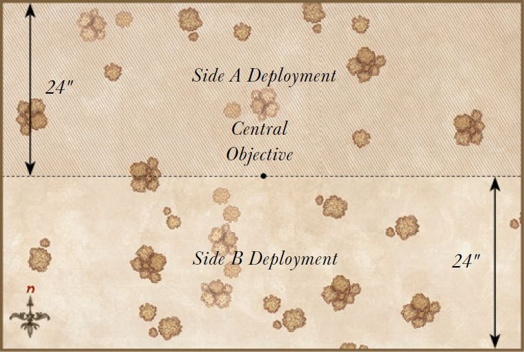

---

## SCENARIO 2 — TO THE DEATH!

**SCENARIO OUTLINE**

Victory goes to the force which can crush the foe and slay the enemy leader.

**THE ARMIES**

Players choose their forces, as described on page 130 of the Middle-earth Strategy Battle Game rules manual, to an equal points value before the game.

**LAYOUT**

Set up terrain as described on page 136 of the Middle-earth Strategy Battle Game rules manual.

**STARTING POSITIONS**

Both players roll a D6 — the player with the highest result chooses one of the deployment zones. They then select a warband in their force to deploy within 12" of their board edge. Models may not be deployed further than 6" from the captain of their
warband.

When this has been done, the opposing player chooses one of their warbands and deploys it within 12" of their board edge, as described above. Players then alternate until all warbands have been placed.

 **INITIAL PRIORITY**

Both players roll a D6. The player with the highest score has Priority in the first turn.

**OBJECTIVES**

The game lasts until the end of a turn in which one force has been reduced to a quarter (25%) of its starting number of models or below, at which point the force that has scored the most Victory Points wins the game. If both players have the same number of Victory Points, the game is a draw.

**SCORING VICTORY POINTS**

* You score **1 Victory Point** for causing one or more Wounds on the enemy leader (Wounds prevented by a successful Fate roll do not count). If you kill the enemy leader, you instead score **3 Victory Points**.

* You score **3 Victory Points** if the enemy force is Broken at the end of the game. If the enemy force is Broken and your force is unbroken, you instead score **5 Victory Points**.

* You score **1 Victory Point** if you have at least one banner remaining at the end of the game. If you have at least one banner remaining and your opponent has none remaining, then you instead score **2 Victory Points**.

* You score **2 Victory Points** if the enemy force is reduced to 25% of its starting models at the end of the game.

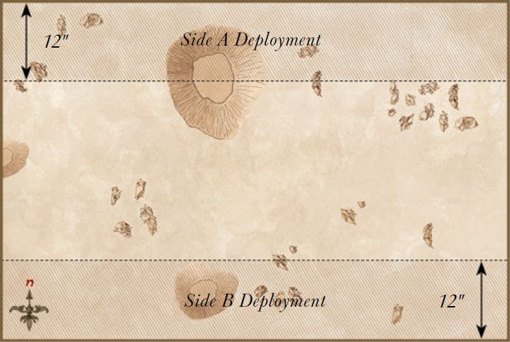

---

## SCENARIO 3 – HOLD GROUND

**SCENARIO OUTLINE**

Control the centre of the battlefield, no matter the cost.

**THE ARMIES**

Players choose their forces, as described on page 130 of the Middle-earth Strategy Battle Game rules manual, to an equal points value before the game.

**LAYOUT**

Set up terrain as described on page 136 of the Middle-earth Strategy Battle Game rules manual. Once the battlefield has been set up, an Objective marker is placed in the centre of the battlefield. Players must also agree which direction is north — this is important for determining where and when Reinforcements arrive from.

**STARTING POSITIONS**

At the battle's start, the forces are yet to arrive — models are not deployed at the start of the game, but will enter as the game continues (see Special Rules later).

**INITIAL PRIORITY**

Both players roll a D6. The player with the highest score has Priority in the first turn.

**OBJECTIVES**

Once one force has been Broken, the game might suddenly end. At the end of each turn, after this condition has been met, roll a D6. On a 1-2, the game ends — otherwise, the battle continues for another turn.

At the end of the game, the force that has scored the most Victory Points wins the game. If both players have the same number of Victory Points, the game is a draw.

**SCORING VICTORY POINTS**

* You score **3 Victory Points** if you have more models within 6" of the Objective marker than your opponent. If you have twice as many models within 6" of the Objective than your opponent, then you instead score **5 Victory Points**. If you have three times as many models within 6" of the Objective than your opponent, or you are the only player to have models within 6" of the Objective marker, then you instead score **7 Victory Points**.

* You score **1 Victory Point** for causing one or more Wounds on the enemy leader (Wounds prevented by a successful Fate roll do not count). If you kill the enemy leader, you instead score **2 Victory Points**.

* You score **1 Victory Point** if the enemy force is Broken at the end of the game. If the enemy force is Broken and your force is unbroken, you instead score **3 Victory Points**.

**SPECIAL RULES**

**Maelstrom of Battle:** At the end of your Move phase, roll a D6 for each of your warbands not on the battlefield and consult the chart below (the warband's captain can use Might to alter the roll either up or down). Models can't charge in the turn that they arrive but otherwise act normally. Roll for each warband separately, deploy the models in the warband (if the D6 allows) then roll for the next. Warbands yet to arrive count as being on the battlefield for the purposes of determining if your force is Broken.

| D6 | Result |
|----|--------|
| 1 | The warband does not arrive. |
| 2 | Your opponent chooses a point on either the north or south board edges at least 6" from a corner – all models in the warband move onto the battlefield from this point. |
| 3 | Your opponent chooses a point on either the east or west board edges at least 6" from a corner – all models in the warband move onto the battlefield from this point. |
| 4 | You choose a point on either the north or south board edges at least 6" from a corner – all models in the warband move onto the battlefield from this point. |
| 5 | You choose a point on either the east or west board edges at least 6" from a corner – all models in the warband move onto the battlefield from this point. |
| 6 | You choose a point on any board edge at least 6" from a corner – all models in the warband move onto the battlefield from this point. |

---

## SCENARIO 4 – LORDS OF BATTLE

**SCENARIO OUTLINE**

A pitched battle where victory goes to the player who causes the most carnage.

**THE ARMIES**

Players choose their forces, as described on page 130 of the Middle-earth Strategy Battle Game rules manual, to an equal points value before the game.

**LAYOUT**

Set up terrain as described on page 136 of the Middle-earth Strategy Battle Game rules manual.

**STARTING POSITIONS**

Both players roll a D6 — the player with the highest result chooses one of the deployment zones. They then select a warband in their force to deploy within 24" of their board edge, but at least 1" away from enemy models. Models may not be deployed further than 6" from the captain of their warband.

When this has been done, the opposing player chooses one of their warbands and deploys it within 24" of their board edge as described above. Players then alternate until all warbands have been placed.

**INITIAL PRIORITY**

Both players roll a D6. The player with the highest score has Priority in the first turn. 

**OBJECTIVES**

Once one force has been Broken, the game might suddenly end. At the end of each turn after this condition has been met, roll a D6. On a 1-2, the game ends — otherwise, the battle continues for another turn.

At the end of the game, the force that has scored the most Victory Points wins the game. If both players have the same number of Victory Points, the game is a draw.

**SCORING VICTORY POINTS**

* For this Scenario you need to keep track of your Wound Tally. Your Wound Tally is equal to the number of Wounds that your army inflicted upon your opponent's army, plus any Fate points that your opponent pent. Hero models that are removed from the game with unspent Fate points will add 1 to the Wound Tally for each one unspent. Models that flee because their force is Broken count towards the Wound Tally, but mounts that flee do not. You score **3 Victory Points** if your Wound Tally is greater than your opponent's. If your Wound Tally is at least twice as large as your opponent's, then you instead score **5 Victory Points**. If your Wound Tally is at least three times as large as your opponent's, or your opponent has no models left on the board, then you instead score **7 Victory Points**.

* You score 1 Victory Point for causing one or more Wounds on the enemy leader (Wounds prevented by a successful Fate roll do not count). If you kill the enemy leader, you instead score **2 Victory Points**.

* You score **1 Victory Point** if the enemy force is Broken at the end of the game. If the enemy force is Broken and your force is unbroken, you instead score **3 Victory Points**.

**SPECIAL RULES**

**A Time of Heroes:** Each time your force kills an enemy Hero in a Fight, one of your Hero models in the same Fight (your choice) regains a point of Might lost earlier in the battle.

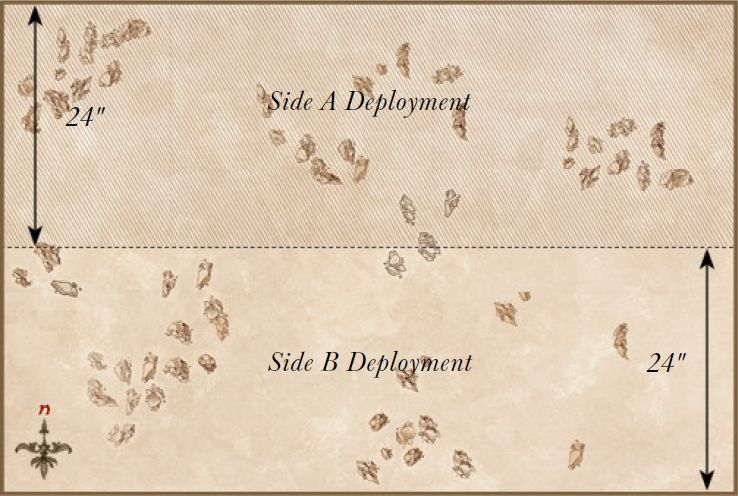

---

## SCENARIO 5 – RECONNOITRE

**SCENARIO OUTLINE**

Ensure more of your models escape the battlefield than your opponent.

**THE ARMIES**

Players choose their forces, as described on page 130 of the Middle-earth Strategy Battle Game rules manual, to an equal points value before the game.

**LAYOUT**

Set up terrain as described on page 136 of the Middle-earth Strategy Battle Game rules manual.

**STARTING POSITIONS**

At the battle's start, the forces are yet to arrive — models are not deployed at the start of the game. Both players roll a D6.

The player with the highest result chooses one of the long table edges to be their board edge — the opposing player has the opposite board edge as their board edge (see Special Rules later).

**INITIAL PRIORITY**

Both players roll a D6. The player with the highest score has Priority in the first turn.

**OBJECTIVES**

The game lasts until the end of a turn in which one force has been reduced to a quarter (25%) of its starting number of models, or below, at which point the force that has scored the most Victory Points wins the game. If both players have the same number of Victory Points, the game is a draw.

Models that have escaped the board count as being on the board for the purpose of determining if a force is Broken. 

**SCORING VICTORY POINTS**

* You score **3 Victory Points** if more of your models have escaped the battlefield via your opponent's board edge than vice versa. If at least two of your models and twice as many models than your opponent have escaped the board, then you instead score **5 Victory Points**. If at least three of your models, and three times as many models than your opponent have escaped the board, then you instead score **7 Victory Points**.

* You score 1 Victory Point for causing one or more Wounds on the enemy leader — Wounds prevented by a successful Fate roll do not count. If you kill the enemy leader, you instead score **2 Victory Points**.

* You score **1 Victory Point** if the enemy force is Broken at the end of the game. If the enemy force is Broken and your force is unbroken, you instead score **3 Victory Points**.

**SPECIAL RULES**

**Reinforcements:** At the end of your Move phase, roll a D6 for each of your warbands that are not on the battlefield and consult the chart below (the warband's captain can use Might to alter the roll). Models enter the board via the rules for Reinforcements (see page 33 of the Middle-earth Strategy Battle Game rules
manual).

Roll for each warband separately, deploy the models in the warband, then roll for the next. Warbands yet to arrive count as being on the battlefield for determining if your force is Broken. Warbands that have still not arrived by the start of the fourth turn will automatically arrive on turn 4.

| D6 | Result |
|------|--------|
| 1-3 | The warband does not arrive, but receives +1 to this dice roll next turn. |
| 4-6 | The controlling player chooses a point on their board edge at least 6" from a corner — all models in the warband move onto the battlefield from this point. |
 
***Designer's Note:** Special rules that allow for models to arrive on from any table edge (such as the Goblin Mercenary Captain's Mercenary Ambush) must choose the controlling player's table edge for this Scenario.*

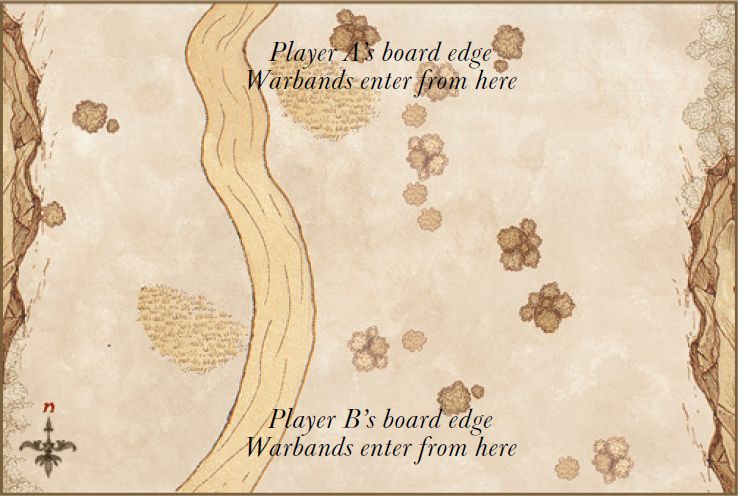

---

## SCENARIO 6 – A CLASH BY MOONLIGHT

**SCENARIO OUTLINE**

A battle to the death in the dark of night!

**THE ARMIES**

Players choose their forces, as described on page 130 of the Middle-earth Strategy Battle Game rules manual, to an equal points value before the game.

**LAYOUT**

Set up terrain as described on page 136 of the Middle-earth Strategy Battle Game rules manual.

**STARTING POSITIONS**

Both players roll a D6 — the player with the highest result chooses one of the deployment zones. They then select a warband in their force to deploy within 12" of their board edge. Models may not be deployed further than 6" from the captain of their
warband.

When this has been done, the opposing player chooses one of their warbands and deploys it within 12" of their board edge as described above. Players then alternate until all warbands have been placed.

**INITIAL PRIORITY**

Both players roll a D6. The player with the highest score has Priority in the first turn.

**OBJECTIVES**

The game lasts until the end of a turn in which one force has been reduced to a quarter (25%) of its starting number of models or below, at which point the force that has scored the most Victory Points wins the game. If both players have the same number of Victory Points, the game is a draw.

**SCORING VICTORY POINTS**

* You score **1 Victory Point** for causing one or more Wounds on the enemy leader. Wounds prevented by a successful Fate roll do not count. If you kill the enemy leader, you instead score **2 Victory Points**.

* You score **3 Victory Points** if the enemy force is Broken at the end of the game. If the enemy force is Broken and your force is unbroken, you instead score **5 Victory Points**.

* You score **1 Victory Point** if you have at least one Hero remaining at the end of the game. If you have at least one Hero left alive, and have killed more Hero models than your opponent, you instead score **3 Victory Points**. If you have at least one Hero remaining, and your opponent has none remaining, then you instead score **5 Victory Points**.

**SPECIAL RULES**

The Dark of Night: Due to the reduced visibility, models cannot be targeted by shooting, Magical Powers or special abilities over 12" away. However, as it is much harder to avoid a shot in the dark, all shooting attacks gain a bonus of +1 when rolling To Wound. Siege Engine models may still target enemy models more than 12" away — however in this situation they will only ever hit on the roll of a 6.

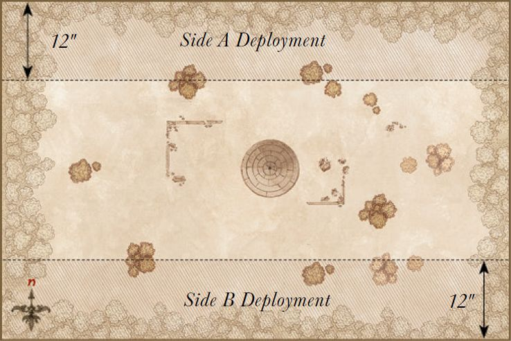

---

## SCENARIO 7 — SEIZE THE PRIZE

**SCENARIO OUTLINE**

Recover a precious item and carry it through the enemy force to victory.

**THE ARMIES**

Players choose their forces, as described on page 130 of the Middle-earth Strategy Battle Game rules manual, to an equal points value before the game.

**LAYOUT**

Set up terrain as described on page 136 of the Middle-earth Strategy Battle Game rules manual. Place a 25mm marker in the centre of the board to represent the artefact.

**STARTING POSITIONS**

Both players roll a D6 — the player with the highest result chooses one of the deployment zones. They then select a warband in their force to deploy within 12" of their board edge. Models may not be deployed further than 6" from the captain of their
warband.

When this has been done, the opposing player chooses one of their warbands and deploys it within 12" of their board edge as described above. Players then alternate until all warbands have been placed.

**INITIAL PRIORITY**

Both players roll a D6. The player with the highest score has Priority in the first turn.

**OBJECTIVES**

The game lasts until either a model carrying the artefact carries it off the board via their opponent's board edge, or both forces have been reduced to a quarter (25%) of their starting number of models, or below, at which point the force that has scored the most Victory Points wins the game. If both players have the same number of Victory Points, the game is a draw.

**SCORING VICTORY POINTS**

* You score **3 Victory Points** if one of your models is carrying the artefact within your own board half. If one of your models is carrying the artefact within your opponent's board half, then you instead score **5 Victory Points**. If one of your models is carrying the artefact and manages to move off the board via your opponent's board edge, then you instead score **7 Victory Points**.

* You score **1 Victory Point** for causing one or more Wounds on the enemy leader. Wounds prevented by a successful Fate roll do not count. If you kill the enemy leader, you instead score **2 Victory Points**.

* You score **1 Victory Point** if the enemy force is Broken at the end of the game. If the enemy force is Broken and your force is unbroken, you instead score **3 Victory Points**.

**SPECIAL RULES**

**The Artefact:** The artefact must be dug out of the soil before it can be carried anywhere. An Infantry model who is in base contact with the Artefact marker at the end of its Move may attempt to free it.

Roll a D6. On a 4+, the artefact has been freed, the artefact is treated as a Light Object (see page 109 of the Middle-earth Strategy Battle Game rules manual). Might cannot be used to influence this roll. Only one model from each side may attempt to pick up the artefact each turn.

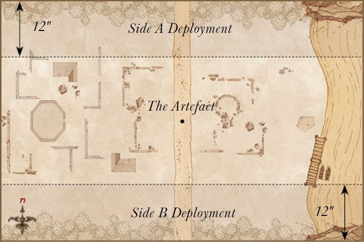

---

## SCENARIO 8 – CONTEST OF CHAMPIONS

**SCENARIO OUTLINE**

A trial of heroes; the leader who causes the most carnage will rise triumphant.

**THE ARMIES**

Players choose their forces, as described on page 130 of the Middle-earth Strategy Battle Game rules manual, to an equal points value before the game.

**LAYOUT**

Set up terrain as described on page 136 of the Middle-earth Strategy Battle Game rules manual.

**STARTING POSITIONS**

Both players roll a D6 — the player with the highest result chooses one of the deployment zones. They place their leader within their deployment zone and within 3" of the centre of the board and then deploy their leader's warband in their deployment zone and within 6" of the leader. Their opponent then does the
same.

Players then take it in turns (starting with the player who rolled highest) to select a warband in their force and roll a D6.

On a 1-3, all models in that warband must be deployed in the deployment zone and within 12" of the centre line of the board.

On a 4-6, the models can be deployed anywhere in the deployment zone.

Models may not be placed within 1" of an enemy model.

Regardless of the dice roll, models may not be deployed further than 6" from the captain of their warband.

Players alternate until all warbands have been placed.

**INITIAL PRIORITY**

Both players roll a D6. The player with the highest score has Priority in the first turn.

**OBJECTIVES**

The game lasts until the end of a turn in which one force has been reduced to a quarter (25%) of its starting number of models or below, at which point the force that has scored the most Victory Points wins the game. If both players have the same number of Victory Points, the game is a draw.

**SCORING VICTORY POINTS**

* Keep a count of how many kills your leader scores in combat throughout the course of the battle. Note, kills caused by shooting, Magical Powers or the Hurl Brutal Power Attack do not count towards your leader's score. You score **3 Victory Points** if your leader has killed more models than your opponent's leader. If your leader has killed at least two models and at least twice as many as your opponent's leader, then you instead score **5 Victory Points**. If your leader has killed at least three models and at least three times as many as your opponent's leader, then you instead score **7 Victory Points**.

* You score **1 Victory Point** if your leader causes one or more Wounds on the enemy leader. Wounds prevented by a successful Fate roll do not count. If your leader kills the enemy leader, you instead score **3 Victory Points**.

* You score **1 Victory Point** if the enemy force is Broken at the end of the game. If the enemy force is Broken and your force is unbroken, you instead score **2 Victory Points**.

**SPECIAL RULES**

**The Last Stand:** Each time either leader kills a **Hero** or a multi-Wound model, they immediately regain a point of Might spent earlier in the battle.

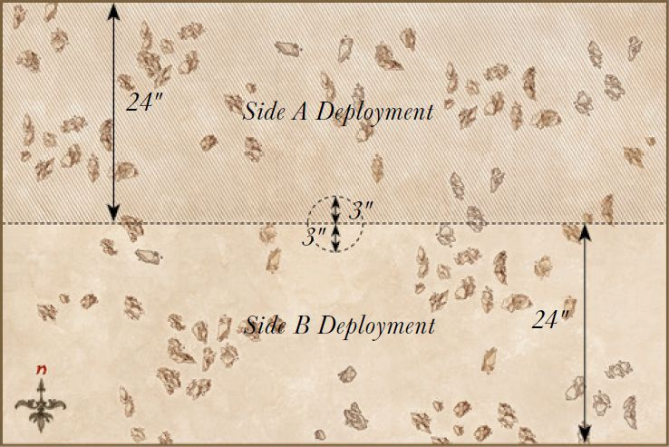

---

## SCENARIO 9 — CAPTURE AND CONTROL

**SCENARIO OUTLINE**

Control areas of the battlefield and deny them to your
foe.

**THE ARMIES**

Players choose their forces, as described on page 130 of the Middle-earth Strategy Battle Game rules manual, to an equal points value before the game.

**LAYOUT**

Set up terrain as described on page 136 of the Middle-earth Strategy Battle Game rules manual. Then, place five Objective markers on the battlefield; one is automatically placed in the centre of the board. One Objective is placed exactly halfway between the centre of the board and the centre of the northern table edge. The other three Objective markers are deployed in the same way in relation to the east, south and west board edges respectively (see map).

**STARTING POSITIONS**

Both players roll a D6 — the player with the highest result chooses one of the deployment zones. They then select a warband in their force and roll a D6.

Players then take it in turns (starting with the player who rolled highest) to select a warband in their force and roll a
D6.

On a 1-3, all models in that warband must be deployed in the deployment zone and within 12" of the centre line of the board. On a 4-6, the models can be deployed anywhere in the deployment zone. Models may not be deployed within 1" of an enemy model. Regardless of the dice roll, models may not be deployed further than 6" from the captain of their
warband.

**INITIAL PRIORITY**

Both players roll a D6. The player with the highest score has Priority in the first turn.

**OBJECTIVES**

Once one force has been Broken, the game might suddenly end. At the end of each turn after this condition has been met, roll a D6. On a 1-2, the game ends — otherwise, the battle continues for another turn.

At the end of the game, the force that has scored the most Victory Points wins the game. If both players have the same number of Victory Points, the game is a draw.

**SCORING VICTORY POINTS**

* You score **2 Victory Points** for each Objective marker that is under your control at the end of the game.

* You score **1 Victory Point** for causing one or more Wounds on the enemy leader or if you kill the enemy leader. Wounds prevented by a successful Fate roll do not count.

* You score **1 Victory Point** if the enemy force is Broken at the end of the game.

**SPECIAL RULES**

**Controlling Objectives:** At the start of the game, all of the Objectives are considered to be neutral and do not belong to either side. If, during the End phase of any turn, one or more of your models are in base contact with an Objective, then that Objective comes under your control. If, during the End phase both sides have models in base contact with an Objective, then that Objective returns to being a neutral Objective.

When this has been done, the opposing player chooses one of their warbands and rolls to place it as described above. Players alternate until all warbands have been placed.

---

## SCENARIO 10 — HEIRLOOM OF AGES PAST

**SCENARIO OUTLINE**

A precious relic lies upon the battlefield. They who hold it will win the day!

**THE ARMIES**

Players choose their forces, as described on page 130 of the Middle-earth Strategy Battle Game rules manual, to an equal points value before the game.

**LAYOUT**

Set up terrain as described on page 136 of the Middle-earth Strategy Battle Game rules manual. Then, place six Objective markers on the battlefield. To place the Objectives, both players roll a D6. The player with the highest score places one Objective marker anywhere on the battlefield at least 6" away from any board edge. Their opponent then places an Objective at least 12" away from the existing Objective marker and 6" away from any board edge. The players then alternate placing the remaining Objectives, according to the restriction noted
earlier.

**STARTING POSITIONS**

At the battle's start, the forces are yet to arrive — models are not deployed at the start of the game, but will enter as the game continues (see Special Rules on page 21).

**INITIAL PRIORITY**

Both players roll a D6. The player with the highest score has Priority in the first turn.

**OBJECTIVES**

The game lasts until the end of a turn in which one force has been reduced to a quarter (25%) of its starting number of models, or below, at which point, the force that has scored the most Victory Points wins the game. If both players have the same number of Victory Points, the game is a draw.

**SCORING VICTORY POINTS**

* You score **6 Victory Points** if your force is in possession of the relic at the end of the game. If at the end of the game you are not in possession of the relic but have more models within 3" of the relic than your opponent, then you instead score **3 Victory Points**.

* You score **1 Victory Point** for causing one or more Wounds on the enemy leader. Wounds prevented by a successful Fate roll do not count. If you kill the enemy leader, you instead score **2 Victory Points**.

* You score **1 Victory Point** if the enemy force is Broken at the end of the game. If the enemy force is Broken and your force is unbroken, you instead score 2 Victory Points.

* You score **1 Victory Point** if you have at least one banner remaining at the end of the game. If you have at least one banner remaining and your opponent has none remaining, then you instead score **2 Victory Points**. 

**SPECIAL RULES**

**Uncovering the Relic:** Only one of the Objective markers is actually the relic that both sides seek. The first time each turn an unengaged Infantry model ends its movement in base contact with an Objective, they may search it in an attempt to uncover the relic. When this happens roll a D6. On a 6, the relic has been discovered and the model that discovered it takes possession of it (Might cannot be used to influence this roll). If the roll is a 1-5 then the relic is not there, remove the Objective from play. If the first five Objective markers to be searched do not reveal the relic, the last one will automatically be the relic, there is no need to roll for it.

**Relic of Power:** The relic is treated as a Light Object (see page 109 of the Middle-earth Strategy Battle Game rules manual). However the dark powers that lie upon it may seep into the mind of its holder. Unwilling to give it up, models carrying the relic may not drop it or pass it to another model. Additionally, at the start of each turn, before Priority is rolled, roll a D6. On a 1, the model is Transfixed as on page 98 of the Middle-earth Strategy Battle Game rules manual. Might may not be used to modify this roll.

**Maelstrom of Battle:** At the end of your Move phase, roll a D6 for each of your warbands not on the battlefield and consult the chart opposite (the warband's captain can use Might to alter the roll either up or down). Models can't Charge in the turn that they arrive but otherwise act normally. Roll for each warband separately, deploy the models in the warband, then roll for the next. Warbands yet to arrive count as being on the battlefield for the purposes of determining if your force is Broken.

| D6 | Result |
|----|--------|
| 1 | The warband does not arrive. |
| 2 | Your opponent chooses a point on either the north or south board edges at least 6" from a corner — all models in the warband move onto the battlefield from this point. |
| 3 | Your opponent chooses a point on either the east or west board edges at least 6" from a corner — all models in the warband move onto the battlefield from this point. |
| 4 | You choose a point on either the north or south board edges at least 6" from a corner — all models in the warband move onto the battlefield from this point. |
| 5 | You choose a point on either the east or west board edges at least 6" from a corner — all models in the warband move onto the battlefield from this point. |
| 6 | You choose a point on any board edge at least 6" from a corner — all models in the warband move onto the battlefield from this point. |

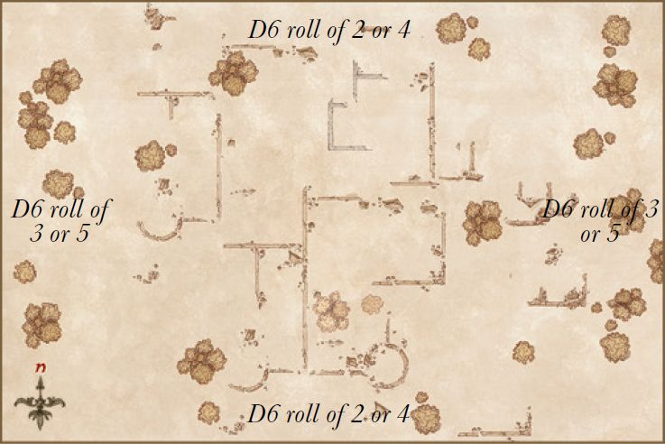

---

## SCENARIO 11 – FOG OF WAR

**SCENARIO OUTLINE**

Outwit your opponent by concealing your true objective.

**THE ARMIES**

Players choose their forces, as described on page 130 of the Middle-earth Strategy Battle Game rules manual, to an equal points value before the game.

**LAYOUT**

Set up terrain as described on page 136 of the Middle-earth Strategy Battle Game rules manual.

**STARTING POSITIONS**

Both players roll a D6 — the player with the highest result chooses one of the deployment zones. They then select a warband in their force to deploy within 12" of their board edge. Models may not be deployed further than 6" from the captain of their warband.

When this has been done, the opposing player chooses one of their warbands and deploys it within 12" of their board edge as described above. Players then alternate until all warbands have been placed.

**INITIAL PRIORITY**

Both players roll a D6. The player with the highest score has Priority in the first turn.

**OBJECTIVES**

Once one force has been Broken, the game might suddenly end. At the end of each turn after this condition has been met, roll a D6. On a 1-2, the game ends — otherwise, the battle continues for another turn.

At the end of the game, the force that has scored the most Victory Points wins the game. If both players have the same number of Victory Points, the game is a draw.

**SCORING VICTORY POINTS**

* At the start of the game secretly note down one of your own Hero models — this may not be your leader unless you only have one Hero. You score **1 Victory Point** if the nominated Hero is still alive at the end of the game. If the nominated Hero is still alive and has suffered no Wounds, you instead score **3 Victory Points**.

* At the start of the game secretly note down one of your opponent's Hero models — this may not be your opponent's leader unless they only have one Hero. You score **1 Victory Point** for causing one or more Wounds on the nominated Hero. Wounds prevented by a successful Fate roll do not count. If you kill the nominated Hero, you instead score **3 Victory Points**.

* At the start of the game secretly note down a single terrain piece in your opponent's half of the board. You scoreVictory Point if at the end of the game you have more models than your opponent completely within your selected terrain piece. If your opponent has no models completely within your selected terrain piece and you have at least one, you instead score **3 Victory Points**.

* You score **1 Victory Point** if the enemy force is Broken at the end of the game. If the enemy force is Broken and your force is unbroken, you instead score **3 Victory Points**.

***Designer's Notes:** In this Scenario you should not reveal any of your objectives to your opponent, even if you successfully complete them during the game. Part of the skill of this Scenario is trying to work out what your opponent is attempting to accomplish, whilst simultaneously trying to mislead them into thinking that you are trying to accomplish something that you aren't.*

---

## SCENARIO 12 — STORM THE CAMP

**SCENARIO OUTLINE**

Oust the enemy from their camp, while keeping yours secure.

**THE ARMIES**

Players choose their forces, as described on page 130 of the Middle-earth Strategy Battle Game rules manual, to an equal points value before the game.

**LAYOUT**

Set up terrain as described on page 136 of the Middle-earth Strategy Battle Game rules manual.

**STARTING POSITIONS**

Both players roll a D6. The player who scored the highest may choose one of the four table corners as their camp. They then deploy their army (including any Siege Engines) entirely within 12" of their chosen table corner. Any models that cannot be deployed within 12" of the chosen corner will move onto the board via the controlling player's corner at the end of their first Move phase. Their opponent then sets up their army entirely within 12" of the table corner diagonally opposite.

**INITIAL PRIORITY**

Both players roll a D6. The player with the highest score has Priority in the first turn.

**OBJECTIVES**

The game lasts until the end of a turn in which one force has been reduced to a quarter (25%) of its starting number of models, or below, at which point the force that has scored the most Victory Points wins the game. If both players have the same number of Victory Points, the game is a draw.

**SCORING VICTORY POINTS**

* You score **3 Victory Points** if your force managed to capture your opponent's camp. If your force managed to capture your opponent's camp and your camp is not captured, you instead score **6 Victory Points**.

* You score **1 Victory Point** for causing one or more
Wounds on the enemy leader. Wounds prevented by a successful Fate roll do not count. If you kill the enemy leader, you instead score **3 Victory Points**.

* You score **1 Victory Point** if the enemy force is Broken
at the end of the game. If the enemy force is Broken and your force is unbroken, you instead score **3 Victory Points**.

**SPECIAL RULES**

**The Campsite:** The campsites are the deployment areas of the two armies. A campsite is captured if during the End phase of any turn you have more models entirely within your opponent's campsite than they do. Should your models subsequently leave a captured campsite, it will no longer count as being captured. In order to keep an opponent's campsite captured, you will need to keep your models within your opponent's
campsite.

Models that are within their own campsite will defend it at all costs. Any model that is within its own campsite at the start of a turn will automatically pass any Courage tests it is required to make for the remainder of that turn.

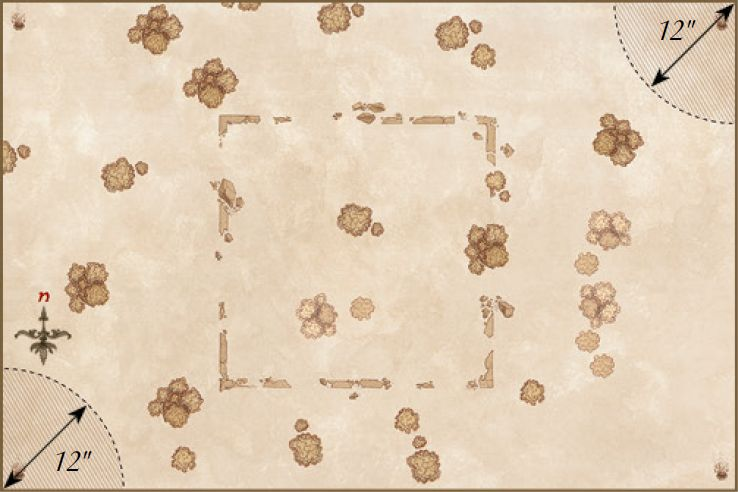

---

## SCENARIO 13 — COMMAND THE BATTLEFIELD

**SCENARIO OUTLINE**

The battlefield is divided into quarters; control the most to achieve victory.

**THE ARMIES**

Players choose their forces, as described on page 130 of the Middle-earth Strategy Battle Game rules manual, to an equal points value before the game.

**LAYOUT**

Set up terrain as described on page 136 of the Middle-earth Strategy Battle Game rules manual.

**STARTING POSITIONS**

At the battle's start, the forces are yet to arrive — models are not deployed at the start of the game, but will enter as the game continues (see Special Rules later).

**INITIAL PRIORITY**

Both players roll a D6. The player with the highest score has Priority in the first turn.

**OBJECTIVES**

The game lasts until the end of a turn in which one force has been reduced to a quarter (25%) of its starting number of models or below, at which point the force that has scored the most Victory Points wins the game. If both players have the same number of Victory Points, the game is a draw.

**SCORING VICTORY POINTS**

* You score **1 Victory Point** for each quarter of the board that has more friendly models than enemy models wholly within it. For each quarter of the board that has at least double the number of models wholly within it than your opponent, you instead score **2 Victory Points**.

* You score **1 Victory Point** for causing one or more Wounds on the enemy leader (Wounds prevented by a successful Fate roll do not count). If you kill the enemy leader, you instead score **2 Victory Points**.

* You score **1 Victory Point** if the enemy force is Broken at the end of the game. If the enemy force is Broken, and your force is unbroken, you instead score **2 Victory Points**.

**SPECIAL RULES**

**Worthless Land:** The centre of the battlefield provides very little tactical value, and so is not much use to either force.

Models wholly within 12" of the centre of the battlefield do not count as being in any quarter of the battlefield for working out Victory Points.

**Maelstrom of Battle:** At the end of your Move phase, roll a D6 for each of your warbands not on the battlefield and consult the chart below (the warband's captain can use Might to alter the roll either up or down). Models can't charge in the turn that they arrive but otherwise act normally. Roll for each warband separately, deploy the models in the warband, then roll for the next. Warbands yet to arrive count as being on the battlefield for the purposes of determining if your force is Broken.

| D6 | Result |
|----|--------|
| 1 | The warband does not arrive yet. |
| 2 | Your opponent chooses a point on either the north or south board edges at least 6" from a corner — all models in the warband move onto the battlefield from this point. |
| 3 | Your opponent chooses a point on either the east or west board edges at least 6" from a corner — all models in the warband move onto the battlefield from this point. |
| 4 | You choose a point on either the north or south board edges at least 6" from a corner — all models in the warband move onto the battlefield from this point. |
| 5 | You choose a point on either the east or west board edges at least 6" from a corner — all models in the warband move onto the battlefield from this point. |
| 6 | You choose a point on any board edge at least 6" from a corner — all models in the warband move onto the battlefield from this point. |

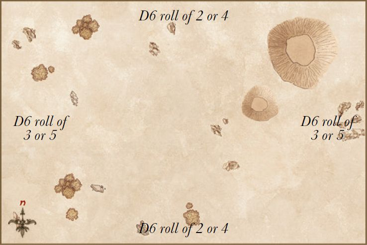

---

## SCENARIO 14 — RETRIEVAL

**SCENARIO OUTLINE**

Reclaim what was stolen by the enemy and escape the battlefield with it.

**THE ARMIES**

Players choose their forces, as described on page 130 of the Middle-earth Strategy Battle Game rules manual, to an equal points value before the game.

**LAYOUT**

Set up terrain as described on page 136 of the Middle-earth Strategy Battle Game rules manual.

**STARTING POSITIONS**

Both players roll a D6 — the player with the highest result chooses one of the corners of the board, and their opponent automatically has the opposite. A line is then drawn between the two chosen corners, and both players then place a single Objective marker 15" away from their corner along this line — this is their own
relic.

The board is then split into two halves diagonally between the two corners that were not chosen, forming two deployment zones. The player who scored the highest then selects a warband in their force to deploy in their deployment zone, but not within 3" of the line that runs diagonally through the centre of the board. Models may not be deployed further than 6" from the captain of their warband.

When this has been done, the opposing player deploys one of their warbands in their deployment zone as described above. Players then alternate until all of their warbands have been
placed.

**INITIAL PRIORITY**

Both players roll a D6. The player with the highest score has Priority in the first turn.

**OBJECTIVES**

Once one force has been Broken, the game might suddenly end. At the end of each turn after this condition has been met, roll a D6. On a 1-2, the game ends — otherwise, the battle continues for another turn.

At the end of the game, the force that has scored the most Victory Points wins the game. If both players have the same number of Victory Points, the game is a draw.

**SCORING VICTORY POINTS**

* You score **1 Victory Point** if your opponent's relic has moved from its original position at the end of the game. If you have retrieved your opponent's relic, you instead score **3 Victory Points**. If you have retrieved your opponent's relic, and the model holding it is in your deployment zone, you instead score **5 Victory Points**. If you have retrieved your opponent's relic, and managed to move it off the board via either of the board edges in your deployment zone, you instead score **7 Victory Points**.

* You score **1 Victory Point** for causing one or more Wounds on the enemy leader (Wounds prevented by a successful Fate roll do not count). If you kill the enemy leader, you instead score **2 Victory Points**.

* You score **1 Victory Point** if the enemy force is Broken
at the end of the game. If the enemy force is Broken, and your force is unbroken, you instead score **3 Victory Points**.

**SPECIAL RULES**

**The Relic:** Each relic is a Light Object (see page 109 of the Middle-earth Strategy Battle Game rules manual). A relic is considered to have been retrieved if at the end of the game it is being carried by a friendly model. If a relic has been picked up by an enemy model, and is then subsequently dropped or retaken by a friendly model, then a player must try to return it to its original position as quickly as possible. Until it has been picked up by an enemy model, friendly models may not pick up their own relic.

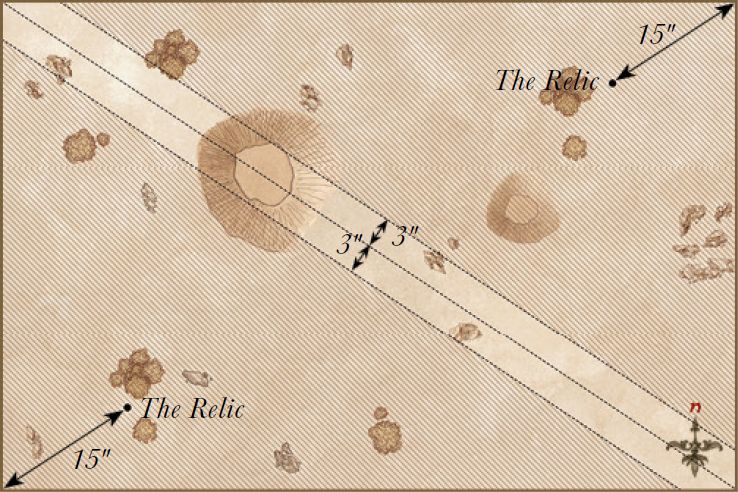

---

## SCENARIO 15 — BREAKTHROUGH

**SCENARIO OUTLINE**

Capture the areas of the battlefield that are worth the most to your opponent.

**THE ARMIES**

Players choose their forces, as described on page 130 of the Middle-earth Strategy Battle Game rules manual, to an equal points value before the game.

**LAYOUT**

Set up terrain as described on page 136 of the Middle-earth Strategy Battle Game rules manual. Then, place four Objective markers on the board. One of these is placed exactly 12" from the centre of one player's board edge, and another is placed exactly 12" from the centre of the other player's board edge. The remaining two Objectives are both placed 12" away from the centre of the board, on opposite sides, along the centreline of the board.

**STARTING POSITIONS**

Both players roll a D6 — the player with the highest result chooses one of the deployment zones. They then select a warband in their force to deploy within 24" of their board edge. Models may not be deployed further than 6" from the captain of their
warband.

When this has been done, the opposing player chooses one of their warbands and deploys it within 24" of their board edge, as described above. Players then alternate until all of their warbands have been placed.

**INITIAL PRIORITY**

Both players roll a D6. The player with the highest score has Priority in the first turn.

**OBJECTIVES**

The game lasts until the end of a turn in which one force has been reduced to a quarter (25%) of its starting number of models or below, at which point the force that has scored the most Victory Points wins the game. If both players have the same number of Victory Points, the game is a draw.

**SCORING VICTORY POINTS**

* You score **1 Victory Point** if there are more friendly models than enemy models within 3" of the Objective in your own deployment zone.

* For each Objective on the centreline of the board, you score **1 Victory Point** if there are more friendly models than enemy models within 3" of the Objective. If there is at least one friendly model, and no enemy models, within 3" of this Objective, you instead score **2 Victory Points**.

* You score **2 Victory Points** if there are more friendly models than enemy models within 3" of the Objective marker in your opponent's deployment zone. If there is at least one friendly model, and no enemy models, within 3" of this Objective, you instead score **4 Victory Points**.

* You score **1 Victory Point** for causing one or more Wounds on the enemy leader (Wounds prevented by a successful Fate roll do not count). If you kill the enemy leader, you instead score **2 Victory Points**.

* You score **1 Victory Point** if the enemy force is Broken at the end of the game.

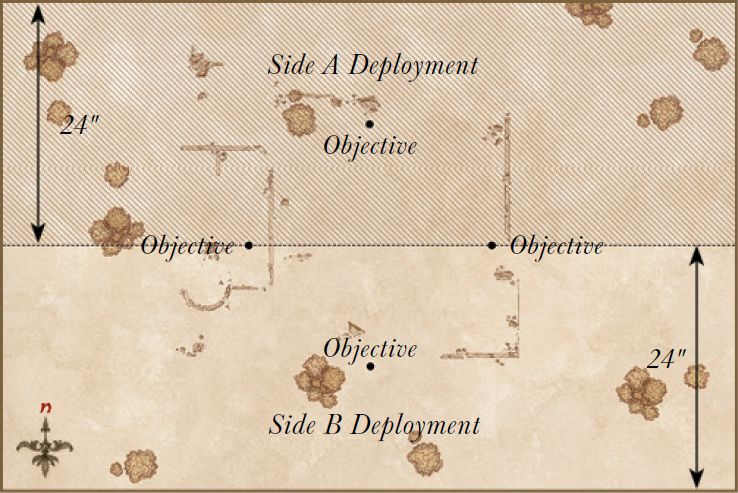

---

## SCENARIO 16 — DESTROY THE SUPPLIES

**SCENARIO OUTLINE**

Destroy your opponent's supplies whilst protecting your own.

**THE ARMIES**

Players choose their forces, as described on page 130 of the Middle-earth Strategy Battle Game rules manual, to an equal points value before the game.

**LAYOUT**

Set up terrain as described on page 136 of the Middle-earth Strategy Battle Game rules manual. Then, place three Objective markers in each player's deployment zone so that the Objectives are equidistant along the edge of each player's deployment zone, with one in the centre.

The first is placed 12" from the centre of the player's board edge. The others are then placed halfway between the central Objective and the board edges on either side, so that all three Objective markers are equidistant along the edge of one player's deployment zone.

**STARTING POSITIONS**

Both players roll a D6 — the player with the highest result chooses one of the deployment zones. They then select a warband in their force to deploy within 12" of their board edge. Models may not be deployed further than 6" from the captain of their
warband.

When this has been done, the opposing player chooses one of their warbands and deploys it within 12" of their board edge, as described above. Players then alternate until all of their warbands have been placed.

**INITIAL PRIORITY**

Both players roll a D6. The player with the highest score has Priority in the first turn.

**OBJECTIVES**

The game lasts until the end of a turn in which one force has been reduced to a quarter (25%) of its starting number of models or below, at which point the force that has scored the most Victory Points wins the game. If both players have the same number of Victory Points, the game is a draw.

**SCORING VICTORY POINTS**

* You score **2 Victory Points** for each enemy supply marker that has been destroyed.

* You score **1 Victory Point** for causing one or more Wounds on the enemy leader (Wounds prevented by a successful Fate roll do not count). If you kill the enemy leader, you instead score **2 Victory Points**.

* You score **1 Victory Point** if the enemy force is Broken at the end of the game. If the enemy force is Broken, and your force is unbroken, you instead score **2 Victory Points**.

* You score **1 Victory Point** if you have at least one banner remaining at the end of the game. If you have at least one banner, and your opponent has none remaining, then you instead score **2 Victory Points**.

**SPECIAL RULES**

**Supply Markers:** The Objective markers represent a series of supplies that both sides are trying to destroy. To destroy an enemy supply marker, a model must be in base contact with the marker during the End phase of a turn having not cast any Magical Powers, used a missile weapon, been involved in a Fight, or been under the effects of the Paralyse, Immobilise or Transfix Magical Power during that turn. Once a supply marker has been destroyed, remove it from play.

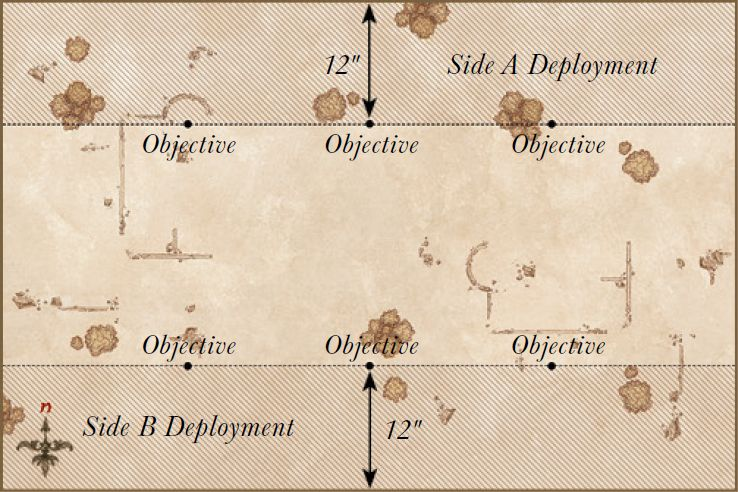

---

## SCENARIO 17 — DIVIDE & CONQUER

**SCENARIO OUTLINE**

With your army split in two, claim the key areas of the battlefield.

**THE ARMIES**

Players choose their forces, as described on page 130 of the Middle-earth Strategy Battle Game rules manual, to an equal points value before the game.

**LAYOUT**

Set up terrain as described on page 136 of the Middle-earth Strategy Battle Game rules manual. Then place one Objective marker in the centre of the board; another halfway between the central Objective and the centre of the eastern board edge, and another halfway between the central Objective and the centre of the western board edge.

**STARTING POSITIONS**

Both players roll a D6 — the player with the highest score chooses two opposite corners to be their deployment zones, and labels them A and B. Their opponent has the other two corners and labels them A and B.

The player who scored highest then deploys one of their warbands anywhere within 12" of their corner A. The other player then does the same. The player that scored highest then deploys one of their warbands anywhere within 12" of corner B. The other player then deploys the same.

Players then repeat the process above until all warbands have been deployed.

**INITIAL PRIORITY**

Both players roll a D6. The player with the highest score has Priority in the first turn.

**OBJECTIVES**

Once one force has been Broken, the game might suddenly end. At the end of each turn after this condition has been met, roll a D6. On a 1-2, the game ends — otherwise, the battle continues for another turn.

At the end of the game, the force that has scored the most Victory Points wins the game. If both players have the same number of Victory Points, the game is a draw.

**SCORING VICTORY POINTS**

* You score **3 Victory Points** if there are more friendly models than enemy models within 3" of the central Objective. If there is at least one friendly model, and no enemy models, within 3" of this Objective, you instead score **5 Victory Points**.

* For each of the other Objectives, you score **1 Victory Point** if there are more friendly models than enemy models within 3" of the Objective. If there is at least one friendly model, and no enemy models, within 3" of this Objective, you instead score **2 Victory Points**.

* You score **1 Victory Point** for causing one or more
Wounds on the enemy leader (Wounds prevented by a successful Fate roll do not count). If you kill the enemy leader, you instead score **2 Victory Points**.

* You score **1 Victory Point** if the enemy force is Broken at the end of the game.

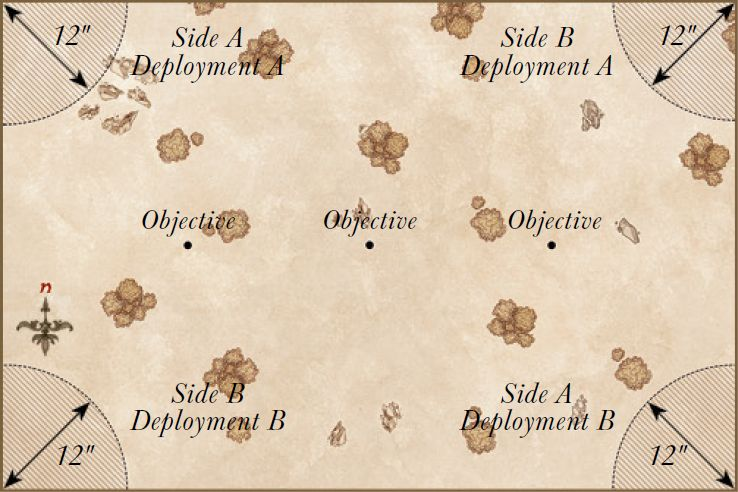

---

## SCENARIO 18 — ASSASSINATION

**SCENARIO OUTLINE**

Using your assassin, slay your target to achieve victory.

**THE ARMIES**

Players choose their forces, as described on page 130 of the Middle-earth Strategy Battle Game rules manual, to an equal points value before the game.

**LAYOUT**

Set up terrain as described on page 136 of the Middle-earth Strategy Battle Game rules manual.

**STARTING POSITIONS**

Both players roll a D6 — the player with the highest result chooses one of the deployment zones. They then select a warband in their force to deploy within 24" of their board edge. Models may not be deployed further than 6" from the captain of their warband.

When this has been done, the opposing player chooses one of their warbands and deploys it within 24" of their board edge, as described above. Players then alternate until all of their warbands have been placed.

**INITIAL PRIORITY**

Both players roll a D6. The player with the highest score has Priority in the first turn.

**OBJECTIVES**

Once one force has been Broken, the game might suddenly end. At the end of each turn after this condition has been met, roll a D6. On a 1-2, the game ends — otherwise, the battle continues for another turn.

At the end of the game, the force that has scored the most Victory Points wins the game. If both players have the same number of Victory Points, the game is a draw.

**SCORING VICTORY POINTS**

* You score **1 Victory Point** if your target has suffered one or more Wounds. If your target has suffered one or more Wounds, and your assassin caused at least one Wound, you instead score **3 Victory Points**. If your target has been slain, you instead score **5 Victory Points**. If your target has been slain, and your assassin caused the fatal Wound, you instead score **7 Victory Points**.

* You score **1 Victory Point** for causing one or more
Wounds on the enemy leader (Wounds prevented by a successful Fate roll do not count). If you kill the enemy leader, you instead score **2 Victory Points**.

* You score **1 Victory Point** if the enemy force is Broken
at the end of the game. If the enemy force is Broken, and your force is unbroken, you instead score **3 Victory Points**.

**SPECIAL RULES**

**The Target:** At the start of the game, secretly note down one of your opponent's Hero models; this is your target for the game. This may not be your opponent's leader unless they only have one Hero.

**The Assassin:** At the start of the game, secretly note down one of your Hero models; this is your assassin. This may not be your leader unless you only have one Hero.

---

## DOUBLE EVENT SCENARIO 1 — NO ESCAPE

**SCENARIO OUTLINE**

Kill as much of the enemy force as possible whilst protecting your own in the centre of the battlefield.

**THE ARMIES**

Players choose their forces, as described on page 130 of the Middle-earth Strategy Battle Game rules manual, to an equal points value before the game.

**LAYOUT**

Set up terrain as described on page 136 of the Middle-earth Strategy Battle Game rules manual.

**STARTING POSITIONS**

Both teams roll a D6 — the team that scores highest becomes Team A and chooses one of the deployment zones in the centre of the board. Team A then deploys their Primary Force within 6" of the centreline of the board in their deployment zone. Team B then deploys their Primary Force within 6" of the centreline of the board in their deployment zone. Team A then deploys their Secondary Force within 6" of the board edge in the opposite half of the board to their Primary Force; Team B then does the same.

**INITIAL PRIORITY**

Both teams roll a D6. The team with the highest score has Priority in the first turn.

**OBJECTIVES**

The game lasts until the end of a turn in which one force has been reduced to a quarter (25%) of its starting number of models or below, at which point the team that has scored the most Victory Points wins the game. If both teams have the same number of Victory Points, the game is a draw.

**SCORING VICTORY POINTS**

* You score **1 Victory Point** for causing one or more Wounds on the enemy leader (Wounds prevented by a successful Fate roll do not count). If you kill the enemy leader, you instead score **3 Victory Points**.

* You score **3 Victory Points** if the enemy force is Broken at the end of the game. If the enemy force is Broken, and your force is unbroken, you instead score **5 Victory Points**.

* You score **1 Victory Point** if you have at least one banner remaining at the end of the game. If you have at least one banner, and your opponent has none remaining, then you instead score **2 Victory Points**.

* You score **2 Victory Points** if you kill the leader of the Secondary Force.

---

## DOUBLE EVENT SCENARIO 2 — TOTAL CONQUEST

**SCENARIO OUTLINE**

There are five Objective markers on the board. Control the most to achieve victory

**THE ARMIES**

Players choose their forces, as described on page 130 of the Middle-earth Strategy Battle Game rules manual, to an equal points value before the game.

**LAYOUT**

Set up terrain as described on page 136 of the Middle-earth Strategy Battle Game rules manual. One Objective marker is deployed in the centre of the board. The other four Objective markers are placed halfway in-between the centre of the board and each corner as shown on the map.

**STARTING POSITIONS**

Both teams roll a D6 — the team that scores highest becomes Team A and chooses one of the deployment zones in the centre of the board. Team A then deploys their Primary Force within 6" of the centre of the board in their deployment zone. Team B then deploys their Primary Force within 6" of the centre of the board in their deployment zone. Both Secondary Forces are kept aside for later in the game.

**INITIAL PRIORITY**

Both teams roll a D6. The team with the highest score has Priority in the first turn.

**OBJECTIVES**

The game lasts until the end of a turn in which one force has been reduced to a quarter (25%) of its starting number of models or below, at which point the team that has scored the most Victory Points wins the game. If both teams have the same number of Victory Points, the game is a draw.

**SCORING VICTORY POINTS**

* You score **2 Victory Points** for each Objective marker that has at least one of your models, and no enemy models, within 3".

* You score 1 Victory Point for each Objective marker that has both friendly and enemy models, but more friendly than enemy models, within 3".

* You score **1 Victory Point** for causing one or more Wounds on the enemy leader.

* You score **1 Victory Point** if the enemy force is Broken at the end of the game.

**SPECIAL RULES**

**Maelstrom of Battle:** At the end of your Move phase, roll a D6 for each of your warbands not on the battlefield and consult the chart below (the warband's captain can use Might to alter the roll either up or down). Models can't charge in the turn that they arrive but otherwise act normally. Roll for each warband separately, deploy the models in the warband, then roll for the next. Warbands yet to arrive count as being on the battlefield for the purposes of determining if your force is
Broken.

| D6 | Result |
|----|--------|
| 1 | The warband does not arrive yet. |
| 2 | Your opponent chooses a point on either the north or south board edges at least 6" from a corner — all models in the warband move onto the battlefield from this point. |
| 3 | Your opponent chooses a point on either the east or west board edges at least 6" from a corner — all models in the warband move onto the battlefield from this point. |
| 4 | You choose a point on either the north or south board edges at least 6" from a corner — all models in the warband move onto the battlefield from this point. |
| 5 | You choose a point on either the east or west board edges at least 6" from a corner — all models in the warband move onto the battlefield from this point. |
| 6 | You choose a point on any board edge at least 6" from a corner — all models in the warband move onto the battlefield from this point. |

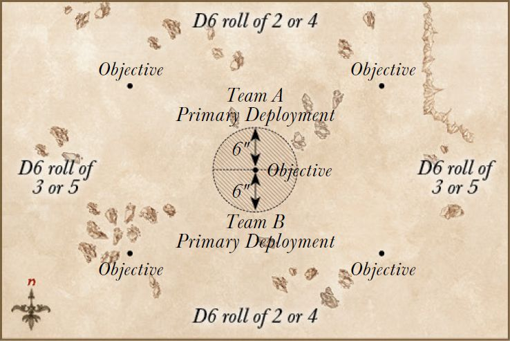

---

## DOUBLE EVENT SCENARIO 3 — TAKE AND HOLD

**SCENARIO OUTLINE**

Control the central objective to claim victory.

**THE ARMIES**

Players choose their forces, as described on page 130 of the Middle-earth Strategy Battle Game rules manual, to an equal points value before the game.

**LAYOUT**

Set up terrain as described on page 136 of the Middle-earth Strategy Battle Game rules manual. A single Objective marker is placed in the centre of the board.

**STARTING POSITIONS**

Both teams roll a D6 — the team that scores highest becomes Team A and chooses a corner. The chosen corner and the one opposite are Team A's deployment zones; the other two corners are Team B's deployment zones. Team A then deploys their Primary Force within 12" of their chosen corner. Team B then deploys their Primary Force within 12" of one of their corners. Team A then deploys their Secondary Force within 12" of their other corner. Finally, Team B deploys their Secondary Force within 12" of their other corner.

**INITIAL PRIORITY**

Both teams roll a D6. The team with the highest score has Priority in the first turn.

**OBJECTIVES**

Once one army has been Broken, the game might suddenly end. At the end of each turn after this condition has been met, roll a D6. On a 1-2, the game ends — otherwise, the battle continues for another turn.

At the end of the game, the team that has scored the most Victory Points wins the game. If both teams have the same number of Victory Points, the game is a draw.

**SCORING VICTORY POINTS**

* You score **3 Victory Points** if your team has more models within 6" of the Objective Marker than your opponents. If your team has at least two models and twice as many models within 6" of the Objective marker than your opponents, then you instead score **5 Victory Points**. If your team has at least three models and three times as many models within 6" of the objective than your opponents, then you instead score **7 Victory Points**.

* You score **1 Victory Point** for causing one or more Wounds on the enemy leader (Wounds prevented by a successful Fate roll do not count). If you kill the enemy leader, you instead score **2 Victory Points**.

* You score **1 Victory Point** if the enemy force is Broken
at the end of the game. If the enemy force is Broken and your force is unbroken, you instead score **3 Victory Points**.

**SPECIAL RULES**

**Site of Power:** The area that both forces are fighting over is an ancient place of great power that is said to be imbued with
magic.

Models within 6" of the Objective marker gain the Resistant to Magic special rule, and may re-roll failed Fate rolls.

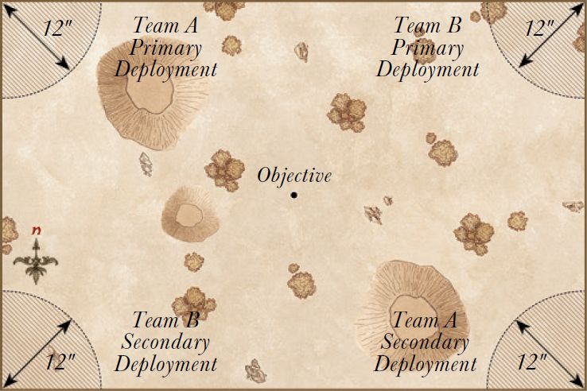

---

## DOUBLE EVENT SCENARIO 4 — CLASH OF CHAMPIONS

**SCENARIO OUTLINE**

Have both forces' leaders kill more than the two enemy
leaders.

**THE ARMIES**

Players choose their forces, as described on page 130 of the Middle-earth Strategy Battle Game rules manual, to an equal points value before the game.

**LAYOUT**

Set up terrain as described on page 136 of the Middle-earth Strategy Battle Game rules manual.

**STARTING POSITIONS**

Both teams roll a D6 — the team that scores highest becomes Team A and chooses a board edge. Team A then deploys their Primary Force within 24" of their board edge. Models may not be deployed further than 6" from the captain of their warband. When this has been done, Team B deploys their Primary Force within 24" of their board edge. Teams then take it turn to deploy their Secondary Forces following the same restrictions.

**INITIAL PRIORITY**

Both teams roll a D6. The team with the highest score has Priority in the first turn.

**OBJECTIVES**

The game lasts until the end of a turn in which one force has been reduced to a quarter (25%) of its starting number of models or below, at which point the team that has scored the most Victory Points wins the game. If both teams have the same number of Victory Points, the game is a draw.

**SCORING VICTORY POINTS**

* Keep a count of how many kills the leaders of both forces score in combat throughout the course of the battle. Note, kills caused by shooting, Magical Powers or the Hurl Brutal Power Attack do not count towards your leader's score.

* You score **3 Victory Points** if your leaders have killed more models than your opponent's leaders. If your leaders have killed at least two models and at least twice as many as your opponent's leaders, then you instead score **5 Victory Points**. If your leaders have killed at least three models and at least three times as many as your opponent's leaders, then you instead score **7 Victory Points**.

* You score **2 Victory Points** for each enemy leader that has been killed in combat by one of your team's leaders.

* You score **1 Victory Point** if the enemy army is Broken at the end of the game.

**SPECIAL RULES**

**Friendly Rivalry:** Whilst the two allies' leaders are fighting alongside each, they are still both trying to prove that they are the better fighter of the two.

Keep a record of how many kills the leaders of both forces have killed in combat individually. For each army, whichever of the two leaders has the least kills out of the two in combat gains a bonus of +1 To Wound during a Fight. This bonus ends immediately as soon as they have drawn equal to or overtaken their
ally.

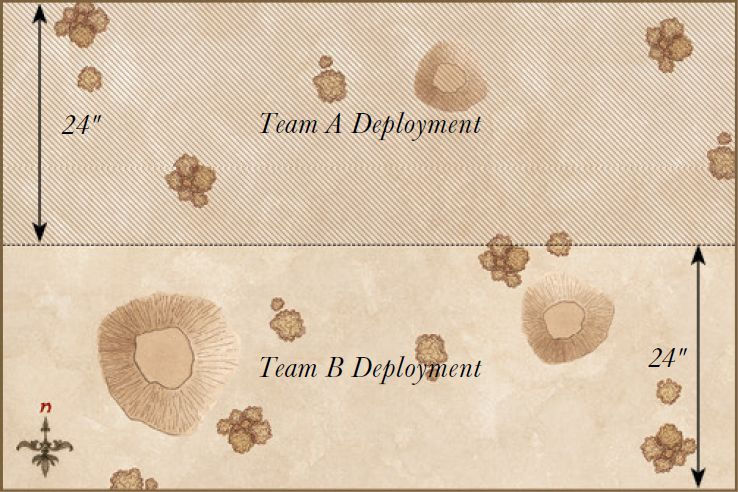

---

## DOUBLE EVENT SCENARIO 5 — CORNERED

**SCENARIO OUTLINE**

The defenders must seek to protect the central force, whilst the attackers seek to destroy them.

**THE ARMIES**

Players choose their forces, as described on page 130 of the Middle-earth Strategy Battle Game rules manual, to an equal points value before the game.

**LAYOUT**

Set up terrain as described on page 136 of the Middle-earth Strategy Battle Game rules manual. There should be a terrain piece in the centre of the board, no more than 6" in diameter, for the team that ends up in the middle to defend.

**STARTING POSITIONS**

Both teams roll a D6 — the team that scores highest becomes Team A. Team A then deploys their Primary Force within 6" of the centre of the board. Team B then deploys their entire army at between 6" and 12" away from Team A's deployment area. Team A then sets up their Secondary Force anywhere within 3" of any board edge.

**INITIAL PRIORITY**

Both teams roll a D6. The team with the highest score has Priority in the first turn.

**OBJECTIVES**

Once one army has been Broken, the game might suddenly end. At the end of each turn after this condition has been met, roll a D6. On a 1-2, the game ends — otherwise, the battle continues for another turn.

At the end of the game, the team that has scored the most Victory Points wins the game. If both teams have the same number of Victory Points, the game is a draw.

**SCORING VICTORY POINTS**

* Team A scores **1 Victory Point** if their leader is alive at the end of the game. If Team A's leader is alive at the end of the game, and has suffered no Wounds, they instead score **3 Victory Points**.

* Team B scores **1 Victory Point** for causing one or more Wounds on the enemy leader (Wounds prevented by a successful Fate roll do not count). If they kill the enemy leader, you instead score **3 Victory Points**.

* You score **1 Victory Point** if the enemy force is Broken at the end of the game. If the enemy force is Broken, and your force is unbroken, you instead score **3 Victory Points**.

* You score **2 Victory Points** if your team has more models within the central terrain piece than your opponents. If your team has at least twice the number of models in the terrain piece than your opponents, you instead score **4 Victory Points**.

* You score **1 Victory Point** if you have at least one banner remaining at the end of the game. If you have at least one banner, and your opponent has none remaining, then you instead score **2 Victory Points**.

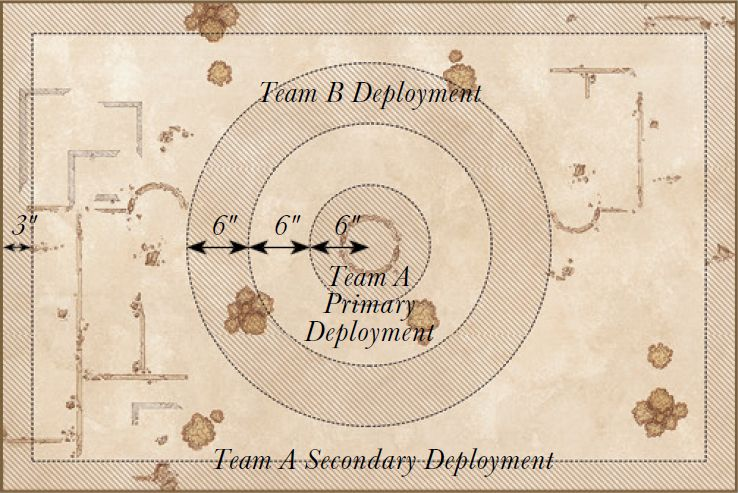

---

## DOUBLE EVENT SCENARIO 6 — DUEL OF WITS

**SCENARIO OUTLINE**

Each force secretly selects an enemy Hero. Try to kill the Heroes chosen by your team, whilst simultaneously getting your selected Heroes into the centre of the board.

**THE ARMIES**

Players choose their forces, as described on page 130 of the Middle-earth Strategy Battle Game rules manual, to an equal points value before the game.

**LAYOUT**

Set up terrain as described on page 136 of the Middle-earth Strategy Battle Game rules manual.

**STARTING POSITIONS**

Both teams roll a D6 — the team that scores highest becomes Team A. Team A then chooses two opposite quarters of the board, and then deploys their Primary Force within one of their chosen quarters but not within 12" of the centre of the board. Team B then deploys their Primary Force within one of the two remaining quarters, but not within 12" of the centre of the board. Team A then deploys their Secondary Force within their other quarter, but not within 12" of the centre of the board. Finally, Team B deploys their Secondary Force within the last remaining quarter, but not within 12" of the centre of the board.

**INITIAL PRIORITY**

Both teams roll a D6. The team with the highest score has Priority in the first turn.

**OBJECTIVES**

Once one army has been Broken, the game might suddenly end. At the end of each turn after this condition has been met, roll a D6. On a 1-2, the game ends — otherwise, the battle continues for another turn.

At the end of the game, the team that has scored the most Victory Points wins the game. If both teams have the same number of Victory Points, the game is a draw.

**SCORING VICTORY POINTS**

At the start of the game, each player secretly writes down one enemy Hero model to be the target of their forces. This means that each team will have two targets. Players may not discuss with their partner which Hero they have chosen for the duration of the game — it is secret from all players accept the player who wrote it down.

* You score **1 Victory Point** for each of your team's targets that has been wounded. For each of your team's targets that has been slain, you instead score **2 Victory Points** (if the same Hero was chosen by both players, you score the Victory Points twice if they are wounded or slain).

* You score **2 Victory Points** for each of your opponent's targets that are within 6" of the centre of the board at the end of the game (if the same Hero was chosen by both players, you score the Victory Points twice if they are within 6" of the centre of the board).

* You score **1 Victory Point** if the enemy force is Broken at the end of the game. If the enemy force is Broken, and your force is unbroken, you instead score **2 Victory Points**.

* You score **1 Victory Point** if you have at least one banner remaining at the end of the game. If you have at least one banner, and your opponent has none remaining, then you instead score **2 Victory Points**.

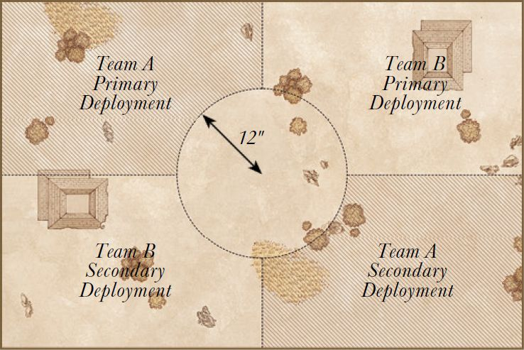
