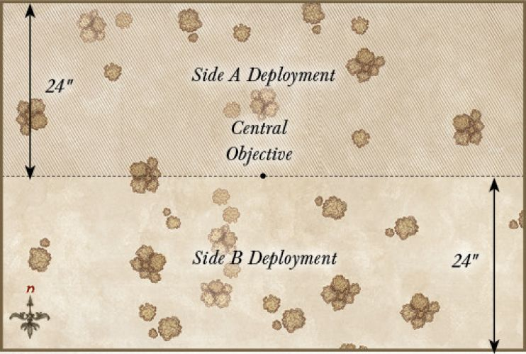
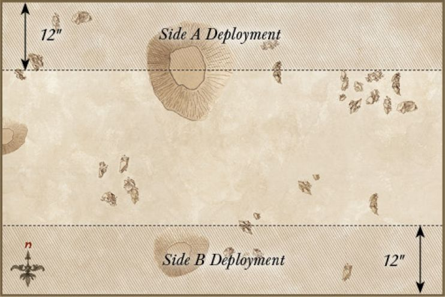
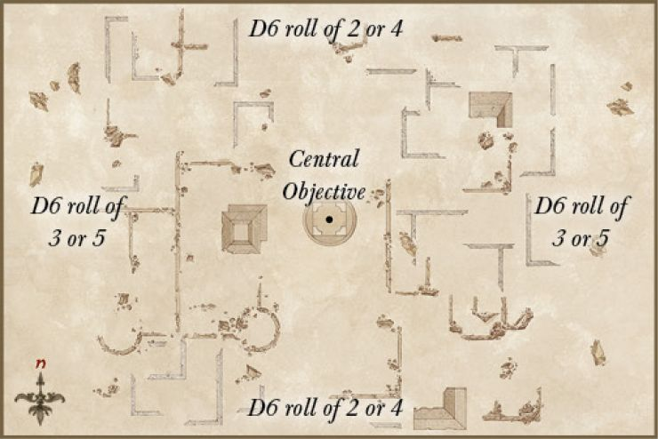
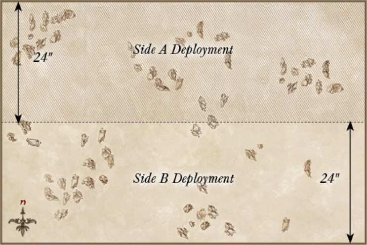
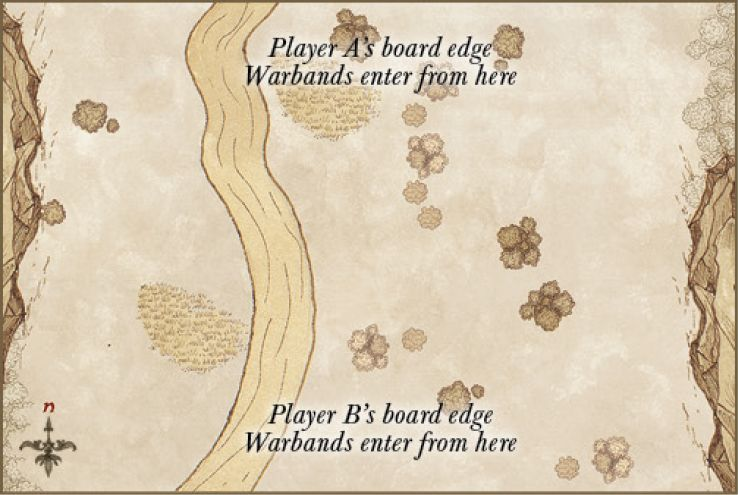
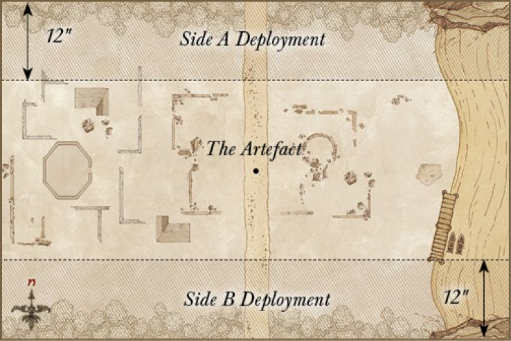
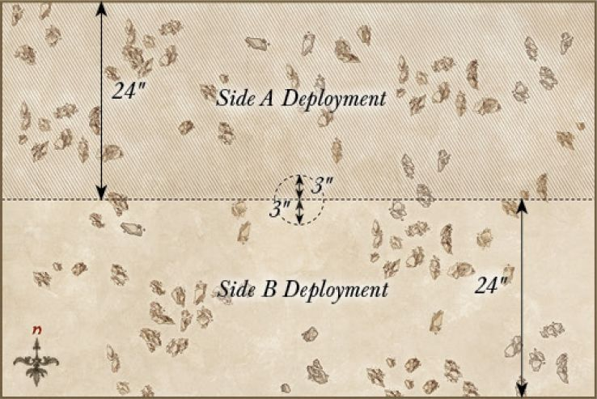
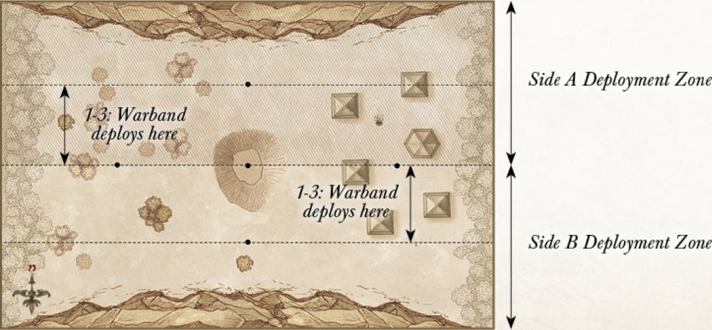
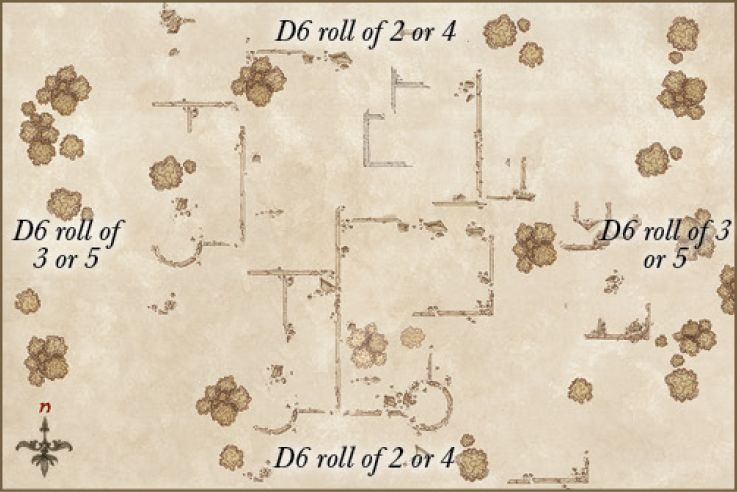
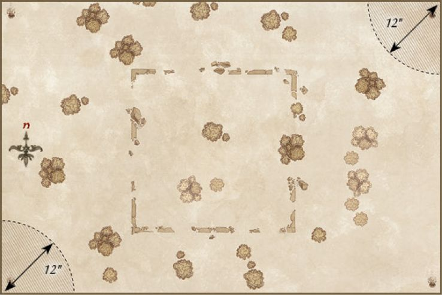

## SCENARIO 1 — DOMINATION

**SCENARIO OUTLINE**

Players fight to control five objectives scattered across the battlefield.

**THE ARMIES**

Players choose their forces, as described on [page 130], to an equal points value before the game.

**LAYOUT**

Set up terrain as described on [page 136]. Then, place five Objective markers on the battlefield; one is automatically placed in the centre of the board. To place the other objectives, both players roll a D6. The player with the highest score places one objective anywhere on the battlefield at least 12" away from the existing objective and 6" away from any board edge. Their opponent then places a third objective at least 12" away from existing objectives and at least 6" away from any board edge. The players then alternate placing the remaining two objectives, according to the restriction noted earlier.

**STARTING POSITIONS**

Both players roll a D6 — the player with the highest result chooses one of the deployment zones. They then select a warband in their force to deploy within 24" of their board edge. Models may not be deployed further than 6" from the captain of their warband.

When this has been done, the opposing player chooses one of their warbands and deploys it within 24" of their board edge, as described above. Players then alternate until all of their warbands have been placed.

**INITIAL PRIORITY**

Both players roll a D6. The player with the highest score has Priority in the first turn.

**OBJECTIVES**

The game lasts until the end of a turn in which one force has been reduced to a quarter (25%) of its starting number of models or below, at which point the force that has scored the most Victory Points wins the game. If both players have the same number of Victory Points, the game is a draw.

Victory Points are scored for the following:

* You score **2 Victory Points** for each Objective marker that has at least one of your models, and no enemy models, within 3".
* You score **1 Victory Point** for each Objective marker that has both friendly and enemy models, but more friendly than enemy models, within 3".
* You score **1 Victory Point** for causing one or more Wounds on the enemy leader (Wounds prevented by a successful Fate roll do not count) or if you kill the enemy leader.
* You score **1 Victory Point** if the enemy force is Broken at the end of the game.

---

## SCENARIO 2 — TO THE DEATH!

**SCENARIO OUTLINE**

Victory goes to the force which can crush the foe and slay the enemy leader.

**THE ARMIES**

Players choose their forces, as described on [page 130], to an equal points value before the game.

**LAYOUT**

Set up terrain as described on [page 136].

**STARTING POSITIONS**

Both players roll a D6 — the player with the highest result chooses one of the deployment zones. They then select a warband in their force to deploy within 12" of their board edge. Models may not be deployed further than 6" from the captain of their warband.

When this has been done, the opposing player chooses one of their warbands and deploys it within 12" of their board edge, as described above. Players then alternate until all warbands have been placed.

**INITIAL PRIORITY**

Both players roll a D6. The player with the highest score has Priority in the first turn.

**OBJECTIVES**

The game lasts until the end of a turn in which one force has been reduced to a quarter (25%) of its starting number of models or below, at which point the force that has scored the most Victory Points wins the game. If both players have the same number of Victory Points, the game is a draw.

Victory Points are scored for the following:

* You score **1 Victory Point** for causing one or more Wounds on the enemy leader (Wounds prevented by a successful Fate roll do not count). If you kill the enemy leader, you instead score **3 Victory Points**.
* You score **3 Victory Points** if the enemy force is Broken at the end of the game. If the enemy force is Broken and your force is unbroken, you instead score

**5 Victory Points**.

* You score **1 Victory Point** if you have at least one banner remaining at the end of the game. If you have at least one banner remaining and your opponent has none remaining, then you instead score **2 Victory Points**.
* You score **2 Victory Points** if the enemy force is reduced to 25% of its starting models at the end of the game.

---

## SCENARIO 3 — HOLD GROUND

**SCENARIO OUTLINE**

Control the centre of the battlefield, no matter the cost.

**THE ARMIES**

Players choose their forces, as described on [page 130], to an equal points value before the game.

**LAYOUT**

Set up terrain as described on [page 136]. Once the battlefield has been set up, an Objective marker is placed in the centre of the battlefield. Players must also agree which direction is north — this is important for determining where and when Reinforcements arrive from.

**STARTING POSITIONS**

At the battle's start, the forces are yet to arrive — models are not deployed at the start of the game, but will enter as the game continues (see Special Rules later).

**INITIAL PRIORITY**

Both players roll a D6. The player with the highest score has Priority in the first turn.

**OBJECTIVES**

Once one force has been Broken, the game might suddenly end. At the end of each turn, after this condition has been met, roll a D6. On a 1-2, the game ends — otherwise, the battle continues for another turn.

At the end of the game, the force that has scored the most Victory Points wins the game. If both players have the same number of Victory Points, the game is a draw.

Victory Points are scored for the following:

* You score **3 Victory Points** if you have more models within 6" of the objective than your opponent. If you have twice as many models within 6" of the objective than your opponent, then you instead score **5 Victory Points**. If you have three times as many models within 6" of the objective than your opponent, or you are the only player to have models within 6" of the objective, then you instead score 7 Victory Points.
* You score **1 Victory Point** for causing one or more Wounds on the enemy leader (Wounds prevented by a successful Fate roll do not count). If you kill the enemy leader, you instead score **2 Victory Points**.
* You score **1 Victory Point** if the enemy force is Broken at the end of the game. If the enemy force is Broken and your force is unbroken, you instead score **3 Victory Points**.

**SPECIAL RULES**

Maelstrom of Battle: At the end of your Move phase, roll a D6 for each of your warbands not on the battlefield and consult the chart below (the warband's captain can use Might to alter the roll either up or down). Models can't charge in the turn that they arrive but otherwise act normally. Roll for each warband separately, deploy the models in the warband, if the D6 allows, then roll for the next. Warbands yet to arrive count as being on the battlefield for the purposes of determining if your force is Broken.

| D6 | RESULT |
| -- | ------------------------------------------------------------------------------------------------------------------------------------------------------------------------ |
| 1 | The warband does not arrive. |
| 2 | Your opponent chooses a point on either the north or south board edges at least 6" from a corner — all models in the warband move onto the battlefield from this point. |
| 3 | Your opponent chooses a point on either the east or west board edges at least 6" from a corner — all models in the warband move onto the battlefield from this point. |
| 4 | You choose a point on either the north or south board edges at least 6" from a corner — all models in the warband move onto the battlefield from this point. |
| 5 | You choose a point on either the east or west board edges at least 6" from a corner — all models in the warband move onto the battlefield from this point. |
| 6 | You choose a point on any board edge at least 6" from a corner — all models in the warband move onto the battlefield from this point. |

---

## SCENARIO 4 — LORDS OF BATTLE

**SCENARIO OUTLINE**

A pitched battle where victory goes to the player who causes the most carnage.

**THE ARMIES**

Players choose their forces, as described on page 130, to an equal points value before the game.

**LAYOUT**

Set up terrain as described on page 136.

**STARTING POSITIONS**

Both players roll a D6 — the player with the highest result chooses one of the deployment zones. They then select a warband in their force to deploy within 24" of their board edge, but at least 1" away from enemy models. Models may not be deployed further than 6" from the captain of their warband.

When this has been done, the opposing player chooses one of their warbands and deploys it within 24" of their board edge as described above. Players then alternate until all warbands have been placed.

**INITIAL PRIORITY**

Both players roll a D6. The player with the highest score has Priority in the first turn.

**OBJECTIVES**

Once one force has been Broken, the game might suddenly end. At the end of each turn after this condition has been met, roll a D6. On a 1-2, the game ends — otherwise, the battle continues for another turn.

At the end of the game, the force that has scored the most Victory Points wins the game. If both players have the same number of Victory Points, the game is a draw.

Victory Points are scored for the following:

- For this Scenario you need to keep track of your Wound Tally. Your Wound Tally is equal to the number of Wounds that your army inflicted upon your opponent's army, plus any Fate points that your opponent spent. Hero models that are removed from the game with unspent Fate points will add 1 to the Wound Tally for each one unspent. Models that flee because their force is Broken count towards the Wound Tally, but mounts that flee do not. You score **3 Victory Points** if your Wound Tally is greater than your opponent's. If your Wound Tally is at least twice as large as your opponent's, then you instead score 5 Victory Points. If your Wound Tally is at least three times as large as your opponent's, or your opponent has no models left on the board, then you instead score 7 Victory Points.
- You score **1 Victory Point** for causing one or more Wounds on the enemy leader (Wounds prevented by a successful Fate roll do not count). If you kill the enemy leader, you instead score **2 Victory Points**.
- You score **1 Victory Point** if the enemy force is Broken at the end of the game. If the enemy force is Broken and your force is unbroken, you instead score **3 Victory Points**.

**SPECIAL RULES**

**A Time of Heroes**: Each time your force kills an enemy **Hero** in a Fight, one of your **Hero** models in the same Fight (your choice) regains a point of Might lost earlier in the battle.

---

## SCENARIO 5 — RECONNOITRE

**SCENARIO OUTLINE**

Ensure more of your models escape the battlefield than your opponent.

**THE ARMIES**

Players choose their forces, as described on [page 130],
to an equal points value before the game.

**LAYOUT**

Set up terrain as described on [page 136].

**STARTING POSITIONS**

At the battle's start, the forces are yet to arrive — models are not deployed at the start of the game. Both players roll a D6. The player with the highest result chooses one of the long table edges to be their board edge — the opposing player has the opposite board edge as their board edge (see Special Rules later).

**INITIAL PRIORITY**

Both players roll a D6. The player with the highest score has Priority in the first turn.

**OBJECTIVES**

The game lasts until the end of a turn in which one force has been reduced to a quarter (25%) of its starting number of models, or below, at which point the force that has scored the most Victory Points wins the game. If both players have the same number of Victory Points, the game is a draw.

Models that have escaped the board count as being on the board for the purpose of determining if a force is Broken.

Victory Points are scored for the following:

* You score **3 Victory Points** if more of your models have escaped the battlefield via your opponent's board edge than vice versa. If at least two of your models and twice as many models than your opponent have escaped the board, then you instead score **5 Victory Points**. If at least three of your models, and three times as many models than your opponent have escaped the board, then you instead score 7 Victory Points.
* You score **1 Victory Point** for causing one or more Wounds on the enemy leader — Wounds prevented by a successful Fate roll do not count. If you kill the enemy leader, you instead score **2 Victory Points**.
* You score **1 Victory Point** if the enemy force is Broken at the end of the game. If the enemy force is Broken and your force is unbroken, you instead score **3 Victory Points**.

**SPECIAL RULES**

**Reinforcements**: At the end of your Move phase, roll a D6 for each of your warbands that are not on the battlefield and consult the chart below (the warband's captain can use Might to alter the roll). Models enter the board via the rules for Reinforcements ([see page 33)].

Roll for each warband separately, deploy the models in the warband, then roll for the next. Warbands yet to arrive count as being on the battlefield for determining if your force is Broken. Warbands that have still not arrived by the start of the fourth turn will automatically arrive on turn 4.

| D6 | RESULT |
| --- | ------------------------------------------------------------------------------------------------------------------------------------------------------------ |
| 1-3 | The warband does not arrive, but receives +1 to this dice roll next turn. |
| 4-6 | The controlling player chooses a point on their board edge at least 6" from a corner — all models in the warband move onto the battlefield from this point. |

***Designer's Note:*** Special rules that allow for models to arrive on from any table edge (such as the Goblin Mercenary Captain's Mercenary Ambush) must choose the controlling player's table edge for this Scenario.

---

## SCENARIO 6 — A CLASH BY MOONLIGHT

**SCENARIO OUTLINE**

A battle to the death in the dark of night!

**THE ARMIES**

Players choose their forces, as described on [page 130],
to an equal points value before the game.

**LAYOUT**

Set up terrain as described on [page 136].

**STARTING POSITIONS**

Both players roll a D6 — the player with the highest result chooses one of the deployment zones. They then select a warband in their force to deploy within 12" of their board edge. Models may not be deployed further than 6" from the captain of their warband.

When this has been done, the opposing player chooses one of their warbands and deploys it within 12" of their board edge as described above. Players then alternate until all warbands have been placed.

**INITIAL PRIORITY**

Both players roll a D6. The player with the highest score has Priority in the first turn.

**OBJECTIVES**

The game lasts until the end of a turn in which one force has been reduced to a quarter (25%) of its starting number of models or below, at which point the force that has scored the most Victory Points wins the game. If both players have the same number of Victory Points, the game is a draw.

Victory Points are scored for the following:

* You score **1 Victory Point** for causing one or more Wounds on the enemy leader. Wounds prevented by a successful Fate roll do not count. If you kill the enemy leader, you instead score **2 Victory Points**.
* You score **3 Victory Points** if the enemy force is Broken at the end of the game. If the enemy force is Broken and your force is unbroken, you instead score **5 Victory Points**.
* You score **1 Victory Point** if you have at least one Hero remaining at the end of the game. If you have at least one Hero left alive, and have killed more Hero models that your opponent, you instead score **3 Victory Points**. If you have at least one Hero remaining, and your opponent has none remaining, then you instead score **5 Victory Points**.

**SPECIAL RULES**

**The Dark of Night:** Due to the reduced visibility, models cannot be targeted by shooting, Magical Powers or special abilities over 12" away. However, as it is much harder to avoid a shot in the dark, all shooting attacks gain a bonus of +1 when rolling To Wound. **Siege Engine** models may still target enemy models more than 12" away — however in this situation they will only ever hit on the roll of a 6.

---

## SCENARIO 7 — SEIZE THE PRIZE

**SCENARIO OUTLINE**

Recover a precious item and carry it through the enemy force to victory.

**THE ARMIES**

Players choose their forces, as described on [page 130], to an equal points value before the game.

**LAYOUT**

Set up terrain as described on [page 136]. Place a 25mm marker in the centre of the board to represent the artefact.

**STARTING POSITIONS**

Both players roll a D6 — the player with the highest result chooses one of the deployment zones. They then select a warband in their force to deploy within 12" of their board edge. Models may not be deployed further than 6" from the captain of their warband.

When this has been done, the opposing player chooses one of their warbands and deploys it within 12" of their board edge as described above. Players then alternate until all warbands have been placed.

**INITIAL PRIORITY**

Both players roll a D6. The player with the highest score has Priority in the first turn.

**OBJECTIVES**

The game lasts until either a model carrying the artefact carries it off the board via their opponent's board edge, or both forces have been reduced to a quarter (25%) of their starting number of models, or below, at which point the force that has scored the most Victory Points wins the game. If both players have the same number of Victory Points, the game is a draw.

Victory Points are scored for the following:

* You score **3 Victory Points** if one of your models is carrying the artefact within your own board half. If one of your models is carrying the artefact within your opponent's board half, then you instead score **5 Victory Points**. If one of your models is carrying the artefact and manages to move off the board via your opponent's board edge, then you instead score 7 Victory Points.
* You score **1 Victory Point** for causing one or more Wounds on the enemy leader. Wounds prevented by a successful Fate roll do not count. If you kill the enemy leader, you instead score **2 Victory Points**.
* You score **1 Victory Point** if the enemy force is Broken at the end of the game. If the enemy force is Broken and your force is unbroken, you instead score **3 Victory Points**.

**SPECIAL RULES**

**The Artefact:** The artefact must be dug out of the soil before it can be carried anywhere. An **Infantry** model who is in base contact with the Artefact marker at the end of its Move may attempt to free it.

Roll a D6. On a 4+, the artefact has been freed, the artefact is treated as a Light Object ([see page 109]). Might cannot be used to influence this roll. Only one model from each side may attempt to pick up the artefact each turn.

---

## SCENARIO 8 — CONTEST OF CHAMPIONS

**SCENARIO OUTLINE**

A trial of heroes, the leader who causes the most carnage will rise triumphant.

**THE ARMIES**

Players choose their forces, as described on page 130, to an equal points value before the game.

**LAYOUT**

Set up terrain as described on page 136.

**STARTING POSITIONS**

Both players roll a D6 — the player with the highest result places their leader within their deployment zone and within 3" of the centre of the board, then deploys their leader's warband in their deployment zone and within 6" of the leader. Their opponent then does the same.

Players take turns (starting with the player who rolled highest) to select a warband in their force and roll a D6. On a 1-3, all models in that warband must be deployed in the deployment zone and within 12" of the centre line of the board. On a 4-6, the models can be deployed anywhere in the deployment zone. Models may not be placed within 1" of an enemy model. Regardless of the dice roll, models may not be deployed further than 6" from the captain of their warband. Players alternate until all warbands have been placed.

**INITIAL PRIORITY**

Both players roll a D6. The player with the highest score has Priority in the first turn.

**OBJECTIVES**

The game lasts until the end of a turn in which one force has been reduced to a quarter (25%) of its starting number of models or below, at which point the force that has scored the most Victory Points wins the game. If both players have the same number of Victory Points, the game is a draw.

Victory Points are scored for the following:

* Keep a count of how many kills your leader scores in combat throughout the course of the battle. Note, kills caused by shooting, Magical Powers, or the Hurl Brutal Power Attack do not count towards your leader's score. You score 3 Victory Points if your leader has killed more models than your opponent's leader. If your leader has killed at least two models and at least twice as many as your opponent's leader, then you instead score 5 Victory Points. If your leader has killed at least three models and at least three times as many as your opponent's leader, then you instead score 7 Victory Points.
* You score **1 Victory Point** if your leader causes one or more Wounds on the enemy leader. Wounds prevented by a successful Fate roll do not count. If your leader kills the enemy leader, you instead score 3 Victory Points.
* You score **1 Victory Point** if the enemy force is Broken at the end of the game. If the enemy force is Broken and your force is unbroken, you instead score **2 Victory Points**.

**SPECIAL RULES**

The Last Stand: Each time either leader kills a Hero or a multi-Wound model, they immediately regain a point of Might spent earlier in the battle.

---

## SCENARIO 9 — CAPTURE AND CONTROL

**SCENARIO OUTLINE**

Control areas of the battlefield and deny them to your foe.

**THE ARMIES**

Players choose their forces, as described on [page 130], to an equal points value before the game.

**LAYOUT**

Set up terrain as described on [page 136]. Then, place five Objective markers on the battlefield; one is automatically placed in the centre of the board. One objective is placed exactly halfway between the centre of the board and the centre of the northern table edge. The other three objectives are deployed in the same way in relation to the east, south and west board edges respectively (see map).

**STARTING POSITIONS**

Both players roll a D6 — the player with the highest result chooses one of the deployment zones. They then select a warband in their force and roll a D6.

Players then take it in turns (starting with the player who rolled highest) to select a warband in their force and roll a D6.

On a 1-3, all models in that warband must be deployed in the deployment zone and within 12" of the centre line of the board. On a 4-6, the models can be deployed anywhere in the deployment zone. Models may not be deployed within 1" of an enemy model. Regardless of the dice roll, models may not be deployed further than 6" from the captain of their warband.

When this has been done, the opposing player chooses one of their warbands and rolls to place it as described above. Players alternate until all warbands have been placed.

**INITIAL PRIORITY**

Both players roll a D6. The player with the highest score has Priority in the first turn.

**OBJECTIVES**

Once one force has been Broken, the game might suddenly end. At the end of each turn after this condition has been met, roll a D6. On a 1-2, the game ends — otherwise, the battle continues for another turn.

At the end of the game, the force that has scored the most Victory Points wins the game. If both players have the same number of Victory Points, the game is a draw.

Victory Points are scored for the following:

* You score **2 Victory Points** for each Objective marker that is under your control at the end of the game.
* You score **1 Victory Point** for causing one or more Wounds on the enemy leader or kill the enemy leader. Wounds prevented by a successful Fate roll do not count.
* You score **1 Victory Point** if the enemy force is Broken at the end of the game.

**SPECIAL RULES**

**Controlling Objectives:** At the start of the game, all of the objectives are considered to be neutral and do not belong to either side. If, during the End phase of any turn, one or more of your models are in base contact with an objective, then that objective comes under your control. If, during the End phase both sides have models in base contact with an objective, then that objective returns to being a neutral objective.

---

## SCENARIO 10 — HEIRLOOM OF AGES PAST

**SCENARIO OUTLINE**

A precious relic lies upon the battlefield. They who hold it will win the day!

**THE ARMIES**

Players choose their forces, as described on [page 130], to an equal points value before the game.

**LAYOUT**

Set up terrain as described on [page 136]. Then, place six Objective markers on the battlefield. To place the objectives, both players roll a D6. The player with the highest score places one objective anywhere on the battlefield at least 6" away from any board edge. Their opponent then places an objective at least 12" away from the existing objectives and 6" away from any board edge. The players then alternate placing the remaining objectives, according to the restriction noted earlier.

**STARTING POSITIONS**

At the battle's start, the forces are yet to arrive — models are not deployed at the start of the game, but will enter as the game continues (see Special Rules later).

**INITIAL PRIORITY**

Both players roll a D6. The player with the highest score has Priority in the first turn.

**OBJECTIVES**

The game lasts until the end of a turn in which one force has been reduced to a quarter (25%) of its starting number of models, or below, at which point, the force that has scored the most Victory Points wins the game. If both players have the same number of Victory Points, the game is a draw.

Victory Points are scored for the following:

* You score 6 Victory Points if your force is in possession of the relic at the end of the game. If at the end of the game you are not in possession of the relic but have more models within 3" of the relic than your opponent, then you instead score **3 Victory Points**.
* You score **1 Victory Point** for causing one or more Wounds on the enemy leader. Wounds prevented by a successful Fate roll do not count. If you kill the enemy leader, you instead score **2 Victory Points**.
* You score **1 Victory Point** if the enemy force is Broken at the end of the game. If the enemy force is Broken and your force is unbroken, you instead score **2 Victory Points**.
* You score **1 Victory Point** if you have at least one banner remaining at the end of the game. If you have at least one banner remaining and your opponent has none remaining, then you instead score **2 Victory Points**.

**SPECIAL RULES**

**Uncovering the Relic:** Only one of the objectives is actually the relic that both sides seek. The first time each turn an unengaged **Infantry** model ends its movement in base contact with an objective, they may search it in an attempt to uncover the relic. When this happens roll a D6. On a 6, the relic has been discovered and the model that discovered it takes possession of it (Might cannot be used to influence this roll). If the roll is a 1-5 then the relic is not there, remove the objective from play. If the first five objectives to be searched do not reveal the relic, the last one will automatically be the relic, there is no need to roll for it.

**Relic of Power:** The relic is treated as a Light Object, however the dark powers that lie upon it may seep into the mind of its holder. Unwilling to give it up, models carrying the relic may not drop it or pass it to another model. Additionally, at the start of each turn, before Priority is rolled, roll a D6. On a 1, the model is Transfixed as on page 98. Might may not be used to modify this roll.

**Maelstrom of Battle:** At the end of your Move phase, roll a D6 for each of your warbands not on the battlefield and consult the chart opposite (the warband's captain can use Might to alter the roll either up or down). Models can't Charge in the turn that they arrive but otherwise act normally. Roll for each warband separately, deploy the models in the warband, then roll for the next. Warbands yet to arrive count as being on the battlefield for the purposes of determining if your force is Broken.

| D6 | RESULT |
| -- | ------------------------------------------------------------------------------------------------------------------------------------------------------------------------ |
| 1 | The warband does not arrive. |
| 2 | Your opponent chooses a point on either the north or south board edges at least 6" from a corner — all models in the warband move onto the battlefield from this point. |
| 3 | Your opponent chooses a point on either the east or west board edges at least 6" from a corner — all models in the warband move onto the battlefield from this point. |
| 4 | You choose a point on either the north or south board edges at least 6" from a corner — all models in the warband move onto the battlefield from this point. |
| 5 | You choose a point on either the east or west board edges at least 6" from a corner — all models in the warband move onto the battlefield from this point. |
| 6 | You choose a point on any board edge at least 6" from a corner — all models in the warband move onto the battlefield from this point. |

---

## SCENARIO 11 — FOG OF WAR

**SCENARIO OUTLINE**

Outwit your opponent by concealing your true objective.

**THE ARMIES**

Players choose their forces, as described on [page 130], to an equal points value before the game.

**LAYOUT**

Set up terrain as described on [page 136].

**STARTING POSITIONS**

Both players roll a D6 — the player with the highest result chooses one of the deployment zones. They then select a warband in their force to deploy within 12" of their board edge. Models may not be deployed further than 6" from the captain of their warband.

When this has been done, the opposing player chooses one of their warbands and deploys it within 12" of their board edge as described above. Players then alternate until all warbands have been placed.

**INITIAL PRIORITY**

Both players roll a D6. The player with the highest score has Priority in the first turn.

**OBJECTIVES**

Once one force has been Broken, the game might suddenly end. At the end of each turn after this condition has been met, roll a D6. On a 1-2, the game ends — otherwise, the battle continues for another turn.

At the end of the game, the force that has scored the most Victory Points wins the game. If both players have the same number of Victory Points, the game is a draw.

Victory Points are scored for the following:

* At the start of the game secretly note down one of your own Hero models — this may not be your leader unless you only have one Hero. You score **1 Victory Point** if the nominated Hero is still alive at the end of the game. If the nominated Hero is still alive and has suffered no Wounds, you instead score **3 Victory Points**.
* At the start of the game secretly note down one of your opponent's Hero models — this may not be your opponent's leader unless they only have one Hero. You score **1 Victory Point** for causing one or more Wounds on the nominated Hero. Wounds prevented by a successful Fate roll do not count. If you kill the nominated Hero, you instead score **3 Victory Points**.
* At the start of the game secretly note down a single terrain piece in your opponent's half of the board. You score **1 Victory Point** if at the end of the game you have more models than your opponent completely within your selected terrain piece. If your opponent has no models completely within your selected terrain piece and you have at least one, you instead score **3 Victory Points**.
* You score **1 Victory Point** if the enemy force is Broken at the end of the game. If the enemy force is Broken and your force is unbroken, you instead score **3 Victory Points**.

***Designer's Notes:** In this Scenario you should not reveal any of your objectives to your opponent, even if you successfully complete them during the game. Part of the skill of this Scenario is trying to work out what your opponent is attempting to accomplish, whilst simultaneously trying to mislead them into thinking that you are trying to accomplish something that you aren't.*

---

## SCENARIO 12 — STORM THE CAMP

**SCENARIO OUTLINE**

Oust the enemy from their camp, while keeping yours secure.

**THE ARMIES**

Players choose their forces, as described on [page 130], to an equal points value before the game.

**LAYOUT**

Set up terrain as described on [page 136].

**STARTING POSITIONS**

Both players roll a D6. The player who scored the highest may choose one of the four table corners as their camp. They then deploy their army (including any Siege Engines) entirely within 12" of their chosen table corner. Any models that cannot be deployed within 12" of the chosen corner will move onto the board via the controlling player's corner at the end of their first Move phase. Their opponent then sets up their army entirely within 12" of the table corner diagonally opposite.

**INITIAL PRIORITY**

Both players roll a D6. The player with the highest score has Priority in the first turn.

**OBJECTIVES**

The game lasts until the end of a turn in which one force has been reduced to a quarter (25%) of its starting number of models, or below, at which point the force that has scored the most Victory Points wins the game. If both players have the same number of Victory Points, the game is a draw.

Victory Points are scored for the following:

* You score **3 Victory Points** if your force managed to capture your opponent's camp. If your force managed to capture your opponent's camp and your camp is not captured, you instead score 6 Victory Points.

* You score **1 Victory Point** for causing one or more Wounds on the enemy leader. Wounds prevented by a successful Fate roll do not count. If you kill the enemy leader, you instead score **3 Victory Points**.

* You score **1 Victory Point** if the enemy force is Broken at the end of the game. If the enemy force is Broken and your force is unbroken, you instead score **3 Victory Points**.

**SPECIAL RULES**

**The Campsite:** The campsites are the deployment areas of the two armies. A campsite is captured if during the End phase of any turn you have more models entirely within your opponent's campsite than they do. Should your models subsequently leave a captured campsite, it will no longer count as being captured. In order to keep an opponent's campsite captured, you will need to keep your models within your opponent's campsite.

Models that are within their own campsite will defend it at all costs. Any model that is within its own campsite at the start of a turn will automatically pass any Courage tests it is required to make for the remainder of that turn.

