## SKIRMISH IN BREE

**LAYOUT**

The board represents the village of Bree. It should have plenty of houses, with a long central road running from east to west. The board should have plenty of different pathways for the models to move between, and could be dotted with the odd cart, crate or other such items. The largest building should be placed as shown on the map and will represent the Prancing Pony. Its entrance should be as close to the centre of the board as possible.

**STARTING POSITIONS**

The Good player deploys their force within 3" of the entrance to the Prancing Pony. The Evil player then deploys their force touching the eastern board edge as close to the center as possible.

**OBJECTIVES**

The game lasts until the end of a turn in which one side has completed their objective. The Evil player wins if they can reduce the Good force to 25% or less of their starting numbers. The Good player wins if Bill Ferny is slain.

If both players complete their objective in the same turn, the game is a draw.

**SPECIAL RULES**

* **Bree Villagers**

The Bree Villagers use the following profile:

| Mv  | F | S | D | A | W | C |
|-----|---|---|---|---|---|---|
| 6"  | 1/5+ | 3 | 3 | 1 | 1 | 2 |

Bree Villagers count as being armed with a dagger; however, they may not use Special Strikes.

* **Bill Ferny's Revenge**

Bill Ferny must cause at least two casualties before the Evil player can win. If the Good player is reduced to 25%, and Bill Ferny has not caused at least two casualties, then the game is a draw.

**PARTICIPANTS**

**Good:** 8 Bree Villagers; 4 Hobbit Militia.

**Evil:** Bill Ferny; 4 Ruffians; 2 Ruffians with whip; 3 Ruffians with bow.

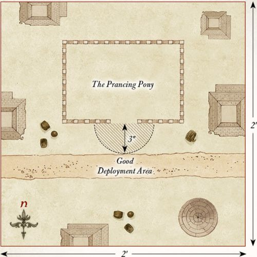

---

## THE RUFFIANS ARRIVE

**LAYOUT**

The board represents the Brandywine Bridge and the area that surrounds it. The Brandywine River runs along the center of the board from north to south and should be 6" wide. The Brandywine Bridge crosses the river at the center of the board and should be wide enough to fit three to four Man-sized models standing side-by-side. The rest of the board can be dotted with the odd tree, bush, or other similar scrubland terrain.

**STARTING POSITIONS**

The Good player deploys Holfoot and Robin touching the bridge on the western side of the Brandywine as shown on the map. Then, they deploy their force on the western side of the Brandywine.

**OBJECTIVES**

The game lasts for 12 turns. The Evil player wins if they can capture both Holfoot and Robin and move them off the board via the western board edge. The Good player wins if they can prevent this from happening.

**SPECIAL RULES**

* **Shirriff Leaders**

The Ruffians must capture Holfoot and Robin to win the game. To do this, they will need to bind them in chains using their At 'em Lads special rule. Whilst bound, a Hobbit is treated as a Heavy Object. If either Holfoot or Robin are slain, then the game is a draw.

* **The Brandywine**

Hobbit models cannot attempt to swim across the Brandywine River.

**PARTICIPANTS**

**Good:** Holfoot Bracegirdle, Shirriff-leader; Robin Smallburrow, Hobbit Shirriff; 8 Hobbit Shirriffs; 4 Hobbit Militia.

**Evil:** Bill Ferny; Lotho Sackville-Baggins; 6 Ruffians; 2 Ruffians with whip; 4 Ruffians with bow.

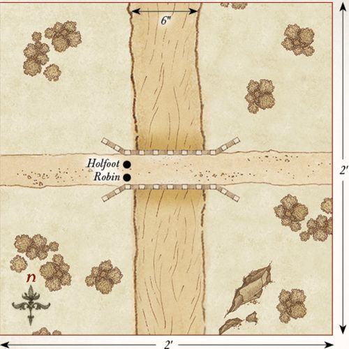

---

## MAGGOT'S FARM

**LAYOUT**

The board represents Farmer Maggot's fields and the wooded area that lies behind it. The western half of the board is Maggot's fields and should have a series of hedges within it. There should also be a scarecrow on the board that is 12" on from the western board edge. The eastern half of the board should be dotted with trees to represent the wooded area.

**STARTING POSITIONS**

The Good player deploys the dogs within 6" of the scarecrow; Farmer Maggot is kept aside for later. The Ruffians do not deploy on the board, but will move onto the board via the eastern board edge during the Evil player's first Move phase.

**OBJECTIVES**

The game lasts until one side has completed their objective. The Evil player wins if four or more Ruffians can move off the board via the western board edge. If three Ruffians move off the board in this way, then the game is a draw. The Good player wins if they can prevent the Evil player from achieving their objective.

**SPECIAL RULES**

* **On the Prowl**

At the start of the game, the dogs follow the rules for Sentries as described in the main rules manual. However, as dogs have a much greater sense of smell, the alarm will be raised if during the End phase of any turn there is a Ruffian within Line of Sight and 6" rather than just 3".

* **Farmer Maggot**

Once the alarm has been raised, the Good player may roll a D6 at the start of each of their Move phases. On a 5+, Farmer Maggot has heard his dogs barking; he may move onto the board from any point on the western board edge via the rules for Reinforcements.

* **A Stormy Night**

Shooting attacks will only ever hit on the roll of a 6 in this Scenario. Additionally, Grip, Fang, and Wolf gain the Terror special rule.

**PARTICIPANTS**

**Good:** Farmer Maggot with Grip, Fang, and Wolf.

**Evil:** 2 Ruffians; 1 Ruffian with whip; 3 Ruffians with bow.

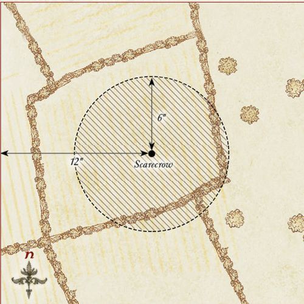

---

## THE OLD MILL

**LAYOUT**

The board represents the lands directly outside the Old Mill. In the center of the western board edge are the doors into the mill. The rest of the board should be littered with a small selection of hedges, carts, crates, and other such things you may find lying around Hobbiton.

**STARTING POSITIONS**

The Good player deploys their force within 6" of the doors of the Old Mill. The Evil player deploys their force within 6" of the eastern board edge.

**OBJECTIVES**

The game lasts until one side has completed their objective. The Evil player wins if they can break down, or open, the doors to the Old Mill. The Good player wins if they can reduce the Evil player to 25% of their starting number before this can happen. If both players achieve their objective in the same turn, the game is a draw.

**SPECIAL RULES**

* **The Doors**

The doors to the Old Mill can be attacked in the Fight phase by a model in base contact that is not already involved in a fight. The doors have a Defence of 7 and 2 Wounds, and always count as trapped.

* **Ted Sandyman**

If, during the End phase of any turn, Ted Sandyman is in base contact with the doors to the Mill, and hasn't been involved in a fight that turn, he may unlock and open the doors to the Mill. Additionally, Hobbit Militia may add 1 when rolling To Wound Ted Sandyman in the Fight phase.

**PARTICIPANTS**

**Good:** 12 Hobbit Militia.

**Evil:** Ted Sandyman; 8 Ruffians; 4 Ruffians with whip.

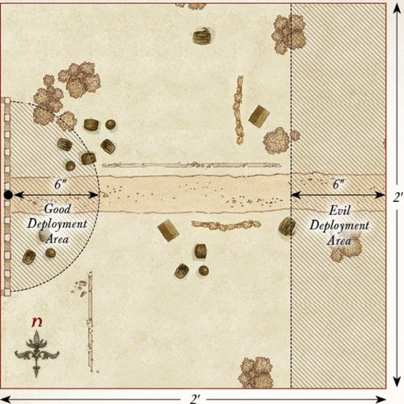

---

## THE MAYOR'S ARREST

**LAYOUT**

The board represents the pathway leading towards Bag End. Across the center of the board from north to south is a pathway with a few Hobbit-holes dotted on either side.

**STARTING POSITIONS**

The Good player deploys Will Whitfoot in the center of the board, then the rest of their force within 3" of Will. The Evil player deploys Sid Briarthorn in the center of the southern board edge. They then split the rest of their force into three equal parts and deploy each part anywhere within 3" of the center of a different board edge — either southern, eastern, or western.

**OBJECTIVES**

The game lasts until Will Whitfoot has left the board.

The Good player wins if Will Whitfoot can escape the board via the southern board edge. The Evil player wins if they can carry Will Whitfoot off of any board edge.

**SPECIAL RULES**

* **Old Flourdumpling**

The Ruffians must capture Will Whitfoot to win the game.

To do this, they will need to bind him in chains using their At 'em Lads or Put 'em in Chains special rules. Whilst bound, Will Whitfoot is treated as a Heavy Object. If Will Whitfoot is slain, then the game is a draw.

* **Ambush!**

Will Whitfoot may not move during the first turn of the game.

**PARTICIPANTS**

**Good:** Will Whitfoot, Mayor of Hobbiton; 12 Hobbit Militia.

**Evil:** Sid Briarthorn, Ruffian Chief; 6 Ruffians; 2 Ruffians with whip; 4 Ruffians with bow.

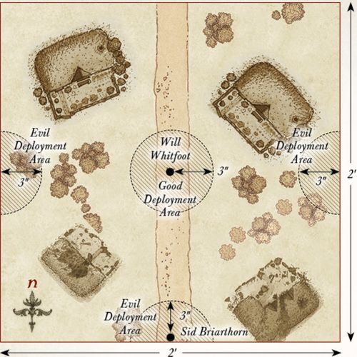

---

## THE DEATH OF LOTHO

**LAYOUT**

The board represents a pathway leading towards Bag End from the Green Dragon. Across the center of the board from north to south is a pathway with a few Hobbit-holes dotted on either side.

**STARTING POSITIONS**

The Good player deploys Lotho Sackville-Baggins in the center of the board, then the rest of their force within 3" of Lotho. The Evil player deploys the Ruffians anywhere on the board at least 6" away from any Good model.

**OBJECTIVES**

The game lasts until Lotho Sackville-Baggins has left the board or is slain. The Good player wins if Lotho Sackville-Baggins can escape the board via any board edge. The Evil player wins if Worm can slay Lotho Sackville-Baggins.

Any other result is a draw.

**SPECIAL RULES**

* **Worm**

Worm doesn't deploy as normal in this Scenario. Instead, the Evil player deploys four 25mm markers on the board at the start of the game, one in the center of each board edge. These markers cannot be Charged, targeted by shooting, and do not block movement or Line of Sight. They move 6", do not have a Control Zone, and can move through other models and their Control Zones, and other models may move through them. These markers may only Charge Lotho Sackville-Baggins, and when a marker Charges Lotho, roll a D6. On a 1-4, it was not Worm — remove the marker from play. On a 5+, it is Worm — replace the marker with Worm and remove the others from play. If the first three markers turn out not to be Worm, replace the final marker with Worm — Lotho has spotted him! Lotho may not use his Considerable Wealth special rule to prevent Worm or a marker from Charging him.

* **Shadowed Figure**

Worm gains the Stalk Unseen special rule and always counts as being concealed by a piece of terrain — even when he is in open ground.

* **Protect the Boss!**

Hobbit Militia must always Charge a Ruffian if able to do so.

**PARTICIPANTS**

**Good:** Lotho Sackville-Baggins; 8 Hobbit Militia.

**Evil:** Worm; 6 Ruffians; 3 Ruffians with whip.

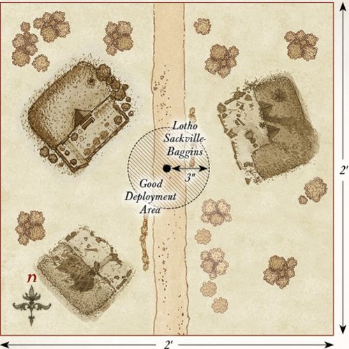

---

## THE BURNING OF WOODY END

**LAYOUT**

The board represents Woody End. The area within 3" of the edges of the board should be dotted with trees, while the rest of the board should have five Hobbit-holes.

**STARTING POSITIONS**

The Good player deploys their forces anywhere within 2" of a Hobbit-hole, making sure to split their forces as evenly as possible between the different Hobbit-holes. The Evil player deploys the Ruffians anywhere within 3" of any board edge.

**OBJECTIVES**

The game lasts for 10 turns. If, at the end of 10 turns, all of the Hobbit-holes are alight, the Evil player is the winner. If three or fewer Hobbit-holes are alight, the Good player is the winner. Any other result is a draw.

**SPECIAL RULES**

* **Torching Hobbit-holes**

During the End phase, any Ruffian model that is in base contact with a Hobbit-hole that did not shoot or participate in a Fight this turn can attempt to set it alight. Roll a D6. On a 5+, the Hobbit-hole has been set alight.

* **Flaming Arrows**

Ruffian models may shoot at any Hobbit-hole as if they were enemy models, without taking In The Way tests for intervening models. Any Hobbit-hole that is wounded by an arrow will immediately be set alight. Hobbit-holes count as having a Defence of 6.

* **Put the Fires Out!**

Any Good model that ends its move in base contact with a Hobbit-hole that is on fire, and is not Engaged in a Fight, may attempt to put it out. Roll a D6. On a 6, the fire has been put out. Models that attempt to put out a fire may not shoot in the following Shoot phase. However, should the Good player roll a 1, then the Hobbit-hole will be consumed by flame and cannot be put out for the remainder of the game. At the end of each Move phase, any model that is on a Hobbit-hole that has been consumed by flames immediately takes a Strength 3 hit.

**PARTICIPANTS**

**Good:** Baldo Tulpenny; 12 Hobbit Militia; 8 Hobbit Archers.

**Evil:** Rowan Thistlewood, Ruffian Enforcer; 12 Ruffians; 6 Ruffians with whip; 6 Ruffians with bow.

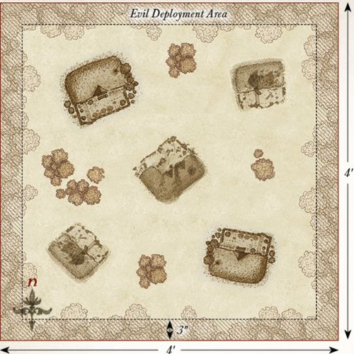

---

## UPROOTING OF BAGSHOT ROW

**LAYOUT**

The board represents the area around Bagshot Row. In the center of the western board edge extending outwards is Bagshot Row. There is a pathway leading up to the door of the Hobbit-hole. The rest of the board should have a few bushes and hedges dotted around.

**STARTING POSITIONS**

The Evil player deploys their forces anywhere within 3" of Bagshot Row. The Good player deploys their force anywhere within 6" of the eastern board edge.

**OBJECTIVES**

The game lasts until the end of the turn in which one side has completed their objective. The Good side wins if they can slay Bill Ferny. The Evil side wins if they can reduce the Good side to 25% or less of their starting models. If both sides achieve their objective in the same turn, the game is a draw.

**SPECIAL RULES**

* **The Gaffer**

Hamfast 'Gaffer' Gamgee adds +1 to his Fight value when Engaged in a Fight with Bill Ferny. Additionally, Hamfast may re-roll failed To Wound rolls against Bill Ferny during the Fight phase.

* **Bill Ferny**

Bill Ferny must always Charge if able to do so.

* **For the Shire!**

Hobbit models must Charge if able to do so.

**PARTICIPANTS**

**Good:** Hamfast 'Gaffer' Gamgee; 12 Hobbit Militia.

**Evil:** Bill Ferny; 6 Ruffians; 2 Ruffians with whip; 4 Ruffians with bow.

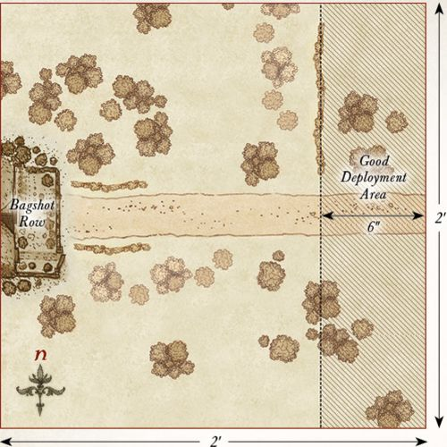

---

## ARREST OF FOLCO BOFFIN

**LAYOUT**

The board represents one of the many pathways through the Shire. A path runs through the center of the board from west to east and should have a few Hobbit-holes dotted on either side.

**STARTING POSITIONS**

The Good player deploys their forces anywhere within 3" of the eastern board edge. The 'Evil' player deploys their force anywhere within 3" of the western board edge.

**OBJECTIVES**

The game lasts until Folco Boffin leaves the board. The Good side wins if Folco can move off the board via the western board edge of his own accord. The 'Evil' side wins if Folco is arrested and carried off of the western board edge.

**SPECIAL RULES**

* **The Shirriffs**

Whenever an 'Evil' model wins a Fight against a Good model, they will not make Strikes against them. Instead, when an 'Evil' model wins a fight, they will roll a single D6. On a 4+, they arrest the model they fought. Arrested models count as being affected by the Paralyse Magical Power and count as Heavy Objects if carried. If Folco is arrested, he may spend his Fate point to attempt to resist the effects of being Paralysed. Roll a D6. On a 4+, Folco is not arrested — this time...

* **Friends at Heart**

Neither side may Throw Stones at each other in this Scenario. Additionally, if a Shirriff is removed as a casualty in the Scenario, it is probably better to assume they were sent packing by the other Hobbits rather than being slain.

**PARTICIPANTS**

**Good:** Folco Boffin; 8 Hobbit Militia.

**'Evil':** Holfoot Bracegirdle, Shirriff-leader; Robin Smallburrow, Hobbit Shirriff; 12 Hobbit Shirriffs.

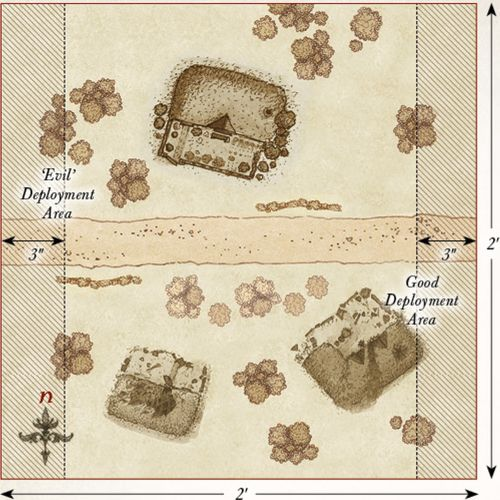

---

## THE OLD STOREHOUSE

**LAYOUT**

The board represents the old storehouse and the surrounding area. In the center of the board should be a building that represents the storehouse. There should also be a few Hobbit-holes on the board, as well as some additional hedges, bushes, and trees dotted around.

**STARTING POSITIONS**

The Evil player deploys their force within 2" of the storehouse.

The Good player splits their forces into two equal parts, each with a single Hero model. One half is deployed within 6" of the northeast corner of the board, and the other is deployed within 6" of the southwest corner of the board.

**OBJECTIVES**

The game lasts until the end of a turn where one force achieves their objective. The Good player wins if they can successfully move four or more Supply counters off of the board via any table edge. The Evil player wins if they can reduce the Good force to 50% or fewer of its starting numbers. If both sides achieve their objective in the same turn, the game is a draw.

**SPECIAL RULES**

* **On Guard**

All Ruffian models start the game as Sentries. Additionally, Rowan Thistlewood may not use his Burn it Down! special rule on the storehouse in this Scenario.

* **Baldo's Traps**

When setting up Baldo Tulpenny's Traps, no Trap marker may be placed within 6" of the storehouse in addition to any other rules for deploying Trap markers.

* **Thieves in the Night**

Any Hobbit that is in base contact with the storehouse during the End phase of any turn automatically gains a Supply counter — this is a Light Object. Additionally, any Ruffian model that suffers its final Wound in combat with a Hobbit will not be slain but is instead knocked unconscious; they count as being under the effect of the Paralyse Magical Power.

* **Ill Met by Moonlight**

Models cannot be seen or targeted by shooting attacks at distances over 12" away. However, as it is harder to avoid a shot in the dark, all shooting attacks gain a bonus of +1 when rolling To Wound.

**PARTICIPANTS**

**Good:** Baldo Tulpenny; Fredegar Bolger; 4 Tookish Hunters; 8 Hobbit Militia.

**Evil:** Rowan Thistlewood, Ruffian Enforcer; 6 Ruffians; 2 Ruffians with whip; 4 Ruffians with bow.

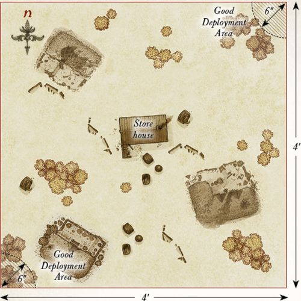

---

## THE BOUNDERS STRIKE BACK

**LAYOUT**

The board represents the wooded lands that lie on the borders of Tuckborough. The board should be densely packed with trees, hedges, and bushes, but leave enough space for the models to move freely across the board.

**STARTING POSITIONS**

The Evil player deploys their models anywhere within 12" of the eastern board edge. The Good player then deploys their models anywhere within 12" of the western board edge.

**OBJECTIVES**

The Ruffians are trying to make their way to Tuckborough in order to arrest Paladin Took, who has been stirring up trouble for the Chief. However, the Thain of the Shire is wise to Sharkey's plans and has sent some of the Bounders to disrupt the advancing Ruffians. The Evil player immediately wins if five Ruffians are able to escape the board via the western board edge. The Good player wins immediately if they can slay enough Ruffians to make it impossible for the Evil player to win.

**SPECIAL RULES**

* **Traps**

After both players have deployed their models, the Good player may deploy 20 Trap markers on the board (five Tripwire, five Snare, five Pitfall, five Dummy), following the rules detailed on page 64.

**PARTICIPANTS**

**Good:** 5 Tookish Hunters.

**Evil:** 6 Ruffians; 2 Ruffians with whip; 4 Ruffians with bow.

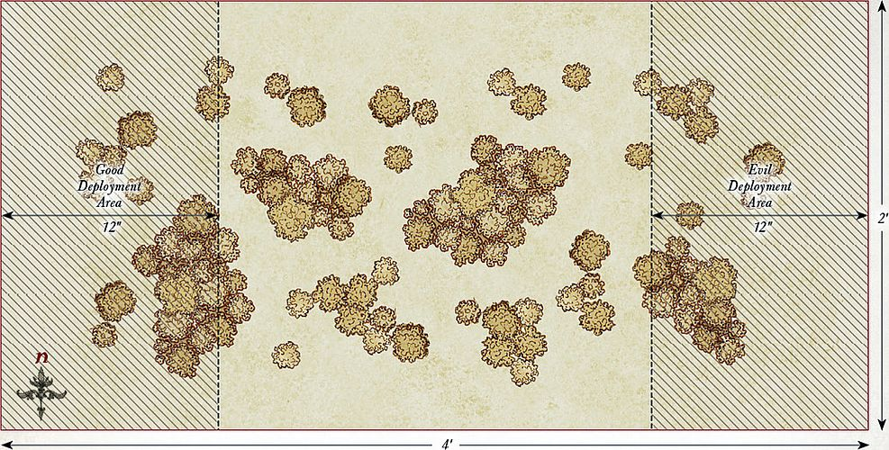

---

## BROCKENBORINGS

**LAYOUT**

The board represents an area of the village of Brockenborings. In the center of the board is a Hobbit-hole that serves as the meetinghouse. The rest of the board should be littered with hedges, fences, and trees.

**STARTING POSITIONS**

The Good player deploys their models anywhere touching the meetinghouse. The Evil player then deploys their models anywhere at least 15" away from any Good model.

**OBJECTIVES**

Having been discovered, the Hobbits must escape the Ruffians. Sharkey has ordered his Ruffians to make an example of the leaders of this attempted rebellion by dragging them to the Lockholes. The game lasts until both Lobelia and Fatty have left the board. The Good player wins if both Lobelia and Fatty can escape the board via any board edge. The Evil player wins if Lobelia and Fatty are carried off of any board edge. If either Lobelia or Fatty escapes but the other is captured, the game is a draw.

**SPECIAL RULES**

* **Rebellion Leaders**

The Ruffians must capture Lobelia and Fatty to win the game. To do this, they will need to bind them in chains using their At 'em Lads or Put 'em in Chains special rules. Whilst bound, Lobelia and Fatty are treated as Heavy Objects. If either Lobelia or Fatty is slain, then the game is a draw.

**PARTICIPANTS**

**Good:** Lobelia Sackville-Baggins; Fredegar Bolger; 8 Hobbit Militia.

**Evil:** Bill Ferny; 6 Ruffians; 2 Ruffians with whip; 4 Ruffians with bow.

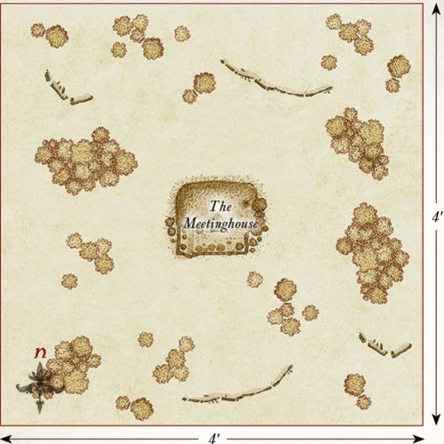

---

## THE LOCKHOLES

**LAYOUT**

The board represents a Lockhole and the surrounding area. The Lockhole is placed 6" away from the center of the northern board edge with the door facing to the south. The rest of the board should be dotted with trees, hedges, and fences.

**STARTING POSITIONS**

The Evil player deploys Rowan Thistlewood and six of the Ruffians anywhere within 6" of the Lockhole; only two of these Ruffians may have a bow. The rest of the Ruffians will arrive later. The Good player then deploys Paladin, Baldo, the Hobbit Archers, and eight Hobbit Militia anywhere within 12" of the southern board edge. The rest of the Good models are those that are prisoners inside the Lockhole.

**OBJECTIVES**

Paladin's mission is to free as many Hobbits from the Lockhole as he can, saving them from the ill treatment they are receiving at the hands of the Ruffians. The Good player wins if four or more imprisoned Hobbits can escape the board via the eastern, western, or southern board edges. The Evil side wins if they can prevent this.

**SPECIAL RULES**

* **Reinforcements**

At the end of each Evil move phase, roll a D6 for each Ruffian that has not yet entered play. On a 4+, that model arrives; roll a further D6 to see where it will arrive. On a 1-2, the model arrives from the western board edge. On a 3-4, the model arrives from the southern board edge. On a 5-6, the model arrives from the eastern board edge. Models arrive via the rules for Reinforcements.

* **Baldo's Traps**

Baldo may not place any Trap markers in this Scenario.

* **Freeing Prisoners**

To free an imprisoned Hobbit, a Good model must be in base contact with the Lockhole's door and have not shot or fought that turn. During the End phase of a turn where these conditions have been met, a single Hobbit may exit the Lockhole. To determine which Hobbit has been freed, the Good player should simply line up the captured Hobbit models and roll a D6 to determine which has been set free. If the Good player rolls higher than the number of remaining Hobbit models, they may choose which has been freed. A rescued Hobbit may act as normal from the start of the following turn. Additionally, Rowan Thistlewood may not use his Burn it Down! special rule on the Lockhole in this Scenario.

* **Weary and Half-starved**

Escaping prisoners may not Charge or Throw Stones but will fight as normal if Charged. Before moving an escaping prisoner, the Good player rolls a D6. On a 1, the Hobbit is overcome with exhaustion and collapses. The Hobbit becomes Prone and may not move any further that turn.

**PARTICIPANTS**

**Good:** Paladin Took; Baldo Tulpenny; Lobelia Sackville-Baggins; Fredegar Bolger; 12 Hobbit Militia; 4 Hobbit Archers.

**Evil:** Rowan Thistlewood, Ruffian Enforcer; 6 Ruffians; 2 Ruffians with whip; 4 Ruffians with bow.

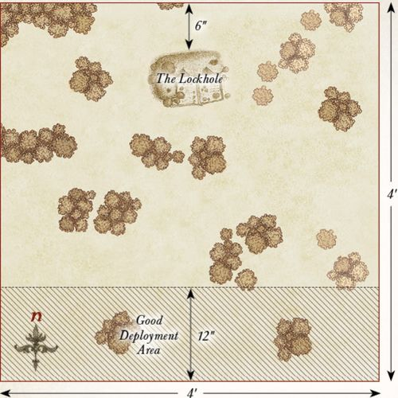

---

## ATTACK ON TUCKBOROUGH

**LAYOUT**

The board represents the edges of Tuckborough. The southern half of the board should have a selection of Hobbit-holes, fences, and hedges, while the northern half of the board should be dotted with trees, hedges, and bushes. Five Objective markers should be placed across the center of the board from east to west, with one in the center and each being 8" away from another.

**STARTING POSITIONS**

The Good player deploys their forces within 12" of the southern board edge. The Evil player then deploys their forces within 12" of the northern board edge.

**OBJECTIVES**

Both sides are battling over control of Tuckborough; the Hobbits must defend their borders, while the Ruffians are trying to capture them. Once one side has suffered eight or more casualties, the game might suddenly end. Roll a D6 at the end of each turn after this condition has been met. On a 1-2, the game ends; otherwise, it continues for another turn. When the game ends, the side that has captured the most objectives is the winner. Whichever side has the most models within 3" of an objective controls that objective. If both sides have the same number of models within 3", then neither side claims that objective. If both sides control the same number of objectives, then the game is a draw.

**SPECIAL RULES**

* **Reinforcements**

At the start of each player's Move phase, roll a D6 for each Warrior model removed as a casualty. On a 5+, that model may re-enter the board from the center of the eastern or western board edge, or any point on their controlling player's board edge via the rules for Reinforcements.

**PARTICIPANTS**

**Good:** Paladin Took; Baldo Tulpenny; 12 Hobbit Militia; 4 Hobbit Archers.

**Evil:** Sid Briarthorn, Ruffian Chief; 7 Ruffians; 3 Ruffians with whip; 5 Ruffians with bow.

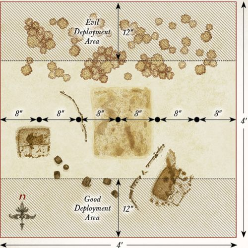

---

## OLD COTTON'S FARM

**LAYOUT**

The board represents the road leading up to Tolman Cotton's farm and the surrounding area. A 6" wide road runs down the center of the board from north to south and is lined with hedgerows on either side. The fields should have a selection of Hobbit-holes, bushes, fences, and trees dotted around.

**STARTING POSITIONS**

The Good player deploys Farmer Cotton 3" from the center of the southern board edge as shown on the map. The Evil player then deploys their models on the road within 3" of the center of the board. The Good player then splits their force into two equal halves, each with two Hero and six Warrior models. They then deploy each half on a different side of the road, making sure they are off the road and at least 3" away from any Evil model.

**OBJECTIVES**

The Ruffians have walked into the Hobbits' trap and have decided to fight their way out and take as many of the ringleaders as they can with them. The game lasts until the end of a turn where one side has completed their objective. The Good side wins if they can reduce the Evil force to 25% or less of its starting numbers. The Evil side wins if they can kill any four Hobbit Hero models. If both sides complete their objective in the same turn, the game is a draw.

**SPECIAL RULES**

* **Defend the Shire!**

Hobbit models must Charge if able to do so.

* **Let 'em have it!**

Ruffian models must re-roll To Wound rolls of 1 during the Fight phase. Additionally, if Rowan Thistlewood is Engaged in combat or has been involved in a Fight this turn, and has not been removed as a casualty, Ruffian models treat him as a banner.

**PARTICIPANTS**

**Good:** Meriadoc, Captain of the Shire with shield; Frodo of the Nine Fingers; Samwise the Brave; Farmer Tolman Cotton; Hamfast 'Gaffer' Gamgee; 6 Hobbit Militia; 4 Hobbit Archers.

**Evil:** Rowan Thistlewood, Ruffian Enforcer; 6 Ruffians; 2 Ruffians with whip; 4 Ruffians with bow.

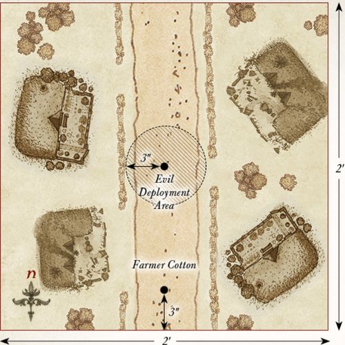

---

## THE BATTLE OF BYWATER

**LAYOUT**

This scenario is played on a 2'x2' board. A long road runs across the center of the board from east to west, and there are a few Hobbit-holes and hedges dotted on either side of the road. A barricade should be situated across the road on the eastern side as shown on the map.

**STARTING POSITIONS**

The Evil player deploys all of their Ruffians within 6" of the center of the western board edge; Sharkey and Worm are kept to one side for later in the game. The Good player then deploys Frodo, Sam, Holfoot, Robin, Farmer Cotton, and the Shirriffs within 6" of the center of the eastern board edge. Merry and the Battlin' Brandybucks are deployed within 6" of the center of the northern board edge. Pippin and the Tookish Hunters are deployed within 6" of the center of the southern board edge.

**OBJECTIVES**

Without the Travellers, the Shirefolk will lose all hope and surely fall to the will of the Ruffians. However, if Sharkey can be exposed for the liar that he is, then the Hobbits can drive back his Ruffians and reclaim the Shire.

The Good player wins if, at the end of any turn, Sharkey has been slain. The Evil player wins immediately if all four of the Travellers (Frodo, Sam, Merry & Pippin) have been slain.

**SPECIAL RULES**

* **Sharkey**

From the fourth turn onwards, roll a D6 at the end of each Evil Move phase. On a 5+, Sharkey and Worm enter the board from the western board edge via the rules for Reinforcements.

* **The Ruffian Mob**

At the end of each Evil Move phase, roll a D6 for each Ruffian Warrior model that has been previously slain. On a 6, that model may move on from the western board edge via the rules for Reinforcements.

* **Merry & Pippin**

Once per game, both Merry and Pippin can each declare a Heroic Combat without spending Might.

**PARTICIPANTS**

**Good:** Frodo of the Nine Fingers on pony; Samwise the Brave on pony; Meriadoc, Captain of the Shire with shield on pony; Peregrin, Captain of the Shire on pony; Farmer Tolman Cotton; Holfoot Bracegirdle, Shirriff-leader; Robin Smallburrow, Hobbit Shirriff; 8 Battlin' Brandybucks; 8 Tookish Hunters; 8 Hobbit Shirriffs.

**Evil:** Sharkey & Worm; Sid Briarthorn, Ruffian Chief; Bill Ferny; 12 Ruffians; 4 Ruffians with whip; 8 Ruffians with bow.

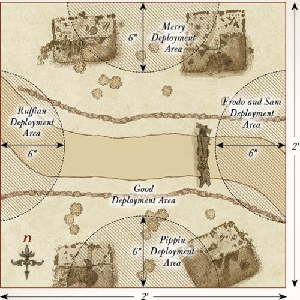
